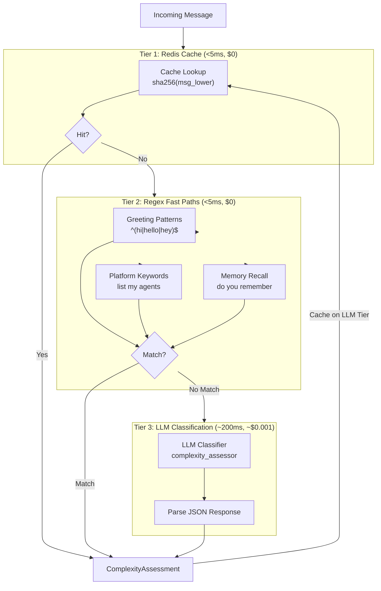
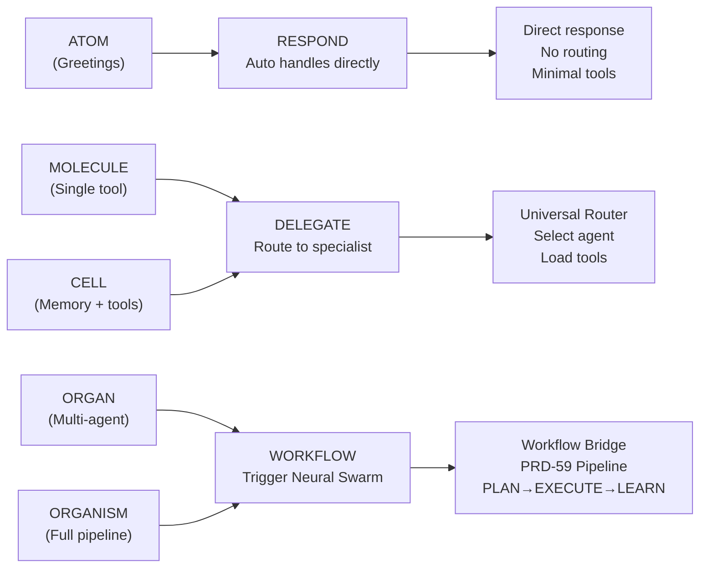
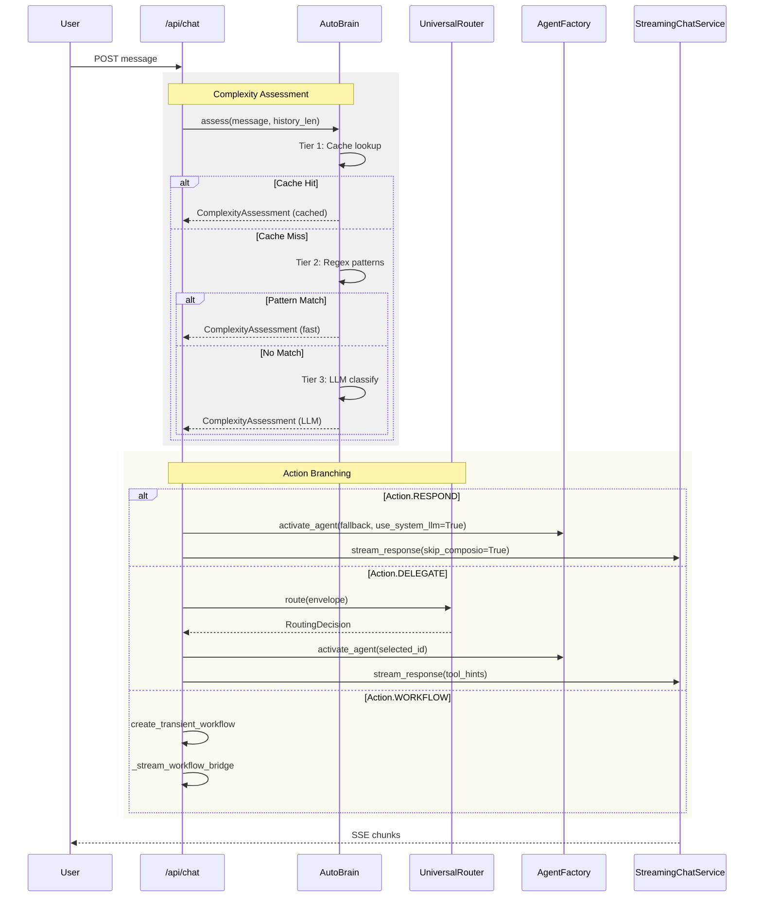
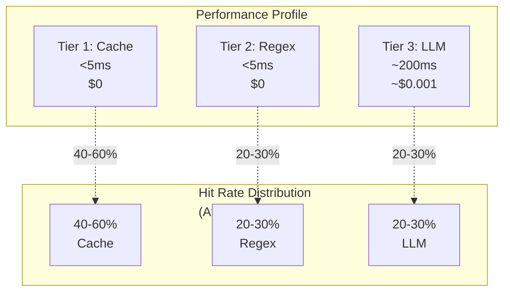
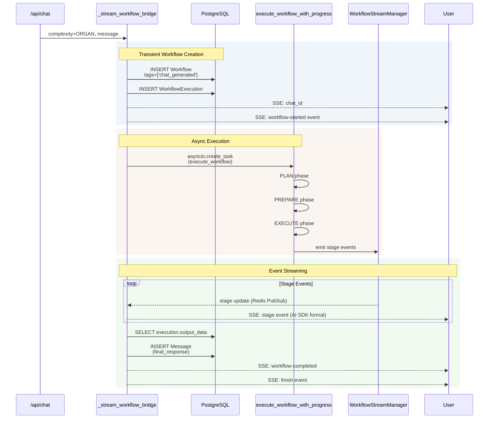

# Complexity Assessment (AutoBrain)

<details>
<summary>Relevant source files</summary>

The following files were used as context for generating this wiki page:

- [orchestrator/api/chat.py](orchestrator/api/chat.py)
- [orchestrator/api/routing.py](orchestrator/api/routing.py)
- [orchestrator/consumers/chatbot/auto.py](orchestrator/consumers/chatbot/auto.py)
- [orchestrator/consumers/chatbot/intent_classifier.py](orchestrator/consumers/chatbot/intent_classifier.py)
- [orchestrator/consumers/chatbot/personality.py](orchestrator/consumers/chatbot/personality.py)
- [orchestrator/consumers/chatbot/smart_orchestrator.py](orchestrator/consumers/chatbot/smart_orchestrator.py)
- [orchestrator/consumers/chatbot/smart_tool_router.py](orchestrator/consumers/chatbot/smart_tool_router.py)
- [orchestrator/core/models/system_settings.py](orchestrator/core/models/system_settings.py)
- [orchestrator/core/routing/engine.py](orchestrator/core/routing/engine.py)
- [orchestrator/modules/tools/discovery/__init__.py](orchestrator/modules/tools/discovery/__init__.py)
- [orchestrator/scripts/setup_jira_trigger.py](orchestrator/scripts/setup_jira_trigger.py)

</details>


## Purpose & Scope

AutoBrain is the progressive complexity assessor that receives **every** incoming chat message and determines the computational depth required to respond. It implements PRD-68's Progressive Complexity Routing, classifying requests on a five-level scale from simple greetings (ATOM) to enterprise-scale multi-agent pipelines (ORGANISM).

The assessor's output determines three critical downstream behaviors:
1. **Routing decision** — whether to respond directly, delegate to a specialized agent, or trigger a workflow
2. **Tool availability** — which tools to load (if any) to avoid overwhelming the LLM
3. **Memory retrieval** — whether to fetch conversation context from Mem0

For universal routing logic (agent selection after AutoBrain delegates), see [Universal Router](#8). For memory integration details, see [Memory Integration](#7.5).

**Sources**: [orchestrator/consumers/chatbot/auto.py:1-394]()

---

## Complexity Levels

AutoBrain classifies requests into five discrete complexity levels, each representing an order-of-magnitude increase in computational requirements:

| Level | Name | Description | Token Budget | Example |
|-------|------|-------------|--------------|---------|
| **ATOM** | Simple | Greetings, chitchat, factual queries | <200 tokens | "hi", "thanks", "what can you do" |
| **MOLECULE** | Single Tool | Needs one tool or specific agent skill | ~1K tokens | "send email", "check Jira", "search docs" |
| **CELL** | Memory + Tools | Requires conversation context + tools + reasoning | ~3K tokens | "reply to that email we discussed" |
| **ORGAN** | Multi-Agent | Needs coordination between multiple agents | ~6K tokens | "research bug, plan fix, open PR" |
| **ORGANISM** | Enterprise Pipeline | Full Neural Swarm with learning + feedback | ~12K tokens | "refactor auth across all services" |

The `Complexity` enum defines these levels:

**Sources**: [orchestrator/consumers/chatbot/auto.py:41-48]()

---

## Three-Tier Assessment Strategy

AutoBrain uses a three-tier cascade with strict latency and cost targets:



**Diagram: AutoBrain's three-tier assessment cascade optimizes for latency and cost**

**Sources**: [orchestrator/consumers/chatbot/auto.py:152-199]()

---

### Tier 1: Redis Cache Lookup

The first tier performs a **cache lookup** using the SHA-256 hash of the normalized message text. This provides instant (<5ms) responses for repeated queries at zero LLM cost.

```python
def _make_cache_key(self, msg_lower: str) -> str:
    h = hashlib.sha256(msg_lower.encode()).hexdigest()[:16]
    return f"complexity:{self._workspace_id}:{h}"
```

Cache entries include the full `ComplexityAssessment` structure with TTL configured by `COMPLEXITY_CACHE_TTL_HOURS` (default: 24 hours).

**Key characteristics**:
- **Latency**: <5ms (Redis GET)
- **Cost**: $0
- **Hit rate**: ~40-60% after warm-up (varies by workspace)
- **Isolation**: Workspace-scoped keys prevent cross-tenant leakage

**Sources**: [orchestrator/consumers/chatbot/auto.py:335-370]()

---

### Tier 2: Regex Fast Paths

When cache misses, Tier 2 applies **hand-coded regex patterns** for common message types. These patterns are deliberately strict — they must match the **entire message** (with optional punctuation) to prevent false positives like "hello can you create an image" matching the greeting pattern.

#### ATOM Pattern Matching

The ATOM detector uses whole-message anchoring to identify pure chitchat:

```python
_ATOM_PATTERNS = [
    r"^(hi|hello|hey|howdy|yo|sup)[\s!?.,:]*$",
    r"^(thanks|thank you|thx|ty|cheers)[\s!?.,:]*$",
    r"^(bye|goodbye|see ya|later|cya)[\s!?.,:]*$",
    # ...
]
```

**Accepts**: `"hello"`, `"thanks!"`, `"bye"`  
**Rejects**: `"hello can you help me"`, `"thanks for the report"` (continues to Tier 3)

#### Platform Query Detection

Platform self-awareness queries (PRD-64) are detected via keyword matching:

```python
_PLATFORM_KEYWORDS = {
    "platform_list_agents": [
        "list my agents", "what agents do i have", "show my agents",
    ],
    "platform_list_recipes": [...],
    "platform_get_llm_usage": [...],
}
```

These return **MOLECULE** complexity with matched tool hints.

#### Memory Recall Detection

Explicit memory references trigger **CELL** complexity with `needs_memory=True`:

```python
_MEMORY_PATTERN = re.compile(
    r"\b(do you remember|recall when|my name is|last time we|"
    r"previously we discussed|earlier (i|we|you) said|what did (i|we|you) (say|tell|ask))\b",
    re.IGNORECASE,
)
```

**Key characteristics**:
- **Latency**: <5ms (compiled regex matching)
- **Cost**: $0
- **Coverage**: ~30-40% of messages after cache misses
- **Precision**: Very high (strict anchoring prevents false positives)

**Sources**: [orchestrator/consumers/chatbot/auto.py:86-139](), [orchestrator/consumers/chatbot/auto.py:205-235]()

---

### Tier 3: LLM Classification

When both cache and regex patterns fail, AutoBrain invokes an **LLM classifier** to assess complexity. This tier is the most expensive (~$0.001 per call) but handles the long tail of nuanced requests.

The classifier prompt includes:
- Available agents in the workspace (for context)
- Conversation turn count
- Five complexity levels with clear definitions
- Expected JSON response structure

```json
{
  "complexity": "atom|molecule|cell|organ|organism",
  "action": "respond|delegate|workflow",
  "tool_hints": ["domain1", "domain2"],
  "needs_memory": true/false,
  "needs_multi_agent": true/false,
  "reasoning": "one sentence"
}
```

The LLM is configured via the `complexity_assessor` service name, allowing workspace-level model overrides through the `SystemSetting` table.

**Key characteristics**:
- **Latency**: ~200ms (model-dependent)
- **Cost**: ~$0.001/call (GPT-4-mini equivalent)
- **Fallback**: On LLM failure, returns `MOLECULE` / `DELEGATE` (current behavior)
- **Results cached**: Tier 3 results are written to Redis for future Tier 1 hits

**Sources**: [orchestrator/consumers/chatbot/auto.py:241-308]()

---

## Action Types

AutoBrain maps complexity levels to three **action types** that control downstream execution:



**Diagram: Complexity levels map to action types that control execution flow**

### RESPOND Action

Used for **ATOM** complexity (greetings, chitchat). Auto responds directly using:
- Orchestrator's LLM configuration (not the agent's model)
- No Composio tool loading (`skip_composio=True`)
- No Universal Router invocation
- Optional memory retrieval (usually skipped)

This bypasses the entire routing and tool discovery pipeline for maximum performance.

### DELEGATE Action

Used for **MOLECULE** and **CELL** complexity (single-agent tasks). Invokes:
- Universal Router for agent selection (unless explicit `agentId` provided)
- Full tool discovery (Composio apps, platform tools, workspace tools)
- Memory retrieval when `needs_memory=True`
- Standard tool calling loop (up to 10 iterations)

### WORKFLOW Action

Used for **ORGAN** and **ORGANISM** complexity (multi-agent coordination). Triggers:
- Transient workflow creation from the user message
- Full PRD-59 Neural Swarm pipeline (PLAN → PREPARE → EXECUTE → EVALUATE → LEARN)
- Stage-by-stage streaming back to chat via AI SDK format
- Workflow results saved as assistant message

**Sources**: [orchestrator/consumers/chatbot/auto.py:50-55](), [orchestrator/api/chat.py:448-566]()

---

## Integration with Chat Flow

AutoBrain executes **before routing** in the chat pipeline, providing guidance to all downstream components:



**Diagram: AutoBrain assessment occurs before routing and influences all downstream decisions**

The assessment result is attached to response headers for observability:

```
x-auto-complexity: molecule
x-auto-action: delegate
x-auto-confidence: 0.87
x-auto-needs-memory: false
x-auto-tool-hints: email,github
```

**Sources**: [orchestrator/api/chat.py:438-526]()

---

## ComplexityAssessment Data Structure

The `ComplexityAssessment` dataclass carries assessment results through the chat pipeline:

```python
@dataclass
class ComplexityAssessment:
    complexity: Complexity           # ATOM → ORGANISM
    action: Action                   # RESPOND | DELEGATE | WORKFLOW
    reasoning: str                   # LLM's one-sentence explanation
    target_agent_id: Optional[int]   # (Reserved for future use)
    target_agent_name: Optional[str] # (Reserved for future use)
    matched_tools: List[str]         # Platform tools matched in Tier 2
    confidence: float                # 0.0-1.0
    
    # Fields consumed by SmartOrchestrator
    needs_memory: bool               # Whether to fetch Mem0 context
    tool_hints: List[str]            # Domain keywords: ["email", "github"]
    needs_multi_agent: bool          # Whether multi-agent coordination needed
```

### Key Fields

**`tool_hints`**: Short domain keywords (e.g., `["email", "github", "code"]`) passed to `SmartToolRouter` to pre-filter tools. This replaces the old regex-based intent classification with LLM-driven hints.

**`needs_memory`**: Boolean flag controlling Mem0 retrieval. Set to `False` for ATOM/MOLECULE to avoid unnecessary latency.

**`matched_tools`**: Populated by Tier 2 platform query detection (e.g., `["platform_list_agents"]`). These are surfaced directly as tool hints.

**Sources**: [orchestrator/consumers/chatbot/auto.py:58-82]()

---

## Integration with SmartOrchestrator

The `ComplexityAssessment` overrides intent-based decisions in the orchestrator:

```python
# PRD-68: ComplexityAssessment can override memory decision
_wants_memory = self._should_fetch_memory(intent_result)
if complexity_assessment and not complexity_assessment.needs_memory:
    _wants_memory = False
    logger.info(f"Memory SKIPPED by ComplexityAssessment ({complexity_assessment.complexity.value})")
```

Similarly, `tool_hints` enable tools even when intent classification says no:

```python
# PRD-68: ComplexityAssessment tool_hints override intent-based routing
if complexity_assessment and complexity_assessment.tool_hints:
    _wants_tools = True
    _tool_hints = complexity_assessment.tool_hints
    logger.info(f"Tools ENABLED by tool_hints={_tool_hints}")
```

This two-stage classification (AutoBrain → IntentClassifier) provides defense-in-depth:
- **AutoBrain** determines whether to delegate at all
- **IntentClassifier** (inside SmartOrchestrator) refines tool/memory selection

**Sources**: [orchestrator/consumers/chatbot/smart_orchestrator.py:159-198]()

---

## Configuration & Settings

AutoBrain's behavior is controlled via environment variables and system settings:

| Setting | Type | Default | Description |
|---------|------|---------|-------------|
| `COMPLEXITY_CACHE_TTL_HOURS` | `int` | 24 | Redis cache TTL for assessment results |
| `LLM_MODEL` (service: `complexity_assessor`) | `str` | `gpt-4o-mini` | Model for Tier 3 classification |
| `LLM_TEMPERATURE` | `float` | 0.3 | Temperature for Tier 3 (low for consistency) |

The LLM configuration uses the `complexity_assessor` service name, allowing per-workspace overrides via the `SystemSetting` table (category: `COMPLEXITY_ASSESSOR`).

**Sources**: [orchestrator/consumers/chatbot/auto.py:362-364](), [orchestrator/core/models/system_settings.py:34]()

---

## Performance Characteristics

AutoBrain's tiered architecture delivers sub-10ms latency for 70-80% of requests:



**Diagram: AutoBrain's performance profile across the three tiers**

### Latency Targets

- **P50 (cache hit)**: <5ms
- **P95 (regex fallback)**: <10ms
- **P99 (LLM fallback)**: <300ms

### Cost Analysis

Assuming 10,000 chat messages/day:
- **Tier 1 (5,000 cache hits)**: $0
- **Tier 2 (2,500 regex matches)**: $0
- **Tier 3 (2,500 LLM calls)**: ~$2.50/day

Total cost: **~$75/month** for complexity assessment at 10K msg/day.

### Cache Warm-up

The cache requires ~100-200 messages per workspace to reach steady-state hit rates. Cold-start workspaces see higher LLM usage initially, then stabilize as common patterns are cached.

**Sources**: [orchestrator/consumers/chatbot/auto.py:152-199]()

---

## Workflow Bridge (ORGAN/ORGANISM)

When AutoBrain detects **ORGAN** or **ORGANISM** complexity, the chat endpoint invokes the **Workflow Bridge** to execute multi-agent coordination:



**Diagram: Workflow Bridge converts ORGAN/ORGANISM chat messages into PRD-59 Neural Swarm pipelines**

The transient workflow is tagged `chat_generated` so users can find and re-run it from the workflows UI.

**Sources**: [orchestrator/api/chat.py:70-197]()

---

## Observability & Debugging

AutoBrain emits structured logs at each tier for debugging:

```
[AutoBrain] Tier 1 Cache hit: 'hello world'
[AutoBrain] Tier 2 Atom: 'thanks!'
[AutoBrain] Tier 2 Platform query: platform_list_agents
[AutoBrain] Tier 2 Memory recall
[AutoBrain] Tier 3 LLM classifying: 'send email to john about the proposal'
```

Assessment results are included in HTTP response headers:

```bash
curl -D - https://api.automatos.ai/api/chat \
  -H "X-Workspace-ID: ws_123" \
  --data '{"message": {"content": "list my agents"}}'

# Response headers:
x-auto-complexity: molecule
x-auto-action: respond
x-auto-confidence: 0.90
x-auto-needs-memory: false
x-auto-tool-hints: platform
```

For live traffic analysis, query the `routing_decisions` table (which also includes AutoBrain assessments when available).

**Sources**: [orchestrator/api/chat.py:519-526]()

---