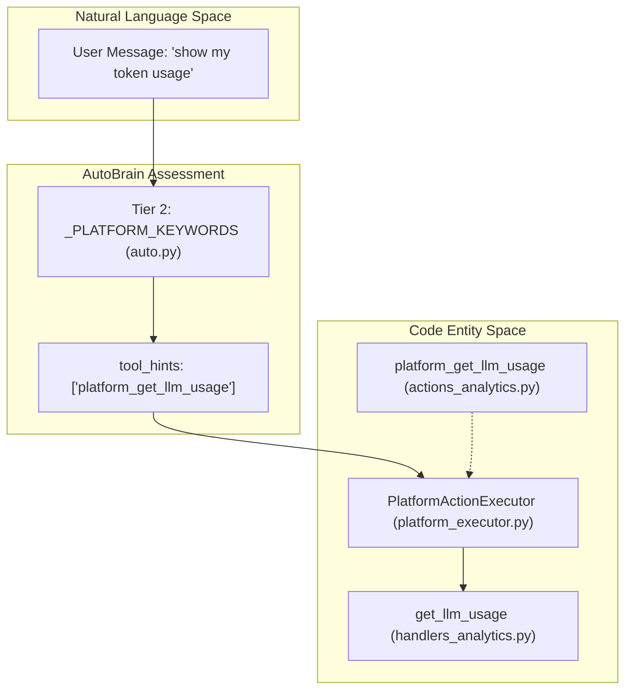
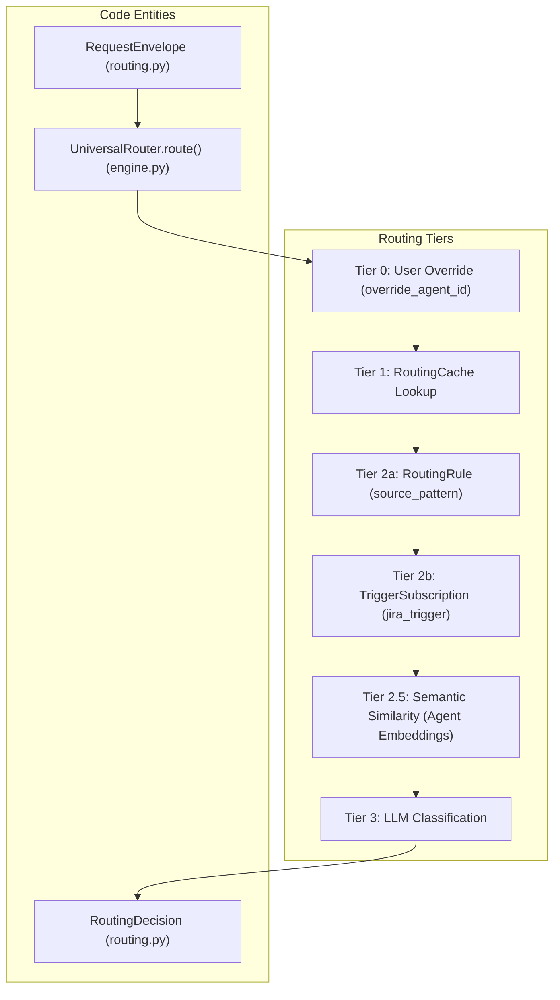

# Complexity Assessment (AutoBrain)

<details>
<summary>Relevant source files</summary>

The following files were used as context for generating this wiki page:

- [docs/reviews/COMPOSIO-TOOL-REGRESSION-REVIEW.md](docs/reviews/COMPOSIO-TOOL-REGRESSION-REVIEW.md)
- [orchestrator/api/chat.py](orchestrator/api/chat.py)
- [orchestrator/api/chat_voice.py](orchestrator/api/chat_voice.py)
- [orchestrator/consumers/chatbot/auto.py](orchestrator/consumers/chatbot/auto.py)
- [orchestrator/consumers/chatbot/intent_classifier.py](orchestrator/consumers/chatbot/intent_classifier.py)
- [orchestrator/consumers/chatbot/personality.py](orchestrator/consumers/chatbot/personality.py)
- [orchestrator/consumers/chatbot/service.py](orchestrator/consumers/chatbot/service.py)
- [orchestrator/consumers/chatbot/smart_tool_router.py](orchestrator/consumers/chatbot/smart_tool_router.py)
- [orchestrator/core/llm/manager.py](orchestrator/core/llm/manager.py)
- [orchestrator/core/routing/engine.py](orchestrator/core/routing/engine.py)
- [orchestrator/modules/orchestrator/service.py](orchestrator/modules/orchestrator/service.py)
- [orchestrator/modules/tools/discovery/actions_analytics_enhanced.py](orchestrator/modules/tools/discovery/actions_analytics_enhanced.py)
- [orchestrator/modules/tools/discovery/handlers_analytics_enhanced.py](orchestrator/modules/tools/discovery/handlers_analytics_enhanced.py)
- [orchestrator/modules/tools/discovery/handlers_search.py](orchestrator/modules/tools/discovery/handlers_search.py)
- [orchestrator/modules/tools/discovery/platform_actions.py](orchestrator/modules/tools/discovery/platform_actions.py)
- [orchestrator/modules/tools/discovery/platform_executor.py](orchestrator/modules/tools/discovery/platform_executor.py)
- [orchestrator/modules/tools/tool_router.py](orchestrator/modules/tools/tool_router.py)

</details>


## Purpose & Scope

AutoBrain is the progressive complexity assessor that receives **every** incoming chat message and determines the computational depth required to respond. It implements PRD-68's Progressive Complexity Routing, classifying requests on a five-level scale from simple greetings (`ATOM`) to enterprise-scale multi-agent pipelines (`ORGANISM`). [orchestrator/consumers/chatbot/auto.py:1-22]()

The assessor's output determines three critical downstream behaviors:
1. **Routing decision** — whether to respond directly, delegate to a specialized agent, or trigger a mission/workflow. [orchestrator/consumers/chatbot/auto.py:51-57]()
2. **Tool availability** — which tools to load (if any) to avoid overwhelming the LLM via `tool_hints`. [orchestrator/consumers/chatbot/auto.py:68-71]()
3. **Memory retrieval** — whether to fetch conversation context from the memory system via `needs_memory`. [orchestrator/consumers/chatbot/auto.py:70-70]()

The `ComplexityAssessment` result flows from the chat API (`api/chat.py`) through the `StreamingChatService` and `SmartChatOrchestrator` to drive these behaviors. [orchestrator/consumers/chatbot/auto.py:19-22]()

**Sources**: [orchestrator/consumers/chatbot/auto.py:1-85](), [orchestrator/api/chat.py:18-24]()

---

## Complexity Levels

AutoBrain classifies requests into five discrete complexity levels on the Atom → Organism scale defined in the `Complexity` Enum: [orchestrator/consumers/chatbot/auto.py:42-49]()

| Level | Name | Description | Token Budget | Example |
|-------|------|-------------|--------------|---------|
| **ATOM** | Simple | Greetings, factual, chitchat | <200 tokens | "hi", "thanks", "what can you do" |
| **MOLECULE** | Single Tool | Needs a tool or specific agent skill | ~1K tokens | "send email", "check Jira", "search docs" |
| **CELL** | Memory + Tools | Needs memory + tool + reasoning | ~3K tokens | "reply to that email we discussed" |
| **ORGAN** | Multi-Agent | Multi-agent coordination | ~6K tokens | "research bug, plan fix, open PR" |
| **ORGANISM** | Enterprise Pipeline | Full PRD-59 pipelines, learning + feedback | ~12K tokens | "refactor auth across all services" |

**Sources**: [orchestrator/consumers/chatbot/auto.py:42-49]()

---

## Three-Tier Assessment Strategy

AutoBrain uses a three-tier cascade with strict latency and cost targets to minimize overhead for simple queries: [orchestrator/consumers/chatbot/auto.py:14-17]()

### Tier 1: Redis Cache Lookup
The first tier performs a **cache lookup** using the SHA-256 hash of the normalized message text. This provides instant (<5ms) responses for repeated queries at zero LLM cost. [orchestrator/consumers/chatbot/auto.py:15-15](), [orchestrator/consumers/chatbot/auto.py:27-28]()

### Tier 2: Regex Fast Paths
When cache misses, Tier 2 applies **hand-coded regex patterns** for common message types. These patterns are deliberately strict — they must match the **entire message** (with optional punctuation) to prevent false positives. [orchestrator/consumers/chatbot/auto.py:87-91]()

#### ATOM Pattern Matching
The `_ATOM_PATTERNS` list contains regex for pure chitchat, greetings, and identity questions: [orchestrator/consumers/chatbot/auto.py:92-114]()

```python
_ATOM_PATTERNS = [
    r"^(hi|hello|hey|howdy|yo|sup)(\s+\w+)?[\s!?.,:]*$",
    r"^(thanks|thank you|thx|ty|cheers)(\s+\w+)?[\s!?.,:]*$",
    r"^(bye|goodbye|see ya|later|cya|see you)(\s+\w+)?[\s!?.,:]*$",
    r"^(what|who)\s+(are|is)\s+(you|automatos|auto)[\s!?.]*$",
]
```

#### Platform Query Detection
Platform self-awareness queries (PRD-64) are detected via keyword matching in `_PLATFORM_KEYWORDS`. If a match is found, AutoBrain injects specific `tool_hints` to enable the fallback agent to call platform tools. [orchestrator/consumers/chatbot/auto.py:116-181]()

| Matched Tool Hint | Example Keyword Patterns |
|-----------|--------------------------|
| `platform_list_agents` | "list my agents", "show my agents" |
| `platform_get_llm_usage` | "token usage", "llm usage", "my api cost" |
| `platform_list_documents` | "list my documents", "show my uploaded files" |
| `platform_query_data` | "query the database", "ask the database" |
| `platform_execute_recipe` | "run the recipe", "execute recipe", "trigger recipe" |

### Tier 3: LLM Classification
When both cache and regex patterns fail, AutoBrain invokes an **LLM classifier** (~200ms) to assess complexity. This tier handles nuanced requests and populates the `ComplexityAssessment` dataclass with reasoning and confidence scores. [orchestrator/consumers/chatbot/auto.py:17-17](), [orchestrator/consumers/chatbot/auto.py:60-68]()

**Sources**: [orchestrator/consumers/chatbot/auto.py:14-181](), [orchestrator/core/llm/manager.py:40-41]()

---

## Action Types

AutoBrain maps complexity levels to specific **action types** that control downstream execution: [orchestrator/consumers/chatbot/auto.py:51-57]()

*   **RESPOND**: Auto responds directly (no delegation). Typically used for `ATOM` complexity. [orchestrator/consumers/chatbot/auto.py:53-53]()
*   **DELEGATE**: Route to a single sub-agent. Used for `MOLECULE` and `CELL` complexity. [orchestrator/consumers/chatbot/auto.py:54-54]()
*   **MISSION**: Complex multi-step task requiring the PRD-125 orchestration layer. [orchestrator/consumers/chatbot/auto.py:56-56]()

---

## Data Flow & Implementation

### ComplexityAssessment Data Structure
The assessment result is encapsulated in a dataclass consumed by the orchestrator: [orchestrator/consumers/chatbot/auto.py:60-73]()

```python
@dataclass
class ComplexityAssessment:
    complexity: Complexity
    action: Action
    reasoning: str
    target_agent_id: Optional[int] = None
    target_agent_name: Optional[str] = None
    matched_tools: List[str] = field(default_factory=list)
    confidence: float = 0.0
    needs_memory: bool = False
    tool_hints: List[str] = field(default_factory=list)
    needs_multi_agent: bool = False
```

### Platform Action Integration
AutoBrain detects platform-specific keywords and injects them into `tool_hints`. These hints are resolved by the `PlatformActionExecutor` which routes to domain-specific handlers. [orchestrator/modules/tools/discovery/platform_executor.py:164-217]()


**Diagram: Mapping Natural Language Platform Queries to Code Handlers**

### Universal Router Integration
When AutoBrain determines an `Action.DELEGATE`, the `UniversalRouter` takes over. It uses a tiered strategy to resolve the `RequestEnvelope` to a `RoutingDecision`. [orchestrator/core/routing/engine.py:4-16]()


**Diagram: UniversalRouter Tiered Execution Flow**

**Sources**: [orchestrator/consumers/chatbot/auto.py:60-82](), [orchestrator/modules/tools/discovery/platform_executor.py:164-217](), [orchestrator/core/routing/engine.py:4-16](), [orchestrator/core/routing/engine.py:79-163]()

---

## Enhanced Analytics & Monitoring
AutoBrain also supports advanced platform monitoring through `tool_hints` for enhanced analytics, such as success rates, completion times, and system health. [orchestrator/modules/tools/discovery/platform_executor.py:147-159]()

| Platform Action | Handler Function | Purpose |
|-----------------|------------------|---------|
| `platform_get_success_rate` | `get_success_rate` | 7-day trend of workflow success |
| `platform_get_completion_time` | `get_completion_time` | Avg task completion speed |
| `platform_get_queue_depth` | `get_queue_depth` | Real-time task backlog |
| `platform_get_efficiency_score` | `get_efficiency_score` | Composite platform health grade |

**Sources**: [orchestrator/modules/tools/discovery/handlers_analytics_enhanced.py:147-159](), [orchestrator/modules/tools/discovery/platform_executor.py:147-159]()

---