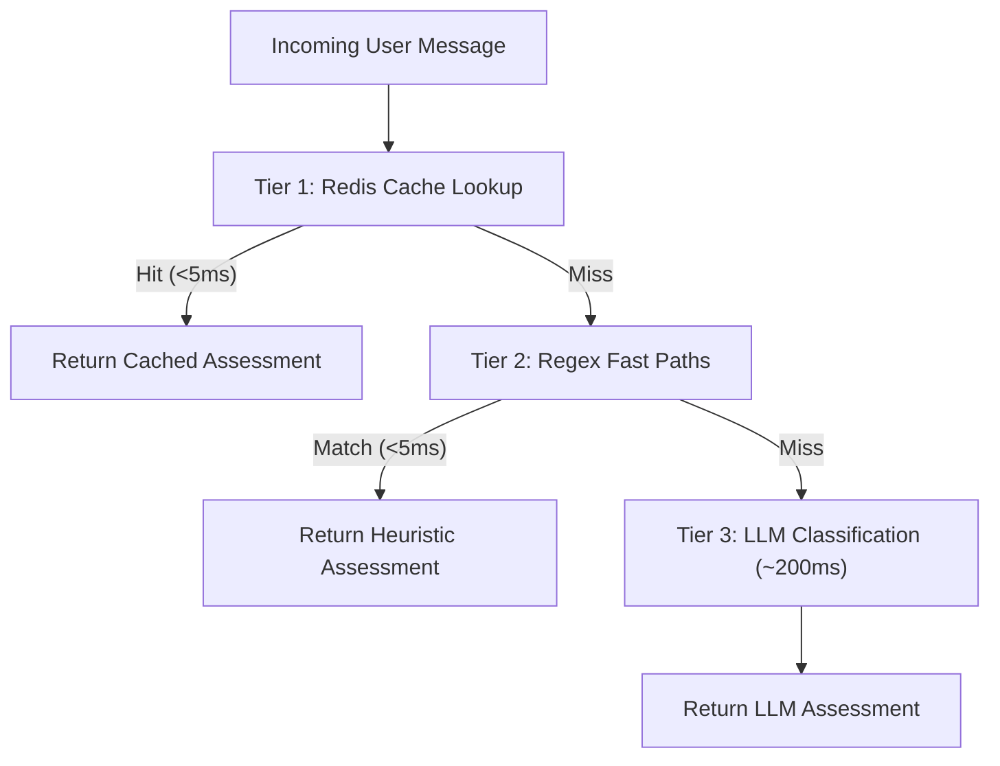
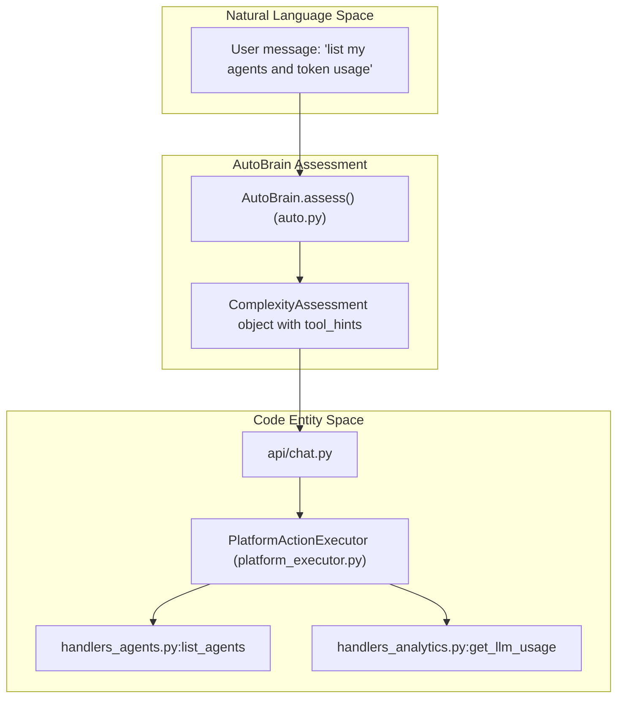
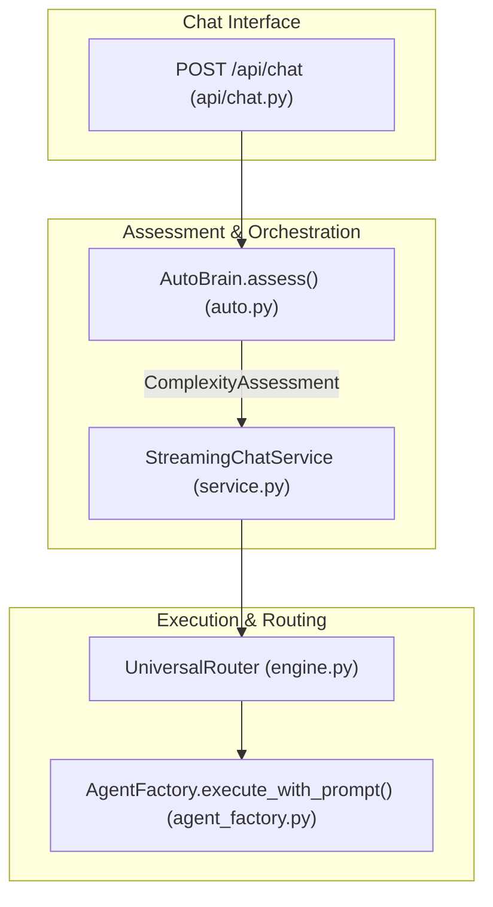

# Complexity Assessment (AutoBrain)

<details>
<summary>Relevant source files</summary>

The following files were used as context for generating this wiki page:

- [orchestrator/api/chat.py](orchestrator/api/chat.py)
- [orchestrator/api/routing.py](orchestrator/api/routing.py)
- [orchestrator/consumers/chatbot/auto.py](orchestrator/consumers/chatbot/auto.py)
- [orchestrator/consumers/chatbot/service.py](orchestrator/consumers/chatbot/service.py)
- [orchestrator/core/llm/manager.py](orchestrator/core/llm/manager.py)
- [orchestrator/core/routing/engine.py](orchestrator/core/routing/engine.py)
- [orchestrator/modules/agents/factory/agent_factory.py](orchestrator/modules/agents/factory/agent_factory.py)
- [orchestrator/modules/tools/discovery/platform_actions.py](orchestrator/modules/tools/discovery/platform_actions.py)
- [orchestrator/modules/tools/discovery/platform_executor.py](orchestrator/modules/tools/discovery/platform_executor.py)
- [orchestrator/scripts/setup_jira_trigger.py](orchestrator/scripts/setup_jira_trigger.py)
- [orchestrator/services/heartbeat_service.py](orchestrator/services/heartbeat_service.py)
- [orchestrator/services/page_context.py](orchestrator/services/page_context.py)
- [orchestrator/tests/test_prd221_page_context.py](orchestrator/tests/test_prd221_page_context.py)
- [orchestrator/tests/test_prd221_page_prior_tools.py](orchestrator/tests/test_prd221_page_prior_tools.py)

</details>


## Purpose & Scope

AutoBrain is the progressive complexity assessor that receives **every** incoming chat message and determines the computational depth required to respond [orchestrator/consumers/chatbot/auto.py:1-22](). It implements PRD-68's Progressive Complexity Model, classifying requests on a five-level scale from simple greetings (`ATOM`) to enterprise-scale multi-agent coordination (`ORGANISM`) [orchestrator/consumers/chatbot/auto.py:47-58]().

The assessor's output dictates three critical downstream behaviors:
1. **Routing decision** — whether to respond directly, delegate to a specialized agent, execute a mission, or assign a board ticket [orchestrator/consumers/chatbot/auto.py:60-68]().
2. **Tool availability** — which tools to load (`tool_hints` / `ASSIGN_TOOL_HINTS`) to prevent context window bloat [orchestrator/consumers/chatbot/auto.py:69-75]().
3. **Memory retrieval** — whether to fetch conversation context from the unified memory system via `needs_memory` [orchestrator/consumers/chatbot/auto.py:65-78]().

Sources: [orchestrator/consumers/chatbot/auto.py:1-78](), [orchestrator/api/chat.py:1-25](), [orchestrator/consumers/chatbot/service.py:1-13]()

---

## Complexity Levels

AutoBrain evaluates incoming prompts against five discrete complexity tiers defined in the `Complexity` Enum [orchestrator/consumers/chatbot/auto.py:51-58]():

| Level | Enum Value | Description | Token Budget | Example Query |
|-------|------------|-------------|--------------|---------------|
| **ATOM** | `atom` | Greetings, factual, chitchat | <200 tokens | "hi", "thanks", "what can you do" |
| **MOLECULE** | `molecule` | Single tool call or specific skill | ~1K tokens | "send email", "check Jira docs" |
| **CELL** | `cell` | Needs memory + tool + reasoning | ~3K tokens | "reply to that email we discussed" |
| **ORGAN** | `organ` | Multi-agent coordination | ~6K tokens | "research bug, plan fix, open PR" |
| **ORGANISM** | `organism` | Enterprise pipeline, learning + feedback | ~12K tokens | "refactor auth across all services" |

Sources: [orchestrator/consumers/chatbot/auto.py:47-58]()

---

## Action Types & Decision Paths

The `Action` Enum maps classified requests to specific execution handlers in the chat and task dispatch pipelines [orchestrator/consumers/chatbot/auto.py:60-68]():

*   `RESPOND`: Auto answers directly in-thread without tools or delegation (typically `ATOM`) [orchestrator/consumers/chatbot/auto.py:62]().
*   `DELEGATE`: Route the query to a specialized single sub-agent to answer during the current turn (`MOLECULE` or `CELL`) [orchestrator/consumers/chatbot/auto.py:63]().
*   `MISSION`: Complex multi-step target requiring conversational mission planning or DAG generation (PRD-125) [orchestrator/consumers/chatbot/auto.py:65]().
*   `ASSIGN`: File an off-thread board ticket for a named single agent using `ASSIGN_TOOL_HINTS` (`platform_create_task`, `platform_assign_task`, `platform_update_task_status`) (PRD-224) [orchestrator/consumers/chatbot/auto.py:66-74]().
*   `WORKFLOW`: Deprecated action type maintained for backward compatibility [orchestrator/consumers/chatbot/auto.py:64]().

Sources: [orchestrator/consumers/chatbot/auto.py:60-74]()

---

## Three-Tier Assessment Strategy

To maintain sub-100ms latency on simple interactions, AutoBrain processes incoming prompts via a three-tier cascade: [orchestrator/consumers/chatbot/auto.py:14-18]()


*Diagram: Three-tier assessment flow for incoming chat prompts.*
Sources: [orchestrator/consumers/chatbot/auto.py:14-18]()

### Tier 1: Redis Cache Lookup
Queries are hashed via SHA-256 and checked against the Redis routing cache. A cache hit bypasses all subsequent computation, returning an instantaneous assessment (<5ms) at zero cost [orchestrator/consumers/chatbot/auto.py:15]().

### Tier 2: Regex Fast Paths
When cache misses occur, strict regular expression patterns evaluate the message for known chitchat structures, greetings, and platform self-awareness queries [orchestrator/consumers/chatbot/auto.py:16](). Platform keywords dynamically populate `tool_hints` such as `platform_list_agents`, `platform_get_llm_usage`, and `platform_query_data` without hitting an LLM [orchestrator/modules/tools/discovery/platform_executor.py:19-158]().

### Tier 3: LLM Classification
If heuristics fail, AutoBrain invokes the `system_llm` model provider tier to categorize the prompt, extract intent, and populate the `ComplexityAssessment` dataclass fields (`confidence`, `needs_memory`, `tool_hints`) [orchestrator/consumers/chatbot/auto.py:17](), [orchestrator/core/llm/manager.py:39-50]().

Sources: [orchestrator/consumers/chatbot/auto.py:14-18](), [orchestrator/core/llm/manager.py:39-50](), [orchestrator/modules/tools/discovery/platform_executor.py:19-158]()

---

## Data Flow & Implementation

The assessment structure is instantiated in `auto.py` and threaded through the chat pipeline to configure execution context [orchestrator/consumers/chatbot/auto.py:65-78]().

```python
@dataclass
class ComplexityAssessment:
    complexity: Complexity
    action: Action
    reasoning: str
    target_agent_id: Optional[int] = None
    target_agent_name: Optional[str] = None
    matched_tools: List[str] = field(default_factory=list)
    confidence: float = 0.0
    needs_memory: bool = False
    tool_hints: List[str] = field(default_factory=list)
    needs_multi_agent: bool = False
```


*Diagram: Bridging natural language assessment requests to execution code entities.*
Sources: [orchestrator/consumers/chatbot/auto.py:65-78](), [orchestrator/api/chat.py:1-25](), [orchestrator/modules/tools/discovery/platform_executor.py:19-158]()


*Diagram: High-level request lifecycle integration with AutoBrain.*
Sources: [orchestrator/api/chat.py:1-25](), [orchestrator/consumers/chatbot/auto.py:1-22](), [orchestrator/consumers/chatbot/service.py:10-13](), [orchestrator/core/routing/engine.py:58-85]()

Sources: [orchestrator/consumers/chatbot/auto.py:65-78](), [orchestrator/api/chat.py:1-25](), [orchestrator/consumers/chatbot/service.py:1-13](), [orchestrator/core/routing/engine.py:58-85](), [orchestrator/modules/tools/discovery/platform_executor.py:19-158]()

---

## Tool Loop Prevention & Deduplication

AutoBrain's routing behavior is paired with runtime checks in `StreamingChatService` to prevent recursive tool loops and runaway token expenditure [orchestrator/consumers/chatbot/service.py:76-104]().

| Loop Prevention Mechanism | Implementation Function / Attribute | Objective |
|---------------------------|-------------------------------------|-----------|
| **Exact Deduplication** | `_normalize_query` / exact match set | Rejects identical tool invocations with duplicate parameters within a turn [orchestrator/consumers/chatbot/service.py:76-82]() |
| **Semantic Deduplication**| `_queries_are_similar` (threshold=0.75) | Blocks redundant searches sharing high string similarity ratio [orchestrator/consumers/chatbot/service.py:85-95]() |
| **Argument Extraction** | `_extract_query_from_args` | Inspects payloads for query keys (`query`, `search_query`, `q`, `text`) [orchestrator/consumers/chatbot/service.py:97-104]() |

Sources: [orchestrator/consumers/chatbot/service.py:76-104]()

---