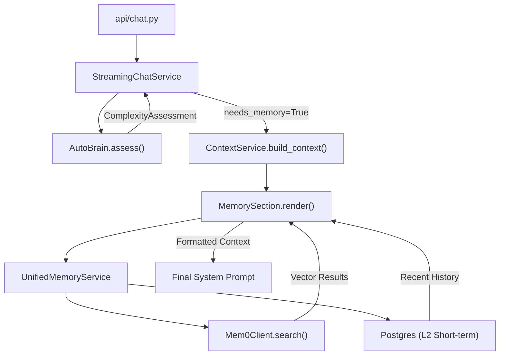
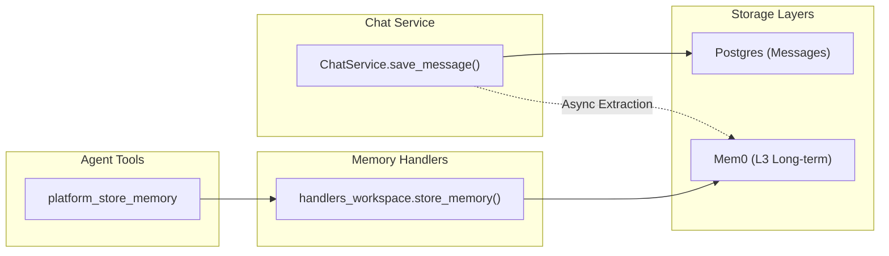

# Memory Integration

Relevant source files

The following files were used as context for generating this wiki page:

- [docs/PRDS/55-AUTONOMOUS-ASSISTANT-PLATFORM.md](docs/PRDS/55-AUTONOMOUS-ASSISTANT-PLATFORM.md)
- [docs/reviews/COMPOSIO-TOOL-REGRESSION-REVIEW.md](docs/reviews/COMPOSIO-TOOL-REGRESSION-REVIEW.md)
- [frontend/components/auth/sign-up-form.tsx](frontend/components/auth/sign-up-form.tsx)
- [orchestrator/alembic/versions/20260215_add_heartbeat_and_channels.py](orchestrator/alembic/versions/20260215_add_heartbeat_and_channels.py)
- [orchestrator/api/channels.py](orchestrator/api/channels.py)
- [orchestrator/api/chat.py](orchestrator/api/chat.py)
- [orchestrator/api/chat_voice.py](orchestrator/api/chat_voice.py)
- [orchestrator/api/heartbeat.py](orchestrator/api/heartbeat.py)
- [orchestrator/channels/base.py](orchestrator/channels/base.py)
- [orchestrator/channels/discord_adapter.py](orchestrator/channels/discord_adapter.py)
- [orchestrator/channels/google_chat_adapter.py](orchestrator/channels/google_chat_adapter.py)
- [orchestrator/channels/line_adapter.py](orchestrator/channels/line_adapter.py)
- [orchestrator/channels/manager.py](orchestrator/channels/manager.py)
- [orchestrator/channels/slack_adapter.py](orchestrator/channels/slack_adapter.py)
- [orchestrator/consumers/chatbot/auto.py](orchestrator/consumers/chatbot/auto.py)
- [orchestrator/consumers/chatbot/intent_classifier.py](orchestrator/consumers/chatbot/intent_classifier.py)
- [orchestrator/consumers/chatbot/personality.py](orchestrator/consumers/chatbot/personality.py)
- [orchestrator/consumers/chatbot/service.py](orchestrator/consumers/chatbot/service.py)
- [orchestrator/consumers/chatbot/smart_memory.py](orchestrator/consumers/chatbot/smart_memory.py)
- [orchestrator/consumers/chatbot/smart_tool_router.py](orchestrator/consumers/chatbot/smart_tool_router.py)
- [orchestrator/core/llm/manager.py](orchestrator/core/llm/manager.py)
- [orchestrator/core/models/channels.py](orchestrator/core/models/channels.py)
- [orchestrator/core/routing/engine.py](orchestrator/core/routing/engine.py)
- [orchestrator/core/services/plugin_security_scanner.py](orchestrator/core/services/plugin_security_scanner.py)
- [orchestrator/modules/agents/__init__.py](orchestrator/modules/agents/__init__.py)
- [orchestrator/modules/agents/factory/__init__.py](orchestrator/modules/agents/factory/__init__.py)
- [orchestrator/modules/memory/integrations/mem0_client.py](orchestrator/modules/memory/integrations/mem0_client.py)
- [orchestrator/modules/orchestrator/service.py](orchestrator/modules/orchestrator/service.py)
- [orchestrator/modules/tools/discovery/actions_analytics_enhanced.py](orchestrator/modules/tools/discovery/actions_analytics_enhanced.py)
- [orchestrator/modules/tools/discovery/handlers_analytics_enhanced.py](orchestrator/modules/tools/discovery/handlers_analytics_enhanced.py)
- [orchestrator/modules/tools/discovery/handlers_search.py](orchestrator/modules/tools/discovery/handlers_search.py)
- [orchestrator/modules/tools/discovery/platform_actions.py](orchestrator/modules/tools/discovery/platform_actions.py)
- [orchestrator/modules/tools/discovery/platform_executor.py](orchestrator/modules/tools/discovery/platform_executor.py)
- [orchestrator/modules/tools/tool_router.py](orchestrator/modules/tools/tool_router.py)

This page documents how the chat interface integrates with the 5-layer memory system during message processing. It covers memory retrieval (pre-LLM context assembly), storage (post-response persistence), and the flow of data between `StreamingChatService`, `ContextService`, and `UnifiedMemoryService`.

For the broader memory architecture and L0-L4 layer definitions, see **3. Memory System**. For context assembly mechanics and token budgets, see **4. Context Service**.

---

## Overview

Memory integration in the chat interface operates in two phases:

1.  **Retrieval Phase** — Before the LLM call, relevant memories are fetched and injected into the system prompt via `MemorySection`. The `AutoBrain` complexity assessor determines if memory is needed based on the task type (e.g., `ATOM` tasks skip memory, while `CELL` and above require it) [orchestrator/consumers/chatbot/auto.py:7-22]().
2.  **Storage Phase** — After the LLM response completes, the user-assistant exchange is stored across multiple layers: L1 Redis session, L2 Postgres short-term, and L3 Mem0 long-term. Platform actions like `platform_store_memory` allow agents to explicitly persist facts during execution [orchestrator/modules/tools/discovery/platform_executor.py:53-54]().

**Sources:** [orchestrator/consumers/chatbot/service.py:1-13](), [orchestrator/consumers/chatbot/auto.py:1-22](), [orchestrator/modules/memory/integrations/mem0_client.py:1-11]()

---

## Memory Retrieval Architecture

### Complexity-Aware Retrieval

The chat system uses `AutoBrain` to assess message complexity. This assessment includes a `needs_memory` flag which informs the `StreamingChatService` whether to invoke the memory retrieval pipeline [orchestrator/consumers/chatbot/auto.py:69-72]().

**Diagram: Memory Retrieval Data Flow**

**Sources:** [orchestrator/api/chat.py:18-20](), [orchestrator/consumers/chatbot/auto.py:59-84](), [orchestrator/modules/memory/integrations/mem0_client.py:143-154]()

---

## ContextService Integration

When `ContextService` is invoked, memory retrieval is encapsulated in the `MemorySection` class. It manages the token budget and formatting for the LLM.

### MemorySection Render Flow

The `MemorySection` handles the complexity of coordinating with the `UnifiedMemoryService`.

**Key Behaviors:**
*   **Intent-Based Filtering**: The `SmartToolRouter` can influence memory usage by mapping intents like `MEMORY_RECALL` to specific memory tool categories [orchestrator/consumers/chatbot/smart_tool_router.py:121]().
*   **Platform Integration**: Agents can search or browse memories using `platform_search_memory` and `platform_browse_memories` handlers, which interface directly with the memory storage layer [orchestrator/modules/tools/discovery/platform_executor.py:65-66]().
*   **Stashing**: Stashed memory context is often used to provide transparency to the user in the chat UI regarding what "facts" the AI is currently recalling.

**Sources:** [orchestrator/consumers/chatbot/smart_tool_router.py:111-125](), [orchestrator/modules/tools/discovery/platform_executor.py:198-200]()

---

## Memory Storage Flow

After a successful LLM response, the system initiates a multi-layered persistence pipeline. This is handled both automatically by the chat orchestrator and explicitly via platform tools.

### Storage Pipeline Implementation

1.  **L3 Long-Term (Mem0)**: The `Mem0Client` performs fact extraction and vector storage. It accepts a list of messages, converts them to a text string, and sends them to the Mem0 server [orchestrator/modules/memory/integrations/mem0_client.py:143-165]().
2.  **L2 Short-Term (Postgres)**: Messages are persisted to the database via `ChatService.save_message` [orchestrator/consumers/chatbot/service.py:184-188]().
3.  **Explicit Storage**: Agents can use the `platform_store_memory` tool to save specific information. This routes through `PlatformActionExecutor` to the `store_memory` handler [orchestrator/modules/tools/discovery/platform_executor.py:53-54]().

**Diagram: Memory Storage Implementation**

**Sources:** [orchestrator/modules/memory/integrations/mem0_client.py:143-176](), [orchestrator/consumers/chatbot/service.py:161-186](), [orchestrator/modules/tools/discovery/platform_executor.py:193-194]()

---

## Error Handling & Circuit Breaking

Memory operations, particularly those involving the external `Mem0` service, are protected by a **Circuit Breaker** to prevent latency in the memory tier from degrading the overall chat experience [orchestrator/modules/memory/integrations/mem0_client.py:27-63]().

*   **Failure Threshold**: 5 consecutive failures will "open" the circuit [orchestrator/modules/memory/integrations/mem0_client.py:21]().
*   **Cooldown**: The circuit stays open for 60 seconds before allowing a "probe" request [orchestrator/modules/memory/integrations/mem0_client.py:22]().
*   **Retries**: The client implements a single retry with exponential backoff (1.5s) for connection errors and timeouts [orchestrator/modules/memory/integrations/mem0_client.py:24-127]().
*   **Timeout**: Requests to Mem0 are capped at 15 seconds [orchestrator/modules/memory/integrations/mem0_client.py:23]().

**Sources:** [orchestrator/modules/memory/integrations/mem0_client.py:20-63](), [orchestrator/modules/memory/integrations/mem0_client.py:111-140]()

---