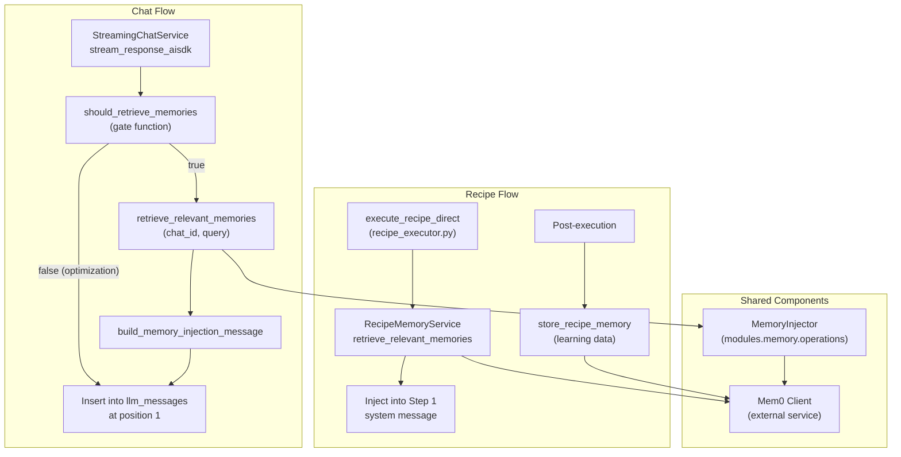
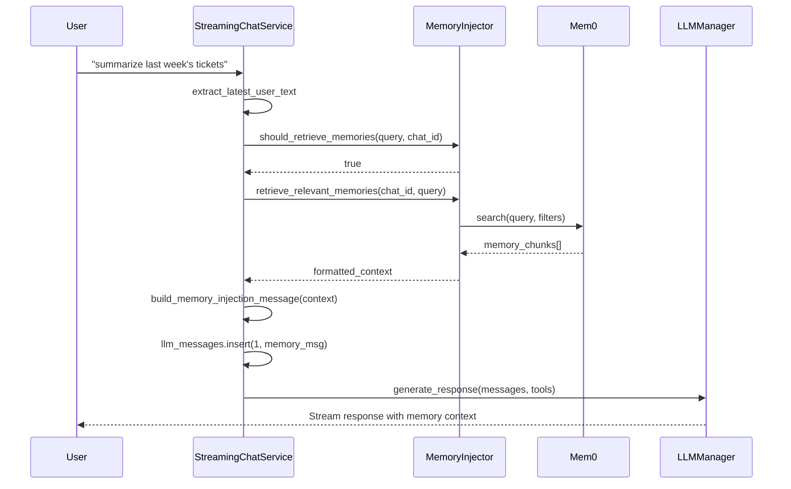
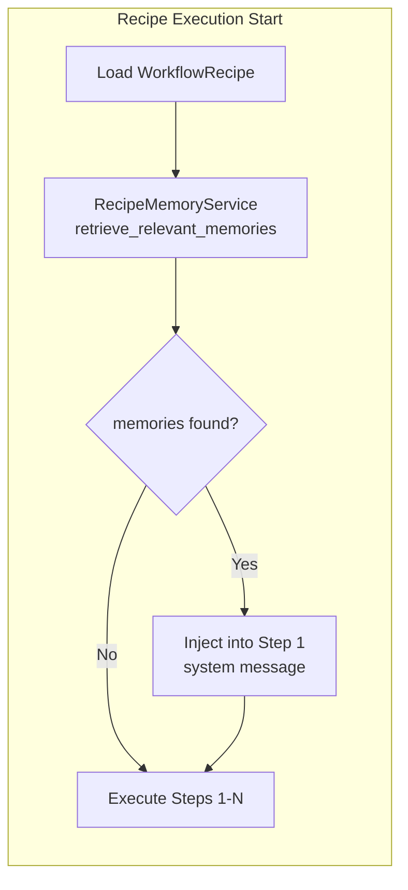
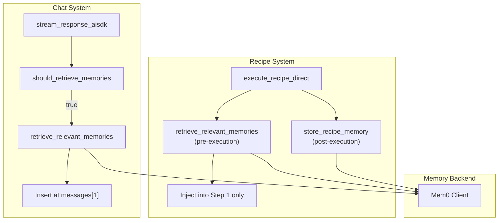

# Memory Integration

<details>
<summary>Relevant source files</summary>

The following files were used as context for generating this wiki page:

- [frontend/tsconfig.tsbuildinfo](frontend/tsconfig.tsbuildinfo)
- [orchestrator/api/chat.py](orchestrator/api/chat.py)
- [orchestrator/api/routing.py](orchestrator/api/routing.py)
- [orchestrator/api/workflows.py](orchestrator/api/workflows.py)
- [orchestrator/consumers/chatbot/auto.py](orchestrator/consumers/chatbot/auto.py)
- [orchestrator/consumers/chatbot/intent_classifier.py](orchestrator/consumers/chatbot/intent_classifier.py)
- [orchestrator/consumers/chatbot/personality.py](orchestrator/consumers/chatbot/personality.py)
- [orchestrator/consumers/chatbot/service.py](orchestrator/consumers/chatbot/service.py)
- [orchestrator/consumers/chatbot/smart_orchestrator.py](orchestrator/consumers/chatbot/smart_orchestrator.py)
- [orchestrator/consumers/chatbot/smart_tool_router.py](orchestrator/consumers/chatbot/smart_tool_router.py)
- [orchestrator/core/llm/manager.py](orchestrator/core/llm/manager.py)
- [orchestrator/core/models/system_settings.py](orchestrator/core/models/system_settings.py)
- [orchestrator/core/routing/engine.py](orchestrator/core/routing/engine.py)
- [orchestrator/modules/agents/factory/agent_factory.py](orchestrator/modules/agents/factory/agent_factory.py)
- [orchestrator/modules/orchestrator/pipeline.py](orchestrator/modules/orchestrator/pipeline.py)
- [orchestrator/modules/orchestrator/service.py](orchestrator/modules/orchestrator/service.py)
- [orchestrator/modules/tools/discovery/__init__.py](orchestrator/modules/tools/discovery/__init__.py)
- [orchestrator/scripts/setup_jira_trigger.py](orchestrator/scripts/setup_jira_trigger.py)

</details>


## Purpose and Scope

This document covers the integration of Mem0 memory retrieval and storage within the chat and recipe execution systems. Memory integration enables agents to access relevant context from previous interactions, improving coherence and task continuity across conversations and workflow executions.

For information about the broader chat streaming system, see [Streaming Chat Service](#8.1). For recipe execution details, see [Recipe Execution](#4.2).

---

## Architecture Overview

Memory integration operates at two primary touch points: the streaming chat service and the recipe executor. Both systems use a shared memory injector to retrieve and format context from Mem0.



**Sources:** [orchestrator/consumers/chatbot/service.py:601-614](), [orchestrator/api/recipe_executor.py:637-652]()

---

## The Memory Retrieval Gate

To avoid unnecessary token overhead and API calls, memory retrieval is gated by the `should_retrieve_memories` function. This optimization determines whether the current user query warrants memory context injection.

### Gate Logic

The gate evaluates the query against heuristics to detect when memories are likely irrelevant:

| Query Pattern | Example | Should Retrieve? |
|---------------|---------|------------------|
| Simple greetings | "hello", "hi there" | No |
| Meta questions | "what can you do?" | No |
| Continuation queries | "continue", "go on" | No |
| Complex task queries | "summarize last week's PRs" | Yes |
| Referential queries | "what did I ask about earlier?" | Yes |

### Implementation

```
orchestrator/consumers/chatbot/service.py:603
    should_retrieve = await self.memory_injector.should_retrieve_memories(latest_text, chat_id)
```

The gate is checked before retrieval. If it returns `False`, memory injection is skipped entirely, saving tokens and reducing latency.

**Sources:** [orchestrator/consumers/chatbot/service.py:602-604]()

---

## Chat Memory Integration

Memory injection in the streaming chat service occurs during the prompt assembly phase, before the LLM generate call.

### Injection Flow



### Code Path

The memory injection occurs in `stream_response_aisdk`:

```
orchestrator/consumers/chatbot/service.py:605-614

if not fresh_start and should_retrieve:
    memory_context = await self.memory_injector.retrieve_relevant_memories(
        chat_id,
        latest_text,
        workspace_id=str(self.workspace_id) if self.workspace_id else None,
        agent_id=agent_id
    )
    if memory_context:
        logger.info(f"[Memory] Injecting {len(memory_context)} chars")
        llm_messages.insert(1, self.memory_injector.build_memory_injection_message(memory_context))
```

The memory message is inserted at **position 1** (after the system message, before user context). This placement ensures memories inform the agent's response without overriding core instructions.

**Sources:** [orchestrator/consumers/chatbot/service.py:492-615]()

---

## Recipe Memory Integration

Recipe execution integrates memories at two stages: **pre-execution** (loading) and **post-execution** (storage).

### Pre-Execution: Memory Loading

Memories are retrieved before recipe execution begins and injected into **Step 1 only**. This prevents redundant memory context from accumulating across all steps.



### Code Path

Memory retrieval occurs in `execute_recipe_direct`:

```
orchestrator/api/recipe_executor.py:637-652

recipe_memories = None
try:
    from core.services.recipe_memory_service import RecipeMemoryService
    memory_svc = RecipeMemoryService(db=db)
    recipe_memories = memory_svc.retrieve_relevant_memories(
        recipe_id=recipe.id,
        context={"workspace_id": str(workspace_id), "input_data": input_data}
    )
    if recipe_memories and recipe_memories.get("total_memories", 0) > 0:
        logger.info(
            "[recipe_direct] Loaded %d Mem0 memories for recipe %d",
            recipe_memories["total_memories"], recipe.id,
        )
except Exception as exc:
    logger.info("[recipe_direct] Mem0 memory retrieval skipped: %s", exc)
```

Injection into Step 1:

```
orchestrator/api/recipe_executor.py:151-162

if recipe_memories and step_order == 1:
    summary = recipe_memories.get("summary", "")
    if summary and summary != "No relevant memories found":
        messages.append({
            "role": "system",
            "content": (
                "## Learnings from Previous Runs\n"
                f"{summary}"
            ),
        })
        logger.info("[recipe_step] Injected %d Mem0 memories into step 1", recipe_memories.get("total_memories", 0))
```

**Sources:** [orchestrator/api/recipe_executor.py:151-162](), [orchestrator/api/recipe_executor.py:637-652]()

### Post-Execution: Memory Storage

After recipe execution completes, learning data is stored back to Mem0 for future runs. This enables continuous improvement through self-learning.

```
orchestrator/api/recipe_executor.py:762-774

# Post-execution: store memories for learning
try:
    from core.services.recipe_memory_service import RecipeMemoryService
    memory_svc = RecipeMemoryService(db=db)
    
    learning_data = {
        "recipe_id": recipe.id,
        "execution_id": recipe_execution_id,
        "success": execution.status == 'completed',
        "step_results": compact_results,
        "duration_ms": total_duration_ms,
        "total_tokens": total_tokens,
    }
    
    memory_svc.store_recipe_memory(learning_data)
    logger.info("[recipe_direct] Stored execution memory for recipe %d", recipe.id)
except Exception as exc:
    logger.warning("[recipe_direct] Memory storage failed: %s", exc)
```

**Sources:** [orchestrator/api/recipe_executor.py:762-774]()

---

## Memory Context Formatting

Memory context is formatted into a structured system message that the LLM can parse naturally. The format varies slightly between chat and recipe contexts.

### Chat Memory Format

For chat interactions, the memory injector builds a context summary:

```
orchestrator/consumers/chatbot/service.py:614

llm_messages.insert(1, self.memory_injector.build_memory_injection_message(memory_context))
```

The `build_memory_injection_message` method (from `modules.memory.operations`) typically produces:

```
## Context from Previous Interactions

<memory_summary>

Relevant details:
- Key point 1
- Key point 2
- Key point 3
```

### Recipe Memory Format

For recipe execution, memories are formatted as learnings:

```
## Learnings from Previous Runs

<summary>
```

This simpler format reflects that recipe memories are typically higher-level patterns (e.g., "JIRA_GET_ISSUE requires `issue_id_or_key` param") rather than conversational context.

**Sources:** [orchestrator/api/recipe_executor.py:151-162](), [orchestrator/consumers/chatbot/service.py:614]()

---

## Component Reference

| Component | Location | Purpose |
|-----------|----------|---------|
| `MemoryInjector` | `modules.memory.operations` | Core memory retrieval/formatting logic |
| `RecipeMemoryService` | `core.services.recipe_memory_service` | Recipe-specific memory operations |
| `should_retrieve_memories` | `MemoryInjector` method | Gate function to optimize retrieval |
| `retrieve_relevant_memories` | `MemoryInjector` method | Fetch memories from Mem0 |
| `build_memory_injection_message` | `MemoryInjector` method | Format memories for LLM context |
| `store_recipe_memory` | `RecipeMemoryService` method | Persist learning data post-execution |

**Sources:** [orchestrator/consumers/chatbot/service.py:37](), [orchestrator/consumers/chatbot/service.py:466](), [orchestrator/api/recipe_executor.py:640]()

---

## Memory Injection Points Summary



**Sources:** [orchestrator/consumers/chatbot/service.py:492-615](), [orchestrator/api/recipe_executor.py:637-774]()

---