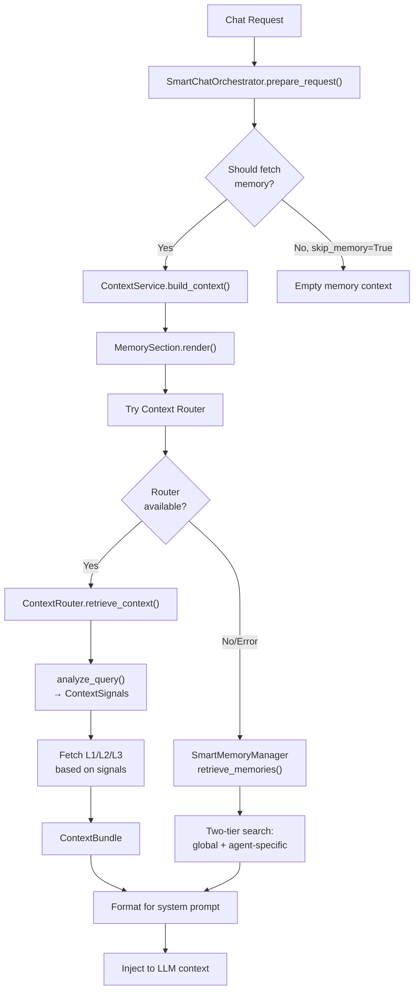
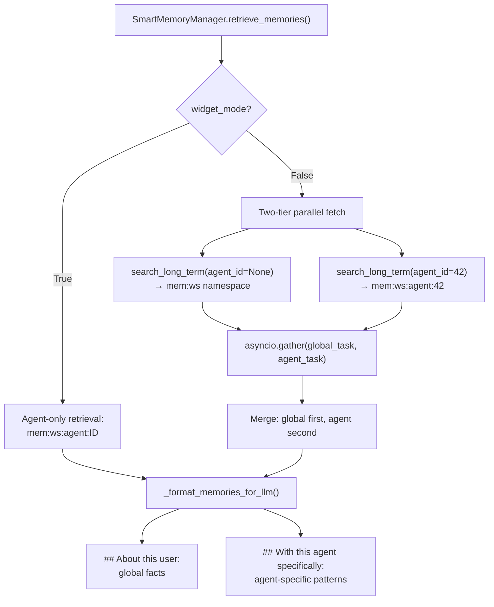

# Memory Integration

Relevant source files

The following files were used as context for generating this wiki page:

- [docs/PRDS/137-AUTO-CHATBOT-RECOVERY.md](docs/PRDS/137-AUTO-CHATBOT-RECOVERY.md)
- [frontend/app/api/chat/route.ts](frontend/app/api/chat/route.ts)
- [frontend/components/chatbot/chat.tsx](frontend/components/chatbot/chat.tsx)
- [frontend/components/chatbot/mission-suggestion-card.tsx](frontend/components/chatbot/mission-suggestion-card.tsx)
- [frontend/lib/chat/hooks.ts](frontend/lib/chat/hooks.ts)
- [frontend/stores/mission-store.ts](frontend/stores/mission-store.ts)
- [orchestrator/api/chat.py](orchestrator/api/chat.py)
- [orchestrator/api/recipe_executor.py](orchestrator/api/recipe_executor.py)
- [orchestrator/consumers/chatbot/integration.py](orchestrator/consumers/chatbot/integration.py)
- [orchestrator/consumers/chatbot/prompt_analyzer.py](orchestrator/consumers/chatbot/prompt_analyzer.py)
- [orchestrator/consumers/chatbot/service.py](orchestrator/consumers/chatbot/service.py)
- [orchestrator/consumers/chatbot/smart_memory.py](orchestrator/consumers/chatbot/smart_memory.py)
- [orchestrator/consumers/chatbot/smart_orchestrator.py](orchestrator/consumers/chatbot/smart_orchestrator.py)
- [orchestrator/modules/agents/factory/agent_factory.py](orchestrator/modules/agents/factory/agent_factory.py)
- [orchestrator/modules/agents/queries.py](orchestrator/modules/agents/queries.py)
- [orchestrator/modules/context/sections/identity.py](orchestrator/modules/context/sections/identity.py)
- [orchestrator/modules/context/sections/skills.py](orchestrator/modules/context/sections/skills.py)
- [orchestrator/modules/context/sections/task_context.py](orchestrator/modules/context/sections/task_context.py)
- [orchestrator/modules/memory/integrations/mem0_client.py](orchestrator/modules/memory/integrations/mem0_client.py)

This page documents how the chat interface integrates with the 5-layer memory system during message processing. It covers memory retrieval (pre-LLM context assembly), storage (post-response persistence), and the flow of data between `SmartChatOrchestrator`, `ContextService`, and `UnifiedMemoryService`.

For the broader memory architecture and L0-L4 layer definitions, see **3. Memory System**. For context assembly mechanics and token budgets, see **4. Context Service**.

---

## Overview

Memory integration in the chat interface operates in two phases:

1.  **Retrieval Phase** — Before the LLM call, relevant memories are fetched and injected into the system prompt via `MemorySection` or `SmartMemoryManager`. The `SmartChatOrchestrator` analyzes the query and complexity to determine if memory is required [orchestrator/consumers/chatbot/smart_orchestrator.py:169-183]().
2.  **Storage Phase** — After the LLM response completes, the user-assistant exchange is stored across multiple layers: L1 Redis session, L2 Postgres short-term, and L3 Mem0 long-term. `SmartMemoryManager` uses a classification logic to determine if a memory is `global` (user identity) or `agent` specific (tool usage patterns) [orchestrator/consumers/chatbot/smart_memory.py:92-106]().

**Sources:** [orchestrator/consumers/chatbot/service.py:1-13](), [orchestrator/consumers/chatbot/smart_orchestrator.py:113-124](), [orchestrator/consumers/chatbot/smart_memory.py:50-60]()

---

## Memory Retrieval Architecture

### Dual-Path Retrieval Strategy

The chat system uses a prioritized retrieval path through the `ContextService`. The `SmartChatOrchestrator` coordinates this by checking `intent_result.requires_memory` and potentially overriding it based on the `ComplexityAssessment` from AutoBrain [orchestrator/consumers/chatbot/smart_orchestrator.py:169-183]().

**Diagram: Memory Retrieval Data Flow**

**Sources:** [orchestrator/consumers/chatbot/smart_orchestrator.py:169-194](), [orchestrator/consumers/chatbot/smart_memory.py:174-181]()

---

## ContextService Integration

When `ContextService` is invoked (the unified path), memory retrieval is encapsulated in the `MemorySection` class.

### MemorySection Render Flow

The `MemorySection` handles the complexity of checking for `skip_memory` flags (often set by `ComplexityAssessment` in **9.2**) and coordinating with the `UnifiedMemoryService`.

**Key Behaviors:**
*   **Skip Logic**: If `skip_memory=True` is passed to the context builder, the section returns an empty string immediately.
*   **Token Budget**: Memory is assigned a specific priority (P6). If the total prompt exceeds the token limit, `TokenBudgetManager` may trim this section before higher priority ones like `Identity` (P1) or `Tools` (P3) [orchestrator/modules/context/sections/identity.py:68-69]().
*   **Stashing**: The raw memory text is stashed in the context's `kwargs` as `_memory_context` so it can be sent to the frontend via SSE data streams for transparency.

**Sources:** [orchestrator/consumers/chatbot/smart_orchestrator.py:191-195](), [orchestrator/modules/context/sections/identity.py:55-69]()

---

## Two-Tier Memory Retrieval

`SmartMemoryManager` implements a parallel fetching strategy to separate general user facts from agent-specific context.

**Diagram: Two-Tier Search Implementation**

**Widget Mode Isolation**: When `widget_mode` is active, the system strictly isolates memory to the agent-specific namespace to prevent leaking sensitive workspace-wide information into public-facing widgets [orchestrator/consumers/chatbot/smart_memory.py:180-181]().

**Sources:** [orchestrator/consumers/chatbot/smart_memory.py:174-200](), [orchestrator/consumers/chatbot/smart_orchestrator.py:107-108]()

---

## Memory Storage Flow

After a successful LLM response, the system initiates a multi-layered persistence pipeline.

### Storage Pipeline Implementation

1.  **L3 Long-Term (Mem0)**: The `Mem0Client` performs fact extraction and vector storage. It accepts a list of messages and a `user_id` [orchestrator/modules/memory/integrations/mem0_client.py:176-187]().
2.  **L2 Short-Term (Postgres)**: Exchanges are persisted to the database via the `ChatService` or the orchestrator's session logic.
3.  **L1 Working (Redis)**: `UnifiedMemoryService` updates the current session state [orchestrator/consumers/chatbot/smart_orchestrator.py:118-119]().
4.  **Classification Logic**: `SmartMemoryManager._classify_memory_tier` determines if a message contains `personal_keywords` (Global) or `tool_keywords` (Agent) [orchestrator/consumers/chatbot/smart_memory.py:92-106]().

**Storage Tier Classification Rules:**
*   **Agent Tier**: Keywords like "slack", "github", "jira", "database", or "repository" [orchestrator/consumers/chatbot/smart_memory.py:113-126]().
*   **Global Tier**: Personal keywords like "my name", "i am", "i work at", "i live" [orchestrator/consumers/chatbot/smart_memory.py:129-135]().
*   **Both**: Preference keywords like "prefer", "favorite", "like to" trigger storage in both tiers [orchestrator/consumers/chatbot/smart_memory.py:138-141]().

**Sources:** [orchestrator/modules/memory/integrations/mem0_client.py:176-200](), [orchestrator/consumers/chatbot/smart_memory.py:92-168](), [orchestrator/consumers/chatbot/smart_orchestrator.py:113-124]()

---

## Error Handling & Circuit Breaking

Memory operations are designed to be resilient. The `Mem0Client` includes a **Circuit Breaker** to prevent external API latency from blocking chat threads [orchestrator/modules/memory/integrations/mem0_client.py:25-60]().

*   **Failure Threshold**: 3 consecutive failures (configurable via `MEM0_CIRCUIT_THRESHOLD`) [orchestrator/modules/memory/integrations/mem0_client.py:29-33]().
*   **Cooldown**: 300 seconds before retrying [orchestrator/modules/memory/integrations/mem0_client.py:34]().
*   **Retries**: One retry with exponential backoff (1.5s) [orchestrator/modules/memory/integrations/mem0_client.py:22, 143-148]().
*   **Timeout**: 3.0 seconds default to ensure Mem0 is enrichment, not a critical path blocker [orchestrator/modules/memory/integrations/mem0_client.py:86]().

**Sources:** [orchestrator/modules/memory/integrations/mem0_client.py:20-60](), [orchestrator/modules/memory/integrations/mem0_client.py:107-140]()

---