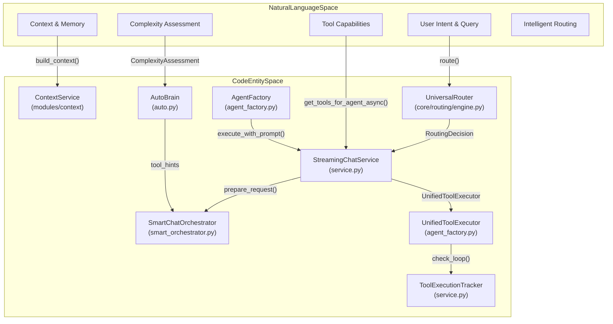
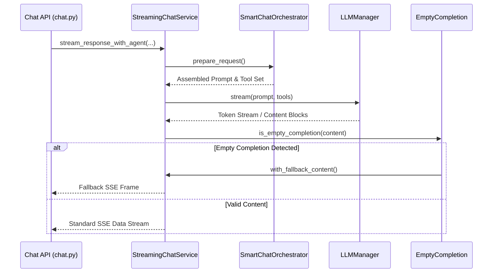

# Streaming Chat Service

Relevant source files

The following files were used as context for generating this wiki page:

- [orchestrator/api/chat.py](orchestrator/api/chat.py)
- [orchestrator/api/routing.py](orchestrator/api/routing.py)
- [orchestrator/consumers/chatbot/auto.py](orchestrator/consumers/chatbot/auto.py)
- [orchestrator/consumers/chatbot/empty_completion.py](orchestrator/consumers/chatbot/empty_completion.py)
- [orchestrator/consumers/chatbot/service.py](orchestrator/consumers/chatbot/service.py)
- [orchestrator/core/llm/manager.py](orchestrator/core/llm/manager.py)
- [orchestrator/core/routing/engine.py](orchestrator/core/routing/engine.py)
- [orchestrator/modules/agents/factory/agent_factory.py](orchestrator/modules/agents/factory/agent_factory.py)
- [orchestrator/modules/tools/discovery/actions_agents.py](orchestrator/modules/tools/discovery/actions_agents.py)
- [orchestrator/modules/tools/discovery/actions_board_tasks.py](orchestrator/modules/tools/discovery/actions_board_tasks.py)
- [orchestrator/modules/tools/discovery/handlers_agents.py](orchestrator/modules/tools/discovery/handlers_agents.py)
- [orchestrator/modules/tools/discovery/handlers_board_tasks.py](orchestrator/modules/tools/discovery/handlers_board_tasks.py)
- [orchestrator/modules/tools/discovery/platform_actions.py](orchestrator/modules/tools/discovery/platform_actions.py)
- [orchestrator/modules/tools/discovery/platform_executor.py](orchestrator/modules/tools/discovery/platform_executor.py)
- [orchestrator/scripts/setup_jira_trigger.py](orchestrator/scripts/setup_jira_trigger.py)
- [orchestrator/services/heartbeat_service.py](orchestrator/services/heartbeat_service.py)
- [orchestrator/services/page_context.py](orchestrator/services/page_context.py)
- [orchestrator/tests/test_board_task_handlers.py](orchestrator/tests/test_board_task_handlers.py)
- [orchestrator/tests/test_prd221_page_context.py](orchestrator/tests/test_prd221_page_context.py)
- [orchestrator/tests/test_prd221_page_prior_tools.py](orchestrator/tests/test_prd221_page_prior_tools.py)
- [orchestrator/tests/test_prd222_empty_completion.py](orchestrator/tests/test_prd222_empty_completion.py)
- [orchestrator/tests/test_prd222_unknown_model_error_names_the_way_out.py](orchestrator/tests/test_prd222_unknown_model_error_names_the_way_out.py)
- [orchestrator/tests/test_prd224_assign_lane.py](orchestrator/tests/test_prd224_assign_lane.py)

## Purpose and Scope

The Streaming Chat Service is the core orchestration layer for real-time, token-by-token chat interactions within the Automatos platform. It leverages Server-Sent Events (SSE) and the AI SDK Data Stream format to provide a responsive user experience. The service bridges high-level user intent with low-level execution by coordinating the `SmartChatOrchestrator` for intent classification, the `ContextService` for unified prompt assembly (Identity, Skills, Memory, Tools), and the `AgentFactory` for execution. It also includes specialized logic for complexity-based routing via `AutoBrain` and the `UniversalRouter`, along with robust empty completion handling.

Sources: `[orchestrator/consumers/chatbot/service.py:1-13]`, `[orchestrator/api/chat.py:1-7]`, `[orchestrator/consumers/chatbot/auto.py:1-22]`

---

## Architecture Overview

The streaming architecture connects "Natural Language Space" (user input and conceptual intent) to "Code Entity Space" (specific service implementations and database models).

### System Entity Map: Natural Language to Code Space

This diagram maps conceptual chat requirements to the specific classes and functions responsible for them.

Sources: `[orchestrator/consumers/chatbot/service.py:12-62]`, `[orchestrator/api/chat.py:17-27]`, `[orchestrator/core/routing/engine.py:58-85]`, `[orchestrator/modules/agents/factory/agent_factory.py:43-45]`, `[orchestrator/consumers/chatbot/auto.py:64-89]`

---

## StreamingChatService & Execution Pipeline

The `StreamingChatService` manages the lifecycle of a chat message exchange, coordinating database updates, SSE streaming, tool loop iterations, and empty completion fallbacks.

### Key Functions and Methods

*   **`prepare_request`**: Normalizes input payloads, resolves workspace bindings, and constructs the runtime environment configuration.
*   **`stream_response_with_agent`**: Drives the asynchronous generator that yields SSE data frames (`0:` text, `2:` tool calls/results) conforming to the AI SDK Data Stream protocol.
*   **Empty Completion Handling (`is_empty_completion`, `with_fallback_content`)**: Detects when an LLM model returns an empty or whitespace-only response block and injects robust fallback content or triggers recovery paths.

### Data Flow: Streaming Response Execution

Sources: `[orchestrator/consumers/chatbot/service.py:1-64]`, `[orchestrator/consumers/chatbot/empty_completion.py:1-25]`

---

## SmartChatOrchestrator & Routing

The chat flow begins at `POST /api/chat`, where the `UniversalRouter` determines which agent should handle the request. If no specific agent is targeted, the system defaults to the workspace's "Auto" agent (`get_default_agent_id`).

*   **`UniversalRouter`**: Implements a tiered routing strategy, starting from Tier 0 (User Overrides) to Tier 3 (LLM Classification). `[orchestrator/core/routing/engine.py:58-164]`
*   **`AutoBrain`**: Performs a 3-tier complexity assessment (`ATOM` to `ORGANISM`). It provides `tool_hints` and `needs_memory` flags that drive the `SmartChatOrchestrator`. `[orchestrator/consumers/chatbot/auto.py:14-22]`
*   **`SmartChatOrchestrator`**: Coordinates final prompt assembly using `ContextService` in `CHATBOT` mode, ensuring agent identity, skills, and relevant memories are injected.

Sources: `[orchestrator/api/chat.py:55-173]`, `[orchestrator/core/routing/engine.py:58-164]`, `[orchestrator/consumers/chatbot/auto.py:14-22]`

---

## Tool Loop Prevention & Execution

The `StreamingChatService` utilizes `ToolLoopExecutor` (converged with the agent tool-loop spine) to manage multi-turn reasoning and tool calls.

*   **`ToolExecutionTracker`**: Implements safety checks to prevent infinite loops:
    *   **Exact Deduplication**: Prevents calling the same tool with identical arguments. `[orchestrator/consumers/chatbot/service.py:76-105]`
    *   **Semantic Deduplication**: Uses string similarity (threshold 0.75) for search-based tools to avoid repeating similar queries. `[orchestrator/consumers/chatbot/service.py:85-95]`
    *   **Retry Limits**: Enforces hard caps per tool invocation. `[orchestrator/consumers/chatbot/service.py:106-142]`
*   **`UnifiedToolExecutor`**: Executes platform actions (`platform_*`), Composio integrations, and workspace file commands. `[orchestrator/modules/tools/discovery/platform_executor.py:1-231]`, `[orchestrator/modules/tools/discovery/platform_actions.py:57-104]`

Sources: `[orchestrator/consumers/chatbot/service.py:31-142]`, `[orchestrator/modules/tools/discovery/platform_executor.py:1-231]`

---

## Page Context Integration (PRD-221)

The service supports structured page context, allowing the agent to know the user's location in the UI without leaking sensitive authz fields.

*   **`sanitize_page_context`**: Filters client-provided context to an allow-list (page, route, tab, selected IDs, filters). `[orchestrator/services/page_context.py:46-52]`
*   **`inject_page_preamble`**: Injects a system-level hint about the user's current view into message history. `[orchestrator/services/page_context.py:178-195]`
*   **`page_actions_from_context`**: Suggests relevant `platform_*` tools based on the page manifest. `[orchestrator/services/page_context.py:151-160]`

Sources: `[orchestrator/api/chat.py:27]`, `[orchestrator/services/page_context.py:1-20]`

---

## Platform Action Integration

Agents manage the platform using natural language by invoking `platform_*` actions routed through `PlatformActionExecutor`.

| Action Category | Handler Module | Key Operations |
| :--- | :--- | :--- |
| **Agents** | `handlers_agents.py` | `create_agent`, `list_agents`, `update_agent`, `get_agent` |
| **Board Tasks** | `handlers_board_tasks.py` | `create_board_task`, `list_board_tasks`, `update_board_task_status` |
| **Analytics** | `handlers_analytics.py` | `get_llm_usage`, `get_cost_breakdown` |
| **Workspace** | `handlers_workspace.py` | `get_workspace_info`, `store_memory`, `checkpoint_thread` |

Sources: `[orchestrator/modules/tools/discovery/platform_executor.py:19-146]`, `[orchestrator/modules/tools/discovery/handlers_agents.py:13-178]`, `[orchestrator/modules/tools/discovery/handlers_board_tasks.py:1-150]`

---

## Heartbeat & Proactive Signals

The `HeartbeatService` provides health signals for the chat primitive, ensuring the system can detect degraded performance or failures in the chat pipeline.

*   **`emit_primitive_finding`**: Writes status updates (`green`, `degraded`, `down`) for the "chat" primitive into the `heartbeat_results` table. `[orchestrator/services/heartbeat_service.py:64-132]`
*   **`_emit_chat_primitive`**: Helper used by the chat service to report successful message exchanges. `[orchestrator/consumers/chatbot/service.py:44]`

Sources: `[orchestrator/services/heartbeat_service.py:44-132]`, `[orchestrator/consumers/chatbot/service.py:44]`

---