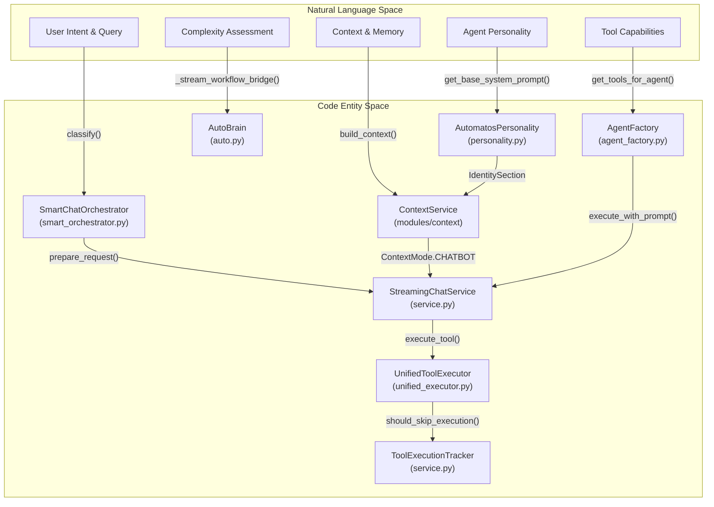
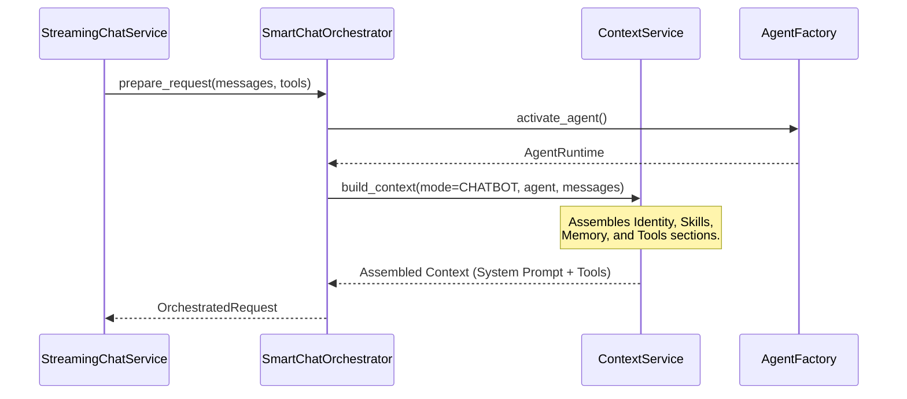
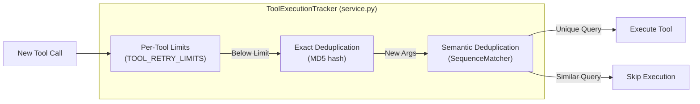

# Streaming Chat Service

Relevant source files

The following files were used as context for generating this wiki page:

- [frontend/app/api/chat/route.ts](frontend/app/api/chat/route.ts)
- [frontend/components/chatbot/chat.tsx](frontend/components/chatbot/chat.tsx)
- [frontend/components/chatbot/mission-suggestion-card.tsx](frontend/components/chatbot/mission-suggestion-card.tsx)
- [frontend/lib/chat/hooks.ts](frontend/lib/chat/hooks.ts)
- [frontend/stores/mission-store.ts](frontend/stores/mission-store.ts)
- [orchestrator/api/chat.py](orchestrator/api/chat.py)
- [orchestrator/api/recipe_executor.py](orchestrator/api/recipe_executor.py)
- [orchestrator/consumers/chatbot/service.py](orchestrator/consumers/chatbot/service.py)
- [orchestrator/modules/agents/factory/agent_factory.py](orchestrator/modules/agents/factory/agent_factory.py)

## Purpose and Scope

The Streaming Chat Service is the core orchestration layer for real-time, token-by-token chat interactions within the Automatos platform. It leverages Server-Sent Events (SSE) and the AI SDK Data Stream format to provide a responsive user experience. The service bridges high-level user intent with low-level execution by coordinating the `SmartChatOrchestrator` for intent classification, the `ContextService` for unified prompt assembly (Identity, Skills, Memory, Tools), and the `AgentFactory` for execution. It also includes specialized logic for complexity-based routing via `AutoBrain`, potentially bridging high-complexity requests to the full workflow engine.

**Sources:** [orchestrator/consumers/chatbot/service.py:1-13](), [orchestrator/api/chat.py:1-27]()

---

## Architecture Overview

The streaming architecture connects "Natural Language Space" (user input and conceptual intent) to "Code Entity Space" (specific service implementations and database models).

### System Entity Map: Natural Language to Code Space

This diagram maps conceptual chat requirements to the specific classes and functions responsible for them.

**Sources:** [orchestrator/consumers/chatbot/service.py:12-40](), [orchestrator/api/chat.py:37-55](), [orchestrator/modules/agents/factory/agent_factory.py:159-176]()

---

## SmartChatOrchestrator

The `SmartChatOrchestrator` is the central coordinator for intelligent chat processing. It manages the transition from raw user messages to an `OrchestratedRequest` containing the final system prompt, filtered tools, and memory context.

### Key Functions

*   **`prepare_request`**: The primary entry point. It extracts the latest query, classifies intent, and calls the `ContextService` to build the full prompt. [orchestrator/consumers/chatbot/service.py:11-13]()
*   **`stream_response_with_agent`**: Orchestrates the LLM generation loop, tool execution, and memory storage. It handles the conversion of raw LLM chunks into the AI SDK Data Stream format. [orchestrator/consumers/chatbot/service.py:12]()
*   **Intent Classification**: Influences `tool_choice` and memory retrieval depth based on the user's message content.
*   **Context Assembly**: Utilizes `ContextService` to inject `IdentitySection`, `SkillsSection`, and `MemorySection` into the final system prompt.

### Data Flow: Request Preparation

**Sources:** [orchestrator/consumers/chatbot/service.py:12-13](), [orchestrator/modules/agents/factory/agent_factory.py:159-176](), [orchestrator/api/chat.py:186-220]()

---

## Tool Loop Prevention

The `ToolExecutionTracker` implements multi-tier deduplication and safety limits to prevent redundant or circular tool calls within a single conversation turn.

*   **Exact Match**: Hashes tool arguments using MD5 to detect identical calls. [orchestrator/consumers/chatbot/service.py:118-119](), [orchestrator/consumers/chatbot/service.py:165-166]()
*   **Semantic Match**: Uses `SequenceMatcher` to compare search queries. If a query is >75% similar to a previous one in the same turn, it is skipped. [orchestrator/consumers/chatbot/service.py:62-71](), [orchestrator/consumers/chatbot/service.py:168-176]()
*   **Retry Limits**: Enforces strict limits (e.g., 5 for `search_knowledge`, 8 for `read_file`, 25 for `platform_default`) to stop agents from infinite execution loops. [orchestrator/consumers/chatbot/service.py:98-111](), [orchestrator/consumers/chatbot/service.py:160-161]()

**Sources:** [orchestrator/consumers/chatbot/service.py:53-185]()

---

## Workflow Bridge (PRD-68)

For high-complexity tasks (categorized as `ORGAN` or `ORGANISM` by AutoBrain), the chat API can bypass standard streaming and trigger a transient workflow.

*   **`_stream_workflow_bridge`**: Creates a temporary `Workflow` and `WorkflowExecution` from the user message. [orchestrator/api/chat.py:68-105]()
*   **Transient Execution**: Executes the workflow through the full PRD-59 pipeline (PLAN → PREPARE → EXECUTE → EVALUATE → LEARN) using `execute_workflow_with_progress`. [orchestrator/api/chat.py:120-126]()
*   **Event Streaming**: Stage events (e.g., "workflow-update") are streamed back to the chat interface using `format_aisdk_data`, ensuring the user sees progress even for long-running background tasks. [orchestrator/api/chat.py:109-117](), [orchestrator/api/chat.py:158-164]()

**Sources:** [orchestrator/api/chat.py:37-174]()

---

## Playbook Execution Integration

The chat service can trigger `WorkflowRecipe` (Playbook) executions directly, bypassing the 9-stage pipeline for sequential execution.

| Feature | Implementation | Description |
| :--- | :--- | :--- |
| **Executor** | `recipe_executor.py` | Executes steps sequentially using chatbot components. [orchestrator/api/recipe_executor.py:1-19]() |
| **Context** | `ContextService(RECIPE)` | Unified prompt assembly for recipe steps. [orchestrator/api/recipe_executor.py:9]() |
| **Reporting** | `_auto_create_playbook_report` | Generates markdown summaries of playbook runs. [orchestrator/api/recipe_executor.py:88-105]() |
| **Notifications** | `_dispatch_playbook_event` | Fires events via `NotificationDispatcher`. [orchestrator/api/recipe_executor.py:45-55]() |

**Sources:** [orchestrator/api/recipe_executor.py:1-105]()

---

## Data Stream Format

The service outputs newline-delimited JSON prefixed by type identifiers, following the AI SDK protocol.

| Prefix | Type | Description |
| :--- | :--- | :--- |
| `0:` | Text | Incremental text content for the assistant's message. |
| `8:` | Metadata | Initial chat ID and session info. |
| `9:` | Tool Call | Signals the start of a tool execution. |
| `a:` | Tool Result | The output from a tool execution. |
| `d:` | Complex Data | Used for workflow updates and complexity assessment summaries. |
| `e:` | Error | Error messages formatted for the frontend. |

**Sources:** [orchestrator/api/chat.py:110-116](), [orchestrator/api/chat.py:159-166](), [frontend/lib/chat/hooks.ts:190-210]()

---