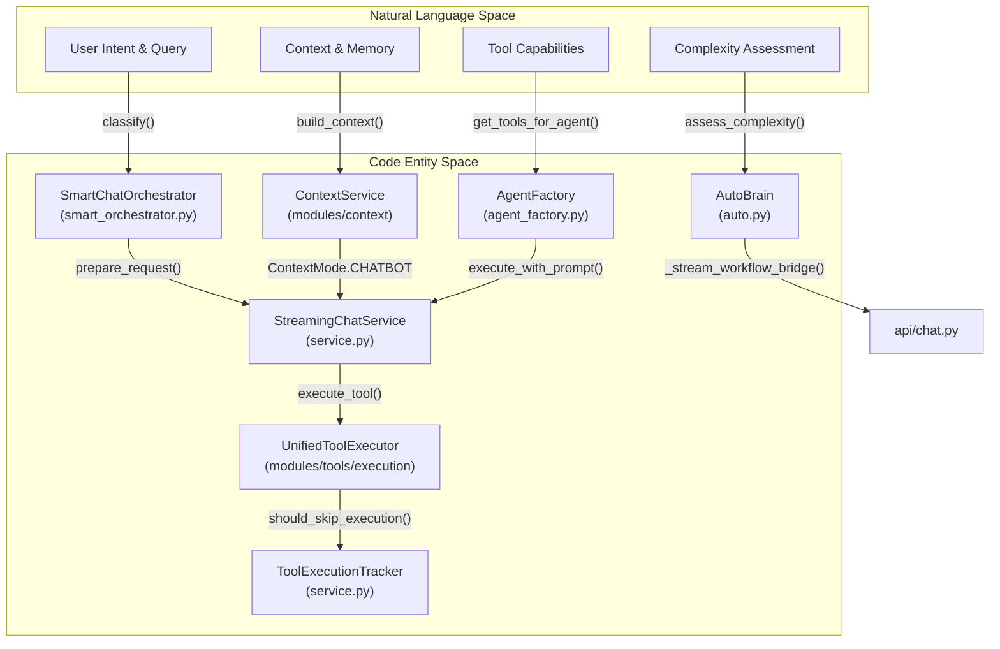
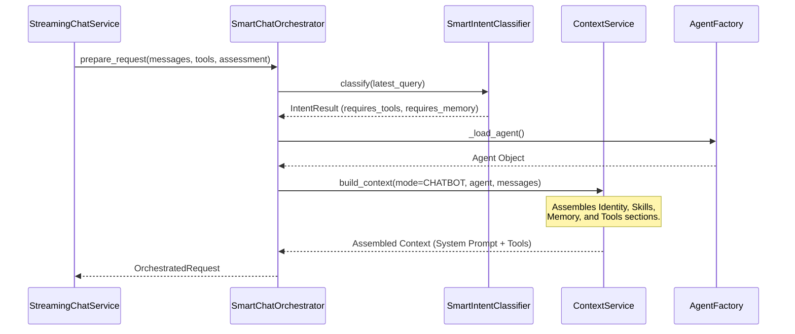
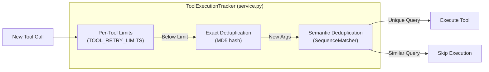

# Streaming Chat Service

Relevant source files

The following files were used as context for generating this wiki page:

- [docs/reviews/COMPOSIO-TOOL-REGRESSION-REVIEW.md](docs/reviews/COMPOSIO-TOOL-REGRESSION-REVIEW.md)
- [orchestrator/api/chat.py](orchestrator/api/chat.py)
- [orchestrator/api/chat_voice.py](orchestrator/api/chat_voice.py)
- [orchestrator/consumers/chatbot/auto.py](orchestrator/consumers/chatbot/auto.py)
- [orchestrator/consumers/chatbot/intent_classifier.py](orchestrator/consumers/chatbot/intent_classifier.py)
- [orchestrator/consumers/chatbot/personality.py](orchestrator/consumers/chatbot/personality.py)
- [orchestrator/consumers/chatbot/service.py](orchestrator/consumers/chatbot/service.py)
- [orchestrator/consumers/chatbot/smart_tool_router.py](orchestrator/consumers/chatbot/smart_tool_router.py)
- [orchestrator/consumers/chatbot/streaming.py](orchestrator/consumers/chatbot/streaming.py)
- [orchestrator/core/llm/manager.py](orchestrator/core/llm/manager.py)
- [orchestrator/core/models/stream_events.py](orchestrator/core/models/stream_events.py)
- [orchestrator/core/routing/engine.py](orchestrator/core/routing/engine.py)
- [orchestrator/modules/orchestrator/service.py](orchestrator/modules/orchestrator/service.py)
- [orchestrator/modules/tools/discovery/actions_analytics_enhanced.py](orchestrator/modules/tools/discovery/actions_analytics_enhanced.py)
- [orchestrator/modules/tools/discovery/handlers_analytics_enhanced.py](orchestrator/modules/tools/discovery/handlers_analytics_enhanced.py)
- [orchestrator/modules/tools/discovery/handlers_search.py](orchestrator/modules/tools/discovery/handlers_search.py)
- [orchestrator/modules/tools/discovery/platform_actions.py](orchestrator/modules/tools/discovery/platform_actions.py)
- [orchestrator/modules/tools/discovery/platform_executor.py](orchestrator/modules/tools/discovery/platform_executor.py)
- [orchestrator/modules/tools/execution/exec_composio.py](orchestrator/modules/tools/execution/exec_composio.py)
- [orchestrator/modules/tools/execution/exec_document.py](orchestrator/modules/tools/execution/exec_document.py)
- [orchestrator/modules/tools/execution/exec_file_ops.py](orchestrator/modules/tools/execution/exec_file_ops.py)
- [orchestrator/modules/tools/execution/exec_multimodal.py](orchestrator/modules/tools/execution/exec_multimodal.py)
- [orchestrator/modules/tools/execution/exec_planning.py](orchestrator/modules/tools/execution/exec_planning.py)
- [orchestrator/modules/tools/tool_router.py](orchestrator/modules/tools/tool_router.py)

## Purpose and Scope

The Streaming Chat Service provides real-time, token-by-token chat responses using Server-Sent Events (SSE) in the AI SDK Data Stream format. It orchestrates the flow between user input, LLM generation, tool execution, and memory management. The service leverages the `SmartChatOrchestrator` to handle intent classification and the `ContextService` to assemble unified prompts including identity, skills, and memory tiers. It also includes specialized logic for bridging high-complexity requests to the workflow engine via the **AutoBrain** complexity assessor.

**Sources:** [orchestrator/consumers/chatbot/service.py:1-13](), [orchestrator/consumers/chatbot/auto.py:1-22](), [orchestrator/api/chat.py:67-88]()

---

## Architecture Overview

The streaming architecture bridges high-level user intent with low-level code execution. The `StreamingChatService` delegates prompt construction to the `ContextService` and execution to the `AgentFactory`.

### System Entity Map: Natural Language to Code Space

This diagram maps conceptual chat requirements to the specific classes and functions responsible for them.

**Sources:** [orchestrator/consumers/chatbot/service.py:12-40](), [orchestrator/consumers/chatbot/auto.py:60-83](), [orchestrator/api/chat.py:70-85](), [orchestrator/modules/tools/tool_router.py:27-29]()

---

## SmartChatOrchestrator

The `SmartChatOrchestrator` is the central coordinator for intelligent chat processing. It manages the transition from raw user messages to an `OrchestratedRequest` ready for the LLM.

### Key Functions

*   **`prepare_request`**: Primary entry point. It extracts the latest query, performs intent classification, and calls the `ContextService` to build the full prompt. It handles the injection of `tool_hints` from the complexity assessment. [orchestrator/consumers/chatbot/smart_orchestrator.py:126-149]()
*   **Intent Classification**: Uses `SmartIntentClassifier` to determine if the user needs tools (e.g., `Intent.DATA_QUERY`, `Intent.SEARCH`) or memory. This influences `tool_choice` ("auto" vs "none"). [orchestrator/consumers/chatbot/intent_classifier.py:23-46]()
*   **Memory Decision**: Implements logic to skip memory fetching for simple queries (e.g., `Intent.GREETING`) or when the complexity is assessed as `ATOM`. [orchestrator/consumers/chatbot/smart_orchestrator.py:166-180]()

### Data Flow: Request Preparation

**Sources:** [orchestrator/consumers/chatbot/smart_orchestrator.py:150-210](), [orchestrator/consumers/chatbot/intent_classifier.py:48-56]()

---

## StreamingChatService Class

The `StreamingChatService` manages the lifecycle of a chat turn, including the tool execution loop and SSE streaming via the `StreamingHandler`.

### `stream_response_with_agent`

This async generator handles the iterative process of LLM generation and tool execution.

1.  **Agent Activation**: Uses `AgentFactory.activate_agent` to initialize the `AgentRuntime` with specific LLM configurations and resolved API keys. [orchestrator/consumers/chatbot/service.py:510-520]()
2.  **Orchestration**: Calls `SmartChatOrchestrator.prepare_request` to get the system prompt and filtered toolset. [orchestrator/consumers/chatbot/service.py:530-550]()
3.  **The Tool Loop**: A `while` loop that continues as long as the LLM generates `tool_calls` (capped at 10 iterations to prevent infinite loops). [orchestrator/consumers/chatbot/service.py:750-810]()

### Tool Execution Logic

Tools are executed via the `UnifiedToolExecutor`, which routes requests to specialized modules.

| Executor Module | Responsibility | File Reference |
| :--- | :--- | :--- |
| `PlatformActionExecutor` | Platform management (agents, recipes, usage) | [orchestrator/modules/tools/discovery/platform_executor.py:164-168]() |
| `exec_file_ops` | read_file, write_file, list_directory | [orchestrator/modules/tools/tool_router.py:28]() |
| `exec_composio` | External App Actions (GitHub, Slack, etc.) | [orchestrator/modules/tools/tool_router.py:28]() |
| `exec_planning` | Multi-step task planning | [orchestrator/modules/tools/tool_router.py:28]() |

**Sources:** [orchestrator/modules/tools/discovery/platform_executor.py:173-220](), [orchestrator/modules/tools/tool_router.py:129-138]()

---

## Tool Loop Prevention

The `ToolExecutionTracker` implements multi-tier deduplication to prevent redundant or circular tool calls within a single conversation turn.

*   **Exact Match**: Hashes tool arguments to detect identical calls. [orchestrator/consumers/chatbot/service.py:111-112]()
*   **Semantic Match**: Uses `SequenceMatcher` to compare search queries. If a query is >75% similar to a previous one in the same turn, it is skipped. [orchestrator/consumers/chatbot/service.py:57-67]()
*   **Retry Limits**: Enforces strict limits (e.g., 2 for search, 3 for file reads) to stop agents from "getting stuck." [orchestrator/consumers/chatbot/service.py:93-104]()

**Sources:** [orchestrator/consumers/chatbot/service.py:78-156]()

---

## Workflow Bridge (PRD-68)

For high-complexity tasks (categorized as `ORGAN` or `ORGANISM` by **AutoBrain**), the chat API can bypass standard streaming and trigger a transient workflow.

*   **Complexity Assessment**: `AutoBrain` uses a 3-tier assessment (Redis cache, regex fast-paths, and LLM classification) to determine task complexity. [orchestrator/consumers/chatbot/auto.py:14-22]()
*   **`_stream_workflow_bridge`**: Creates a temporary `Workflow` and `WorkflowExecution` from the user message. [orchestrator/api/chat.py:70-120]()
*   **Execution**: Kicks off the full PRD-59 pipeline (PLAN → PREPARE → EXECUTE → EVALUATE → LEARN) via `execute_workflow_with_progress`. [orchestrator/api/chat.py:153-159]()
*   **Event Streaming**: Stage events (e.g., "workflow-update") are streamed back to the chat interface using `StreamingHandler.format_aisdk_data`. [orchestrator/api/chat.py:143-149]()

**Sources:** [orchestrator/api/chat.py:67-189](), [orchestrator/consumers/chatbot/auto.py:42-49]()

---

## Data Stream Format

The service outputs newline-delimited JSON prefixed by type identifiers, following the AI SDK protocol.

| Prefix | Type | Description |
| :--- | :--- | :--- |
| `0:` | Text | Incremental text content for the assistant's message. [orchestrator/consumers/chatbot/streaming.py:105-108]() |
| `d:` | Data | Complex data events (e.g., `chat-id`, `tool-data`, `workflow-update`). [orchestrator/consumers/chatbot/streaming.py:110-115]() |
| `e:` | Error | JSON-formatted error messages. [orchestrator/consumers/chatbot/streaming.py:174-176]() |

**Sources:** [orchestrator/consumers/chatbot/streaming.py:102-177]()

---