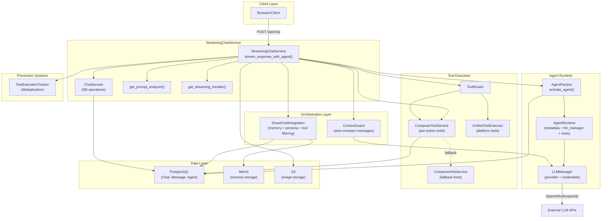
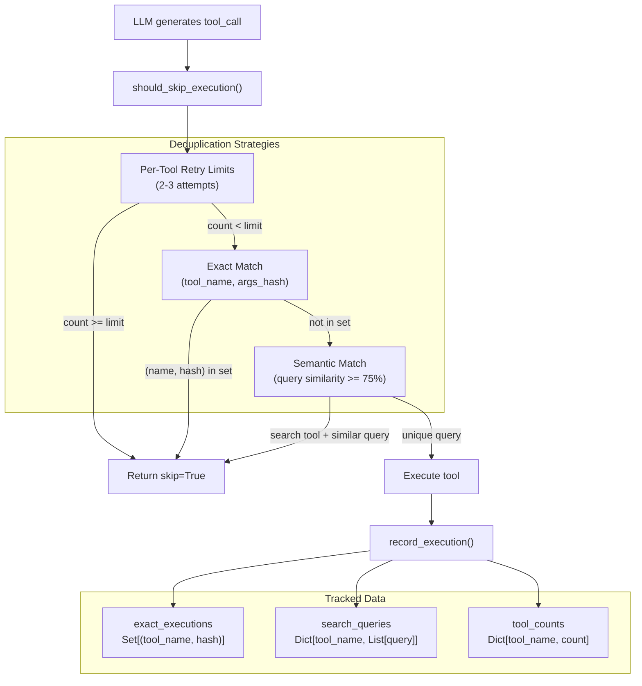
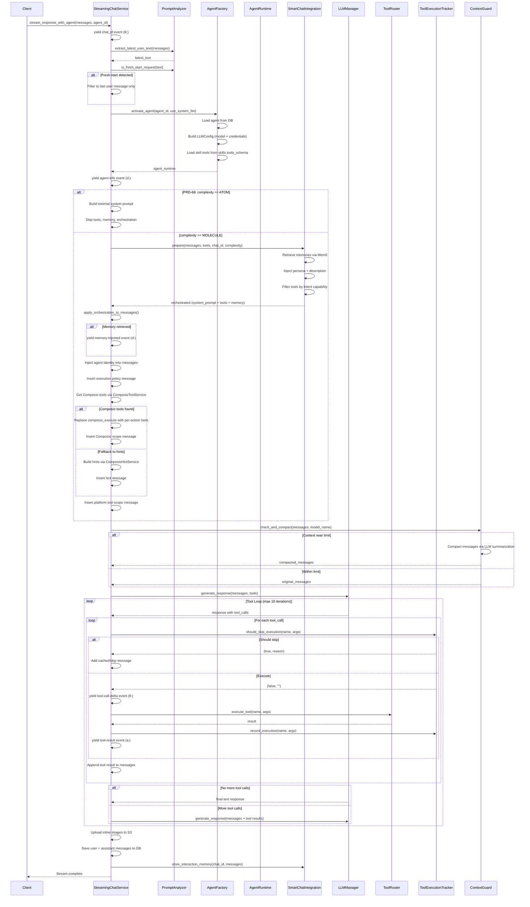
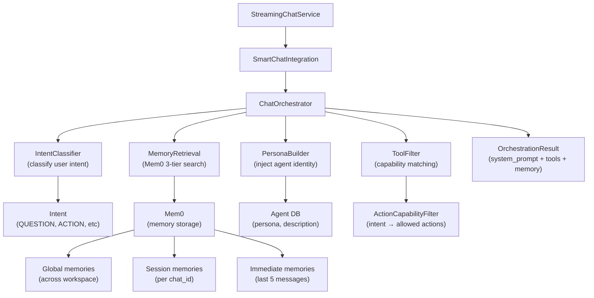
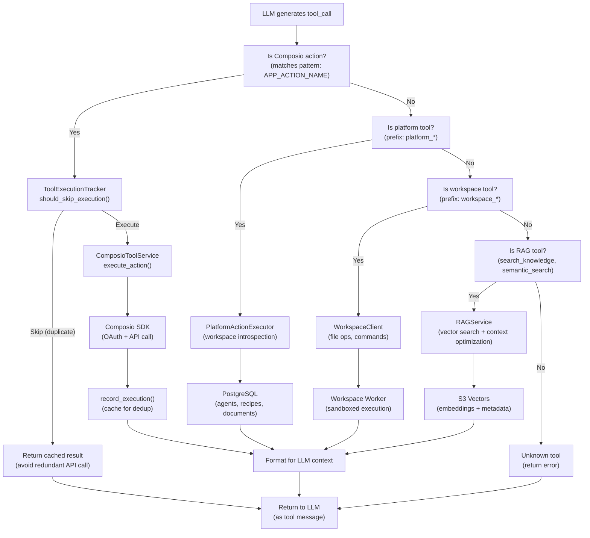
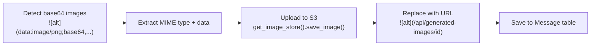

# Streaming Chat Service

<details>
<summary>Relevant source files</summary>

The following files were used as context for generating this wiki page:

- [frontend/tsconfig.tsbuildinfo](frontend/tsconfig.tsbuildinfo)
- [orchestrator/api/workflows.py](orchestrator/api/workflows.py)
- [orchestrator/consumers/chatbot/service.py](orchestrator/consumers/chatbot/service.py)
- [orchestrator/core/llm/manager.py](orchestrator/core/llm/manager.py)
- [orchestrator/modules/agents/factory/agent_factory.py](orchestrator/modules/agents/factory/agent_factory.py)
- [orchestrator/modules/orchestrator/pipeline.py](orchestrator/modules/orchestrator/pipeline.py)
- [orchestrator/modules/orchestrator/service.py](orchestrator/modules/orchestrator/service.py)

</details>


## Purpose and Scope

The Streaming Chat Service provides real-time, token-by-token chat responses using Server-Sent Events (SSE) in the AI SDK Data Stream format. It orchestrates the flow between user input, LLM generation, tool execution, and memory management to deliver intelligent, context-aware responses with function calling capabilities.

For information about the chatbot frontend components, see [Chat Components](#8.4). For details on tool execution mechanics, see [Tool Router & Execution](#6.3). For memory retrieval logic, see [Memory Integration](#8.3).

**Sources:** [orchestrator/consumers/chatbot/service.py:1-14]()

---

## Architecture Overview

The streaming chat service orchestrates real-time responses by activating specialized agents, integrating memory context, and executing tools through a composable pipeline. The service delegates LLM configuration and tool execution to agent-specific runtimes, enabling per-agent model selection and credential management.



**Key Components:**

| Component | Purpose | Location |
|-----------|---------|----------|
| `StreamingChatService` | Main orchestrator for streaming responses | [orchestrator/consumers/chatbot/service.py:456-475]() |
| `stream_response_with_agent()` | Core streaming method with agent activation | [orchestrator/consumers/chatbot/service.py:493-896]() |
| `ChatService` | Database operations for chats/messages | [orchestrator/consumers/chatbot/service.py:191-416]() |
| `ToolExecutionTracker` | Prevents infinite tool loops via deduplication | [orchestrator/consumers/chatbot/service.py:88-186]() |
| `SmartChatIntegration` | Orchestrates memory, persona, and tool filtering | [orchestrator/consumers/chatbot/integration.py]() |
| `AgentFactory` | Creates agent runtimes with LLM configuration | [orchestrator/modules/agents/factory/agent_factory.py:503-820]() |
| `ContextGuard` | Auto-compacts messages approaching context limit | [orchestrator/core/context_guard.py]() |

**Sources:** [orchestrator/consumers/chatbot/service.py:1-40](), [orchestrator/consumers/chatbot/service.py:456-896](), [orchestrator/modules/agents/factory/agent_factory.py:503-675]()

---

## AI SDK Data Stream Format

The service outputs responses in Vercel's AI SDK Data Stream format, which uses newline-delimited structured messages. This format enables streaming text content, structured data events, and error handling in a unified protocol.

### Format Specification

| Prefix | Type | Example | Purpose |
|--------|------|---------|---------|
| `0:` | Text chunk | `0:"Hello"\n` | Incremental text streaming |
| `d:` | Data event | `d:{"type":"tool_call"}\n` | Structured events (tool calls, metadata) |
| `e:` | Error | `e:{"message":"Failed"}\n` | Error propagation to client |
| `8:` | Chat ID | `8:"chat-uuid"\n` | Session identifier |

### Example Stream Sequence

```
8:"550e8400-e29b-41d4-a716-446655440000"
0:"I'll help"
0:" you with"
0:" that."
d:{"type":"tool_start","tool":"search_knowledge","params":{"query":"API docs"}}
d:{"type":"tool_complete","tool":"search_knowledge","result":"..."}
0:"\n\nBased on"
0:" the documentation..."
```

**Implementation:** The `streaming_handler.format_aisdk_*` methods generate these prefixed lines. The service calls `yield` to send each chunk to the client over SSE.

**Sources:** [orchestrator/consumers/chatbot/service.py:500-503](), [orchestrator/api/workflows.py:36-136]()

---

## StreamingChatService Class

The `StreamingChatService` class is the main entry point for streaming chat operations. It initializes dependencies and provides the `stream_response_with_agent()` method for generating streamed responses with agent-specific configuration.

### Initialization

```python
class StreamingChatService:
    def __init__(self, db: Session, workspace_id: Optional[str] = None, widget_mode: bool = False):
        self.db = db
        self.chat_service = ChatService(db)
        self.prompt_analyzer = get_prompt_analyzer()
        self.memory_injector = get_memory_injector()
        self.tool_router = get_tool_router()
        self.streaming_handler = get_streaming_handler()
        self.workspace_id = workspace_id
        self.widget_mode = widget_mode
        
        # PRD: Unified Agent-Chat System - Initialize AgentFactory
        from modules.agents.factory.agent_factory import AgentFactory
        self.agent_factory = AgentFactory(db_session=db)
```

**Lazy Module Loading:** Dependencies are retrieved via factory functions (`get_*()`) to avoid circular imports and enable clean module boundaries.

**Widget Mode:** When `widget_mode=True`, the service skips workspace-scoped memory to ensure embedded widgets don't leak context across users.

**Sources:** [orchestrator/consumers/chatbot/service.py:456-475]()

### Main Streaming Method

The `stream_response_with_agent()` method is an async generator that yields AI SDK formatted chunks:

```python
async def stream_response_with_agent(
    self,
    chat_id: str,
    messages: List[Dict[str, Any]],
    agent_id: int,
    user_id: int,
    use_system_llm: bool = False,
    skip_composio: bool = False,
    complexity_assessment: Optional[Any] = None,
) -> AsyncGenerator[str, None]:
```

**Parameters:**

| Parameter | Type | Purpose |
|-----------|------|---------|
| `chat_id` | `str` | UUID of the chat session |
| `messages` | `List[Dict]` | Conversation history in OpenAI format |
| `agent_id` | `int` | Agent ID to activate (determines model, tools, persona) |
| `user_id` | `int` | User ID for memory scoping |
| `use_system_llm` | `bool` | Use orchestrator LLM settings instead of agent's model |
| `skip_composio` | `bool` | Disable Composio tool injection (for testing) |
| `complexity_assessment` | `Any` | PRD-68: AutoBrain complexity assessment with tool hints |

**Unified Agent-Chat System:** The method activates the agent via `AgentFactory`, which loads the agent's LLM configuration, skills, and tool permissions. This enables per-agent model selection (e.g., Agent A uses GPT-4, Agent B uses Claude 3.5).

**Sources:** [orchestrator/consumers/chatbot/service.py:493-522]()

---

## Tool Loop Prevention

The `ToolExecutionTracker` class prevents infinite loops where the LLM repeatedly calls the same tool with identical or similar parameters. This is critical for preventing runaway token costs and ensuring stable execution.

### ToolExecutionTracker Architecture



### Search Tools Semantic Deduplication

For search-related tools, the tracker performs fuzzy matching on query parameters to detect semantically similar requests:

**Search Tools Set:**
```python
SEARCH_TOOLS = {
    'search_knowledge', 'semantic_search', 'search_codebase',
    'search_tables', 'search_images', 'search_formulas',
    'search_multimodal', 'smart_query_database', 'query_database'
}
```

**Similarity Algorithm:**
1. Normalize queries (lowercase, remove punctuation)
2. Use `SequenceMatcher.ratio()` for fuzzy matching
3. Threshold: 75% similarity triggers skip

**Example:** `"search for API docs"` and `"search api documentation"` are detected as duplicates.

**Sources:** [orchestrator/consumers/chatbot/service.py:88-186]()

### Retry Limits

Different tools have different retry limits based on their characteristics:

| Tool Type | Limit | Rationale |
|-----------|-------|-----------|
| `composio_execute` | 2 | External APIs may be flaky, but repeated calls are expensive |
| `search_knowledge` | 2 | First attempt + one refinement usually sufficient |
| `read_file` | 3 | File reads are cheap, may need multiple attempts |
| `write_file` | 2 | Writing twice to same file likely indicates loop |
| Default | 3 | Conservative fallback for unknown tools |

**Sources:** [orchestrator/consumers/chatbot/service.py:104-116]()

---

## Request Flow

The streaming response follows a multi-stage pipeline with agent activation, memory orchestration, and tool loop prevention:



**Key Decision Points:**

1. **Agent Activation:** `AgentFactory.activate_agent()` loads agent-specific model, credentials, and skills
2. **PRD-68 ATOM Path:** Simple queries skip tools/memory/orchestration for fastest response (~200ms saved)
3. **Fresh Start Detection:** Keywords like "start over", "forget", "new" trigger context reset
4. **SmartChatIntegration:** Orchestrates memory retrieval, persona injection, and tool filtering based on intent
5. **Composio Tool Resolution:** Per-action tools (primary) or hint-based mega-tool (fallback)
6. **Context Guard:** Auto-compacts messages if approaching model's context window limit
7. **Tool Loop:** Max 10 iterations prevents runaway execution
8. **Image Upload:** Base64 inline images replaced with S3 URLs before DB storage

**Sources:** [orchestrator/consumers/chatbot/service.py:493-896](), [orchestrator/modules/agents/factory/agent_factory.py:676-820]()

---

## Message Format and Conversion

The service converts between multiple message formats to integrate with various LLM providers and the frontend chat UI.

### OpenAI Format (Internal)

```json
{
  "role": "user|assistant|system|tool",
  "content": "text content",
  "tool_calls": [
    {
      "id": "call_abc123",
      "type": "function",
      "function": {
        "name": "search_knowledge",
        "arguments": "{\"query\":\"docs\"}"
      }
    }
  ]
}
```

### Chat UI Format (Database)

Messages stored in the `Message` table use a parts-based format:

```json
{
  "role": "user",
  "parts": [
    {"type": "text", "text": "Hello"},
    {"type": "image", "url": "/api/generated-images/xyz"}
  ],
  "attachments": [
    {"type": "file", "name": "doc.pdf", "url": "..."}
  ]
}
```

### Conversion Logic

The `prompt_analyzer.convert_to_llm_messages()` method handles conversion:

1. **User messages:** Concatenate `parts[].text`, preserve attachments as context
2. **Assistant messages:** Extract text content, serialize tool calls
3. **Tool messages:** Format tool results for LLM context

**Sources:** [orchestrator/consumers/chatbot/service.py:590-594]()

---

## Memory Integration

The service integrates with the Mem0 memory system via `SmartChatIntegration`, which orchestrates memory retrieval, persona injection, and tool filtering in a single preparation step. This replaces the legacy `MemoryInjector` with a more sophisticated orchestration layer.

### SmartChatIntegration Architecture



**3-Tier Memory Retrieval:**

| Tier | Scope | Query Strategy | Purpose |
|------|-------|----------------|---------|
| **Global** | Workspace-wide | Semantic search across all conversations | Long-term facts, preferences, patterns |
| **Session** | Current chat_id | Semantic search within chat | Chat-specific context, multi-turn reasoning |
| **Immediate** | Last 5 messages | Exact retrieval | Recent context for continuity |

**Memory Injection Format:**

Memories are injected into the system prompt, not as separate messages:

```python
system_prompt = f"""
{base_system_prompt}

## Relevant Context from Memory
{memory_context}

## Your Identity
{agent_persona}
{agent_description}
"""
```

This ensures the LLM sees all context as part of its core instructions rather than fragmented across multiple system messages.

**Skip Conditions:**
- Query is too short (< 10 characters)
- Query is a greeting ("hello", "hi")
- Query is a simple command ("clear", "reset")
- Widget mode is enabled (prevents cross-user context leakage)

### Memory Injection Event (US-015)

When memories are retrieved, the service emits a structured SSE event to the frontend:

```python
yield self.streaming_handler.format_aisdk_memory_injected(
    memories=_mem_summaries,  # List of {id, memory, tier}
    total_matched=_total_matched,
)
```

This enables the frontend to display which memories were used to generate the response, improving transparency and debuggability.

**Sources:** [orchestrator/consumers/chatbot/service.py:583-709](), [orchestrator/consumers/chatbot/integration.py]()

---

## Tool Execution Flow

Tool execution follows a three-tier resolution strategy: per-action Composio tools (primary), hint-based Composio mega-tool (fallback), and built-in platform/workspace tools (always available).

### Tool Resolution Strategy



### Composio Tool Modes

The service uses `ComposioToolService.get_tools_for_step()` with a three-tier resolution strategy:

**1. Per-Action Tools (Primary - PRD-64):**
```python
composio_result = composio_tool_service.get_tools_for_step(
    agent_id=agent_id,
    workspace_id=workspace_id,
    task_prompt=latest_text,
    tool_hints=_tool_hints  # PRD-68: From AutoBrain complexity assessment
)
```

**Resolution Strategies (in order):**

| Strategy | Condition | Example | Benefit |
|----------|-----------|---------|---------|
| **Exact action name** | `tool_hints` contains exact action | `["GITHUB_GET_ISSUE"]` | 0ms overhead, 100% accuracy |
| **SDK semantic search** | Composio SDK available | Search for "github issues" | ~50ms, 95% accuracy |
| **Cache fallback** | SDK unavailable | Query `ComposioActionCache` table | ~5ms, 90% accuracy |

**2. Hint-Based Fallback:**
```python
hint_result = hint_service.build_hints(
    agent_id=agent_id,
    prompt=latest_text,
    workspace_id=workspace_id,
)
```

Provides the `composio_execute` mega-tool + LLM hints for action selection. Used when SDK search returns empty results.

**Sources:** [orchestrator/consumers/chatbot/service.py:743-800](), [orchestrator/modules/tools/services/composio_tool_service.py:56-360]()

### Tool Result Formatting

Tool results are routed through `ToolRouter.execute_tool()`:

```python
result = await self.tool_router.execute_tool(
    tool_name=tool_name,
    tool_args=tool_args,
    agent_id=agent_id,
    workspace_id=workspace_id
)
```

The router delegates to the appropriate executor:

| Tool Pattern | Executor | Example Tools |
|--------------|----------|---------------|
| `APP_ACTION_*` | `ComposioToolService` | `GITHUB_GET_ISSUE`, `SLACK_SEND_MESSAGE` |
| `platform_*` | `PlatformActionExecutor` | `platform_list_agents`, `platform_get_workspace_info` |
| `workspace_*` | `WorkspaceClient` | `workspace_read_file`, `workspace_execute_command` |
| `search_*` | `RAGService` | `search_knowledge`, `semantic_search` |

**Sources:** [orchestrator/modules/tools/tool_router.py:1-575](), [orchestrator/api/recipe_executor.py:314-332]()

---

## Frontend Integration

The frontend consumes the AI SDK Data Stream using the `useChat` hook from `ai/react`, which automatically handles streaming text and structured data events.

### React Hook Usage

```typescript
const { messages, append, isLoading } = useChat({
  api: '/api/chat',
  body: {
    agentId: selectedAgent?.id,
    chatId: chat?.id,
  },
  onFinish: (message) => {
    // Handle completion
  },
  onError: (error) => {
    // Handle errors
  }
})
```

### Event Handling

The `ai` library automatically parses the stream format:

| Stream Event | Hook Behavior |
|--------------|---------------|
| `0:"text"` | Appends to `messages[].content` incrementally |
| `8:"chat-id"` | Sets chat session ID |
| `d:{...}` | Fires `onToolCall` callback with structured data |
| `e:{...}` | Fires `onError` callback |

### Recipe Execution Streaming

For recipe executions, the frontend uses a similar pattern with stage tracking:

```typescript
const response = await fetch(`/api/workflow-recipes/${id}/execute`, {
  method: 'POST',
  body: JSON.stringify(input),
})

const reader = response.body?.getReader()
const decoder = new TextDecoder()

while (true) {
  const { done, value } = await reader.read()
  if (done) break
  
  const text = decoder.decode(value)
  const lines = text.split('\n')
  
  for (const line of lines) {
    if (line.startsWith('d:')) {
      const event = JSON.parse(line.slice(2))
      handleStageUpdate(event)
    }
  }
}
```

**Sources:** [frontend/components/workflows/execution-kitchen.tsx:47-56](), [frontend/components/workflows/execution-kitchen.tsx:420-510]()

---

## Image Upload Handling

The service automatically detects base64-encoded inline images in markdown format and replaces them with S3 URLs before storing messages in the database.

### Detection and Upload Flow



### Implementation

```python
_BASE64_IMG_RE = re.compile(
    r'!\[([^\]]*)\]\((data:image/(jpeg|jpg|png|gif|webp);base64,([A-Za-z0-9+/=\s]+))\)'
)

async def _upload_inline_images(text: str, workspace_id: str = None) -> str:
    matches = list(_BASE64_IMG_RE.finditer(text))
    if not matches:
        return text
    
    store = get_image_store()
    result = text
    for match in reversed(matches):  # Reverse to preserve offsets
        alt = match.group(1)
        mime_type = f"image/{match.group(3)}"
        b64_data = match.group(4).replace("\n", "").replace(" ", "")
        
        image_id = await store.save_image(b64_data, mime_type, workspace_id)
        url = f"/api/generated-images/{image_id}"
        replacement = f""
        result = result[:match.start()] + replacement + result[match.end():]
    
    return result
```

**Storage Path:** `workspaces/{workspace_id}/generated-images/{image_id}.{ext}`

**Access Pattern:** Images are served via `/api/generated-images/{image_id}` endpoint with workspace validation.

**Sources:** [orchestrator/consumers/chatbot/service.py:424-449](), [orchestrator/consumers/chatbot/service.py:831-835]()

---

## Error Handling and Recovery

The service implements defensive error handling to ensure partial failures don't break the streaming flow:

### Error Categories

| Error Type | Handling Strategy | User Impact |
|------------|-------------------|-------------|
| LLM API failure | Log warning, return cached response if available | Graceful degradation |
| Tool execution error | Return error message to LLM, allow retry | LLM can adjust approach |
| Memory retrieval failure | Log warning, continue without memory | Slight context loss |
| Image upload failure | Log warning, preserve base64 in message | Image not optimized |
| Database save failure | Log error, continue streaming | Response visible but not persisted |

### Tool Error Format

When a tool fails, the error is returned to the LLM as a tool message:

```python
messages.append({
    "role": "tool",
    "tool_call_id": tool_id,
    "content": f"Error executing {tool_name}: {error_message}"
})
```

This allows the LLM to:
1. Understand what went wrong
2. Reformulate the request with corrected parameters
3. Try an alternative approach
4. Inform the user about the limitation

**Sources:** [orchestrator/consumers/chatbot/service.py:790-855]()

---

## Performance Optimizations

### PRD-68 ATOM Path

For simple queries (greetings, basic questions), the service bypasses tools, memory, and orchestration:

```python
if _complexity == Complexity.ATOM:
    _atom_prompt = (
        f"You are {agent_runtime.metadata.name}, a friendly AI assistant. "
        "Respond naturally and conversationally. Keep it brief."
    )
    llm_messages = self.prompt_analyzer.convert_to_llm_messages(
        messages, system_prompt=_atom_prompt, available_tools=None
    )
    use_tools = None
    orchestrated = None
```

**Performance Impact:**
- **Skip SmartChatIntegration:** Saves ~200ms (memory retrieval + tool filtering)
- **Skip Composio resolution:** Saves ~50ms (SDK search)
- **Minimal system prompt:** Reduces input tokens by ~80%

**Triggers:** AutoBrain complexity assessment detects ATOM-level queries (greetings, acknowledgments, simple questions).

**Sources:** [orchestrator/consumers/chatbot/service.py:604-617]()

### Context Window Guard

The `ContextGuard` auto-compacts messages if they approach the model's context window limit:

```python
from core.context_guard import ContextGuard
_guard = ContextGuard()
llm_messages, _was_compacted = await _guard.check_and_compact(
    messages=llm_messages,
    model_name=_model_name,
    llm_manager=agent_runtime.llm_manager,
    workspace_id=str(self.workspace_id),
    agent_id=agent_id,
    db_session=self.db,
)
```

**Strategy:** If messages exceed 85% of context window, the guard uses an LLM to summarize older messages, preserving recent context and system prompts intact.

**Average savings:** Prevents context overflow errors, enables longer conversations without manual intervention.

**Sources:** [orchestrator/consumers/chatbot/service.py:821-835]()

### Tool Execution Deduplication

The `ToolExecutionTracker` maintains per-turn caches to prevent redundant tool calls:

**Strategies:**

| Strategy | Mechanism | Savings |
|----------|-----------|---------|
| **Exact dedup** | Hash of `(tool_name, args)` | ~500ms + API cost |
| **Semantic dedup** | Query similarity >= 75% for search tools | ~500ms + API cost |
| **Retry limits** | Max 2-3 executions per tool type | Prevents infinite loops |

**Sources:** [orchestrator/consumers/chatbot/service.py:88-186]()

### Composio Action Caching

The service maintains a per-execution cache for Composio action results:

```python
_composio_call_cache: Dict[str, str] = {}  # "ACTION|args_hash" → result
```

When the LLM calls the same Composio action twice (e.g., retrying after error), the cached result is returned instead of making another API call.

**Average savings:** 500ms + Composio API cost per duplicate call.

**Sources:** [orchestrator/api/recipe_executor.py:209](), [orchestrator/api/recipe_executor.py:269-273]()

---

## Usage Tracking

All LLM calls made by the streaming service are automatically tracked via the `LLMManager`'s usage tracking context:

```python
llm = agent_runtime.llm_manager
if hasattr(llm, '_tracking_ctx'):
    llm._tracking_ctx["request_type"] = "chat"
```

This populates the `LLMUsage` table with:
- Workspace ID
- Agent ID
- Input/output token counts
- Model provider and name
- Cost calculation (based on `LLMModel.pricing`)
- Latency
- BYOK flag (user-provided vs platform API key)

For detailed usage tracking mechanics, see [LLM Usage Tracking](#10.1).

**Sources:** [orchestrator/api/recipe_executor.py:202-205](), [orchestrator/core/llm/manager.py:1-68]()

---