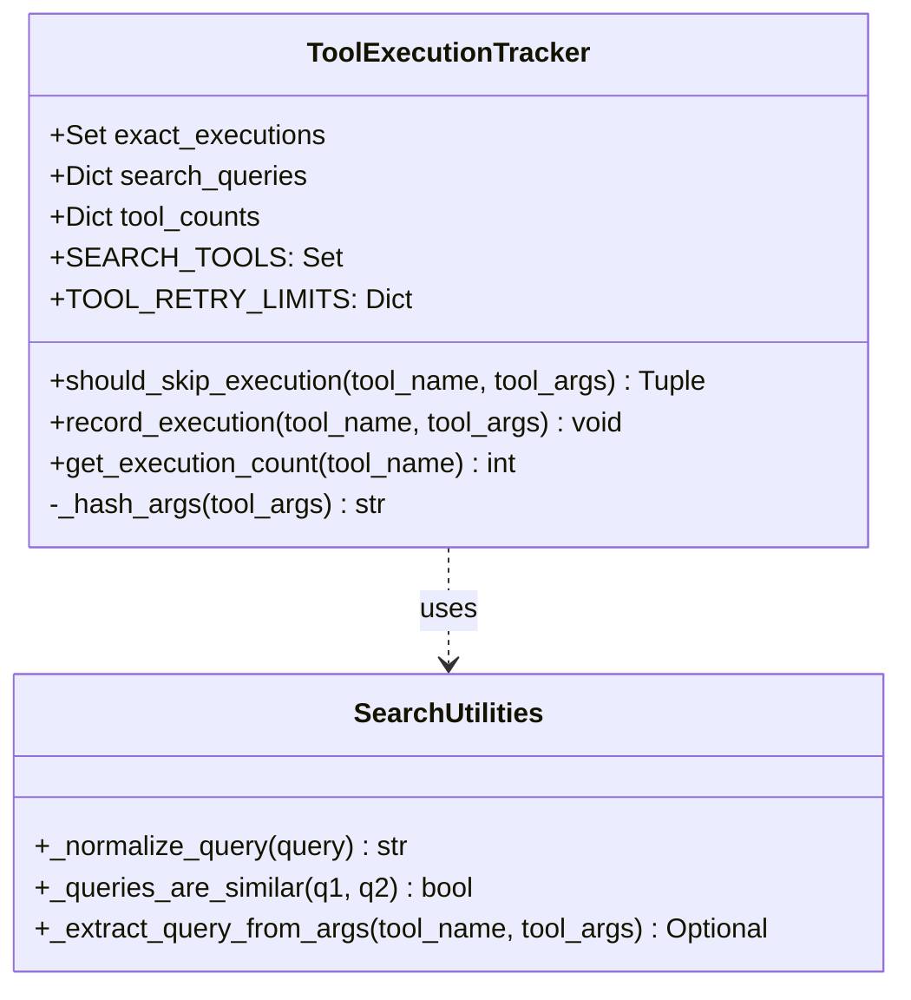

# Tool Loop Prevention

<details>
<summary>Relevant source files</summary>

The following files were used as context for generating this wiki page:

- [orchestrator/consumers/chatbot/intent_classifier.py](orchestrator/consumers/chatbot/intent_classifier.py)
- [orchestrator/consumers/chatbot/personality.py](orchestrator/consumers/chatbot/personality.py)
- [orchestrator/consumers/chatbot/smart_tool_router.py](orchestrator/consumers/chatbot/smart_tool_router.py)
- [orchestrator/core/services/auto_autonomy.py](orchestrator/core/services/auto_autonomy.py)
- [orchestrator/modules/tools/discovery/actions_autonomy.py](orchestrator/modules/tools/discovery/actions_autonomy.py)
- [orchestrator/modules/tools/discovery/handlers_autonomy.py](orchestrator/modules/tools/discovery/handlers_autonomy.py)
- [orchestrator/modules/tools/execution/exec_research.py](orchestrator/modules/tools/execution/exec_research.py)
- [orchestrator/tests/security/test_nl2sql_tenancy.py](orchestrator/tests/security/test_nl2sql_tenancy.py)
- [orchestrator/tests/security/test_w3_full_autonomy_gate.py](orchestrator/tests/security/test_w3_full_autonomy_gate.py)
- [orchestrator/tests/test_harness_governance_gate.py](orchestrator/tests/test_harness_governance_gate.py)
- [orchestrator/tests/test_nl2sql_agent_path.py](orchestrator/tests/test_nl2sql_agent_path.py)
- [orchestrator/tests/test_nl2sql_semantic_audit_templates.py](orchestrator/tests/test_nl2sql_semantic_audit_templates.py)
- [orchestrator/tests/test_prd143_manifest_parity.py](orchestrator/tests/test_prd143_manifest_parity.py)
- [orchestrator/tests/test_prd232_us001_dispatcher_survives_route.py](orchestrator/tests/test_prd232_us001_dispatcher_survives_route.py)
- [orchestrator/tests/test_prd232_us002_flag_split.py](orchestrator/tests/test_prd232_us002_flag_split.py)
- [orchestrator/tests/test_us014_graph_router_delegation.py](orchestrator/tests/test_us014_graph_router_delegation.py)
- [orchestrator/tests/test_us015_registry_intent_filter.py](orchestrator/tests/test_us015_registry_intent_filter.py)
- [orchestrator/tests/test_w3_auto_autonomy_service.py](orchestrator/tests/test_w3_auto_autonomy_service.py)

</details>


## Purpose and Scope

The Tool Loop Prevention system is a critical safety and efficiency mechanism within Automatos AI. It prevents agents from entering infinite execution loops where they repeatedly call the same tools with identical or semantically similar parameters during a single conversation turn.

This system addresses several key operational risks:
- **Infinite Loops**: Prevents agents from getting stuck in "retry-fail" cycles.
- **Cost Management**: Reduces LLM token consumption by blocking redundant tool invocations.
- **API Protection**: Shields external integrations (e.g., Composio, GitHub, Slack) from excessive duplicate requests.
- **Response Quality**: Forces the agent to pivot to alternative strategies when a specific tool approach is exhausted.

Sources: [orchestrator/consumers/chatbot/service.py:1-13](), [orchestrator/consumers/chatbot/service.py:155-162]()

---

## System Overview

The system primarily revolves around the `ToolExecutionTracker` class [orchestrator/consumers/chatbot/service.py:155-162](). It is instantiated during the lifecycle of a chat or agent execution turn to track state.

The prevention logic implements three distinct layers of protection:
1.  **Exact Deduplication**: Uses argument hashing to block bit-for-bit identical calls [orchestrator/consumers/chatbot/service.py:220-227]().
2.  **Semantic Deduplication**: Uses string normalization and similarity ratios to block repetitive search queries [orchestrator/consumers/chatbot/service.py:230-244]().
3.  **Execution Caps**: Enforces strict per-tool and per-turn iteration limits defined in `TOOL_RETRY_LIMITS` [orchestrator/consumers/chatbot/service.py:173-189]().

Sources: [orchestrator/consumers/chatbot/service.py:155-190](), [orchestrator/consumers/chatbot/service.py:209-217]()

---

## Architecture and Data Flow

The following diagrams illustrate how the `ToolExecutionTracker` bridges the natural language intent (queries) with the code-level execution state.

### Tool Execution Tracking Logic

This diagram shows how the `StreamingChatService` or `AgentFactory` utilizes the tracker during the LLM's tool-calling loop.

**Diagram: Tool Loop Prevention Flow**
```mermaid
graph TD
    subgraph "Execution Context [orchestrator/consumers/chatbot/service.py]"
        Stream["StreamingChatService.stream_response_with_agent()"]
        Loop["Tool Loop (Converged Spine)"]
    end

    subgraph "ToolExecutionTracker (Code Entity Space)"
        Tracker["ToolExecutionTracker [orchestrator/consumers/chatbot/service.py:155]"]
        ExactSet["exact_executions (Set[Tuple[str, str]]) [orchestrator/consumers/chatbot/service.py:192]"]
        SearchDict["search_queries (Dict[str, List[str]]) [orchestrator/consumers/chatbot/service.py:193]"]
        CountDict["tool_counts (Dict[str, int]) [orchestrator/consumers/chatbot/service.py:194]"]
    end

    subgraph "Natural Language Space"
        UserQuery["User Search Intent"]
        SimilarQuery["'find bug' vs 'find the bug'"]
    end

    Stream -->|Initialize| Tracker
    Loop -->|should_skip_execution()| Tracker
    Tracker -->|Verify Limit| CountDict
    Tracker -->|Verify Hash| ExactSet
    Tracker -->|Verify Similarity| SearchDict
    SearchDict -.->|_normalize_query()| UserQuery
    SearchDict -.->|_queries_are_similar()| SimilarQuery
    
    Tracker -->|Decision (bool, reason)| Loop
    Loop -->|If Allowed| Exec["UnifiedToolExecutor [orchestrator/modules/tools/tool_router.py]"]
    Exec -->|record_execution()| Tracker
```

Sources: [orchestrator/consumers/chatbot/service.py:155-194](), [orchestrator/consumers/chatbot/service.py:209-244](), [orchestrator/modules/agents/factory/agent_factory.py:43-45]()

---

## Deduplication Strategies

### 1. Exact Deduplication (Hashing)
The system prevents the exact same tool from being called with the exact same arguments.
- **Mechanism**: The `_hash_args` method converts the `tool_args` dictionary into a sorted JSON string and generates an MD5 hex digest [orchestrator/consumers/chatbot/service.py:265-271]().
- **Storage**: The tracker maintains a set of `(tool_name, args_hash)` tuples in `exact_executions` [orchestrator/consumers/chatbot/service.py:192]().

Sources: [orchestrator/consumers/chatbot/service.py:192](), [orchestrator/consumers/chatbot/service.py:220-227](), [orchestrator/consumers/chatbot/service.py:265-271]()

### 2. Semantic Deduplication (Search Tools)
For tools defined in `SEARCH_TOOLS` (e.g., `search_knowledge`, `smart_query_database`), the system performs fuzzy matching on the query string [orchestrator/consumers/chatbot/service.py:164-171]().
- **Normalization**: `_normalize_query` removes punctuation, converts to lowercase, and strips extra whitespace using regex `[^\w\s]` [orchestrator/consumers/chatbot/service.py:73-80]().
- **Similarity**: `_queries_are_similar` uses `difflib.SequenceMatcher` with a default threshold of **0.75** [orchestrator/consumers/chatbot/service.py:82-91]().
- **Extraction**: `_extract_query_from_args` looks for keys like `query`, `search_query`, `q`, `text`, `question`, `prompt` [orchestrator/consumers/chatbot/service.py:94-100]().

Sources: [orchestrator/consumers/chatbot/service.py:73-100](), [orchestrator/consumers/chatbot/service.py:164-171](), [orchestrator/consumers/chatbot/service.py:230-244]()

### 3. Execution Limits (Retry Caps)
The `TOOL_RETRY_LIMITS` dictionary defines the maximum number of times a specific tool can be invoked in one turn [orchestrator/consumers/chatbot/service.py:173-189]().

| Tool Name / Category | Limit | Rationale |
| :--- | :--- | :--- |
| `smart_query_database` | 2 | Expensive and self-corrects internally [orchestrator/consumers/chatbot/service.py:184]() |
| `read_file` | 8 | Higher limit for iterative code reading [orchestrator/consumers/chatbot/service.py:179]() |
| `composio_execute` | 5 | Standard external action limit [orchestrator/consumers/chatbot/service.py:174]() |
| `platform_default` | 25 | High limit for platform introspection [orchestrator/consumers/chatbot/service.py:186]() |
| `default` | 5 | Standard fallback [orchestrator/consumers/chatbot/service.py:188]() |

Sources: [orchestrator/consumers/chatbot/service.py:173-189]()

---

## Implementation Details

### ToolExecutionTracker Class
The `ToolExecutionTracker` is the core state container for prevention logic.

**Diagram: ToolExecutionTracker Structure**


Sources: [orchestrator/consumers/chatbot/service.py:155-271](), [orchestrator/consumers/chatbot/service.py:73-100]()

### Converged Tool Loop Spine
Automatos uses a converged tool-loop spine shared between chat and agent execution (PRD-142) [orchestrator/consumers/chatbot/service.py:30-35](). 

1.  **Check**: Before calling the executor, `should_skip_execution` is invoked [orchestrator/consumers/chatbot/service.py:209-217]().
2.  **Bypass**: If a skip is triggered, the system returns a `(True, reason)` tuple. The reason is fed back into the LLM loop to explain why the tool was not run [orchestrator/consumers/chatbot/service.py:224, 243]().
3.  **Telemetry**: Every tool call is wrapped in a `caller_context` built by `build_tool_caller_context`, which includes `turn_id` and `prior_action` to help the tracker and telemetry service group sequential calls [orchestrator/consumers/chatbot/service.py:103-152]().

Sources: [orchestrator/consumers/chatbot/service.py:30-35](), [orchestrator/consumers/chatbot/service.py:103-152](), [orchestrator/consumers/chatbot/service.py:209-246]()

---

## Smart Tool Router and Intent Classifier Integration

Tool loop prevention operates in tandem with the `SmartToolRouter` and `SmartIntentClassifier` to ensure agents receive only the relevant tool subset and maintain clear boundaries.

- **SmartIntentClassifier**: Classifies the incoming message into categories like `DATA_QUERY`, `SEARCH`, `EXTERNAL_ACTION`, `CREATION`, or `MEMORY_RECALL` [orchestrator/consumers/chatbot/intent_classifier.py:23-34](). It dictates whether tools are needed at all via `requires_tools` [orchestrator/consumers/chatbot/intent_classifier.py:41]().
- **SmartToolRouter**: Maps classified intents to `ActionRegistry` categories (`_INTENT_TO_REGISTRY_CATEGORIES`) and can delegate semantic ranking to `GraphRouter` when enabled, avoiding tool sprawl that could trigger confusing retry loops [orchestrator/consumers/chatbot/smart_tool_router.py:11-51]().

Sources: [orchestrator/consumers/chatbot/intent_classifier.py:23-46](), [orchestrator/consumers/chatbot/smart_tool_router.py:11-51]()

---

## Interaction with AutoBrain (PRD-68)

The `AutoBrain` (Complexity Assessor) influences the tool loop by providing `tool_hints` and determining if the request is an `ATOM` (no tools) or a `MOLECULE` (single tool) [orchestrator/consumers/chatbot/auto.py:47-53]().

- **ATOM**: Complexity assessment skips the tool loop entirely [orchestrator/consumers/chatbot/auto.py:49]().
- **Tool Hints**: For higher complexity levels, `AutoBrain` injects `tool_hints` into the orchestrator, which the `ToolExecutionTracker` then monitors during the resulting multi-turn execution [orchestrator/consumers/chatbot/auto.py:76, 121-176]().

Sources: [orchestrator/consumers/chatbot/auto.py:47-53](), [orchestrator/consumers/chatbot/auto.py:76](), [orchestrator/consumers/chatbot/auto.py:121-176]()

---