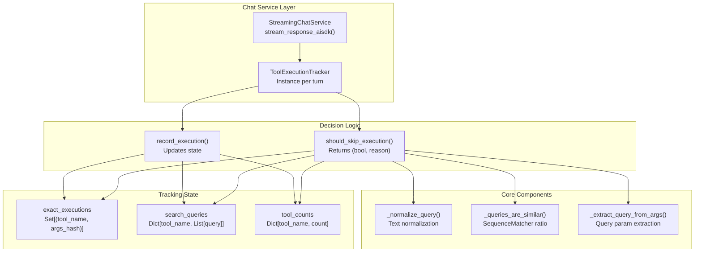
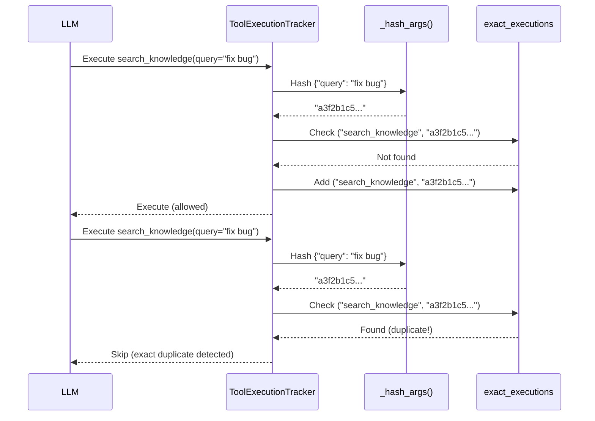
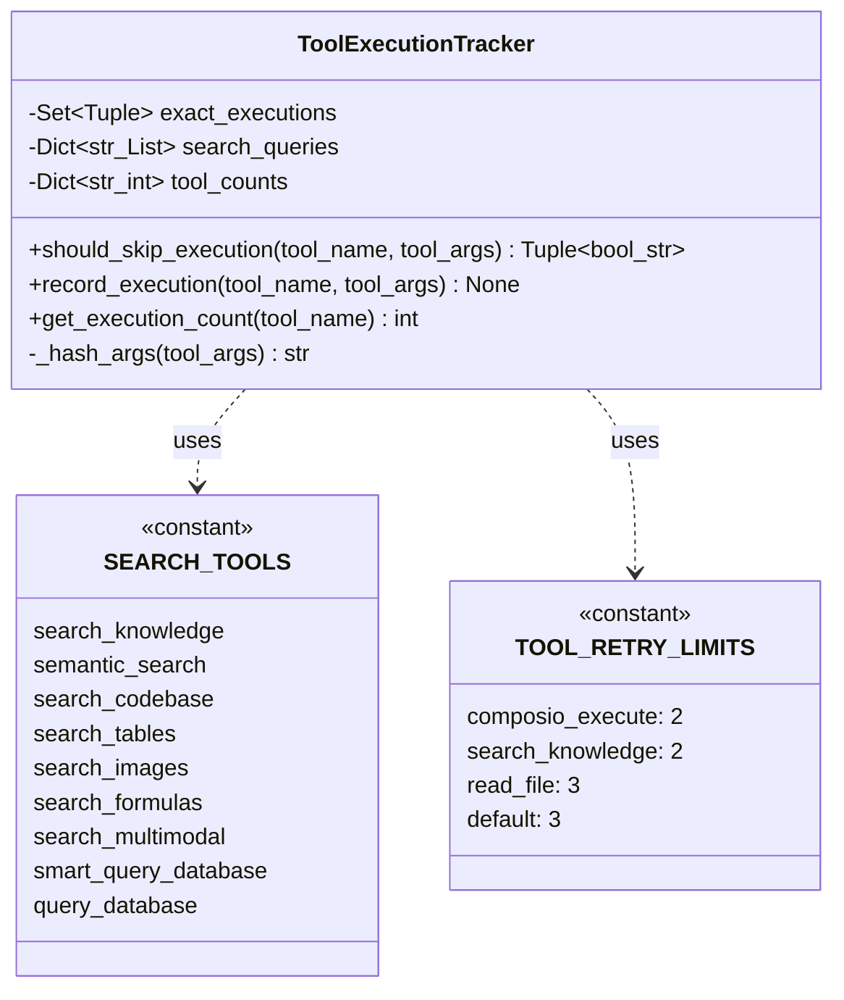
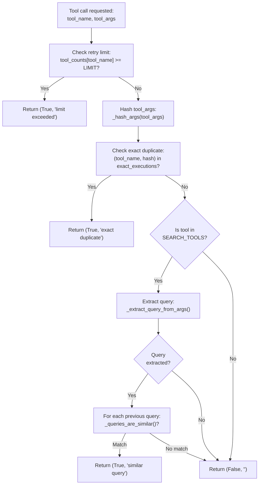
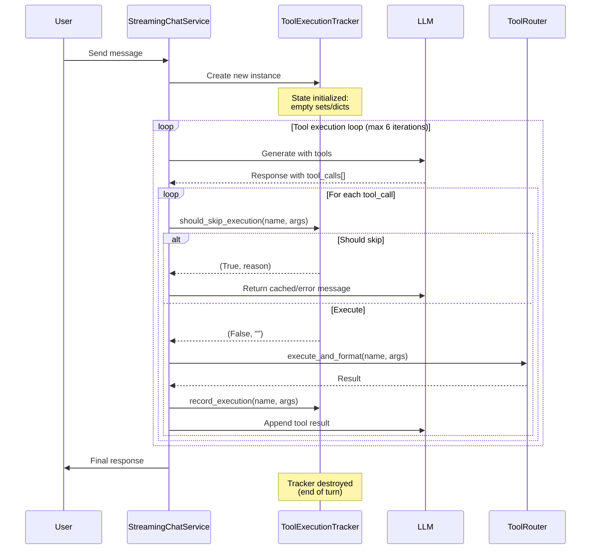

# Tool Loop Prevention

<details>
<summary>Relevant source files</summary>

The following files were used as context for generating this wiki page:

- [frontend/tsconfig.tsbuildinfo](frontend/tsconfig.tsbuildinfo)
- [orchestrator/api/workflows.py](orchestrator/api/workflows.py)
- [orchestrator/consumers/chatbot/service.py](orchestrator/consumers/chatbot/service.py)
- [orchestrator/core/llm/manager.py](orchestrator/core/llm/manager.py)
- [orchestrator/modules/agents/factory/agent_factory.py](orchestrator/modules/agents/factory/agent_factory.py)
- [orchestrator/modules/orchestrator/pipeline.py](orchestrator/modules/orchestrator/pipeline.py)
- [orchestrator/modules/orchestrator/service.py](orchestrator/modules/orchestrator/service.py)

</details>


## Purpose and Scope

This document describes the tool loop prevention system that prevents agents from repeatedly calling the same tools with identical or similar parameters during a single conversation turn. This system is critical for:

- **Preventing infinite loops** when agents get stuck retrying the same failed operation
- **Reducing LLM costs** by avoiding redundant tool executions
- **Improving response quality** by forcing agents to try alternative approaches
- **Protecting external APIs** from excessive duplicate requests

For information about the broader tool execution system, see [Tools & Integrations](#6). For recipe-specific tool handling, see [Recipe Execution](#4.2).

**Sources:** [orchestrator/consumers/chatbot/service.py:1-40]()

---

## System Overview

The tool loop prevention system operates within a single conversation turn (one user message → one agent response cycle). It tracks all tool executions and applies three types of deduplication:

1. **Exact deduplication**: Blocks identical tool calls (same name + same parameters)
2. **Semantic deduplication**: Blocks similar search queries (e.g., "fix bug" vs "fix the bug")
3. **Retry limits**: Enforces per-tool execution caps (e.g., max 2 Composio calls per turn)

The system is implemented in the `StreamingChatService` and integrated into the recipe executor's tool execution pipeline.

**Sources:** [orchestrator/consumers/chatbot/service.py:44-103]()

---

## Architecture



**Diagram: ToolExecutionTracker Component Architecture**

**Sources:** [orchestrator/consumers/chatbot/service.py:88-186]()

---

## Deduplication Strategies

### 1. Exact Deduplication

Blocks tool calls with identical parameters by hashing the argument dictionary:



**Diagram: Exact Deduplication Flow**

**Implementation:**
- Hash function: MD5 of sorted JSON-serialized arguments [orchestrator/consumers/chatbot/service.py:126-128]()
- Storage: `Set[Tuple[str, str]]` mapping `(tool_name, args_hash)` [orchestrator/consumers/chatbot/service.py:120]()
- Check: `exec_key in self.exact_executions` [orchestrator/consumers/chatbot/service.py:152-153]()

**Sources:** [orchestrator/consumers/chatbot/service.py:126-153]()

---

### 2. Semantic Deduplication

Prevents similar search queries from being executed repeatedly by comparing normalized query strings:

| Step | Function | Purpose |
|------|----------|---------|
| 1. Query extraction | `_extract_query_from_args()` | Finds query parameter in tool args |
| 2. Normalization | `_normalize_query()` | Lowercase, remove punctuation, strip whitespace |
| 3. Similarity check | `_queries_are_similar()` | SequenceMatcher with 0.75 threshold |
| 4. History lookup | `search_queries[tool_name]` | Compare against previous queries |

**Example:**
```python
# These queries are considered similar (ratio >= 0.75):
"fix the bug in authentication"
"fix bug in authentication"
"fix authentication bug"

# After normalization:
"fix bug authentication"  # All three normalize to similar form
```

**Configuration:**
- Similarity threshold: `0.75` (75% match required) [orchestrator/consumers/chatbot/service.py:56-73]()
- Applicable tools: Defined in `SEARCH_TOOLS` set [orchestrator/consumers/chatbot/service.py:98-102]()

**Sources:** [orchestrator/consumers/chatbot/service.py:46-86](), [orchestrator/consumers/chatbot/service.py:156-162]()

---

### 3. Retry Limits

Enforces maximum execution counts per tool type to prevent excessive retries:

```python
TOOL_RETRY_LIMITS = {
    'composio_execute': 2,      # Composio gets 2 total attempts
    'search_knowledge': 2,
    'semantic_search': 2,
    'search_codebase': 2,
    'smart_query_database': 2,
    'query_database': 2,
    'list_directory': 2,
    'read_file': 3,
    'write_file': 2,
    'default': 3                # Default limit for unlisted tools
}
```

**Tool Retry Limits Configuration Table**

| Tool Category | Tool Names | Max Attempts | Rationale |
|---------------|------------|--------------|-----------|
| External APIs | `composio_execute` | 2 | Protect third-party rate limits |
| Search Operations | `search_knowledge`, `semantic_search`, `search_codebase`, `smart_query_database`, `query_database` | 2 | Expensive operations, diminishing returns |
| File Operations | `read_file` | 3 | May need retries for file system races |
| File Operations | `write_file`, `list_directory` | 2 | Idempotent operations |
| Default | All others | 3 | Conservative fallback |

**Sources:** [orchestrator/consumers/chatbot/service.py:104-116]()

---

## Implementation Details

### ToolExecutionTracker Class



**Diagram: ToolExecutionTracker Class Structure**

**Sources:** [orchestrator/consumers/chatbot/service.py:88-186]()

---

### Decision Flow



**Diagram: should_skip_execution() Decision Flow**

**Sources:** [orchestrator/consumers/chatbot/service.py:130-164]()

---

## Integration Points

### Chat Service Integration

The tracker is instantiated per conversation turn in `StreamingChatService.stream_response_aisdk()`:



**Diagram: Chat Service Integration Flow**

**Key Integration Points:**

1. **Tracker creation**: Line 697 in `stream_response_aisdk()` [orchestrator/consumers/chatbot/service.py:697]()
2. **Skip check**: Lines 755-766 check `should_skip_execution()` [orchestrator/consumers/chatbot/service.py:755-766]()
3. **Execution recording**: Line 790 calls `record_execution()` [orchestrator/consumers/chatbot/service.py:790]()
4. **Tool result injection**: Lines 767-774 inject skip reason to LLM [orchestrator/consumers/chatbot/service.py:767-774]()

**Sources:** [orchestrator/consumers/chatbot/service.py:492-800]()

---

### Recipe Executor Integration

The recipe executor uses a different pattern - a simple deduplication cache for Composio actions:

```python
# Per-step deduplication cache
_composio_call_cache: Dict[str, str] = {}  # "ACTION|args_hash" → cached result

# Before execution (line 269-273)
_dedup_key = f"{tool_name}|{json.dumps(tool_args, sort_keys=True, default=str)}"
if _dedup_key in _composio_call_cache:
    result_text = _composio_call_cache[_dedup_key]
    logger.info(f"Composio dedup hit: {tool_name} (skipped repeat call)")
```

**Differences from chat service:**

| Aspect | Chat Service | Recipe Executor |
|--------|-------------|-----------------|
| Scope | Per conversation turn | Per recipe step |
| Strategy | Three-tier (exact/semantic/limit) | Exact match only |
| Target | All tools | Composio actions only |
| State persistence | In-memory per turn | In-memory per step |

**Sources:** [orchestrator/api/recipe_executor.py:209-298]()

---

## Configuration

### Search Tools List

Tools subject to semantic deduplication:

```python
SEARCH_TOOLS = {
    'search_knowledge',     # RAG knowledge base search
    'semantic_search',      # Vector similarity search
    'search_codebase',      # CodeGraph search
    'search_tables',        # Database table search
    'search_images',        # Image content search
    'search_formulas',      # Formula search
    'search_multimodal',    # Multi-modal search
    'smart_query_database', # NL2SQL with semantic matching
    'query_database'        # Direct SQL queries
}
```

**Sources:** [orchestrator/consumers/chatbot/service.py:98-102]()

---

### Dangerous Tokens

Query normalization removes these tokens to prevent inappropriate similarity matches:

```python
DANGEROUS_TOKENS: Set[str] = {
    "archive", "delete", "remove", "revoke", "clear", "close",
    "disable", "ban", "kick", "deactivate", "destroy", "purge",
}
```

**Purpose:** Prevent "delete user" and "deactivate user" from being considered similar, as these are destructive operations that should be executed with full intent.

**Sources:** [orchestrator/consumers/chatbot/service.py:48-51]()

---

## Usage Examples

### Example 1: Exact Deduplication

```
Turn context:
1. LLM calls: search_knowledge(query="authentication flow")
   → Executes successfully
   
2. LLM calls: search_knowledge(query="authentication flow") 
   → BLOCKED (exact duplicate)
   → LLM receives: "Tool 'search_knowledge' was already executed with identical parameters"
   
3. LLM calls: search_knowledge(query="authentication diagram")
   → Executes (different parameters)
```

**Sources:** [orchestrator/consumers/chatbot/service.py:149-153]()

---

### Example 2: Semantic Deduplication

```
Turn context:
1. LLM calls: semantic_search(query="fix the authentication bug")
   → Normalized: "fix authentication bug"
   → Executes successfully
   
2. LLM calls: semantic_search(query="fix authentication bug please")
   → Normalized: "fix authentication bug please"
   → Similarity ratio: 0.89 (> 0.75 threshold)
   → BLOCKED (similar query)
   → LLM receives: "Tool 'semantic_search' was already executed with a similar query"
   
3. LLM calls: semantic_search(query="list all authentication tests")
   → Normalized: "list all authentication tests"
   → Similarity ratio: 0.42 (< 0.75 threshold)
   → Executes (sufficiently different)
```

**Sources:** [orchestrator/consumers/chatbot/service.py:156-162]()

---

### Example 3: Retry Limit

```
Turn context:
1. LLM calls: composio_execute(action="JIRA_GET_ISSUE", params={"issue": "PILOT-123"})
   → Executes (attempt 1/2)
   
2. LLM calls: composio_execute(action="JIRA_GET_ISSUE", params={"issue": "PILOT-456"})
   → Executes (attempt 2/2)
   
3. LLM calls: composio_execute(action="GITHUB_CREATE_PR", params={...})
   → BLOCKED (limit 2 reached for composio_execute)
   → LLM receives: "Tool 'composio_execute' has reached its execution limit (2) for this turn"
```

**Sources:** [orchestrator/consumers/chatbot/service.py:142-146]()

---

## Error Messages

When a tool execution is skipped, the tracker returns a descriptive reason string that is injected into the LLM context:

| Reason Code | Message Template | Trigger Condition |
|-------------|------------------|-------------------|
| Limit exceeded | `"Tool '{tool_name}' has reached its execution limit ({limit}) for this turn"` | `tool_counts[tool_name] >= TOOL_RETRY_LIMITS[tool_name]` |
| Exact duplicate | `"Tool '{tool_name}' was already executed with identical parameters"` | `(tool_name, args_hash) in exact_executions` |
| Similar query | `"Tool '{tool_name}' was already executed with a similar query"` | `_queries_are_similar(current, previous) >= 0.75` |

**Sources:** [orchestrator/consumers/chatbot/service.py:145-162]()

---

## Performance Characteristics

### Memory Usage

Per conversation turn:

- **Exact deduplication**: O(n) space for n tool calls
  - Each entry: ~50 bytes (tool name + MD5 hash)
  - Typical turn: 5-15 tool calls = 250-750 bytes
  
- **Semantic deduplication**: O(m) space for m search queries
  - Each entry: ~100 bytes (tool name + query string)
  - Typical turn: 1-3 search queries = 100-300 bytes
  
- **Tool counts**: O(k) space for k unique tools
  - Each entry: ~40 bytes (tool name + integer)
  - Typical turn: 3-8 unique tools = 120-320 bytes

**Total per-turn memory**: ~500-1,500 bytes (negligible)

**Sources:** [orchestrator/consumers/chatbot/service.py:119-124]()

---

### Time Complexity

| Operation | Complexity | Notes |
|-----------|------------|-------|
| `should_skip_execution()` | O(1) to O(m) | O(1) for exact/limit checks, O(m) for semantic where m = previous search queries (typically 1-3) |
| `record_execution()` | O(1) | Set/dict insertions |
| `_hash_args()` | O(k) | k = number of argument keys |
| `_normalize_query()` | O(n) | n = query string length |
| `_queries_are_similar()` | O(n×m) | SequenceMatcher between strings of length n, m |

**Worst case per tool call**: O(n×m) for semantic similarity check, where n and m are query lengths (~100 chars each). With m=3 previous queries, this is ~30,000 character comparisons, negligible compared to LLM inference time (100ms+).

**Sources:** [orchestrator/consumers/chatbot/service.py:46-186]()

---

## Limitations and Edge Cases

### 1. Cross-Turn State Not Preserved

The tracker is scoped to a single conversation turn. Across multiple turns:

```
Turn 1:
  - LLM calls search_knowledge(query="auth flow")
  - Executes successfully

Turn 2:
  - LLM calls search_knowledge(query="auth flow") 
  - Executes again (new tracker instance)
```

**Rationale**: Cross-turn deduplication would require persistent state and could prevent legitimate re-queries with updated context.

**Sources:** [orchestrator/consumers/chatbot/service.py:130-164]()

---

### 2. Parameter Order Sensitivity

The exact deduplication uses JSON serialization with `sort_keys=True`, but nested objects may differ:

```python
# These are considered DIFFERENT:
search_knowledge(filters={"type": "doc", "status": "published"})
search_knowledge(filters={"status": "published", "type": "doc"})

# Because nested dicts are not recursively sorted by _hash_args()
```

**Sources:** [orchestrator/consumers/chatbot/service.py:126-128]()

---

### 3. Semantic False Positives

The 0.75 similarity threshold may block legitimately different queries:

```python
# These queries are 76% similar (above threshold):
"list all authentication methods"
"list authentication features"

# But they may return different results depending on the knowledge base
```

**Mitigation**: The threshold (0.75) is tuned empirically. Adjust in [orchestrator/consumers/chatbot/service.py:56]() if needed.

**Sources:** [orchestrator/consumers/chatbot/service.py:56-73]()

---

## Testing Considerations

### Unit Test Coverage

Key test cases for `ToolExecutionTracker`:

```python
def test_exact_deduplication():
    tracker = ToolExecutionTracker()
    assert tracker.should_skip_execution("read_file", {"path": "/tmp/test.txt"}) == (False, "")
    tracker.record_execution("read_file", {"path": "/tmp/test.txt"})
    assert tracker.should_skip_execution("read_file", {"path": "/tmp/test.txt"}) == (True, "...")

def test_semantic_deduplication():
    tracker = ToolExecutionTracker()
    tracker.record_execution("search_knowledge", {"query": "fix bug"})
    # Similar query should be blocked
    should_skip, _ = tracker.should_skip_execution("search_knowledge", {"query": "fix the bug"})
    assert should_skip == True

def test_retry_limits():
    tracker = ToolExecutionTracker()
    tracker.record_execution("composio_execute", {"action": "ACTION1"})
    tracker.record_execution("composio_execute", {"action": "ACTION2"})
    # Third call should be blocked (limit=2)
    should_skip, _ = tracker.should_skip_execution("composio_execute", {"action": "ACTION3"})
    assert should_skip == True
```

**Test File Location**: Tests should be added to the test suite for the chatbot consumer module.

**Sources:** [orchestrator/consumers/chatbot/service.py:88-186]()

---

## Related Systems

- **[Tool Router & Execution](#6.3)**: Executes the tools after deduplication checks pass
- **[Streaming Chat Service](#8.1)**: Parent service that instantiates the tracker
- **[Recipe Execution](#4.2)**: Uses a simpler deduplication cache for Composio actions
- **[Composio Integration](#6.1)**: External tool system with rate limit concerns

**Sources:** [orchestrator/consumers/chatbot/service.py:1-40]()

---