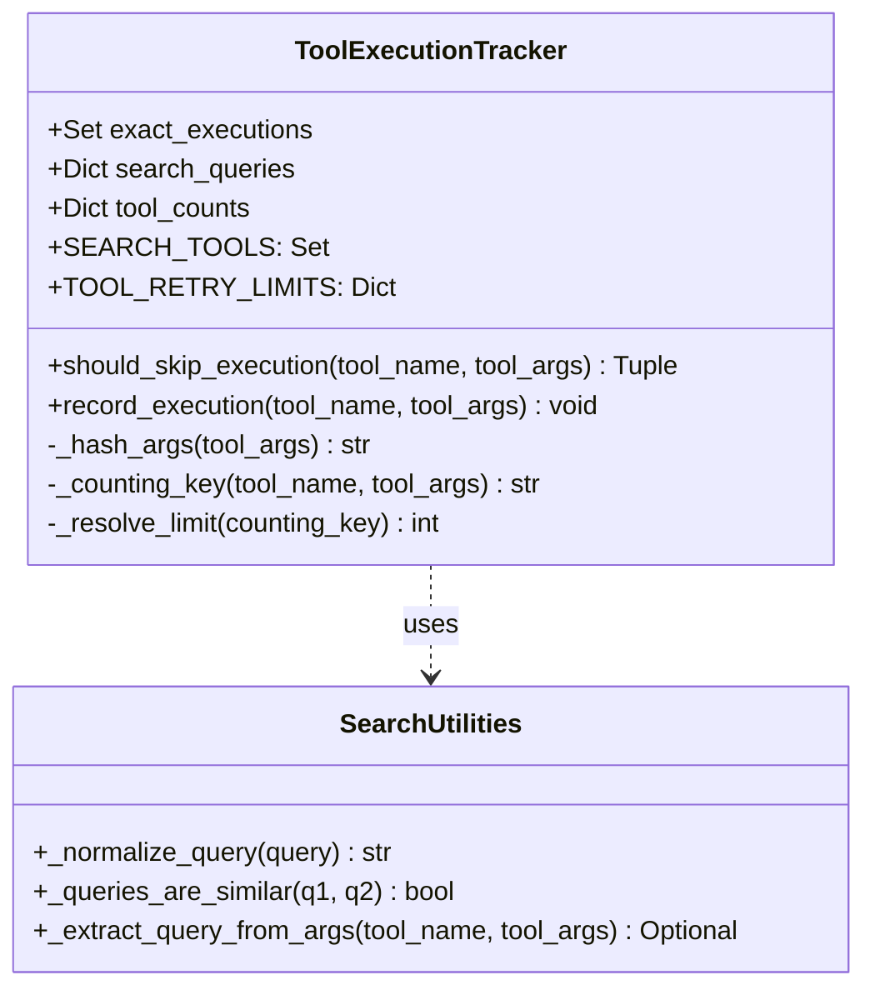

# Tool Loop Prevention

<details>
<summary>Relevant source files</summary>

The following files were used as context for generating this wiki page:

- [frontend/app/api/chat/route.ts](frontend/app/api/chat/route.ts)
- [frontend/components/chatbot/chat.tsx](frontend/components/chatbot/chat.tsx)
- [frontend/components/chatbot/mission-suggestion-card.tsx](frontend/components/chatbot/mission-suggestion-card.tsx)
- [frontend/lib/chat/hooks.ts](frontend/lib/chat/hooks.ts)
- [frontend/stores/mission-store.ts](frontend/stores/mission-store.ts)
- [orchestrator/api/chat.py](orchestrator/api/chat.py)
- [orchestrator/api/recipe_executor.py](orchestrator/api/recipe_executor.py)
- [orchestrator/consumers/chatbot/service.py](orchestrator/consumers/chatbot/service.py)
- [orchestrator/modules/agents/factory/agent_factory.py](orchestrator/modules/agents/factory/agent_factory.py)

</details>


## Purpose and Scope

The Tool Loop Prevention system is a critical safety and efficiency mechanism within Automatos AI. It prevents agents from entering infinite execution loops where they repeatedly call the same tools with identical or semantically similar parameters during a single conversation turn.

This system addresses several key operational risks:
- **Infinite Loops**: Prevents agents from getting stuck in "retry-fail" cycles.
- **Cost Management**: Reduces LLM token consumption by blocking redundant tool invocations.
- **API Protection**: Shields external integrations (e.g., Composio, GitHub, Slack) from excessive duplicate requests.
- **Response Quality**: Forces the agent to pivot to alternative strategies when a specific tool approach is exhausted.

**Sources:** [orchestrator/consumers/chatbot/service.py:1-13](), [orchestrator/consumers/chatbot/service.py:46-46](), [orchestrator/modules/agents/factory/agent_factory.py:1-11]()

---

## System Overview

The system primarily revolves around the `ToolExecutionTracker` class [orchestrator/consumers/chatbot/service.py:83-90](). It is instantiated during agent execution (e.g., in `StreamingChatService` or `AgentFactory`) and tracks state throughout a single "turn" or step.

The prevention logic implements three distinct layers of protection:
1.  **Exact Deduplication**: Uses argument hashing to block bit-for-bit identical calls [orchestrator/consumers/chatbot/service.py:118-119]().
2.  **Semantic Deduplication**: Uses string normalization and similarity ratios to block repetitive search queries [orchestrator/consumers/chatbot/service.py:53-71]().
3.  **Execution Caps**: Enforces strict per-tool and per-turn iteration limits, including specialized logic for dispatched platform actions [orchestrator/consumers/chatbot/service.py:98-111]().

**Sources:** [orchestrator/consumers/chatbot/service.py:83-90](), [orchestrator/consumers/chatbot/service.py:150-176]()

---

## Architecture and Data Flow

The following diagrams illustrate how the `ToolExecutionTracker` bridges the natural language intent (queries) with the code-level execution state.

### Tool Execution Tracking Logic

This diagram shows how the `StreamingChatOrchestrator` utilizes the tracker during the LLM's tool-calling loop.

**Diagram: Tool Loop Prevention Flow**
```mermaid
graph TD
    subgraph "Execution Layer [orchestrator/consumers/chatbot/service.py]"
        Stream["StreamingChatService.stream_response_with_agent()"]
        Loop["Tool Loop (max 10 iterations)"]
    end

    subgraph "ToolExecutionTracker (Code Entity Space)"
        Tracker["ToolExecutionTracker"]
        ExactSet["exact_executions (Set[Tuple[str, str]])"]
        SearchDict["search_queries (Dict[str, List[str]])"]
        CountDict["tool_counts (Dict[str, int])"]
    end

    subgraph "Natural Language Space"
        UserQuery["User Search Intent"]
        SimilarQuery["'find bug' vs 'find the bug'"]
    end

    Stream -->|Initialize| Tracker
    Loop -->|should_skip_execution()| Tracker
    Tracker -->|Verify Limit| CountDict
    Tracker -->|Verify Hash| ExactSet
    Tracker -->|Verify Similarity| SearchDict
    SearchDict -.->|_normalize_query()| UserQuery
    SearchDict -.->|_queries_are_similar()| SimilarQuery
    
    Tracker -->|Decision (bool, reason)| Loop
    Loop -->|If Allowed| Exec["UnifiedToolExecutor [orchestrator/modules/tools/tool_router.py]"]
    Exec -->|record_execution()| Tracker
```

**Sources:** [orchestrator/consumers/chatbot/service.py:150-154](), [orchestrator/consumers/chatbot/service.py:114-116](), [orchestrator/consumers/chatbot/service.py:178-183]()

---

## Deduplication Strategies

### 1. Exact Deduplication (Hashing)
The system prevents the exact same tool from being called with the exact same arguments.
- **Mechanism**: The `_hash_args` method converts the `tool_args` dictionary into a sorted JSON string and generates an MD5 hex digest [orchestrator/consumers/chatbot/service.py:118-119]().
- **Storage**: The tracker maintains a set of `(tool_name, args_hash)` tuples in `exact_executions` [orchestrator/consumers/chatbot/service.py:114]().

**Sources:** [orchestrator/consumers/chatbot/service.py:118-119](), [orchestrator/consumers/chatbot/service.py:163-166]()

### 2. Semantic Deduplication (Search Tools)
For tools defined in `SEARCH_TOOLS` (e.g., `search_knowledge`, `search_codebase`, `query_database`), the system performs fuzzy matching on the query string [orchestrator/consumers/chatbot/service.py:92-96]().
- **Normalization**: `_normalize_query` removes punctuation, converts to lowercase, and strips extra whitespace using regex `[^\w\s]` [orchestrator/consumers/chatbot/service.py:53-59]().
- **Similarity**: `_queries_are_similar` uses `difflib.SequenceMatcher` with a default threshold of **0.75** [orchestrator/consumers/chatbot/service.py:62-71]().
- **Extraction**: `_extract_query_from_args` looks for keys like `query`, `search_query`, `q`, `text`, `question`, `prompt` [orchestrator/consumers/chatbot/service.py:74-80]().

**Sources:** [orchestrator/consumers/chatbot/service.py:53-59](), [orchestrator/consumers/chatbot/service.py:62-71](), [orchestrator/consumers/chatbot/service.py:74-80](), [orchestrator/consumers/chatbot/service.py:168-174]()

### 3. Execution Limits (Retry Caps)
The `TOOL_RETRY_LIMITS` dictionary defines the maximum number of times a specific tool or action can be invoked in one turn [orchestrator/consumers/chatbot/service.py:98-111]().

| Tool Name / Category | Limit | Rationale |
| :--- | :--- | :--- |
| `composio_execute` | 5 | Standard external tool limit |
| `search_knowledge` | 5 | Prevent RAG retrieval loops |
| `read_file` | 8 | Higher limit for iterative context gathering |
| `platform_default` | 25 | High limit for internal orchestration actions |
| `workspace_default`| 8 | Limit for filesystem/command operations |
| `default` | 5 | Standard fallback for all other tools |

**Sources:** [orchestrator/consumers/chatbot/service.py:98-111](), [orchestrator/consumers/chatbot/service.py:135-148]()

---

## Implementation Details

### ToolExecutionTracker Class
The `ToolExecutionTracker` is the core state container for prevention logic. It handles the complex mapping between dispatcher tools (like `platform_execute`) and their underlying actions.

**Diagram: ToolExecutionTracker Structure**


**Sources:** [orchestrator/consumers/chatbot/service.py:83-148](), [orchestrator/consumers/chatbot/service.py:53-80]()

### Counting Key Resolution
For the `platform_execute` dispatcher, the tracker counts by the inner action name (e.g., `list_agents`) rather than the dispatcher itself. This ensures that a sequence of different platform actions is not incorrectly flagged as a loop [orchestrator/consumers/chatbot/service.py:122-133]().

### Integration in Execution Engines
The `StreamingChatService` and `RecipeDirectExecutor` manage the high-level loops.
1.  **Check**: Before calling `UnifiedToolExecutor`, the engine calls `tracker.should_skip_execution` [orchestrator/consumers/chatbot/service.py:150-154]().
2.  **Bypass**: If `should_skip` is true, the tool execution is bypassed, and a "skip reason" is injected back into the LLM's conversation history [orchestrator/consumers/chatbot/service.py:160-161]().
3.  **Record**: If executed, `tracker.record_execution` is called to update the state [orchestrator/consumers/chatbot/service.py:178-183]().

**Sources:** [orchestrator/consumers/chatbot/service.py:150-176](), [orchestrator/api/recipe_executor.py:6-12]()

---

## Prevention Logic Decision Table

| Condition | Action | Reason String Returned to LLM |
| :--- | :--- | :--- |
| `count >= limit` | Skip | "Tool '{key}' has reached its execution limit ({limit}) for this turn" |
| `(name, hash) in exact_executions` | Skip | "Tool '{name}' was already executed with identical parameters" |
| `similarity >= 0.75` (Search) | Skip | "Tool '{name}' was already executed with a similar query" |
| All checks pass | Execute | N/A |

**Sources:** [orchestrator/consumers/chatbot/service.py:160-161](), [orchestrator/consumers/chatbot/service.py:165-166](), [orchestrator/consumers/chatbot/service.py:173-174]()

---

## Interaction with UI and Workflows

### Chat Interface Feedback
When a tool execution is prevented, the backend sends a tool result indicating the skip reason. The `StreamingHandler` formats these as AI SDK data stream events for the frontend [orchestrator/consumers/chatbot/service.py:35](), [orchestrator/api/chat.py:109-117]().

**Sources:** [orchestrator/consumers/chatbot/service.py:35-36](), [orchestrator/api/chat.py:72-83]()

### Workflow Bridge (PRD-68)
For complex tasks categorized as `ORGAN` or `ORGANISM`, the system bridges the chat to a transient workflow [orchestrator/api/chat.py:37-46](). This workflow is executed via `execute_workflow_with_progress`, which utilizes its own stage tracking but relies on the underlying `AgentFactory` execution paths that respect these safety guards [orchestrator/api/chat.py:120-126]().

**Sources:** [orchestrator/api/chat.py:67-87](), [orchestrator/api/chat.py:146-156](), [frontend/components/chatbot/chat.tsx:140-145]()

---