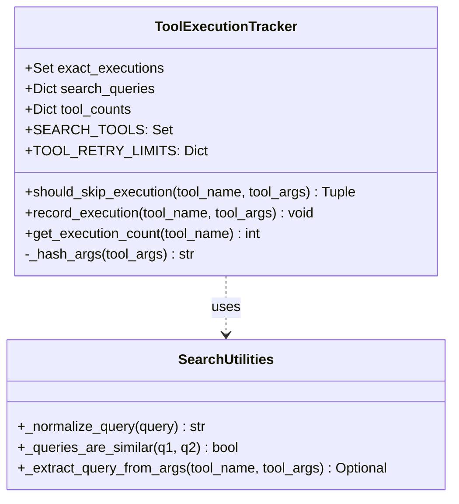
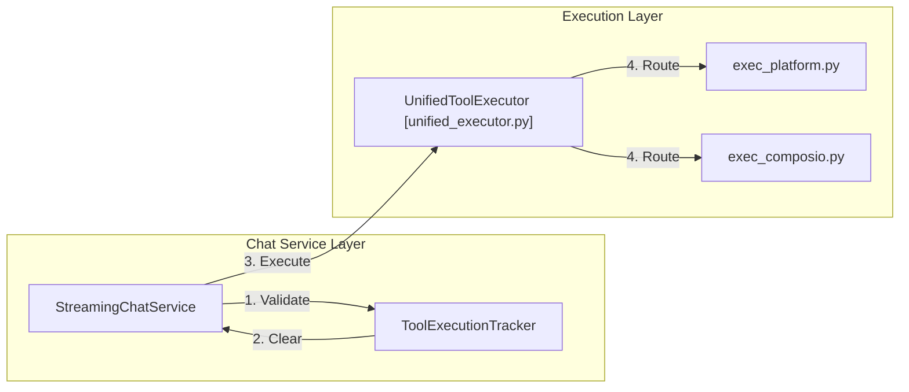

# Tool Loop Prevention

<details>
<summary>Relevant source files</summary>

The following files were used as context for generating this wiki page:

- [orchestrator/alembic/versions/prd123_tool_tier.py](orchestrator/alembic/versions/prd123_tool_tier.py)
- [orchestrator/consumers/__init__.py](orchestrator/consumers/__init__.py)
- [orchestrator/consumers/chatbot/__init__.py](orchestrator/consumers/chatbot/__init__.py)
- [orchestrator/consumers/chatbot/streaming.py](orchestrator/consumers/chatbot/streaming.py)
- [orchestrator/consumers/chatbot/tool_router.py](orchestrator/consumers/chatbot/tool_router.py)
- [orchestrator/core/models/stream_events.py](orchestrator/core/models/stream_events.py)
- [orchestrator/core/models/tools.py](orchestrator/core/models/tools.py)
- [orchestrator/modules/tools/__init__.py](orchestrator/modules/tools/__init__.py)
- [orchestrator/modules/tools/execution/exec_composio.py](orchestrator/modules/tools/execution/exec_composio.py)
- [orchestrator/modules/tools/execution/exec_document.py](orchestrator/modules/tools/execution/exec_document.py)
- [orchestrator/modules/tools/execution/exec_file_ops.py](orchestrator/modules/tools/execution/exec_file_ops.py)
- [orchestrator/modules/tools/execution/exec_multimodal.py](orchestrator/modules/tools/execution/exec_multimodal.py)
- [orchestrator/modules/tools/execution/exec_planning.py](orchestrator/modules/tools/execution/exec_planning.py)
- [orchestrator/modules/tools/execution/exec_platform.py](orchestrator/modules/tools/execution/exec_platform.py)
- [orchestrator/modules/tools/execution/unified_executor.py](orchestrator/modules/tools/execution/unified_executor.py)
- [orchestrator/modules/tools/registry/tool_registry.py](orchestrator/modules/tools/registry/tool_registry.py)

</details>


## Purpose and Scope

The Tool Loop Prevention system is a critical safety and efficiency mechanism within Automatos AI. It prevents agents from entering infinite execution loops where they repeatedly call the same tools with identical or semantically similar parameters during a single conversation turn.

This system addresses several key operational risks:
- **Infinite Loops**: Prevents agents from getting stuck in "retry-fail" cycles.
- **Cost Management**: Reduces LLM token consumption by blocking redundant tool invocations.
- **API Protection**: Shields external integrations (e.g., Composio, GitHub, Slack) from excessive duplicate requests.
- **Response Quality**: Forces the agent to pivot to alternative strategies when a specific tool approach is exhausted.

**Sources:** [orchestrator/consumers/chatbot/service.py:1-13](), [orchestrator/consumers/chatbot/service.py:44-46]()

---

## System Overview

The system primarily revolves around the `ToolExecutionTracker` class. It is instantiated at the start of a streaming response and tracks state throughout a single "turn" (the lifecycle of one user request to one final agent response).

The prevention logic implements three distinct layers of protection:
1.  **Exact Deduplication**: Uses argument hashing to block bit-for-bit identical calls.
2.  **Semantic Deduplication**: Uses string normalization and similarity ratios to block repetitive search queries.
3.  **Execution Caps**: Enforces strict per-tool and per-turn iteration limits.

**Sources:** [orchestrator/consumers/chatbot/service.py:78-85](), [orchestrator/consumers/chatbot/service.py:106-110]()

---

## Architecture and Data Flow

The following diagrams illustrate how the `ToolExecutionTracker` bridges the natural language intent (queries) with the code-level execution state.

### Tool Execution Tracking Logic

This diagram shows how the `StreamingChatService` utilizes the tracker during the LLM's tool-calling loop.

```mermaid
graph TD
    subgraph "StreamingChatService [orchestrator/consumers/chatbot/service.py]"
        Stream["stream_response_with_agent()"]
        Loop["Tool Loop (max 10 iterations)"]
    end

    subgraph "Tool Loop Prevention (Code Entity Space)"
        Tracker["ToolExecutionTracker"]
        ExactSet["exact_executions (Set[Tuple[str, str]])"]
        SearchDict["search_queries (Dict[str, List[str]])"]
        CountDict["tool_counts (Dict[str, int])"]
    end

    subgraph "Natural Language Space"
        UserQuery["User Search Intent"]
        SimilarQuery["'find bug' vs 'find the bug'"]
    end

    Stream -->|Initialize| Tracker
    Loop -->|should_skip_execution()| Tracker
    Tracker -->|Verify Limit| CountDict
    Tracker -->|Verify Hash| ExactSet
    Tracker -->|Verify Similarity| SearchDict
    SearchDict -.->|_normalize_query()| UserQuery
    SearchDict -.->|_queries_are_similar()| SimilarQuery
    
    Tracker -->|Decision (bool, reason)| Loop
    Loop -->|If Allowed| Exec["UnifiedToolExecutor [orchestrator/modules/tools/execution/unified_executor.py]"]
    Exec -->|record_execution()| Tracker
```

**Diagram: Tool Loop Prevention Flow**

**Sources:** [orchestrator/consumers/chatbot/service.py:106-110](), [orchestrator/consumers/chatbot/service.py:114-118](), [orchestrator/modules/tools/execution/unified_executor.py:67-73]()

---

## Deduplication Strategies

### 1. Exact Deduplication (Hashing)
The system prevents the exact same tool from being called with the exact same arguments.
- **Mechanism**: The `_hash_args` method converts the `tool_args` dictionary into a sorted JSON string and generates an MD5 hex digest.
- **Storage**: The tracker maintains a set of `(tool_name, args_hash)` tuples in `exact_executions`.

**Sources:** [orchestrator/consumers/chatbot/service.py:111-112](), [orchestrator/consumers/chatbot/service.py:126-129]()

### 2. Semantic Deduplication (Search Tools)
For tools defined in `SEARCH_TOOLS` (e.g., `search_knowledge`, `search_codebase`, `smart_query_database`), the system performs fuzzy matching on the query string.
- **Normalization**: `_normalize_query` removes punctuation, converts to lowercase, and strips extra whitespace using regex `[^\w\s]`.
- **Similarity**: `_queries_are_similar` uses `difflib.SequenceMatcher` with a default threshold of **0.75**.
- **Extraction**: `_extract_query_from_args` looks for keys like `query`, `search_query`, `q`, `text`, etc.

**Sources:** [orchestrator/consumers/chatbot/service.py:48-54](), [orchestrator/consumers/chatbot/service.py:57-66](), [orchestrator/consumers/chatbot/service.py:69-75](), [orchestrator/consumers/chatbot/service.py:87-91]()

### 3. Execution Limits (Retry Caps)
The `TOOL_RETRY_LIMITS` dictionary defines the maximum number of times a specific tool can be invoked in one turn.

| Tool Name / Category | Limit | Rationale |
| :--- | :--- | :--- |
| `composio_execute` | 2 | Protect external API rate limits |
| `search_knowledge` | 2 | Prevent RAG retrieval loops |
| `read_file` | 3 | Allow for slight variations in file path attempts |
| `write_file` | 2 | Prevent destructive loop cycles |
| `default` | 3 | Standard fallback for all other tools |

**Sources:** [orchestrator/consumers/chatbot/service.py:93-104](), [orchestrator/consumers/chatbot/service.py:120-124]()

---

## Implementation Details

### ToolExecutionTracker Class
The `ToolExecutionTracker` is the core state container for prevention logic.



**Diagram: ToolExecutionTracker Structure**

**Sources:** [orchestrator/consumers/chatbot/service.py:78-104](), [orchestrator/consumers/chatbot/service.py:48-75]()

### Integration in StreamingChatService
The `StreamingChatService` manages the high-level loop. While individual tools have limits, the service enforces a global maximum of **10 iterations** per turn to ensure termination even if individual tool limits haven't been reached.

1.  **Check**: Before calling `UnifiedToolExecutor`, the service calls `tracker.should_skip_execution`.
2.  **Bypass**: If `should_skip` is true, the tool execution is bypassed, and a "skip reason" is injected back into the LLM's conversation history as a tool result.
3.  **Record**: If executed, `tracker.record_execution` is called to update the state.

**Sources:** [orchestrator/consumers/chatbot/service.py:114-118](), [orchestrator/consumers/chatbot/service.py:141-152]()

---

## Prevention Logic Decision Table

| Condition | Action | Reason String Returned to LLM |
| :--- | :--- | :--- |
| `count >= limit` | Skip | "Tool '{name}' has reached its execution limit ({limit}) for this turn" |
| `(name, hash) in exact_executions` | Skip | "Tool '{name}' was already executed with identical parameters" |
| `similarity >= 0.75` (Search) | Skip | "Tool '{name}' was already executed with a similar query" |
| All checks pass | Execute | N/A |

**Sources:** [orchestrator/consumers/chatbot/service.py:123-124](), [orchestrator/consumers/chatbot/service.py:128-129](), [orchestrator/consumers/chatbot/service.py:137-137]()

---

## Interaction with UI and Workflows

### Chat Interface Feedback
When a tool execution is prevented, the backend sends a tool result indicating the skip reason. The frontend handles these results via the AI SDK Data Stream. The `StreamingHandler` formats these as `tool-end` events with success=false if blocked, ensuring the UI reflects the failure correctly.

**Sources:** [orchestrator/consumers/chatbot/streaming.py:141-160](), [orchestrator/core/models/stream_events.py:29-34]()

### Tool Tier and Registry
Tools are managed in the `ToolRegistry` and assigned a `ToolTier` (SYSTEM, PLATFORM, MARKETPLACE, CUSTOM). Loop prevention applies across all tiers, but critical system tools like `MEMORY` or `RAG` (mapped to `search_knowledge`) have specific limits to maintain performance without breaking core agent functionality.

**Sources:** [orchestrator/modules/tools/registry/tool_registry.py:157-180](), [orchestrator/core/models/tools.py:19-26](), [orchestrator/alembic/versions/prd123_tool_tier.py:18-20]()

### Unified Tool Routing
The `UnifiedToolExecutor` serves as the single entry point for all execution. It handles routing to specific sub-executors (e.g., `exec_composio.py`, `exec_platform.py`) only after the `StreamingChatService` has cleared the tool through the `ToolExecutionTracker`.



**Diagram: Execution Routing and Prevention Guard**

**Sources:** [orchestrator/modules/tools/execution/unified_executor.py:105-166](), [orchestrator/modules/tools/execution/exec_platform.py:13-26](), [orchestrator/modules/tools/execution/exec_composio.py:84-132]()

---