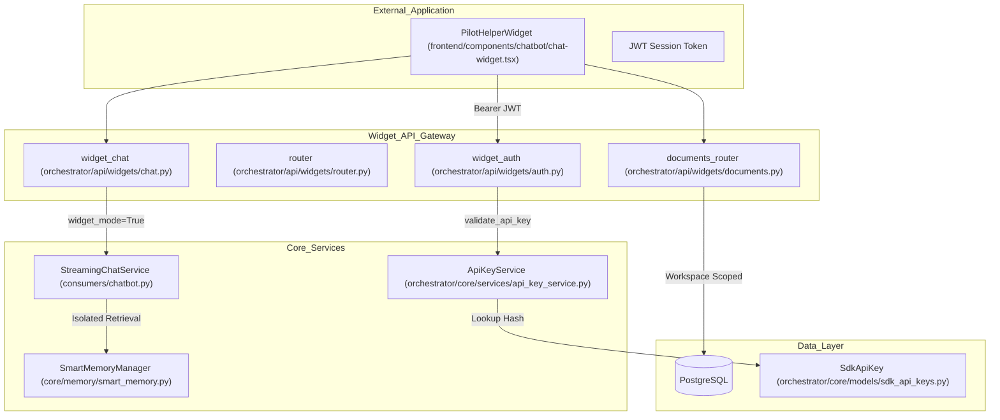
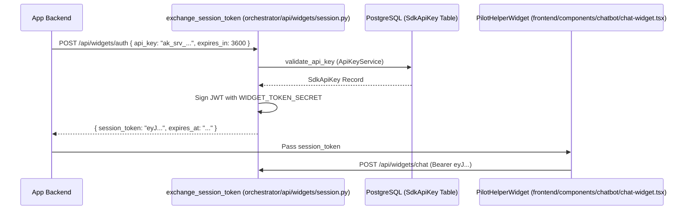

# Widget System

Relevant source files

The following files were used as context for generating this wiki page:

- [frontend/components/chatbot/chat-widget.tsx](frontend/components/chatbot/chat-widget.tsx)
- [frontend/components/documents/delete-confirmation-modal.tsx](frontend/components/documents/delete-confirmation-modal.tsx)
- [frontend/components/documents/document-details-modal.tsx](frontend/components/documents/document-details-modal.tsx)
- [frontend/components/documents/download-progress-modal.tsx](frontend/components/documents/download-progress-modal.tsx)
- [frontend/public/brand/jira-logo.svg](frontend/public/brand/jira-logo.svg)
- [orchestrator/api/api_keys.py](orchestrator/api/api_keys.py)
- [orchestrator/api/widgets/__init__.py](orchestrator/api/widgets/__init__.py)
- [orchestrator/api/widgets/auth.py](orchestrator/api/widgets/auth.py)
- [orchestrator/api/widgets/chat.py](orchestrator/api/widgets/chat.py)
- [orchestrator/api/widgets/data.py](orchestrator/api/widgets/data.py)
- [orchestrator/api/widgets/documents.py](orchestrator/api/widgets/documents.py)
- [orchestrator/api/widgets/router.py](orchestrator/api/widgets/router.py)
- [orchestrator/api/widgets/session.py](orchestrator/api/widgets/session.py)
- [orchestrator/core/database/migrations/043_team_based_document_scoping.sql](orchestrator/core/database/migrations/043_team_based_document_scoping.sql)
- [orchestrator/core/models/sdk_api_keys.py](orchestrator/core/models/sdk_api_keys.py)
- [orchestrator/core/services/api_key_service.py](orchestrator/core/services/api_key_service.py)

The Widget System provides two distinct capabilities: it enables dynamic, rich data visualization in the chat interface by automatically creating interactive widgets from tool execution results, and it provides a secure, isolated **Widget Mode** for embedding the chat assistant into external applications via an SDK.

For information about the chat interface itself, see [9.6 Chat UI Components](). For tool execution and routing, see [8.3 Tool Router & Execution]().

---

## Purpose and Scope

This page documents:
- **Widget Mode**: Secure embedding of chat in external apps with isolated memory access and API key authentication.
- **Widget API**: Dedicated endpoints for session exchange, workspace-scoped document search, and streaming chat.
- **Frontend Widget System**: Automatic widget creation from SSE `tool-data` events and split-panel layout architecture.
- **Memory Isolation**: How `widget_mode` restricts memory retrieval to prevent cross-workspace data leakage.
- **Team-Based Scoping**: Integration with PRD-124 for restricted document visibility within widgets.

---

## Architecture: Embedded Widget System

The following diagram illustrates the data flow from an external application through the Widget API to the core AI services.

### Widget Request Flow

**Sources:** [orchestrator/api/widgets/chat.py:79-114](), [orchestrator/api/widgets/auth.py:112-171](), [orchestrator/core/services/api_key_service.py:97-124](), [orchestrator/api/widgets/router.py:13-56]()

---

## Widget Mode & Memory Isolation

When the system operates in "Widget Mode" (triggered by `widget_mode=True` in `StreamingChatService`), it enforces strict memory access boundaries. This ensures that an embedded assistant only accesses information relevant to that specific deployment.

### Memory Retrieval Logic

| Feature | Standard Mode | Widget Mode |
| :--- | :--- | :--- |
| **L1-L3 Access** | Global + Agent-specific | **Agent-specific only** |
| **Workspace Scope** | User's active workspace | API Key's assigned workspace |
| **User Identity** | Authenticated Platform User | Default Widget User (ID=1) |
| **Agent Lock** | User selected | `default_agent_id` from API Key |
| **Team Visibility** | Workspace-wide | Scoped to `team` in `SdkApiKey` |

In `StreamingChatService`, the `widget_mode` flag is passed to the `SmartMemoryManager` to filter retrieval tiers. The system uses a well-known user ID (ID=1) via `_get_widget_user_id` for widget-initiated chats to satisfy foreign-key constraints while maintaining anonymity for external users.

**Sources:** [orchestrator/api/widgets/chat.py:114-115](), [orchestrator/api/widgets/chat.py:57-72](), [orchestrator/core/models/sdk_api_keys.py:55-58](), [orchestrator/api/widgets/chat.py:171-172]()

---

## Authentication & API Keys

The system uses a two-tier authentication strategy for widgets:
1.  **Server API Keys**: Long-lived keys (`ak_srv_...`) used by backend servers to exchange for session tokens.
2.  **JWT Session Tokens**: Short-lived, browser-safe tokens used by the frontend widget.

### API Key Schema (`SdkApiKey`)

The `SdkApiKey` model defines the permissions and restrictions for a widget deployment.

| Field | Description |
| :--- | :--- |
| `key_hash` | SHA-256 hash of the plaintext key. |
| `key_type` | `public` (client-side) or `server` (backend exchange). |
| `permissions` | Array of scopes (e.g., `chat`, `documents:read`). |
| `allowed_domains` | CORS-style origin allowlist for public keys. |
| `default_agent_id` | Forces all widget chats to use a specific agent. |
| `team` | (PRD-124) Scopes document access to a specific organizational team. |

**Sources:** [orchestrator/core/models/sdk_api_keys.py:29-73](), [orchestrator/core/services/api_key_service.py:35-91](), [orchestrator/core/database/migrations/043_team_based_document_scoping.sql:17-18]()

### Token Exchange Flow

To avoid exposing raw API keys in the browser, developers use the `/auth` endpoint to get a temporary JWT.

**Sources:** [orchestrator/api/widgets/session.py:74-155](), [orchestrator/api/widgets/auth.py:85-106](), [orchestrator/core/services/api_key_service.py:97-124]()

---

## Widget API Reference

### 1. Chat Streaming (`POST /chat`)
Sends a message and receives a standard SSE stream. Unlike the main chat API, this endpoint uses `WidgetAuthContext`.

*   **Endpoint**: [orchestrator/api/widgets/chat.py:79-84]()
*   **Events**: `message`, `tool-start`, `tool-end`, `tool-data`, `done`.
*   **Implementation**: Reuses `StreamingChatService` with `widget_mode=True`.

### 2. Session Token Exchange (`POST /auth`)
Allows backend servers to exchange a server key for a JWT.

*   **Endpoint**: [orchestrator/api/widgets/session.py:74-78]()
*   **Security**: Only `key_type == "server"` keys are permitted.
*   **Payload**: Includes `workspace_id`, `permissions`, and optional `team` lock.

### 3. API Key Management
Endpoints for platform admins to manage SDK access via `ApiKeyService`.

*   **Create**: [orchestrator/api/api_keys.py:111-116]() (`create_api_key`)
*   **List**: [orchestrator/api/api_keys.py:153-157]() (`list_api_keys`)
*   **Revoke**: [orchestrator/api/api_keys.py:167-171]() (`revoke_api_key`)

---

## Frontend Widget Components

The `PilotHelperWidget` is the primary React component for embedding the assistant. It includes per-page help content and bug reporting capabilities.

### Help Content Configuration
The widget maps application routes to specific help items to provide context-aware assistance.

| Page | Help Titles |
| :--- | :--- |
| `agents` | Create an Agent, Assign Tools, Monitor Performance |
| `documents` | Upload Documents, Cloud Sync, Search & Query |
| `tools` | Browse Integrations, Connect an App, Manage Permissions |

**Sources:** [frontend/components/chatbot/chat-widget.tsx:40-86](), [frontend/components/chatbot/chat-widget.tsx:108-116]()

### Widget UI State
The frontend maintains several modals for document interaction within the widget context:
- `DeleteConfirmationModal`: Handles document removal with impact analysis (e.g., `vector_chunks`, `embeddings`).
- `DocumentDetailsModal`: Displays metadata, processing stages (e.g., `processing_stages`), and chunk counts.
- `DownloadProgressModal`: Manages file downloads with real-time speed/progress tracking.

**Sources:** [frontend/components/documents/delete-confirmation-modal.tsx:46-52](), [frontend/components/documents/document-details-modal.tsx:99-105](), [frontend/components/documents/download-progress-modal.tsx:32-38](), [frontend/components/documents/delete-confirmation-modal.tsx:33-44]()

---

## Summary of Key Code Entities

| Entity | Path | Role |
| :--- | :--- | :--- |
| `SdkApiKey` | `orchestrator/core/models/sdk_api_keys.py` | Database model for SDK access. |
| `ApiKeyService` | `orchestrator/core/services/api_key_service.py` | Logic for hashing and validating keys. |
| `widget_auth` | `orchestrator/api/widgets/auth.py` | FastAPI dependency for JWT/Key validation. |
| `WidgetChatRequest` | `orchestrator/api/widgets/chat.py` | Pydantic model for widget chat input. |
| `PilotHelperWidget` | `frontend/components/chatbot/chat-widget.tsx` | Main React component for the helper widget. |
| `exchange_session_token` | `orchestrator/api/widgets/session.py` | Logic for exchanging server keys for browser JWTs. |

**Sources:** [orchestrator/api/widgets/chat.py:39-43](), [orchestrator/api/widgets/auth.py:112-115](), [orchestrator/core/services/api_key_service.py:28-29](), [orchestrator/api/widgets/session.py:74-78]()

---