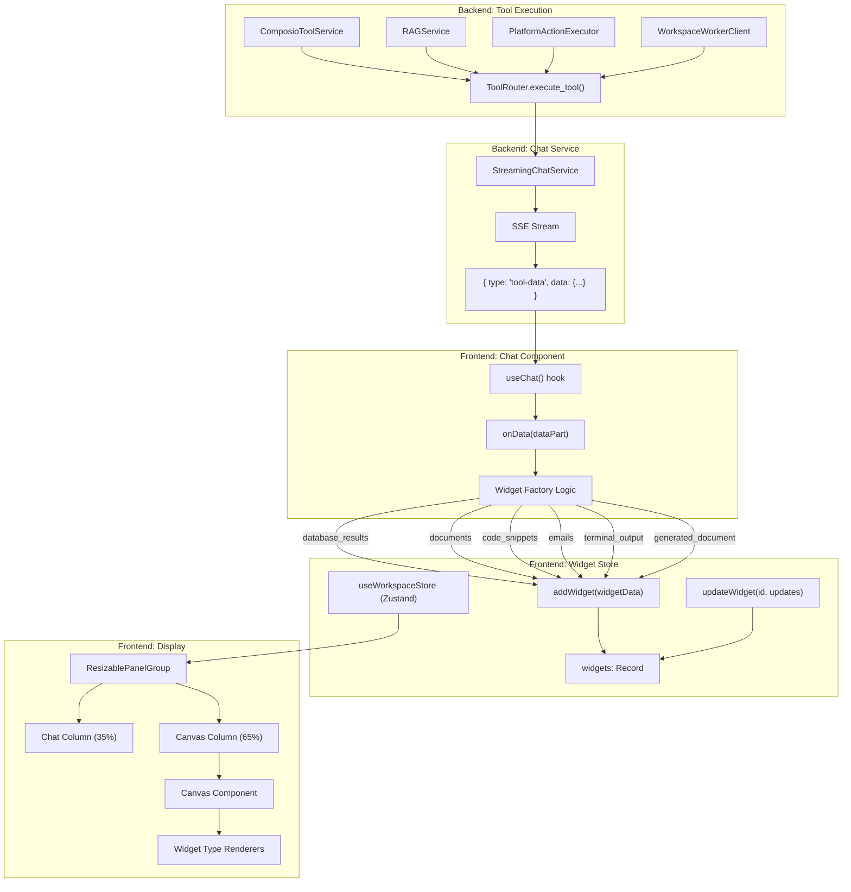
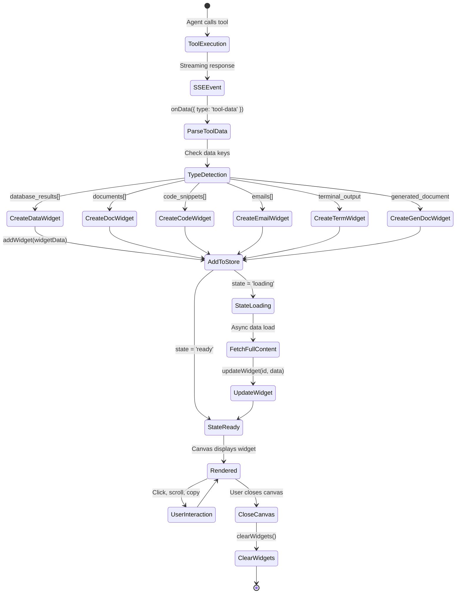
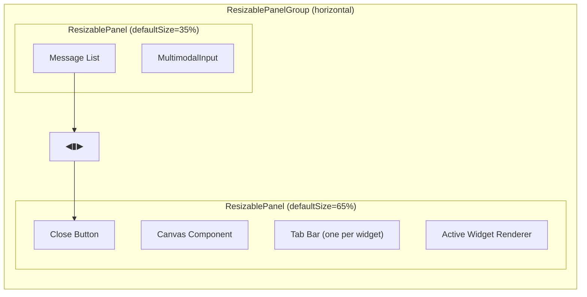
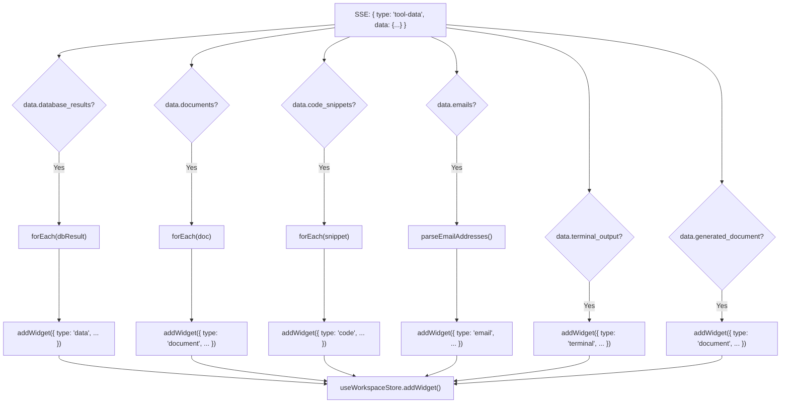
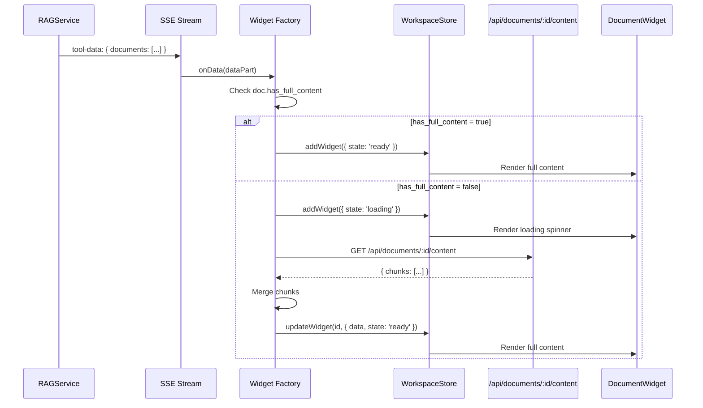

# Widget System

<details>
<summary>Relevant source files</summary>

The following files were used as context for generating this wiki page:

- [frontend/components/chatbot/chat-widget.tsx](frontend/components/chatbot/chat-widget.tsx)
- [frontend/components/chatbot/chat.tsx](frontend/components/chatbot/chat.tsx)
- [frontend/components/chatbot/multimodal-input.tsx](frontend/components/chatbot/multimodal-input.tsx)
- [frontend/public/brand/jira-logo.svg](frontend/public/brand/jira-logo.svg)
- [orchestrator/modules/documents/generation_service.py](orchestrator/modules/documents/generation_service.py)
- [orchestrator/modules/tools/discovery/platform_actions.py](orchestrator/modules/tools/discovery/platform_actions.py)
- [orchestrator/modules/tools/discovery/platform_executor.py](orchestrator/modules/tools/discovery/platform_executor.py)

</details>


The Widget System provides dynamic, rich data visualization in the chat interface by automatically creating interactive widgets from tool execution results. When agents use tools that return structured data (database queries, documents, code snippets, emails, etc.), the system instantiates type-specific widgets in a split-screen canvas alongside the chat conversation.

For information about the chat interface itself, see [Chat Interface](#7). For tool execution and routing, see [Tool Router & Execution](#6.3).

---

## Purpose and Scope

This page documents:
- Widget type definitions and data structures
- Automatic widget creation from SSE `tool-data` events
- Widget state management via Zustand store
- Split-panel layout architecture
- Widget-specific rendering behaviors

This does **not** cover the legacy artifact viewer system, which is being deprecated in favor of widgets.

---

## Architecture Overview



**Sources:** [frontend/components/chatbot/chat.tsx:1-250](), [orchestrator/consumers/chatbot/service.py:1-950](), [orchestrator/modules/tools/tool_router.py:1-575]()

---

## Widget Type Definitions

The system supports seven widget types, each with a specific data structure:

| Widget Type | Trigger | Data Structure | Primary Use Case |
|-------------|---------|----------------|------------------|
| `data` | `tool-data.database_results[]` | `DataWidgetData` | SQL query results with charts |
| `document` | `tool-data.documents[]` | `DocumentWidgetData` | RAG-retrieved documents |
| `code` | `tool-data.code_snippets[]` | `CodeWidgetData` | Code search results |
| `email` | `tool-data.emails[]` | `EmailWidgetData` | Gmail/Outlook messages |
| `terminal` | `tool-data.terminal_output` | `TerminalWidgetData` | Command execution output |
| `document` | `tool-data.generated_document` | `DocumentWidgetData` | PDF/DOCX/XLSX generation |
| `coding_canvas` | User action | `CodingCanvasWidgetData` | Workspace file editor |

**Sources:** [frontend/components/chatbot/chat.tsx:14-23](), [frontend/components/widgets/types]()

---

## Widget Data Structures

### Core Widget Schema

Every widget conforms to this base structure:

```typescript
interface Widget<T = any> {
  id: string                    // Auto-generated UUID
  type: WidgetType              // One of the types above
  title: string                 // Display title
  data: T                       // Type-specific payload
  metadata: WidgetMetadata      // Source info
  state: 'ready' | 'loading' | 'error'
  error?: { message: string }
  createdAt: string             // ISO timestamp
}

interface WidgetMetadata {
  source: {
    type: 'tool' | 'user'
    name: string                // Tool name or 'user'
    provider?: string           // 'rag', 'nl2sql', 'composio', etc.
  }
  createdAt: Date
  conversationId?: string
}
```

### Data Widget Structure

Created when tools return database query results:

```typescript
interface DataWidgetData {
  columns: string[]             // Column names
  rows: any[][]                 // Row data
  sql?: string                  // Executed SQL
  database?: string             // Database name
  rowCount: number
  executionTime?: number        // ms
  charts?: Array<{
    filename: string
    mimeType: string
    base64: string              // PandasAI chart
  }>
  pandasAiSummary?: string      // LLM analysis
  explanation?: string          // Query explanation
  rephrased_query?: string      // Normalized query
  follow_up_questions?: string[]
}
```

**Sources:** [frontend/components/chatbot/chat.tsx:156-193]()

### Document Widget Structure

Created from RAG retrieval or document generation:

```typescript
interface DocumentWidgetData {
  content: string               // Full or preview content
  format: 'markdown' | 'html' | 'text'
  filename?: string
  filePath?: string
  similarity?: number           // RAG similarity score
  relevance?: number            // Reranker score
  chunkCount?: number
  chunks?: Array<{
    content: string
    excerpt: string
    similarity: number
    chunkIndex: number
  }>
  downloadUrl?: string
  hasFullContent: boolean       // Lazy-load flag
}
```

**Sources:** [frontend/components/chatbot/chat.tsx:196-230](), [frontend/components/chatbot/chat.tsx:319-341]()

### Code Widget Structure

Created from codebase search results:

```typescript
interface CodeWidgetData {
  code: string                  // Source code
  language: string              // 'python', 'typescript', etc.
  filePath?: string
  lineNumber?: number
  explanation?: string
  symbolName?: string           // Function/class name
}
```

**Sources:** [frontend/components/chatbot/chat.tsx:233-255]()

### Email Widget Structure

Created from Gmail/Outlook tool execution:

```typescript
interface EmailWidgetData {
  mode: 'list' | 'detail'
  emails: Array<{
    id: string
    threadId?: string
    subject: string
    from: { email: string; name?: string }
    to: Array<{ email: string; name?: string }>
    date: string                // ISO timestamp
    snippet: string             // Preview text
    body: string                // Plain text
    bodyHtml?: string           // Rich HTML
    isRead: boolean
    hasAttachments: boolean
    attachments?: any[]
    labels?: string[]
  }>
}
```

**Email address parsing** normalizes various formats (`"Name <email>"`, `"email"`, objects) into a consistent structure using the `parseEmailAddress` helper.

**Sources:** [frontend/components/chatbot/chat.tsx:259-317]()

### Terminal Widget Structure

Created from workspace command execution:

```typescript
interface TerminalWidgetData {
  command: string
  output: string
  stderr?: string
  exitCode: number
  executionTime?: number        // ms
  workingDirectory?: string
}
```

**Sources:** [frontend/components/chatbot/chat.tsx:343-366]()

---

## Widget Lifecycle



**Sources:** [frontend/components/chatbot/chat.tsx:140-380](), [frontend/components/chatbot/chat.tsx:650-680]()

---

## Widget Store Architecture

The widget system uses Zustand for client-side state management:

```typescript
// Store structure (conceptual)
interface WorkspaceStore {
  // Widget state
  widgets: Record<string, Widget>
  widgetIds: string[]
  activeWidgetId: string | null
  
  // Widget operations
  addWidget: (widget: Omit<Widget, 'id'>) => string
  updateWidget: (id: string, updates: Partial<Widget>) => void
  removeWidget: (id: string) => void
  clearWidgets: () => void
  setActiveWidget: (id: string | null) => void
  
  // SSE event dispatchers
  dispatchMemoryInjected: (data: any) => void
  dispatchMemoryStored: (data: any) => void
  dispatchWorkflowUpdate: (data: any) => void
}
```

**Key operations:**

1. **addWidget**: Generates UUID, adds widget to store, pushes ID to `widgetIds`, returns ID
2. **updateWidget**: Performs partial update on widget data (used for lazy-loading document content)
3. **clearWidgets**: Resets store to empty state when closing canvas
4. **setActiveWidget**: Controls which widget tab is visible in Canvas

**Sources:** [frontend/components/chatbot/chat.tsx:56-65](), [frontend/stores/workspace-store]()

---

## Layout System

When widgets exist, the chat interface switches from full-screen to split-panel mode:



**Panel constraints:**
- Chat column: `minSize={20}`, `maxSize={60}`
- Canvas column: `minSize={30}`, no max
- Handle is draggable with visual indicator

**Layout trigger logic:**

```typescript
const hasWidgets = widgetIds.length > 0

// Render split layout when widgets exist
{hasWidgets && (
  <ResizablePanelGroup direction="horizontal">
    <ResizablePanel defaultSize={35} minSize={20} maxSize={60}>
      {/* Chat */}
    </ResizablePanel>
    <ResizableHandle withHandle />
    <ResizablePanel defaultSize={65} minSize={30}>
      <Canvas onClose={handleCloseCanvas} />
    </ResizablePanel>
  </ResizablePanelGroup>
)}

// Fall back to full-screen chat when no widgets
{!hasWidgets && !isArtifactViewerVisible && (
  <div className="relative flex flex-col">
    {/* Full-width chat */}
  </div>
)}
```

**Sources:** [frontend/components/chatbot/chat.tsx:738-817](), [frontend/components/chatbot/chat.tsx:902-1147]()

---

## Widget Creation from Tool Data

The widget factory logic in the `onData` callback inspects SSE event payloads and dispatches to type-specific creators:



**Key patterns:**

1. **Array iteration**: Most data types arrive as arrays (`database_results[]`, `documents[]`, etc.) — each item becomes a separate widget
2. **Metadata normalization**: Each widget's `metadata.source` includes the tool name and provider
3. **Lazy loading**: Document widgets may set `state: 'loading'` if `has_full_content: false`, then fetch via `/api/documents/{id}/content`
4. **Deduplication**: Code and document widgets check if an existing widget with the same file path or symbol name exists before creating a new one

**Sources:** [frontend/components/chatbot/chat.tsx:145-367]()

---

## Data Widget Details

Data widgets visualize SQL query results with optional PandasAI analysis and charts.

### Creation Logic

```typescript
// Triggered by tool-data.database_results[] array
if (toolData.database_results && Array.isArray(toolData.database_results)) {
  toolData.database_results.forEach((dbResult: any) => {
    // Column inference: use dbResult.columns if present, else infer from first row
    const columns = dbResult.columns && dbResult.columns.length > 0
      ? dbResult.columns
      : (dbResult.data && dbResult.data.length > 0 ? Object.keys(dbResult.data[0]) : [])
    
    // Chart attachment
    const charts = dbResult.pandas_ai?.charts?.map((chart: any) => ({
      filename: chart.filename || 'chart.png',
      mimeType: chart.mime_type || 'image/png',
      base64: chart.base64,
    }))
    
    addWidget({
      type: 'data',
      title: `${dbResult.database || 'Query'} Result`,
      data: {
        columns,
        rows: dbResult.data || [],
        sql: dbResult.sql,
        database: dbResult.database,
        rowCount: dbResult.row_count || dbResult.data?.length || 0,
        executionTime: dbResult.execution_time_ms,
        charts,
        pandasAiSummary: dbResult.pandas_ai?.summary,
        explanation: dbResult.explanation,
        rephrased_query: dbResult.rephrased_query,
        follow_up_questions: dbResult.follow_up_questions,
      },
      metadata: {
        source: { type: 'tool', name: 'smart_query_database', provider: 'nl2sql' },
        createdAt: new Date(),
        conversationId: id,
      },
      state: 'ready',
      createdAt: new Date().toISOString(),
    })
  })
}
```

**Backend source:** The `smart_query_database` tool (NL2SQL service) returns structured results. PandasAI charts are generated server-side and embedded as base64 PNGs.

**Sources:** [frontend/components/chatbot/chat.tsx:156-193](), [orchestrator/modules/nl2sql/service.py]()

---

## Document Widget Details

Document widgets display RAG-retrieved or generated documents with optional lazy-loading.

### RAG Document Flow



**Chunk merging logic:**

```typescript
if (doc.id && !doc.has_full_content) {
  apiClient.request(`/api/documents/${doc.id}/content`)
    .then((data: any) => {
      const fullContent = Array.isArray(data?.chunks)
        ? data.chunks.map((chunk: any) => chunk?.content ?? '').filter(Boolean).join('\n\n')
        : initialContent
      
      useWorkspaceStore.getState().updateWidget(widgetId, {
        data: {
          ...widgetData.data,
          content: fullContent || initialContent,
          chunkCount: data?.chunk_count ?? doc.chunk_count,
          hasFullContent: true,
        },
        state: 'ready',
      })
    })
    .catch(() => {
      useWorkspaceStore.getState().updateWidget(widgetId, {
        state: 'error',
        error: { message: 'Failed to load full document' },
      })
    })
}
```

**Sources:** [frontend/components/chatbot/chat.tsx:603-680]()

### Generated Document Flow

Documents created by the `generate_document` tool are immediately available with full content:

```typescript
if (toolData.generated_document) {
  const genDoc = toolData.generated_document
  addWidget({
    type: 'document',
    title: genDoc.title || genDoc.filename || 'Generated Document',
    data: {
      content: genDoc.content || `*Document generated: ${genDoc.filename}*`,
      format: 'markdown',
      filename: genDoc.filename,
      downloadUrl: genDoc.download_url,  // S3 presigned URL
      hasFullContent: true,
    },
    metadata: {
      source: { type: 'tool', name: 'generate_document', provider: 'document_generation' },
      createdAt: new Date(),
      conversationId: id,
    },
    state: 'ready',
    createdAt: new Date().toISOString(),
  })
}
```

The `content` field contains a Markdown representation of the document (see `DocumentGenerationService._data_to_markdown()` for rendering logic).

**Sources:** [frontend/components/chatbot/chat.tsx:319-341](), [orchestrator/modules/documents/generation_service.py:398-504]()

---

## Code Widget Details

Code widgets display syntax-highlighted source code from codebase search:

```typescript
if (toolData.code_snippets && Array.isArray(toolData.code_snippets)) {
  toolData.code_snippets.forEach((snippet: any) => {
    addWidget({
      type: 'code',
      title: snippet.symbol_name || snippet.file_path || 'Code Snippet',
      data: {
        code: snippet.code,
        language: snippet.language || 'python',
        filePath: snippet.file_path,
        lineNumber: snippet.line_number,
        explanation: snippet.explanation,
        symbolName: snippet.symbol_name,
      },
      metadata: {
        source: { type: 'tool', name: 'search_codebase', provider: 'codegraph' },
        createdAt: new Date(),
        conversationId: id,
      },
      state: 'ready',
      createdAt: new Date().toISOString(),
    })
  })
}
```

**Deduplication:** Before creating a code widget, the system checks if a widget with the same `filePath` and `symbolName` already exists. If found, it activates the existing widget instead of creating a duplicate.

**Sources:** [frontend/components/chatbot/chat.tsx:233-255](), [frontend/components/chatbot/chat.tsx:564-601]()

---

## Email Widget Details

Email widgets display messages from Gmail or Outlook integrations:

```typescript
if (toolData.emails && Array.isArray(toolData.emails) && toolData.emails.length > 0) {
  // Parse email addresses from various formats
  const parseEmailAddress = (addr: any): { email: string; name?: string } => {
    if (!addr) return { email: 'unknown' }
    if (typeof addr === 'object' && addr.email) return addr
    if (typeof addr !== 'string') return { email: String(addr) }
    
    // Match "Name <email>" or just "email"
    const match = addr.match(/^(.+?)\s*<([^>]+)>$/)
    if (match) {
      return { name: match[1].trim(), email: match[2].trim() }
    }
    return { email: addr.trim() }
  }
  
  const parseEmailAddresses = (addrs: any): { email: string; name?: string }[] => {
    if (!addrs) return []
    if (typeof addrs === 'string') return [parseEmailAddress(addrs)]
    if (Array.isArray(addrs)) return addrs.map(parseEmailAddress)
    return [parseEmailAddress(addrs)]
  }
  
  const emailList = toolData.emails.map((email: any) => ({
    id: email.id || email.messageId || crypto.randomUUID(),
    threadId: email.threadId,
    subject: email.subject || '(No Subject)',
    from: parseEmailAddress(email.from || email.sender),
    to: parseEmailAddresses(email.to || email.recipients),
    date: email.date || email.receivedAt || new Date().toISOString(),
    snippet: email.snippet || email.body?.substring(0, 200) || '',
    body: email.body || email.content || email.snippet || '',
    bodyHtml: email.bodyHtml,
    isRead: email.isRead ?? true,
    hasAttachments: email.hasAttachments || (email.attachments?.length > 0),
    attachments: email.attachments,
    labels: email.labels || email.tags,
  }))
  
  addWidget({
    type: 'email',
    title: `Emails (${emailList.length})`,
    data: {
      mode: 'list',
      emails: emailList,
    },
    metadata: {
      source: { type: 'tool', name: 'composio_execute', provider: 'gmail' },
      createdAt: new Date(),
      conversationId: id,
    },
    state: 'ready',
    createdAt: new Date().toISOString(),
  })
}
```

**Email normalization:** The parsing logic handles three email address formats:
1. Plain string: `"john@example.com"`
2. Named format: `"John Doe <john@example.com>"`
3. Object format: `{ email: "john@example.com", name: "John Doe" }`

**Sources:** [frontend/components/chatbot/chat.tsx:259-317]()

---

## Terminal Widget Details

Terminal widgets display command execution output from the workspace worker:

```typescript
if (toolData.terminal_output) {
  const term = toolData.terminal_output
  addWidget({
    type: 'terminal',
    title: term.command ? `$ ${term.command.substring(0, 30)}${term.command.length > 30 ? '...' : ''}` : 'Terminal',
    data: {
      command: term.command || '',
      output: term.output || '',
      stderr: term.stderr || '',
      exitCode: term.exitCode ?? 0,
      executionTime: term.executionTime,
      workingDirectory: term.workingDirectory,
    },
    metadata: {
      source: { type: 'tool', name: 'execute_command', provider: 'shell' },
      createdAt: new Date(),
      conversationId: id,
    },
    state: 'ready',
    createdAt: new Date().toISOString(),
  })
}
```

**Title truncation:** Command titles are limited to 30 characters with ellipsis to prevent overflow.

**Sources:** [frontend/components/chatbot/chat.tsx:343-366]()

---

## Coding Canvas Widget

The coding canvas is unique — it's created by user action rather than tool output:

```typescript
const handleOpenCodeCanvas = useCallback(() => {
  if (!workspace?.id) {
    toast.error('No workspace selected')
    return
  }
  
  // Check if already open for this workspace
  const allWidgets = useWorkspaceStore.getState().widgets
  const existing = Object.values(allWidgets).find(
    (w: Widget) => w.type === 'coding_canvas' && (w.data as CodingCanvasWidgetData).workspaceId === workspace.id
  )
  if (existing) {
    useWorkspaceStore.getState().setActiveWidget(existing.id)
    return
  }
  
  const widgetData: CodingCanvasWidgetData = { workspaceId: workspace.id }
  addWidget({
    type: 'coding_canvas',
    title: 'Code Canvas',
    data: widgetData,
    metadata: {
      source: { type: 'user', name: 'code_canvas' },
      createdAt: new Date(),
    },
    state: 'ready',
    createdAt: new Date().toISOString(),
  })
}, [workspace?.id, addWidget])
```

This widget provides a Monaco editor connected to the workspace filesystem for direct code editing.

**Sources:** [frontend/components/chatbot/chat.tsx:70-98]()

---

## Widget Deduplication Strategy

To prevent duplicate widgets when agents repeatedly call the same tools:

### Document Deduplication

```typescript
const existingWidget = Object.values(existingWidgets).find(
  w => w.type === 'document' && (w.data as any)?.filename === docFilename
)
if (existingWidget) {
  useWorkspaceStore.getState().setActiveWidget(existingWidget.id)
  return
}
```

### Code Deduplication

```typescript
const existingWidget = Object.values(existingWidgets).find(
  w => w.type === 'code' && (
    (w.data as any)?.filePath === code.file_path &&
    (w.data as any)?.symbolName === code.symbol_name
  )
)
if (existingWidget) {
  useWorkspaceStore.getState().setActiveWidget(existingWidget.id)
  return
}
```

### Coding Canvas Deduplication

```typescript
const existing = Object.values(allWidgets).find(
  (w: Widget) => w.type === 'coding_canvas' && (w.data as CodingCanvasWidgetData).workspaceId === workspace.id
)
if (existing) {
  useWorkspaceStore.getState().setActiveWidget(existing.id)
  return
}
```

**Rationale:** Without deduplication, repeated tool calls (e.g., "show me that document again") would create many identical widget tabs, degrading UX.

**Sources:** [frontend/components/chatbot/chat.tsx:569-579](), [frontend/components/chatbot/chat.tsx:609-616](), [frontend/components/chatbot/chat.tsx:77-84]()

---

## SSE Event Dispatchers

Beyond widget creation, the chat component dispatches additional SSE events to the workspace store:

```typescript
// Memory events (US-015)
if (dataPart.type === 'memory-injected' && dataPart.data) {
  dispatchMemoryInjected(dataPart.data)
}
if (dataPart.type === 'memory-stored' && dataPart.data) {
  dispatchMemoryStored(dataPart.data)
}

// Workflow events
if (dataPart.type === 'workflow-update' && dataPart.data) {
  dispatchWorkflowUpdate(dataPart.data)
}
```

These events are consumed by other components (e.g., memory widgets, workflow progress indicators) that subscribe to the workspace store.

**Sources:** [frontend/components/chatbot/chat.tsx:369-378](), [frontend/stores/workspace-store]()

---

## Close Canvas Behavior

Closing the canvas clears all widgets and resets overlay states:

```typescript
const handleCloseCanvas = useCallback(() => {
  clearWidgets()
  setIsArtifactViewerVisible(false)
  setSelectedArtifact(null)
}, [clearWidgets])
```

This ensures a clean slate when returning to full-screen chat mode.

**Sources:** [frontend/components/chatbot/chat.tsx:101-105]()

---

## Integration with Platform Actions

Platform actions (see [Platform Action Definitions](#6.5)) can return data that automatically creates widgets. For example:

- `platform_get_llm_usage` → Data widget with token usage table
- `platform_list_documents` → Data widget with document list
- `platform_get_agent` → JSON viewer widget (via generic data widget)

The `PlatformActionExecutor` returns structured JSON that matches widget data schemas:

```python
async def _get_llm_usage(self, params: Dict[str, Any]) -> Dict[str, Any]:
    # ... query logic ...
    return {
        "success": True,
        "period_days": days,
        "total_requests": total_requests,
        "total_tokens": total_tokens,
        "by_model": models,  # List of dicts with model, provider, tokens
    }
```

When this result is streamed via `tool-data`, the widget factory can parse it as a database result and create a data widget.

**Sources:** [orchestrator/modules/tools/discovery/platform_executor.py:280-324](), [orchestrator/modules/tools/discovery/platform_actions.py:146-172]()

---

## Legacy Artifact Viewer

The system maintains backward compatibility with the pre-widget artifact viewer for gradual migration:

```typescript
{isArtifactViewerVisible && selectedArtifact && !hasWidgets && (
  <motion.div className="fixed top-0 left-0 z-50 h-screen w-screen bg-background">
    <ResizablePanelGroup direction="horizontal" className="h-full">
      {/* Same layout as widget system */}
      <ResizablePanel defaultSize={35} minSize={20} maxSize={60}>
        {/* Chat */}
      </ResizablePanel>
      <ResizableHandle withHandle />
      <ResizablePanel defaultSize={65} minSize={30}>
        <ArtifactViewer artifact={selectedArtifact} onClose={...} />
      </ResizablePanel>
    </ResizablePanelGroup>
  </motion.div>
)}
```

**Deprecation path:** The artifact viewer is being phased out in favor of widgets. It currently only activates when `hasWidgets === false` and an artifact is selected.

**Sources:** [frontend/components/chatbot/chat.tsx:820-898]()

---

## Summary

The Widget System provides:

1. **Seven widget types** for different data modalities (database, document, code, email, terminal, generated document, coding canvas)
2. **Automatic creation** from SSE `tool-data` events with zero configuration
3. **Split-panel layout** with resizable columns via `ResizablePanelGroup`
4. **Zustand state management** for widget CRUD operations
5. **Lazy loading** for large documents with async content fetching
6. **Deduplication** to prevent duplicate widgets from repeated tool calls
7. **Type-safe data structures** with TypeScript interfaces for each widget type

The system bridges backend tool execution (RAG, NL2SQL, Composio, workspace worker) to frontend visualization through a simple event protocol, enabling rich multimodal chat interactions without explicit UI coding for each tool.

**Sources:** [frontend/components/chatbot/chat.tsx:1-1200](), [frontend/components/widgets/](), [orchestrator/consumers/chatbot/service.py](), [orchestrator/modules/tools/tool_router.py]()

---