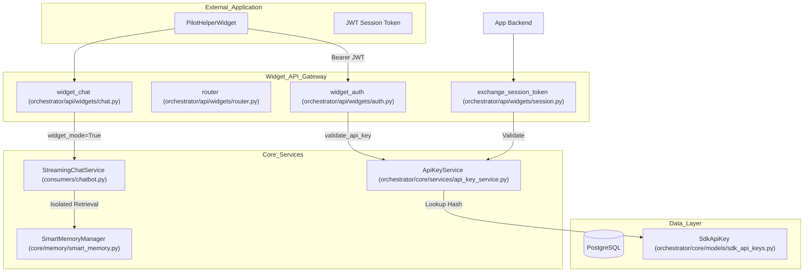
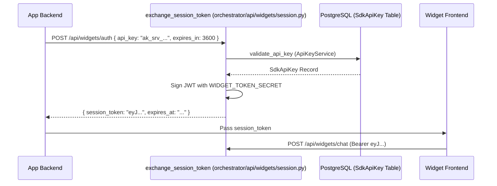

# Widget System

Relevant source files

The following files were used as context for generating this wiki page:

- [frontend/components/settings/ApiKeyManager.tsx](frontend/components/settings/ApiKeyManager.tsx)
- [frontend/components/widgets/CodeWidget/index.tsx](frontend/components/widgets/CodeWidget/index.tsx)
- [frontend/components/widgets/DataWidget/index.tsx](frontend/components/widgets/DataWidget/index.tsx)
- [frontend/components/widgets/DocumentWidget/index.tsx](frontend/components/widgets/DocumentWidget/index.tsx)
- [frontend/components/widgets/ImageWidget/index.tsx](frontend/components/widgets/ImageWidget/index.tsx)
- [frontend/components/widgets/WidgetBase.tsx](frontend/components/widgets/WidgetBase.tsx)
- [frontend/components/widgets/WidgetWrapper.tsx](frontend/components/widgets/WidgetWrapper.tsx)
- [frontend/components/widgets/registry.ts](frontend/components/widgets/registry.ts)
- [frontend/stores/index.ts](frontend/stores/index.ts)
- [frontend/stores/workspace-store.ts](frontend/stores/workspace-store.ts)
- [orchestrator/alembic/versions/add_workspace_admin_lifecycle_fields.py](orchestrator/alembic/versions/add_workspace_admin_lifecycle_fields.py)
- [orchestrator/api/api_keys.py](orchestrator/api/api_keys.py)
- [orchestrator/api/widgets/__init__.py](orchestrator/api/widgets/__init__.py)
- [orchestrator/api/widgets/auth.py](orchestrator/api/widgets/auth.py)
- [orchestrator/api/widgets/chat.py](orchestrator/api/widgets/chat.py)
- [orchestrator/api/widgets/data.py](orchestrator/api/widgets/data.py)
- [orchestrator/api/widgets/docs.py](orchestrator/api/widgets/docs.py)
- [orchestrator/api/widgets/documents.py](orchestrator/api/widgets/documents.py)
- [orchestrator/api/widgets/router.py](orchestrator/api/widgets/router.py)
- [orchestrator/api/widgets/session.py](orchestrator/api/widgets/session.py)
- [orchestrator/core/database/migrations/043_team_based_document_scoping.sql](orchestrator/core/database/migrations/043_team_based_document_scoping.sql)
- [orchestrator/core/models/sdk_api_keys.py](orchestrator/core/models/sdk_api_keys.py)
- [orchestrator/core/models/workspaces.py](orchestrator/core/models/workspaces.py)
- [orchestrator/core/services/api_key_service.py](orchestrator/core/services/api_key_service.py)
- [orchestrator/core/team_access.py](orchestrator/core/team_access.py)

The Widget System provides two distinct capabilities: it enables dynamic, rich data visualization in the chat interface by automatically creating interactive widgets from tool execution results, and it provides a secure, isolated **Widget Mode** for embedding the chat assistant into external applications via an SDK.

For information about the chat interface itself, see [9.6 Chat UI Components](). For tool execution and routing, see [8.3 Tool Router & Execution]().

---

## Purpose and Scope

This page documents:
- **Widget Mode**: Secure embedding of chat in external apps with isolated memory access and API key authentication.
- **Widget API**: Dedicated endpoints for session exchange, workspace-scoped document search, and streaming chat.
- **Frontend Widget System**: Automatic widget creation from SSE `tool-data` events and split-panel layout architecture using `useWorkspaceStore`.
- **Memory Isolation**: How `widget_mode` restricts memory retrieval to prevent cross-workspace data leakage.
- **Team-Based Scoping**: Integration of `team` locks for granular document and agent access control within widgets.

---

## Architecture: Embedded Widget System

The following diagram illustrates the data flow from an external application through the Widget API to the core AI services.

### Widget Request Flow

**Sources:** [orchestrator/api/widgets/chat.py:79-114](), [orchestrator/api/widgets/auth.py:112-171](), [orchestrator/core/services/api_key_service.py:96-124](), [orchestrator/api/widgets/session.py:74-80](), [orchestrator/api/widgets/router.py:1-56]()

---

## Widget Mode & Memory Isolation

When the system operates in "Widget Mode" (triggered by `widget_mode=True` in `StreamingChatService`), it enforces strict memory access boundaries. This ensures that an embedded assistant only accesses information relevant to that specific deployment.

### Memory Retrieval Logic

| Feature | Standard Mode | Widget Mode |
| :--- | :--- | :--- |
| **L1-L3 Access** | Global + Agent-specific | **Agent-specific only** |
| **Workspace Scope** | User's active workspace | API Key's assigned workspace |
| **User Identity** | Authenticated Platform User | Default Widget User (ID=1) |
| **Agent Lock** | User selected | `default_agent_id` from API Key |
| **Team Lock** | Optional | Enforced via `team` field if set |

In `StreamingChatService`, the `widget_mode` flag is passed to the `SmartMemoryManager` to filter retrieval tiers. The system uses a well-known user ID (ID=1) for widget-initiated chats via `_get_widget_user_id` to satisfy foreign-key constraints while maintaining anonymity for external users [orchestrator/api/widgets/chat.py:57-72]().

**Sources:** [orchestrator/api/widgets/chat.py:114-115](), [orchestrator/api/widgets/chat.py:57-72](), [orchestrator/core/models/sdk_api_keys.py:54-55](), [orchestrator/api/widgets/chat.py:171-172]()

---

## Authentication & API Keys

The system uses a two-tier authentication strategy for widgets:
1.  **Server API Keys**: Long-lived keys (`ak_srv_...`) used by backend servers to exchange for session tokens [orchestrator/api/widgets/session.py:5-10]().
2.  **JWT Session Tokens**: Short-lived, browser-safe tokens used by the frontend widget [orchestrator/api/widgets/auth.py:7-10]().

### API Key Schema (`SdkApiKey`)

The `SdkApiKey` model defines the permissions and restrictions for a widget deployment.

| Field | Description |
| :--- | :--- |
| `key_hash` | SHA-256 hash of the plaintext key [orchestrator/core/models/sdk_api_keys.py:46](). |
| `key_type` | `public` (client-side) or `server` (backend exchange) [orchestrator/core/models/sdk_api_keys.py:47](). |
| `permissions` | Array of scopes (e.g., `chat`, `documents:read`) [orchestrator/core/models/sdk_api_keys.py:50](). |
| `allowed_domains` | CORS-style origin allowlist for public keys [orchestrator/core/models/sdk_api_keys.py:61](). |
| `default_agent_id` | Forces all widget chats to use a specific agent [orchestrator/core/models/sdk_api_keys.py:55](). |
| `team` | Scopes all requests to a specific team for document access [orchestrator/core/models/sdk_api_keys.py:58](). |

**Sources:** [orchestrator/core/models/sdk_api_keys.py:29-73](), [orchestrator/core/services/api_key_service.py:35-91]()

### Token Exchange Flow

To avoid exposing raw API keys in the browser, developers use the `/auth` endpoint to get a temporary JWT.

**Sources:** [orchestrator/api/widgets/session.py:74-155](), [orchestrator/api/widgets/auth.py:85-106](), [orchestrator/core/services/api_key_service.py:96-124]()

---

## Workspace Canvas Widgets

Beyond embedded mode, the system uses a "Widget Architecture" (PRD-38.1) for the main workspace canvas to visualize agent outputs like code, data tables, and RAG results.

### Frontend State Management (`useWorkspaceStore`)
The `useWorkspaceStore` manages the lifecycle of widgets on the canvas, including positions, sizes, and layout modes [frontend/stores/workspace-store.ts:25-49]().

- **`addWidget`**: Generates a unique ID and calculates the next available grid position [frontend/stores/workspace-store.ts:177-209]().
- **`handleToolResult`**: Routes tool outputs (e.g., from `code_interpreter`) to the appropriate widget type [frontend/stores/workspace-store.ts:86-91]().
- **Layout Persistence**: Uses Zustand `persist` middleware to save widget arrangements [frontend/stores/workspace-store.ts:158-159]().

### Specialized Widget Components
- **`DocumentWidget`**: Displays RAG results and markdown content with chunk inspection and relevance scores [frontend/components/widgets/DocumentWidget/index.tsx:4-8]().
- **`DataWidget`**: Visualizes structured data from tools like `sql_query` or `csv_analyzer`.
- **`CodeWidget`**: Renders code snippets and execution outputs from the `code_interpreter`.

**Sources:** [frontend/stores/workspace-store.ts:8-49](), [frontend/components/widgets/DocumentWidget/index.tsx:34-44](), [frontend/stores/index.ts:1-20]()

---

## Widget API Reference

### 1. Chat Streaming (`POST /chat`)
Sends a message and receives a standard SSE stream. Unlike the main chat API, this endpoint uses `WidgetAuthContext` [orchestrator/api/widgets/chat.py:82]().

*   **Endpoint**: `orchestrator/api/widgets/chat.py:79`
*   **Events**: `message`, `tool-start`, `tool-end`, `tool-data`, `done` [orchestrator/api/widgets/chat.py:91-96]().
*   **Implementation**: Reuses `StreamingChatService` with `widget_mode=True` [orchestrator/api/widgets/chat.py:114]().

### 2. Team-Based Document Scoping (`/api/widgets/docs`)
Widgets respect the `team` lock defined in the API key. Documents with `team_access` restrictions are filtered at the database level via the `TEAM_FILTER_CLAUSE` [orchestrator/api/widgets/docs.py:72-80]().

*   **Search**: `POST /api/widgets/docs/search` - Returns team-filtered document snippets [orchestrator/api/widgets/docs.py:87-128]().
*   **Detail**: `GET /api/widgets/docs/{document_id}` - Retrieves full content if team-access is granted [orchestrator/api/widgets/docs.py:135-170]().
*   **Categories**: `GET /api/widgets/docs/categories` - Lists tags from accessible documents [orchestrator/api/widgets/docs.py:176-202]().

### 3. API Key Management
The `ApiKeyManager` component and backend endpoints allow platform admins to manage SDK access.

*   **Create**: `POST /api/api-keys` [orchestrator/api/api_keys.py:111-150]()
*   **List**: `GET /api/api-keys` [orchestrator/api/api_keys.py:153-164]()
*   **Revoke**: `DELETE /api/api-keys/{key_id}` [orchestrator/api/api_keys.py:166-186]()

**Sources:** [orchestrator/api/widgets/docs.py:1-202](), [orchestrator/api/api_keys.py:1-186](), [frontend/components/settings/ApiKeyManager.tsx:1-173]()

---

## Summary of Key Code Entities

| Entity | Path | Role |
| :--- | :--- | :--- |
| `SdkApiKey` | `orchestrator/core/models/sdk_api_keys.py` | Database model for SDK access. |
| `ApiKeyService` | `orchestrator/core/services/api_key_service.py` | Logic for hashing and validating keys. |
| `widget_auth` | `orchestrator/api/widgets/auth.py` | FastAPI dependency for JWT/Key validation. |
| `WidgetChatRequest` | `orchestrator/api/widgets/chat.py` | Pydantic model for widget chat input. |
| `useWorkspaceStore` | `frontend/stores/workspace-store.ts` | Zustand store for canvas widget management. |
| `exchange_session_token` | `orchestrator/api/widgets/session.py` | Logic for exchanging server keys for browser JWTs. |

**Sources:** [orchestrator/api/widgets/chat.py:39-43](), [orchestrator/api/widgets/auth.py:112-115](), [orchestrator/core/services/api_key_service.py:28-29](), [orchestrator/api/widgets/session.py:74-79](), [frontend/stores/workspace-store.ts:157-160]()

---