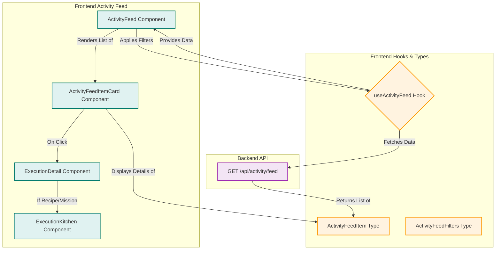

# 27.2. Activity Feed & Execution Detail

<details>
<summary>Relevant source files</summary>

The following files were used as context for generating this wiki page:

- [frontend/components/activity/__tests__/feed-progress-followup.test.ts](frontend/components/activity/__tests__/feed-progress-followup.test.ts)
- [frontend/components/activity/activity-feed-item.tsx](frontend/components/activity/activity-feed-item.tsx)
- [frontend/components/activity/activity-feed.tsx](frontend/components/activity/activity-feed.tsx)
- [frontend/components/activity/execution-detail.tsx](frontend/components/activity/execution-detail.tsx)
- [frontend/components/activity/routine-card.tsx](frontend/components/activity/routine-card.tsx)
- [frontend/components/activity/widgets/agent-reports-widget.tsx](frontend/components/activity/widgets/agent-reports-widget.tsx)
- [frontend/components/activity/widgets/recent-activity-widget.tsx](frontend/components/activity/widgets/recent-activity-widget.tsx)
- [frontend/components/shared/item-card.tsx](frontend/components/shared/item-card.tsx)
- [frontend/components/workspace/Canvas.tsx](frontend/components/workspace/Canvas.tsx)
- [frontend/components/workspace/WidgetTray.tsx](frontend/components/workspace/WidgetTray.tsx)
- [frontend/components/workspace/index.ts](frontend/components/workspace/index.ts)
- [frontend/hooks/use-activity-api.ts](frontend/hooks/use-activity-api.ts)
- [frontend/hooks/use-scheduled-tasks-api.ts](frontend/hooks/use-scheduled-tasks-api.ts)
- [orchestrator/alembic/versions/prd221_digest_feedback.py](orchestrator/alembic/versions/prd221_digest_feedback.py)
- [orchestrator/api/activity.py](orchestrator/api/activity.py)
- [orchestrator/modules/tools/discovery/actions_scheduling.py](orchestrator/modules/tools/discovery/actions_scheduling.py)
- [orchestrator/services/activity_service.py](orchestrator/services/activity_service.py)
- [orchestrator/services/digest_service.py](orchestrator/services/digest_service.py)
- [orchestrator/tests/test_ctx_actor_attribute.py](orchestrator/tests/test_ctx_actor_attribute.py)
- [orchestrator/tests/test_prd221_digest_feedback.py](orchestrator/tests/test_prd221_digest_feedback.py)
- [orchestrator/tests/test_prd221_digest_service.py](orchestrator/tests/test_prd221_digest_service.py)
- [orchestrator/tests/test_schedule_endpoint.py](orchestrator/tests/test_schedule_endpoint.py)

</details>


The Activity Feed and Execution Detail components provide a unified view of all agent and workflow activities within a workspace. This includes chats, routine executions (heartbeats), recipe (playbook) executions, and board tasks. The system aggregates these diverse activities into a single, sortable, and filterable feed, offering insights into the operational state of the AI ecosystem. Execution Detail provides an in-depth view of a specific activity, including its progress, logs, and associated agents.

## Activity Service & API

The backend functionality for the activity feed is primarily handled by the `ActivityService` [orchestrator/services/activity_service.py:67-73]() and exposed via the `/api/activity` FastAPI router [orchestrator/api/activity.py:29-30]().

### `ActivityService`

The `ActivityService` [orchestrator/services/activity_service.py:67-73]() is a request-scoped service that takes a SQLAlchemy `Session` and a `workspace_id`. Its main responsibilities include:

*   **`get_feed`**: Merges data from various sources (chats, routines, recipes, board tasks) into a unified activity feed. It supports filtering by type, status, and time period, as well as pagination.
*   **`get_stats`**: Provides hero-card statistics for the Activity Command Centre, such as currently working items, live channels, completed items, and items needing attention.
*   **`get_schedule`**: Retrieves upcoming scheduled routines, recipes, and board tasks for the calendar widget.
*   **`get_scheduler_health`**: Provides advisory health status for the scheduler.
*   **`get_agent_reports`**: Fetches the latest execution summaries for specified agents.

The `get_feed` method [orchestrator/services/activity_service.py:77-131]() is central to the activity feed. It queries different data sources:
*   `_fetch_chats` [orchestrator/services/activity_service.py:200-219]() retrieves `Chat` records.
*   `_fetch_routines` [orchestrator/services/activity_service.py:221-270]() retrieves agent heartbeat configurations (`Agent` records with `heartbeat` configuration).
*   `_fetch_recipes` [orchestrator/services/activity_service.py:272-321]() retrieves `RecipeExecution` records.
*   `_fetch_board_tasks` [orchestrator/services/activity_service.py:323-369]() retrieves `BoardTask` records.

After fetching, it merges these items, applies status filters, and sorts them by `started_at` in descending order. It also attaches `last_progress` information to run-linked items using a single bounded query to `orchestration_events` [orchestrator/services/activity_service.py:133-181]().

### Activity API Endpoints

The `orchestrator/api/activity.py` module defines the following endpoints:

*   **`GET /api/activity/feed`**: Returns the unified activity feed. It accepts query parameters for `type` (e.g., `chat`, `routine`, `recipe`), `status` (e.g., `working`, `done`, `attention`, `upcoming`), `period` (e.g., `7d`), `limit`, and `offset` [orchestrator/api/activity.py:32-67]().
*   **`GET /api/activity/digest`**: Provides a plain-English summary of the workspace, cached per (workspace, state\_hash) [orchestrator/api/activity.py:69-87]().
*   **`POST /api/activity/digest/feedback`**: Records user feedback (thumbs up/down) on a digest [orchestrator/api/activity.py:94-119]().
*   **`GET /api/activity/schedule`**: Returns upcoming scheduled routines and recipes for the calendar widget [orchestrator/api/activity.py:122-141]().
*   **`GET /api/activity/scheduler-health`**: Provides advisory scheduler health status [orchestrator/api/activity.py:144-158]().
*   **`GET /api/activity/agent-reports`**: Returns the latest execution summaries for pinned agents [orchestrator/api/activity.py:161-180]().
*   **`GET /api/activity/board/stats`**: Returns board-related statistics [orchestrator/api/activity.py:183-191]().

### Activity Feed Data Flow

The frontend interacts with these API endpoints using React Query hooks defined in `frontend/hooks/use-activity-api.ts`.

```mermaid
graph TD
    subgraph Frontend
        A[ActivityFeed Component] --> B{useActivityFeed Hook}
        C[ActivityStats Component] --> D{useActivityStats Hook}
        E[ActivitySchedule Component] --> F{useActivitySchedule Hook}
        G[AgentReportsWidget] --> H{useAgentReports Hook}
    end

    subgraph Backend
        I[FastAPI Router /api/activity]
        J[ActivityService]
        K[SQLAlchemy Session]
        L[PostgreSQL Database]
    end

    B -- GET /api/activity/feed --> I
    D -- GET /api/activity/stats --> I
    F -- GET /api/activity/schedule --> I
    H -- GET /api/activity/agent-reports --> I

    I -- Delegates to --> J
    J -- Queries --> K
    K -- Interacts with --> L

    L -- Data from --> M[Chat Table]
    L -- Data from --> N[Agent Table (Heartbeats)]
    L -- Data from --> O[RecipeExecution Table]
    L -- Data from --> P[BoardTask Table]
    L -- Data from --> Q[OrchestrationEvent Table]

    J -- Merges & Processes --> R[Unified Activity Feed Data]
    J -- Aggregates --> S[Activity Stats Data]
    J -- Calculates --> T[Scheduled Items Data]
    J -- Formats --> U[Agent Reports Data]

    R --> B
    S --> D
    T --> F
    U --> H
```

Title: Activity Feed Data Flow
Sources:
*   `orchestrator/services/activity_service.py`
*   `orchestrator/api/activity.py`
*   `frontend/hooks/use-activity-api.ts`

## Activity Feed & Items

The `ActivityFeed` component [frontend/components/activity/activity-feed.tsx:128-211]() is responsible for displaying the unified activity feed. It uses the `useActivityFeed` hook [frontend/hooks/use-activity-api.ts:158-186]() to fetch data from the backend.

Each item in the feed is represented by an `ActivityFeedItem` interface [frontend/hooks/use-activity-api.ts:31-58](), which includes fields like:
*   `id`: Unique identifier.
*   `type`: `chat`, `routine`, `recipe`, `mission`, or `task`.
*   `name`: Name of the activity.
*   `status`: `pending`, `running`, `completed`, `failed`, `cancelled`, `paused`.
*   `started_at`, `completed_at`, `duration_seconds`.
*   `agent`, `agents`: Associated agent(s).
*   `summary`: A brief description.
*   `source_id`, `source_url`: Links to the original source.
*   `trigger`: How the activity was initiated (e.g., `manual`, `scheduled`, `heartbeat`).
*   `channel`: For chat activities.
*   `step_progress`: For activities with multiple steps (e.g., recipes, missions).
*   `last_progress`: Latest plain-English progress line from orchestration events [frontend/hooks/use-activity-api.ts:51-56]().
*   `orchestration_run_id`: ID of the associated orchestration run.

The `ActivityFeed` component allows users to filter items by `type` and `status`, and paginate through the results. It also supports deep-linking to specific executions via URL parameters `openExecution` and `recipeId` [frontend/components/activity/activity-feed.tsx:175-207]().

Individual activity items are rendered using the `ActivityFeedItemCard` component [frontend/components/activity/activity-feed-item.tsx:208-447](). This component displays the item's type, name, status, summary, and relevant timestamps. It also provides actions like viewing the item or configuring its source.



Title: Activity Feed Frontend Architecture
Sources:
*   `frontend/components/activity/activity-feed.tsx`
*   `frontend/components/activity/activity-feed-item.tsx`
*   `frontend/hooks/use-activity-api.ts`

## Execution Detail

When an `ActivityFeedItem` is selected, the `ExecutionDetail` component [frontend/components/activity/execution-detail.tsx:1-588]() is displayed. This component provides a comprehensive view of a specific execution.

Key features of `ExecutionDetail` include:

*   **Header**: Displays the activity type, name, status, and duration.
*   **Summary**: Shows a brief summary of the execution.
*   **Agent Information**: Lists the agent(s) involved.
*   **Step Pipeline**: For multi-step activities (recipes, missions), it visualizes the progress through each step, indicating `pending`, `running`, `completed`, or `failed` states [frontend/components/activity/execution-detail.tsx:147-184]().
*   **Execution Log**: Provides a chronological log of events during the execution, including start, step completion, and errors [frontend/components/activity/execution-detail.tsx:187-220]().
*   **Action Buttons**: Allows re-running the execution or editing the associated recipe/agent.
*   **`ExecutionKitchen` Integration**: For recipe and mission executions, it dynamically loads the `ExecutionKitchen` component [frontend/components/activity/activity-feed.tsx:37-40](), which offers a more interactive and detailed view of the workflow, including streaming updates and sub-components like the "theater" view.

The `ExecutionDetail` component uses `TYPE_CONFIG` [frontend/components/activity/execution-detail.tsx:35-66]() and `STATUS_MAP` [frontend/components/activity/execution-detail.tsx:77-84]() to style and display information based on the activity type and status.

## Routine Cards

Routine cards are a specific type of activity feed item that represents agent heartbeats. The `RoutineCard` component [frontend/components/activity/routine-card.tsx:60-199]() displays information about a recurring agent activity.

Key aspects of `RoutineCard`:

*   **Heartbeat Configuration**: Displays the agent's name, prompt, interval, last run, and next scheduled run [frontend/components/activity/routine-card.tsx:94-117]().
*   **Status**: Shows whether the routine is `Active` or `Paused` [frontend/components/activity/routine-card.tsx:97-103]().
*   **Actions**: Allows users to `Pause`/`Resume` the routine and `Edit` the agent configuration [frontend/components/activity/routine-card.tsx:136-164]().
*   **Execution History**: When expanded, it fetches and displays a list of past heartbeat executions using `useHeartbeatExecutions` [frontend/components/activity/routine-card.tsx:66-67](), showing their status and timestamps [frontend/components/activity/routine-card.tsx:168-197]().

## Memory Cards

While not explicitly detailed as "Memory Cards" in the provided snippets, the `MemoryWidget` [frontend/components/workspace/index.ts:15]() is listed as a Phase 2 widget. This suggests that there are UI components designed to display and interact with the agent's memory, likely within the context of an execution detail or a dedicated memory explorer. These would visualize the different memory tiers (L0-L4) and the context assembled for an agent's operation.

## Reports Viewer and Grading

The `AgentReportsWidget` [frontend/components/activity/widgets/agent-reports-widget.tsx:185-301]() displays summaries of agent reports. This widget allows users to pin specific agents and view their latest execution summaries.

Key features:

*   **Pinned Agents**: Users can pin up to `MAX_PINNED` (12) agents to monitor their reports [frontend/components/activity/widgets/agent-reports-widget.tsx:30-45]().
*   **Report Card**: Each `ReportCard` [frontend/components/activity/widgets/agent-reports-widget.tsx:60-115]() shows the agent's name, icon, status of its last report, a summary, and the time since the last run.
*   **View Report Action**: Clicking "View Report" navigates to the deliverables explorer if a `latest_file_path` is available, or to the board tab if an `agent_id` is present [frontend/components/activity/widgets/agent-reports-widget.tsx:68-73]().
*   **Status Configuration**: `STATUS_CONFIG` [frontend/components/activity/widgets/agent-reports-widget.tsx:53-58]() defines icons and colors for different report statuses (`completed`, `failed`, `no_data`, `error`).

The concept of "grading" reports is not explicitly covered in the provided code snippets, but the presence of `DigestFeedback` model [orchestrator/api/activity.py:89-91]() and the `submit_digest_feedback` endpoint [orchestrator/api/activity.py:94-119]() suggests a mechanism for users to provide feedback on generated content, which could be extended to grading agent reports or summaries.

Sources:
*   `orchestrator/services/activity_service.py`
*   `orchestrator/api/activity.py`
*   `frontend/hooks/use-activity-api.ts`
*   `frontend/components/activity/activity-feed.tsx`
*   `frontend/components/activity/activity-feed-item.tsx`
*   `frontend/components/activity/execution-detail.tsx`
*   `frontend/components/activity/routine-card.tsx`
*   `frontend/components/activity/widgets/agent-reports-widget.tsx`
*   `frontend/components/workspace/index.ts`

---