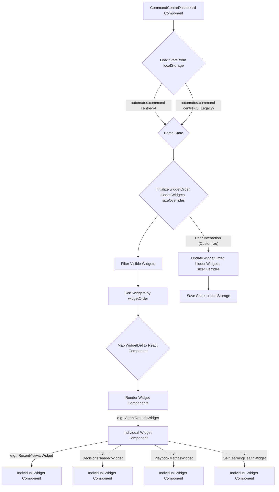
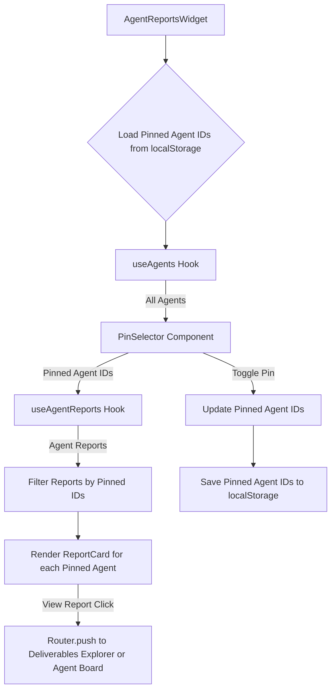
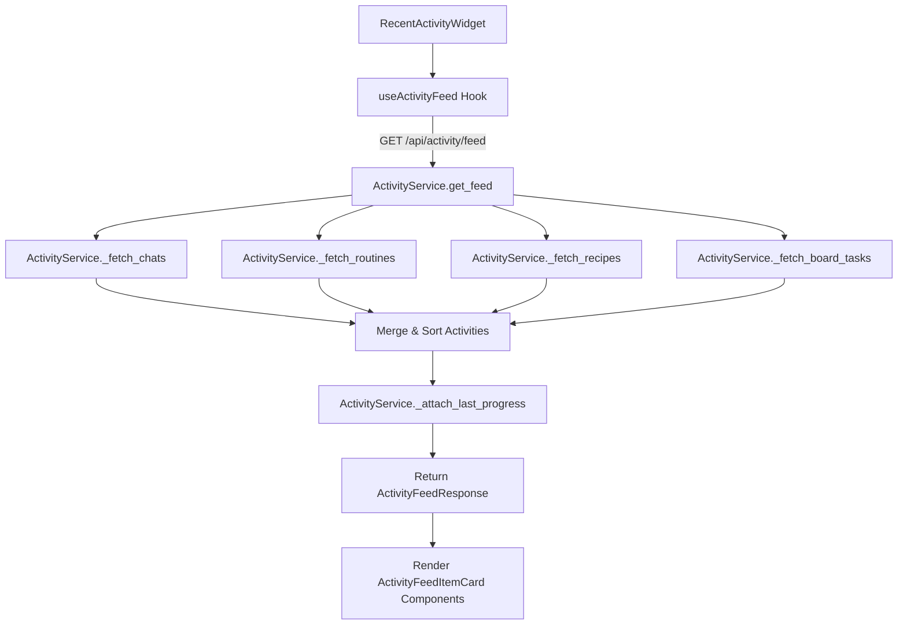
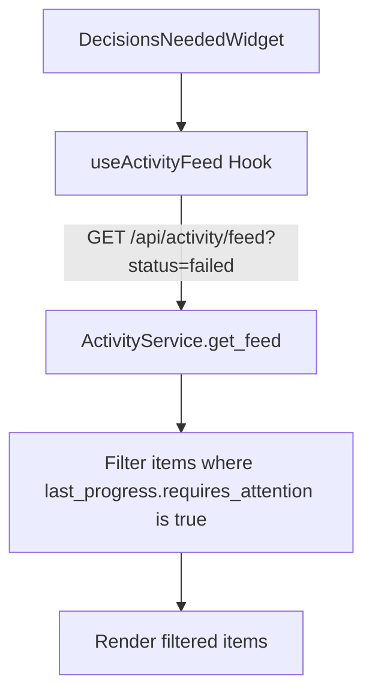
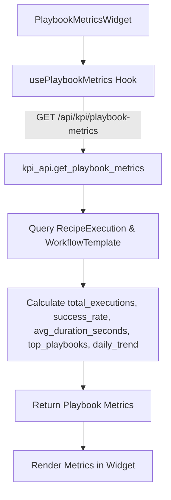
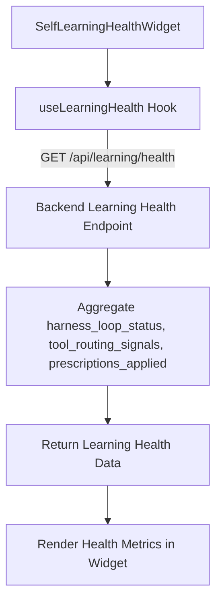

# Dashboard Widgets

Relevant source files

The following files were used as context for generating this wiki page:

- [frontend/app/layout.tsx](frontend/app/layout.tsx)
- [frontend/components/activity/__tests__/feed-progress-followup.test.ts](frontend/components/activity/__tests__/feed-progress-followup.test.ts)
- [frontend/components/activity/activity-feed-item.tsx](frontend/components/activity/activity-feed-item.tsx)
- [frontend/components/activity/activity-feed.tsx](frontend/components/activity/activity-feed.tsx)
- [frontend/components/activity/execution-detail.tsx](frontend/components/activity/execution-detail.tsx)
- [frontend/components/activity/routine-card.tsx](frontend/components/activity/routine-card.tsx)
- [frontend/components/activity/widgets/agent-reports-widget.tsx](frontend/components/activity/widgets/agent-reports-widget.tsx)
- [frontend/components/activity/widgets/command-centre-dashboard.tsx](frontend/components/activity/widgets/command-centre-dashboard.tsx)
- [frontend/components/activity/widgets/decisions-needed-widget.tsx](frontend/components/activity/widgets/decisions-needed-widget.tsx)
- [frontend/components/activity/widgets/playbook-metrics-widget.tsx](frontend/components/activity/widgets/playbook-metrics-widget.tsx)
- [frontend/components/activity/widgets/recent-activity-widget.tsx](frontend/components/activity/widgets/recent-activity-widget.tsx)
- [frontend/components/activity/widgets/self-learning-health-widget.tsx](frontend/components/activity/widgets/self-learning-health-widget.tsx)
- [frontend/components/shared/item-card.tsx](frontend/components/shared/item-card.tsx)
- [frontend/hooks/use-activity-api.ts](frontend/hooks/use-activity-api.ts)
- [frontend/hooks/use-kpi-api.ts](frontend/hooks/use-kpi-api.ts)
- [frontend/hooks/use-learning-api.ts](frontend/hooks/use-learning-api.ts)
- [frontend/hooks/use-scheduled-tasks-api.ts](frontend/hooks/use-scheduled-tasks-api.ts)
- [orchestrator/api/kpi_api.py](orchestrator/api/kpi_api.py)
- [orchestrator/core/services/auto_reporting.py](orchestrator/core/services/auto_reporting.py)
- [orchestrator/core/services/notification_dispatcher.py](orchestrator/core/services/notification_dispatcher.py)
- [orchestrator/modules/memory/tool_outcome_capture.py](orchestrator/modules/memory/tool_outcome_capture.py)
- [orchestrator/modules/tools/discovery/actions_auto_reporting.py](orchestrator/modules/tools/discovery/actions_auto_reporting.py)
- [orchestrator/modules/tools/discovery/actions_scheduling.py](orchestrator/modules/tools/discovery/actions_scheduling.py)
- [orchestrator/modules/tools/discovery/handlers_auto_reporting.py](orchestrator/modules/tools/discovery/handlers_auto_reporting.py)
- [orchestrator/services/activity_service.py](orchestrator/services/activity_service.py)
- [orchestrator/tests/test_p2w2_ask_notification.py](orchestrator/tests/test_p2w2_ask_notification.py)
- [orchestrator/tests/test_schedule_endpoint.py](orchestrator/tests/test_schedule_endpoint.py)
- [orchestrator/tests/test_tool_outcome_capture.py](orchestrator/tests/test_tool_outcome_capture.py)

This page details the implementation and data flow for the various dashboard widgets displayed in the Command Center. These widgets provide a quick overview of system activity, agent performance, and operational health. The widgets covered include `command-centre-dashboard`, `agent-reports`, `recent-activity`, `decisions-needed`, `playbook-metrics`, and `self-learning-health`.

## Command Center Dashboard (`command-centre-dashboard`)

The Command Center Dashboard is the central hub for operational oversight, displaying a collection of configurable widgets. It allows users to customize the layout, visibility, and size of these widgets.

### Implementation Details

The dashboard is implemented in the `CommandCentreDashboard` React component [frontend/components/activity/widgets/command-centre-dashboard.tsx:110-115](). It manages the state for widget order, hidden widgets, and size overrides using `localStorage` for persistence [frontend/components/activity/widgets/command-centre-dashboard.tsx:80-107]().

The `WIDGET_REGISTRY` [frontend/components/activity/widgets/command-centre-dashboard.tsx:52-72]() defines all available widgets, their default visibility, size, and associated icons.

- `widgetOrder`: An array of widget IDs determining the display order.
- `hiddenWidgets`: An array of widget IDs that are currently hidden.
- `sizeOverrides`: An object mapping widget IDs to their `WidgetSize` (e.g., 'half', 'full').

The `loadState()` and `saveState()` functions handle reading from and writing to `localStorage` using the key `automatos:command-centre-v4` [frontend/components/activity/widgets/command-centre-dashboard.tsx:82-82](). A legacy key `automatos:command-centre-v3` is also checked for backward compatibility [frontend/components/activity/widgets/command-centre-dashboard.tsx:94-94]().

### Widget Rendering

Each widget defined in `WIDGET_REGISTRY` is dynamically rendered based on its visibility and order. The `SIZE_TO_SPAN` mapping [frontend/components/activity/widgets/command-centre-dashboard.tsx:33-37]() translates `WidgetSize` values into Tailwind CSS grid column spans for responsive layout.

Sources:
- [frontend/components/activity/widgets/command-centre-dashboard.tsx:33-37]()
- [frontend/components/activity/widgets/command-centre-dashboard.tsx:52-72]()
- [frontend/components/activity/widgets/command-centre-dashboard.tsx:80-107]()
- [frontend/components/activity/widgets/command-centre-dashboard.tsx:82-82]()
- [frontend/components/activity/widgets/command-centre-dashboard.tsx:94-94]()
- [frontend/components/activity/widgets/command-centre-dashboard.tsx:110-115]()

## Agent Reports Widget (`agent-reports`)

The Agent Reports widget displays the latest reports from selected agents, providing a quick summary of their recent activities and status.

### Implementation Details

The `AgentReportsWidget` component [frontend/components/activity/widgets/agent-reports-widget.tsx:185-187]() is responsible for rendering this widget. It uses `localStorage` to store and retrieve a list of `pinnedIds` [frontend/components/activity/widgets/agent-reports-widget.tsx:30-45](), allowing users to select which agents' reports they want to see.

It leverages the `useAgentReports` hook [frontend/components/activity/widgets/agent-reports-widget.tsx:200-200]() to fetch agent reports and `useAgents` [frontend/components/activity/widgets/agent-reports-widget.tsx:195-195]() to get a list of all available agents for pinning.

The `ReportCard` component [frontend/components/activity/widgets/agent-reports-widget.tsx:60-60]() displays individual agent reports, including the agent's name, icon, status, summary, and last run time. It also provides a link to view the full report in the deliverables explorer or navigate to the agent's board tasks [frontend/components/activity/widgets/agent-reports-widget.tsx:68-74]().

Sources:
- [frontend/components/activity/widgets/agent-reports-widget.tsx:30-45]()
- [frontend/components/activity/widgets/agent-reports-widget.tsx:60-60]()
- [frontend/components/activity/widgets/agent-reports-widget.tsx:68-74]()
- [frontend/components/activity/widgets/agent-reports-widget.tsx:185-187]()
- [frontend/components/activity/widgets/agent-reports-widget.tsx:195-195]()
- [frontend/components/activity/widgets/agent-reports-widget.tsx:200-200]()

## Recent Activity Widget (`recent-activity`)

The Recent Activity widget displays a unified feed of recent events, including chats, routine executions, recipe executions, and board tasks.

### Implementation Details

The `RecentActivityWidget` component [frontend/components/activity/widgets/recent-activity-widget.tsx:10-12]() uses the `useActivityFeed` hook [frontend/components/activity/widgets/recent-activity-widget.tsx:16-16]() to fetch activity data. This hook, defined in `use-activity-api.ts` [frontend/hooks/use-activity-api.ts:158-186](), makes an API call to `/api/activity/feed` [frontend/hooks/use-activity-api.ts:178-178]().

The backend `ActivityService` [orchestrator/services/activity_service.py:67-73]() is responsible for aggregating data from various sources:
- `_fetch_chats()`: Retrieves chat messages.
- `_fetch_routines()`: Fetches agent heartbeat executions.
- `_fetch_recipes()`: Gathers recipe (playbook) executions.
- `_fetch_board_tasks()`: Includes board task activities.

These items are merged, sorted by `started_at` timestamp, and paginated [orchestrator/services/activity_service.py:116-126](). The `_attach_last_progress` method [orchestrator/services/activity_service.py:133-180]() enriches each item with the latest orchestration event for a plain-English progress line.

The frontend then renders these items using `ActivityFeedItemCard` components [frontend/components/activity/activity-feed-item.tsx:208-214]().

Sources:
- [frontend/components/activity/activity-feed-item.tsx:208-214]()
- [frontend/components/activity/widgets/recent-activity-widget.tsx:10-12]()
- [frontend/components/activity/widgets/recent-activity-widget.tsx:16-16]()
- [frontend/hooks/use-activity-api.ts:158-186]()
- [frontend/hooks/use-activity-api.ts:178-178]()
- [orchestrator/services/activity_service.py:67-73]()
- [orchestrator/services/activity_service.py:116-126]()
- [orchestrator/services/activity_service.py:133-180]()

## Decisions Needed Widget (`decisions-needed`)

The Decisions Needed widget highlights items requiring human attention or approval.

### Implementation Details

The `DecisionsNeededWidget` component [frontend/components/activity/widgets/decisions-needed-widget.tsx:10-12]() fetches data using the `useActivityFeed` hook [frontend/components/activity/widgets/decisions-needed-widget.tsx:16-16](), specifically filtering for items with a 'failed' status and `requires_attention: true` in their `last_progress` field.

The `ActivityService` backend populates the `last_progress` field [orchestrator/services/activity_service.py:176-180]() based on orchestration events, indicating if an event type requires attention. This allows the frontend to quickly identify and display critical items.

Sources:
- [frontend/components/activity/widgets/decisions-needed-widget.tsx:10-12]()
- [frontend/components/activity/widgets/decisions-needed-widget.tsx:16-16]()
- [orchestrator/services/activity_service.py:176-180]()

## Playbook Metrics Widget (`playbook-metrics`)

The Playbook Metrics widget provides key performance indicators for playbooks, such as success rates and execution trends.

### Implementation Details

The `PlaybookMetricsWidget` component [frontend/components/activity/widgets/playbook-metrics-widget.tsx:10-12]() utilizes the `usePlaybookMetrics` hook [frontend/components/activity/widgets/playbook-metrics-widget.tsx:16-16]() to retrieve data. This hook queries the `/api/kpi/playbook-metrics` endpoint.

The backend endpoint `get_playbook_metrics` [orchestrator/api/kpi_api.py:205-207]() calculates:
- `total_executions`: Total number of playbook executions within the specified period.
- `success_rate`: Percentage of successful executions.
- `avg_duration_seconds`: Average duration of successful executions.
- `top_playbooks`: A list of the top 3 playbooks by execution count.
- `daily_trend`: Daily execution counts for the period.

These metrics are derived from the `RecipeExecution` and `WorkflowTemplate` models [orchestrator/api/kpi_api.py:22-25]() in the database.

Sources:
- [frontend/components/activity/widgets/playbook-metrics-widget.tsx:10-12]()
- [frontend/components/activity/widgets/playbook-metrics-widget.tsx:16-16]()
- [orchestrator/api/kpi_api.py:22-25]()
- [orchestrator/api/kpi_api.py:205-207]()

## Self-Learning Health Widget (`self-learning-health`)

The Self-Learning Health widget provides insights into the health and effectiveness of the system's self-learning mechanisms.

### Implementation Details

The `SelfLearningHealthWidget` component [frontend/components/activity/widgets/self-learning-health-widget.tsx:10-12]() fetches its data using the `useLearningHealth` hook [frontend/components/activity/widgets/self-learning-health-widget.tsx:16-16](). This hook queries the `/api/learning/health` endpoint.

The backend `get_learning_health` endpoint (not fully provided in the snippets, but implied by the hook) would typically aggregate data related to:
- `harness_loop_status`: Status of the self-learning harness loop.
- `tool_routing_signals`: Metrics on tool routing decisions and corrections.
- `prescriptions_applied`: Number of learning-driven adjustments made.

This widget is designed to surface information about the system's ability to adapt and improve over time, as mentioned in PRD-142 Wave 4 (W4-S16) [frontend/components/activity/widgets/command-centre-dashboard.tsx:70-71]().

Sources:
- [frontend/components/activity/widgets/command-centre-dashboard.tsx:70-71]()
- [frontend/components/activity/widgets/self-learning-health-widget.tsx:10-12]()
- [frontend/components/activity/widgets/self-learning-health-widget.tsx:16-16]()

---