# Community Marketplace

<details>
<summary>Relevant source files</summary>

The following files were used as context for generating this wiki page:

- [frontend/components/marketplace/marketplace-agents-tab.tsx](frontend/components/marketplace/marketplace-agents-tab.tsx)
- [frontend/components/marketplace/marketplace-card.tsx](frontend/components/marketplace/marketplace-card.tsx)
- [frontend/components/marketplace/marketplace-grid.tsx](frontend/components/marketplace/marketplace-grid.tsx)
- [frontend/components/marketplace/marketplace-homepage.tsx](frontend/components/marketplace/marketplace-homepage.tsx)
- [frontend/components/marketplace/marketplace-item-modal.tsx](frontend/components/marketplace/marketplace-item-modal.tsx)
- [frontend/components/marketplace/marketplace-llms-tab.tsx](frontend/components/marketplace/marketplace-llms-tab.tsx)
- [frontend/components/marketplace/marketplace-recipes-tab.tsx](frontend/components/marketplace/marketplace-recipes-tab.tsx)
- [frontend/components/marketplace/marketplace-tools-tab.tsx](frontend/components/marketplace/marketplace-tools-tab.tsx)
- [frontend/lib/agent-constants.ts](frontend/lib/agent-constants.ts)
- [orchestrator/api/marketplace.py](orchestrator/api/marketplace.py)
- [orchestrator/scripts/seed_llm_marketplace.py](orchestrator/scripts/seed_llm_marketplace.py)

</details>


The Community Marketplace enables users to discover, install, and publish reusable components including agents, recipes (workflows), LLM models, tools, plugins, and skills. Items published to the marketplace can be installed into any workspace, promoting sharing and collaboration across the platform. The marketplace implements an approval-based publishing workflow with install tracking, version management, and automatic dependency cloning.

This document covers the marketplace browsing UI, installation flow, publishing workflow, and backend architecture. For information about tool integration after installation, see [Tools & Integrations](#6). For recipe execution after installation, see [Workflows & Recipes](#4). For agent configuration after installation, see [Agents](#3).

---

## System Architecture

The marketplace operates as a shared catalog layer that sits above workspace-level resources. Items exist in one of two ownership states: `owner_type='marketplace'` (shared, approved items) or `owner_type='workspace'` (private workspace items). When a user installs a marketplace item, the system clones it into their workspace with ownership transfer.

### Data Model

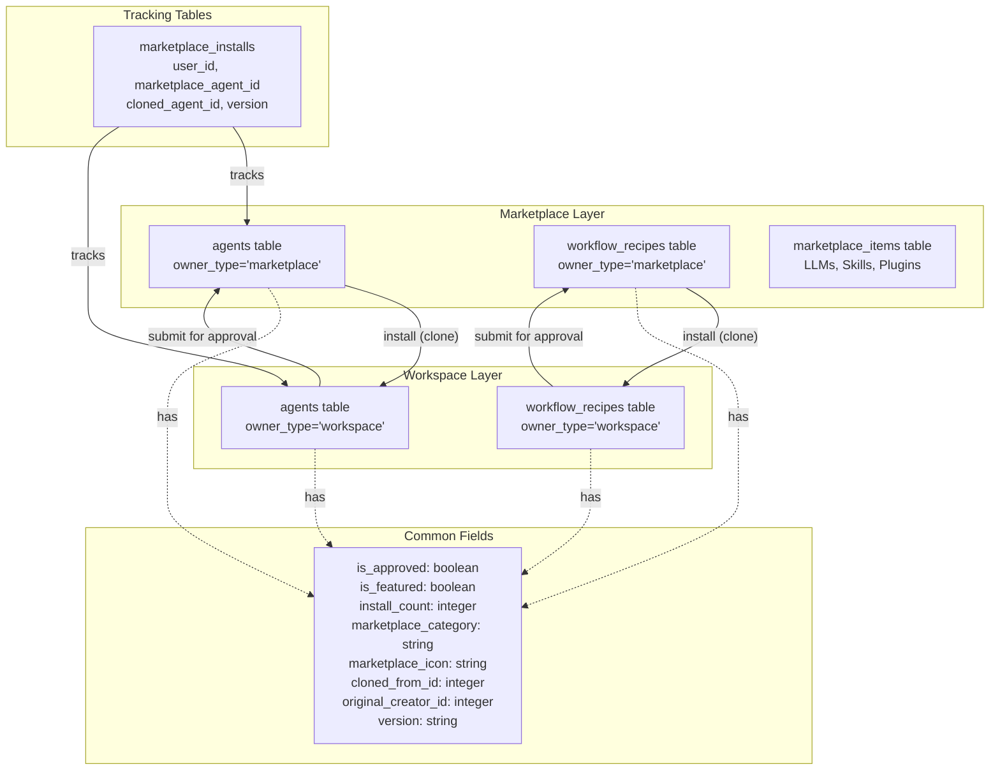

**Sources:** [orchestrator/api/marketplace.py:1-309](), [frontend/components/marketplace/marketplace-homepage.tsx:21-36]()

### Key Database Fields

| Field | Type | Purpose |
|-------|------|---------|
| `owner_type` | `enum('marketplace', 'workspace')` | Determines if item is shared or private |
| `is_approved` | `boolean` | Whether marketplace submission is approved |
| `is_featured` | `boolean` | Featured items shown on homepage |
| `install_count` | `integer` | Incremented on each installation |
| `marketplace_category` | `string` | Category for filtering (e.g., 'Personal Assistant', 'DevOps') |
| `marketplace_icon` | `string` | Icon/emoji for visual identification |
| `cloned_from_id` | `integer` | References original marketplace item |
| `original_creator_id` | `integer` | User who created the original item |
| `version` | `string` | Semantic version (e.g., '1.0.0') |

**Sources:** [orchestrator/api/marketplace.py:53-80](), [orchestrator/api/marketplace.py:510-535]()

---

## Browsing & Discovery

### Frontend Architecture

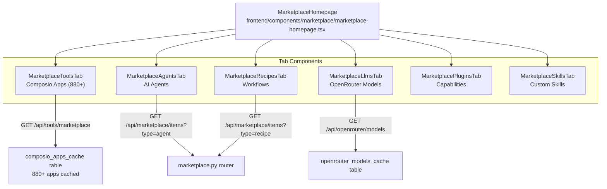

**Sources:** [frontend/components/marketplace/marketplace-homepage.tsx:38-167](), [frontend/components/marketplace/marketplace-tools-tab.tsx:74-565]()

### Filtering & Search

Each tab implements client-side and server-side filtering:

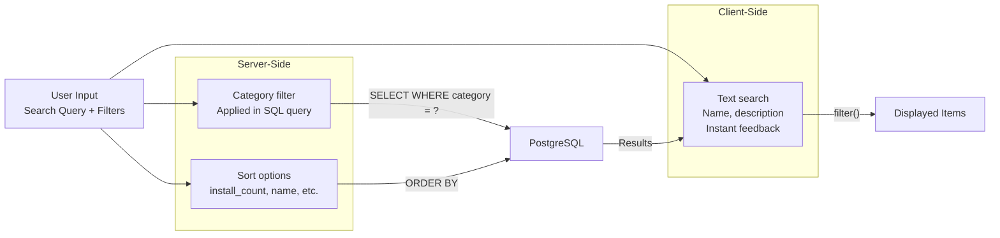

**Example: Agent Category Filtering**

```typescript
// frontend/components/marketplace/marketplace-agents-tab.tsx:155-172
const AGENT_CATEGORIES = [
  { id: 'all', name: 'All Categories' },
  { id: 'Personal Assistant', name: 'Personal Assistant' },
  { id: 'Customer Support', name: 'Customer Support' },
  { id: 'DevOps', name: 'DevOps' },
  // ...
]
```

The backend filters by `marketplace_category`:

```python
# orchestrator/api/marketplace.py:160-167
if category:
    agent_query = agent_query.filter(Agent.marketplace_category == category)

if search:
    agent_query = agent_query.filter(or_(
        Agent.name.ilike(f'%{search}%'),
        Agent.description.ilike(f'%{search}%')
    ))
```

**Sources:** [frontend/components/marketplace/marketplace-agents-tab.tsx:26-39](), [orchestrator/api/marketplace.py:122-309]()

### View Modes

Users can toggle between **list** (compact) and **grid** (detailed) views. The view mode preference is stored per-tab using the `useViewMode` hook with keys like `'mp-agents'`, `'mp-recipes'`, etc.

| View Mode | Layout | Use Case |
|-----------|--------|----------|
| List | 3-column grid, compact cards | Quick browsing, high density |
| Grid | 4-column grid, detailed cards | Exploring features, visual comparison |

**Sources:** [frontend/components/marketplace/marketplace-agents-tab.tsx:86-237](), [frontend/hooks/use-view-mode.ts]()

---

## Installing Items

### Installation Flow

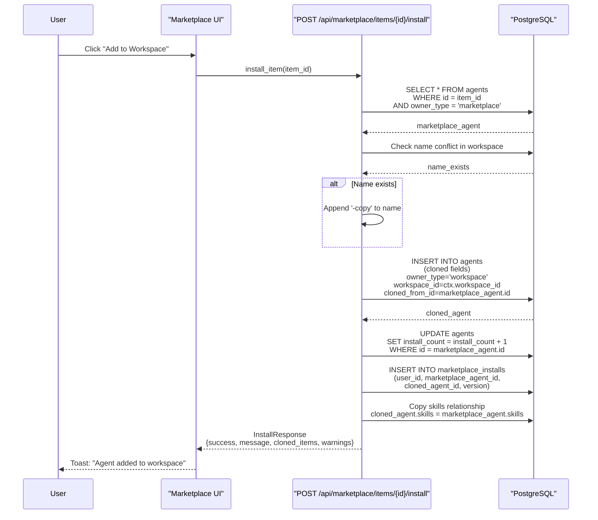

**Sources:** [orchestrator/api/marketplace.py:468-581]()

### Clone Operation Details

When installing an agent, the system performs the following:

1. **Field Cloning:** All configuration fields are copied (name, description, agent_type, configuration, model_config, tags, status)
2. **Ownership Transfer:** 
   - `owner_type` → `'workspace'`
   - `owner_id` → `workspace_id`
   - `workspace_id` → `ctx.workspace_id`
   - `created_by_user_id` → current user's database ID
3. **Tracking Fields:**
   - `cloned_from_id` → marketplace agent ID
   - `original_creator_id` → preserved from marketplace agent
4. **Reset Fields:**
   - `is_approved` → `True` (no re-approval needed in workspace)
   - `is_featured` → `False`
   - `install_count` → `0`
5. **Relationship Copying:** Skills are copied via relationship (`cloned_agent.skills = marketplace_agent.skills`)

**Name Conflict Resolution:**

```python
# orchestrator/api/marketplace.py:502-508
name_exists = db.query(Agent).filter(
    Agent.name == marketplace_agent.name,
    Agent.workspace_id == ctx.workspace_id,
    Agent.owner_type == 'workspace'
).first() is not None

agent_name = f"{marketplace_agent.name}-copy" if name_exists else marketplace_agent.name
```

**Sources:** [orchestrator/api/marketplace.py:510-566]()

### Recipe Installation with Dependency Handling

Recipe installation is more complex due to step-level agent dependencies:

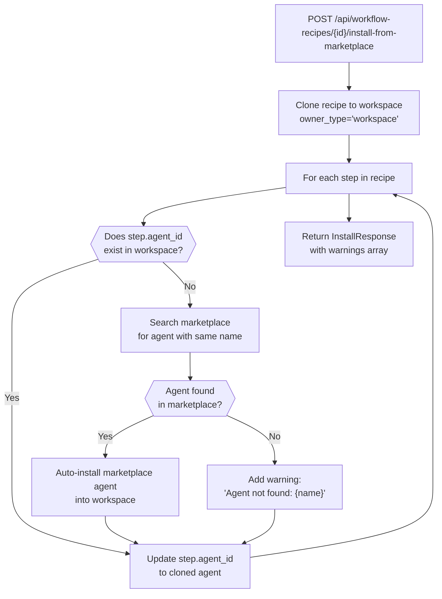

The recipe installation endpoint attempts to auto-resolve agent dependencies by searching the marketplace for agents with matching names and automatically installing them.

**Sources:** [frontend/components/marketplace/marketplace-recipes-tab.tsx:98-132](), [orchestrator/api/workflow_recipes.py]()

---

## Publishing to Marketplace

### Submission Flow

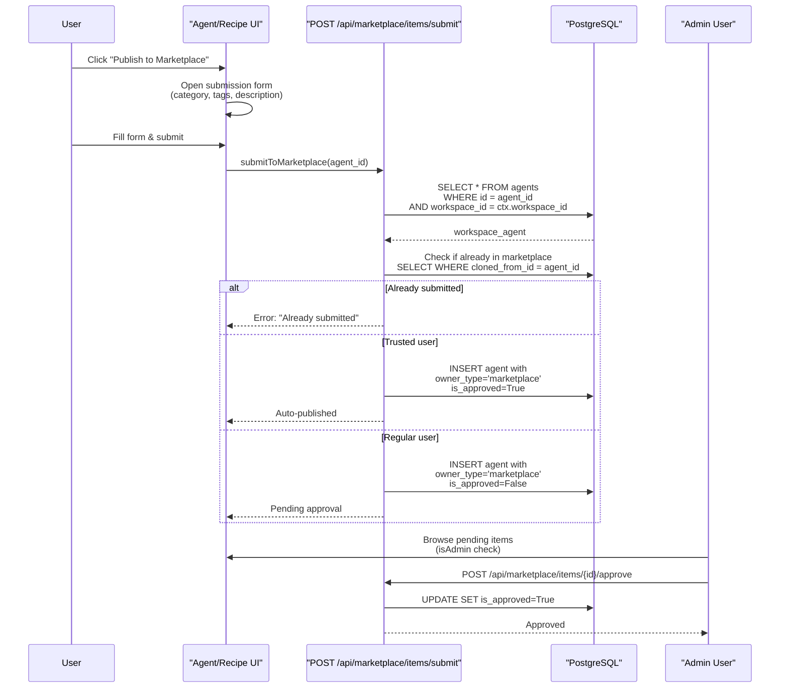

**Sources:** [orchestrator/api/marketplace.py:699-871]()

### Admin Role Check

Admin access is determined by email domain:

```python
# orchestrator/api/marketplace.py:36-46
def is_admin(ctx: RequestContext) -> bool:
    """Check whether the current user has admin privileges."""
    if not ctx.user:
        return False
    return getattr(ctx.user, 'system_role', 'user') == 'admin'
```

Corresponding frontend check:

```typescript
// frontend/components/marketplace/marketplace-agents-tab.tsx:92-93
const isAdmin = user?.emailAddresses?.[0]?.emailAddress?.includes('automatos.app') || false
```

**Sources:** [orchestrator/api/marketplace.py:36-46](), [frontend/components/marketplace/marketplace-agents-tab.tsx:92-93]()

### Submission Payload

```typescript
interface SubmitRequest {
  item_type: string           // 'agent', 'recipe', etc.
  name?: string               // Optional override (uses item's name if not provided)
  description?: string        // Optional override
  category?: string           // marketplace_category
  tags: string[]             // Searchable tags
  metadata: Record<string, any>  // Additional metadata
}
```

**Sources:** [orchestrator/api/marketplace.py:100-107]()

### Trusted User Auto-Publish

The system supports auto-publishing for trusted users without requiring approval. This is implemented by checking a user-level `is_trusted` flag:

```python
# orchestrator/api/marketplace.py:750-755
is_trusted = getattr(ctx.user, 'is_trusted', False)

if is_trusted:
    # Auto-approve trusted user submissions
    is_approved = True
```

**Sources:** [orchestrator/api/marketplace.py:699-871]()

---

## Item Types

### Agents

Marketplace agents are cloned from the `agents` table with `owner_type='marketplace'`. Each agent card displays:

- **Name & Icon:** Agent name with category-based icon
- **Creator:** `original_creator_id` mapped to user email
- **Category:** `marketplace_category` (e.g., 'Personal Assistant', 'DevOps')
- **Tools Preview:** First 5 assigned tools with logos (from `agent_tool_assignments` join)
- **Model Badge:** Primary LLM model (e.g., 'gpt-4o', 'claude-3.5-sonnet')
- **Install Count:** Total installations across all workspaces

**Agent Detail Modal:**

When viewing agent details, the system fetches extended information including:
- Full LLM configuration (provider, model, temperature, max_tokens, context_window)
- Assigned skills with descriptions
- Assigned tools with Composio metadata (logos, descriptions)
- Capabilities and recommended use cases

**Sources:** [frontend/components/marketplace/marketplace-agents-tab.tsx:84-368](), [frontend/components/marketplace/marketplace-item-modal.tsx:26-338](), [orchestrator/api/marketplace.py:355-428]()

### Recipes (Workflows)

Recipes display step count, unique agent count, and install metrics:

```typescript
// frontend/components/marketplace/marketplace-recipes-tab.tsx:218-223
<span>{recipe.steps?.length || 0} Steps</span>
<span>&middot;</span>
<span>{recipe.steps ? new Set(recipe.steps.map((s: any) => s.agent_id)).size : 0} Agents</span>
<span>&middot;</span>
<span>{recipe.install_count || 0} installs</span>
```

Recipe cards include:
- **Steps:** Array of step definitions with agent assignments
- **Category:** `marketplace_category`
- **Inputs/Outputs:** Schema definitions
- **Execution Config:** Error handling, timeouts, priorities
- **Schedule Config:** Cron expressions for automation

**Sources:** [frontend/components/marketplace/marketplace-recipes-tab.tsx:28-344](), [orchestrator/api/marketplace.py:430-461]()

### Tools (Composio Apps)

The marketplace tools tab displays Composio apps from the cached metadata:

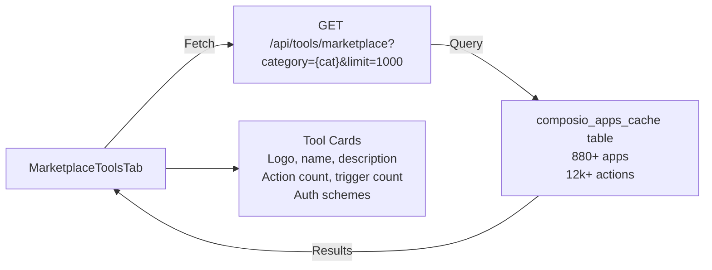

Unlike agents and recipes, tools are not cloned. Instead, the "Add to Workspace" button creates an entry in `workspace_tools` table marking the app as available for agent assignment.

**Add to Workspace Flow:**

```typescript
// frontend/components/marketplace/marketplace-tools-tab.tsx:253-306
const handleAddToWorkspace = async (app: ComposioApp) => {
  const result = await apiClient.post('/api/tools/add-to-workspace', {
    app_name: app.name,
  })
  
  // Status can be 'added' or 'already_added'
  if (result.status === 'already_added') {
    toast({ title: 'Already in Workspace' })
  } else {
    toast({ title: 'Added to Workspace', 
           description: 'Go to Tools > Applications to connect it.' })
  }
}
```

**Sources:** [frontend/components/marketplace/marketplace-tools-tab.tsx:74-565](), [orchestrator/api/tools.py]()

### LLMs (OpenRouter Models)

The LLM marketplace tab displays models from the `openrouter_models_cache` table:

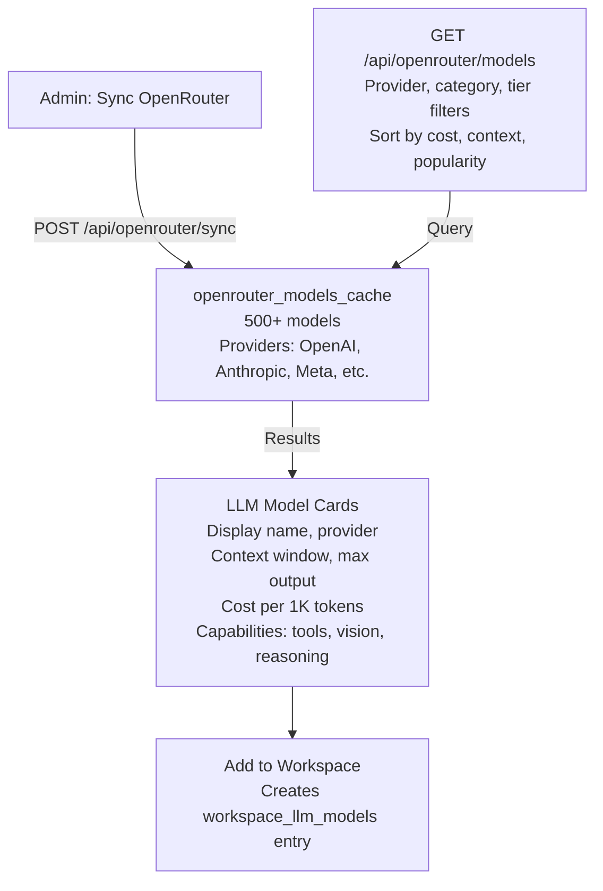

**Capability Filters:**

Users can filter by:
- **Tools:** `supports_tools=true` (function calling)
- **Vision:** `supports_vision=true` (image input)
- **Reasoning:** `supports_reasoning=true` (chain-of-thought)

**Sources:** [frontend/components/marketplace/marketplace-llms-tab.tsx:159-653](), [orchestrator/api/openrouter.py]()

### Plugins (Capabilities)

Plugins represent pre-configured capability sets that can be assigned to agents. They are stored in the `plugins` table with `owner_type='marketplace'`.

Examples:
- Code Analysis Plugin (code_review, security_scan)
- Data Analysis Plugin (data_visualization, statistical_analysis)
- Content Creation Plugin (copywriting, seo_optimization)

**Sources:** [frontend/components/marketplace/marketplace-plugins-tab.tsx]()

### Skills

Skills are reusable code modules stored in the `skills` table. Marketplace skills have `owner_type='marketplace'` and can be attached to agents via the `agent_skills` junction table.

Skill types include:
- `code_execution` - Python/JavaScript code
- `api_integration` - HTTP client wrappers
- `data_processing` - ETL functions
- `custom` - User-defined logic

**Sources:** [frontend/components/marketplace/marketplace-skills-tab.tsx](), [orchestrator/core/models/core.py]()

---

## Install Tracking & Analytics

### Tracking Tables

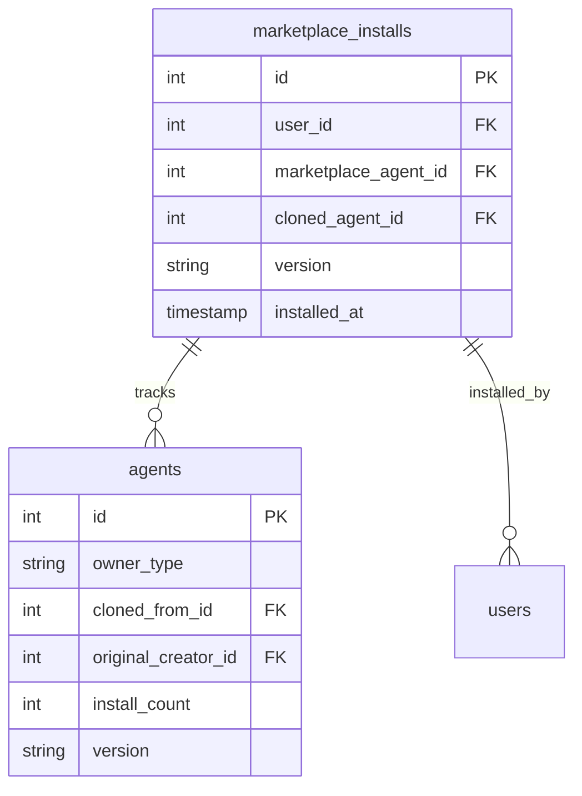

### Install Count Increment

Every successful installation increments the marketplace item's `install_count`:

```python
# orchestrator/api/marketplace.py:551
marketplace_agent.install_count += 1
```

This provides social proof metrics displayed on cards:

```typescript
// frontend/components/marketplace/marketplace-agents-tab.tsx:145-149
const formatInstallCount = (count: number) => {
  if (count >= 1000000) return `${(count / 1000000).toFixed(1)}M`
  if (count >= 1000) return `${(count / 1000).toFixed(1)}k`
  return count.toString()
}
```

**Sources:** [orchestrator/api/marketplace.py:551-565](), [frontend/components/marketplace/marketplace-agents-tab.tsx:145-149]()

---

## Updates & Versioning

### Version Comparison

The system tracks which version was installed and compares it to the latest marketplace version:

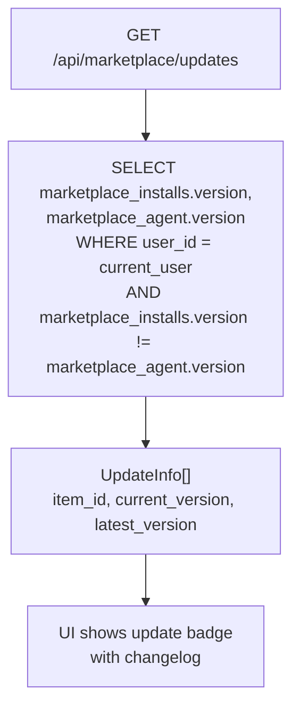

**Update Response:**

```typescript
interface UpdateInfo {
  item_id: number
  item_name: string
  item_type: string
  current_version: string      // Version installed in workspace
  latest_version: string        // Latest marketplace version
  changelog: string
}
```

**Sources:** [orchestrator/api/marketplace.py:645-696]()

### Semantic Versioning

Version strings follow semantic versioning (e.g., `"1.2.3"`):
- **Major:** Breaking changes (agent behavior fundamentally different)
- **Minor:** New features (added tools, skills)
- **Patch:** Bug fixes (prompt improvements, config tweaks)

When publishing updates to marketplace items, creators should increment the version appropriately.

**Sources:** [orchestrator/api/marketplace.py:109-115]()

---

## Multi-Tenancy & Ownership

### Ownership Model

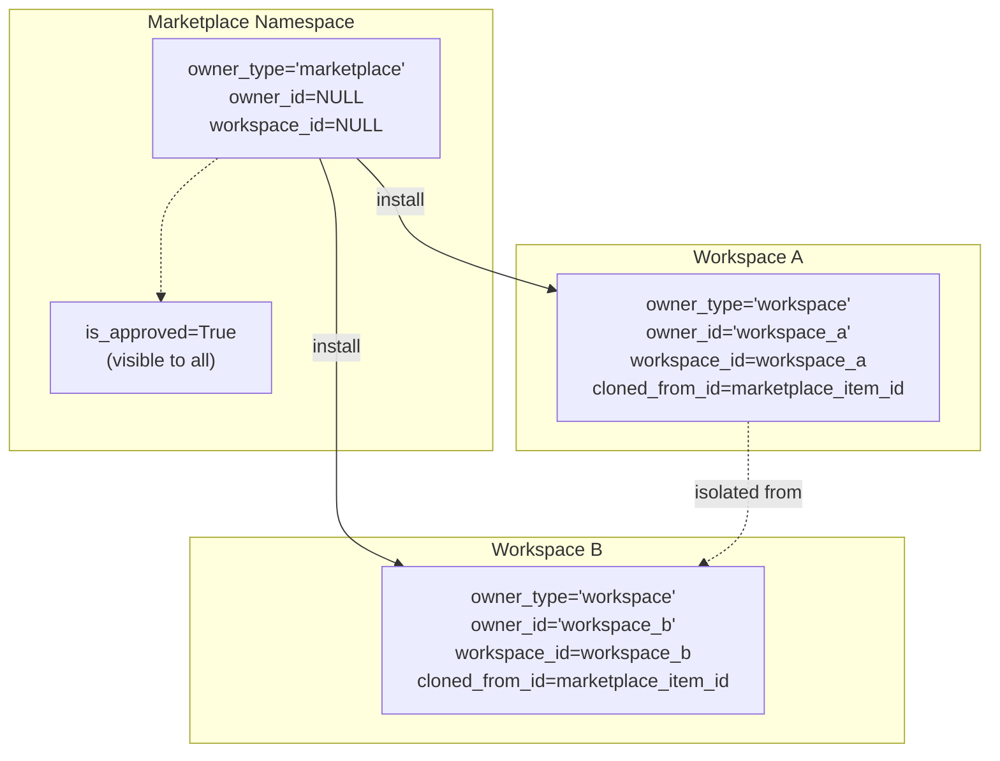

### Query Filtering

All marketplace queries filter by `owner_type='marketplace'` and `is_approved=True` (unless admin):

```python
# orchestrator/api/marketplace.py:154-157
agent_query = db.query(Agent).filter(Agent.owner_type == 'marketplace')

if not user_is_admin:
    agent_query = agent_query.filter(Agent.is_approved == True)
```

Workspace queries filter by `owner_type='workspace'` and `workspace_id`:

```python
# orchestrator/api/agents.py (example)
agents = db.query(Agent).filter(
    Agent.workspace_id == ctx.workspace_id,
    Agent.owner_type == 'workspace'
).all()
```

This ensures complete isolation between workspaces while allowing shared marketplace visibility.

**Sources:** [orchestrator/api/marketplace.py:154-157](), [orchestrator/api/marketplace.py:234-250]()

---

## Featured Items

Featured items are curated by admins and displayed prominently:

```python
# orchestrator/api/marketplace.py:587-638
@router.get("/featured", response_model=List[MarketplaceItemOut])
async def get_featured(limit: int = Query(8, ge=1, le=20), ...):
    agents = db.query(Agent).filter(
        Agent.owner_type == 'marketplace',
        Agent.is_approved == True,
        Agent.is_featured == True
    ).order_by(desc(Agent.install_count), desc(Agent.created_at)).limit(limit).all()
```

Featured items appear:
- On the marketplace homepage header
- Sorted first in category listings
- With a "Featured" badge in the UI

**Sources:** [orchestrator/api/marketplace.py:587-638]()

---

## API Reference

### Endpoints

| Method | Endpoint | Description |
|--------|----------|-------------|
| `GET` | `/api/marketplace/items` | List marketplace items with filters |
| `GET` | `/api/marketplace/items/{id}` | Get item detail with dependencies |
| `POST` | `/api/marketplace/items/{id}/install` | Clone item to workspace |
| `GET` | `/api/marketplace/featured` | Get featured items (homepage) |
| `GET` | `/api/marketplace/updates` | Check for updates to installed items |
| `POST` | `/api/marketplace/items/submit` | Submit workspace item to marketplace |
| `POST` | `/api/marketplace/items/{id}/approve` | Approve pending item (admin only) |
| `DELETE` | `/api/marketplace/items/{id}` | Delete marketplace item (admin only) |

### Query Parameters: `/api/marketplace/items`

| Parameter | Type | Description |
|-----------|------|-------------|
| `type` | `string` | Filter by type: `agent`, `recipe`, `skill`, `llm`, `tool` |
| `category` | `string` | Filter by category (e.g., 'Personal Assistant') |
| `search` | `string` | Search by name or description |
| `featured` | `boolean` | Filter featured items only |
| `limit` | `integer` | Max results (1-100, default 50) |
| `offset` | `integer` | Pagination offset (default 0) |

### Response Models

**MarketplaceItemOut:**

```typescript
{
  id: number
  type: string                    // 'agent', 'recipe', 'llm', etc.
  name: string
  description: string
  creator_name: string
  icon?: string
  category?: string
  tags: string[]
  install_count: number
  is_featured: boolean
  is_approved: boolean
  version: string
  metadata: Record<string, any>
  created_at: string
  updated_at: string
  
  // Recipe-specific
  steps?: Array<{...}>
  inputs?: Record<string, any>
  outputs?: Record<string, any>
  execution_config?: Record<string, any>
}
```

**InstallResponse:**

```typescript
{
  success: boolean
  message: string
  cloned_items: Array<{
    type: string
    name: string
    id: number
  }>
  warnings: string[]            // e.g., "Agent not found: xyz"
}
```

**Sources:** [orchestrator/api/marketplace.py:53-115]()

---

## Frontend Components

### Component Hierarchy

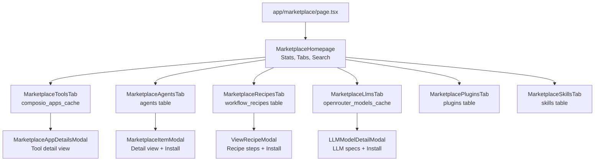

### Key Hooks

| Hook | Purpose |
|------|---------|
| `useMarketplaceItems({type, category, search})` | Fetch marketplace items with filters |
| `useInstallMarketplaceItem()` | Install mutation with optimistic updates |
| `useAvailableApps()` | Fetch Composio apps from cache |
| `useSyncToolsCache()` | Admin: Sync Composio metadata (880+ apps) |
| `useSyncOpenRouterCache()` | Admin: Sync OpenRouter models (500+) |
| `useViewMode(key)` | Persist list/grid view preference |

**Sources:** [frontend/hooks/use-marketplace-api.ts](), [frontend/hooks/use-composio-api.ts](), [frontend/hooks/use-openrouter-api.ts]()

---

## Stats & Metrics

The marketplace homepage displays aggregated statistics:

```typescript
// frontend/components/marketplace/marketplace-homepage.tsx:54-70
const stats = {
  totalItems: items.length,                                    // All approved items
  categories: new Set(items.map(i => i.category)).size,       // Unique categories
  totalInstalls: items.reduce((sum, i) => sum + i.install_count, 0),  // Global installs
  featuredCount: items.filter(i => i.is_featured).length      // Curated items
}
```

Stats are displayed in a `StatsBar` component with icons and labels.

**Sources:** [frontend/components/marketplace/marketplace-homepage.tsx:54-70](), [frontend/components/shared/stats-bar.tsx]()

---

## Seeding & Initial Data

The marketplace can be seeded with initial items using migration scripts:

```python
# orchestrator/scripts/seed_llm_marketplace.py
LLM_MODELS = [
    {"provider": "aiml", "model_id": "llama-3.3-70b-instruct", ...},
    {"provider": "anthropic", "model_id": "claude-3.5-sonnet", ...},
    {"provider": "openai", "model_id": "gpt-4o", ...},
    # ...
]

for model in LLM_MODELS:
    db.execute(text("""
        INSERT INTO marketplace_items
        (type, name, description, creator_name, category, tags, 
         is_featured, is_approved, version, metadata)
        VALUES ('llm', :name, :description, 'Automatos Team', ...)
    """))
```

Similar scripts exist for seeding:
- Default agents (Personal Assistant, DevOps Agent, Data Analyst)
- Starter recipes (Email Automation, Daily Digest, GitHub PR Review)
- Popular Composio tools (cached via metadata sync)

**Sources:** [orchestrator/scripts/seed_llm_marketplace.py:1-101]()

---