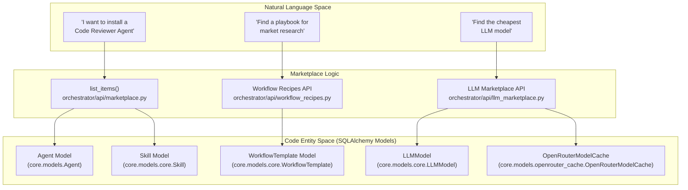
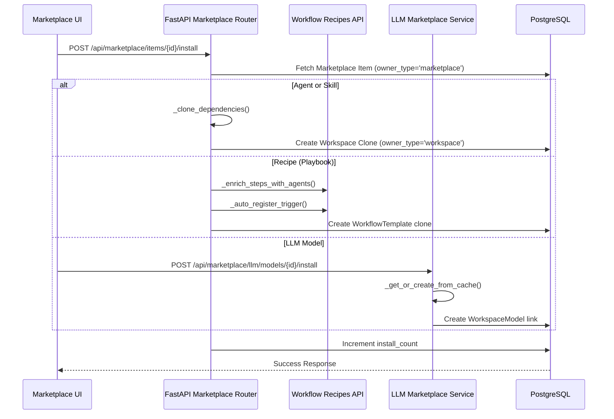

# Community Marketplace

Relevant source files

The following files were used as context for generating this wiki page:

- [frontend/components/agents/org-chart-tab.tsx](frontend/components/agents/org-chart-tab.tsx)
- [frontend/components/marketplace/llm-model-card.tsx](frontend/components/marketplace/llm-model-card.tsx)
- [frontend/components/marketplace/llm-model-detail-modal.tsx](frontend/components/marketplace/llm-model-detail-modal.tsx)
- [frontend/components/marketplace/marketplace-agents-tab.tsx](frontend/components/marketplace/marketplace-agents-tab.tsx)
- [frontend/components/marketplace/marketplace-homepage.tsx](frontend/components/marketplace/marketplace-homepage.tsx)
- [frontend/components/marketplace/marketplace-llms-tab.tsx](frontend/components/marketplace/marketplace-llms-tab.tsx)
- [frontend/components/marketplace/marketplace-plugin-detail-modal.tsx](frontend/components/marketplace/marketplace-plugin-detail-modal.tsx)
- [frontend/components/marketplace/marketplace-plugins-tab.tsx](frontend/components/marketplace/marketplace-plugins-tab.tsx)
- [frontend/components/marketplace/marketplace-skills-tab.tsx](frontend/components/marketplace/marketplace-skills-tab.tsx)
- [frontend/components/marketplace/marketplace-tools-tab.tsx](frontend/components/marketplace/marketplace-tools-tab.tsx)
- [frontend/hooks/use-openrouter-api.ts](frontend/hooks/use-openrouter-api.ts)
- [orchestrator/api/llm_marketplace.py](orchestrator/api/llm_marketplace.py)
- [orchestrator/api/marketplace.py](orchestrator/api/marketplace.py)
- [orchestrator/api/marketplace_plugins.py](orchestrator/api/marketplace_plugins.py)
- [orchestrator/api/openrouter_marketplace.py](orchestrator/api/openrouter_marketplace.py)
- [orchestrator/api/workflow_recipes.py](orchestrator/api/workflow_recipes.py)
- [orchestrator/core/database/migrations/042_openrouter_models_cache.sql](orchestrator/core/database/migrations/042_openrouter_models_cache.sql)
- [orchestrator/core/seeds/platform-management-skill.md](orchestrator/core/seeds/platform-management-skill.md)
- [orchestrator/scripts/seed_llm_marketplace.py](orchestrator/scripts/seed_llm_marketplace.py)

The Community Marketplace is a centralized discovery and distribution system for sharing AI agents, recipes (playbooks), tools, LLMs, and reusable capabilities across workspaces. It enables users to browse curated items, install them with a single click, and publish their own creations for community use.

For information about creating agents locally, see [Creating Agents](#5.1). For workflow/recipe creation, see [Creating Recipes](#6.1). For connecting external tools, see [Tools & Integrations](#8).

---

## System Overview

The marketplace operates on an **owner-type isolation pattern** where entities exist in two primary states:

- **Marketplace items**: `owner_type='marketplace'` — Globally visible, curated items available to all workspaces. These typically have `workspace_id` set to `NULL` [orchestrator/api/marketplace.py:154-155]().
- **Workspace items**: `owner_type='workspace'` — Private items scoped to a single workspace via a `workspace_id` [orchestrator/api/marketplace.py:221-225]().

Installation is a **cloning operation** that copies marketplace items into the user's workspace while preserving metadata and configurations [orchestrator/api/marketplace.py:180-280]().

**Supported Item Types:**
- **Agents**: Pre-configured AI agents with specific personas, model settings, and assigned skills [orchestrator/api/marketplace.py:153-180]().
- **Recipes (Playbooks)**: Multi-agent workflow templates with execution steps and execution configurations [orchestrator/api/marketplace.py:215-250]().
- **Applications**: Composio-integrated external services (Slack, Jira, GitHub, etc.) that provide tools to agents [frontend/components/marketplace/marketplace-tools-tab.tsx:116-128]().
- **LLMs**: Model provider configurations sourced from OpenRouter or custom provider settings [orchestrator/api/llm_marketplace.py:25-54]().
- **Capabilities**: Specialized plugins and skills that extend agent functionality [frontend/components/marketplace/marketplace-homepage.tsx:178-180]().

Sources: [orchestrator/api/marketplace.py:1-130](), [frontend/components/marketplace/marketplace-agents-tab.tsx:47-65](), [frontend/components/marketplace/marketplace-homepage.tsx:58-184](), [orchestrator/api/llm_marketplace.py:1-54]()

---

## Architecture & Data Model

### Entity Space Mapping

The following diagram bridges high-level marketplace concepts to specific database models and code identifiers used in the backend.

**Marketplace to Code Entity Map**

**Key Data Fields:**
- `owner_type`: Enum determining if the item is in the `marketplace` or a specific `workspace` [orchestrator/api/marketplace.py:154-155]().
- `is_approved`: Boolean flag requiring admin intervention before an item is public [orchestrator/api/marketplace.py:36-47]().
- `install_count`: Integer tracking popularity, incremented during the install flow [orchestrator/api/marketplace.py:270-275]().
- `original_creator_id`: Reference to the `UserModel` who first published the item [orchestrator/api/marketplace.py:185-188]().

Sources: [orchestrator/api/marketplace.py:53-80](), [orchestrator/api/workflow_recipes.py:25-28](), [orchestrator/api/llm_marketplace.py:101-143]()

---

### Installation Flow (Clone Pattern)

Installation involves duplicating a marketplace record into the user's workspace context. For complex items like Recipes, this also involves auto-registering triggers and mapping dependencies.

**Installation Details:**
- **Dependency Resolution**: For recipes, the system populates agent details for each step using `_enrich_steps_with_agents` [orchestrator/api/workflow_recipes.py:140-142]().
- **Trigger Registration**: If a recipe includes a Composio trigger, `_auto_register_trigger` subscribes the workspace to the external webhook [orchestrator/api/workflow_recipes.py:50-58]().
- **LLM Bridging**: The LLM marketplace uses `_get_or_create_from_cache` to bridge the `OpenRouterModelCache` to the local `LLMModel` table when a user installs a model not yet in the system [orchestrator/api/llm_marketplace.py:101-143]().

Sources: [orchestrator/api/marketplace.py:180-280](), [orchestrator/api/workflow_recipes.py:50-174](), [orchestrator/api/llm_marketplace.py:101-143]()

---

## Marketplace Components

### Browsing & Filtering
The frontend uses a tabbed interface in `MarketplaceHomepage` to separate different item types [frontend/components/marketplace/marketplace-homepage.tsx:140-148]().

| Component | Logic / Data Source | Key Features |
|-----------|---------------------|--------------|
| `MarketplaceToolsTab` | `apiClient.getToolCategories()` & `/api/tools/marketplace` | 40 items per page, category filtering, "Add to Workspace" [frontend/components/marketplace/marketplace-tools-tab.tsx:79-112](). |
| `MarketplaceAgentsTab` | `useMarketplaceItems({ type: 'agent' })` | Grid/List view, `normalizeCategory` for legacy support [frontend/components/marketplace/marketplace-agents-tab.tsx:39-94](). |
| `MarketplaceLlmsTab` | `useQuery(['openrouterModels'])` | Provider filtering, cost comparison, capability toggles [frontend/components/marketplace/marketplace-llms-tab.tsx:205-216](). |
| `MarketplacePlaybooksTab` | `apiClient.get('/api/marketplace/items?type=recipe')` | Browse multi-agent workflows [frontend/components/marketplace/marketplace-homepage.tsx:24](). |
| `MarketplacePluginsTab` | `apiClient.get('/api/marketplace/plugins')` | Security status (Verified Safe), token estimates [frontend/components/marketplace/marketplace-plugin-detail-modal.tsx:197-228](). |
| `MarketplaceSkillsTab` | `apiClient.get('/api/workspaces/{id}/skills/available')` | Methodology injection, specialized tools [frontend/components/marketplace/marketplace-skills-tab.tsx:82-95](). |

Sources: [frontend/components/marketplace/marketplace-tools-tab.tsx:1-135](), [frontend/components/marketplace/marketplace-agents-tab.tsx:1-100](), [frontend/components/marketplace/marketplace-llms-tab.tsx:161-216](), [frontend/components/marketplace/marketplace-homepage.tsx:1-184]()

### Platform Management Capability
The marketplace includes core "Skills" like `platform-management`, which allow agents to interact with the marketplace itself using tools like `platform_browse_marketplace_agents` and `platform_install_plugin` [orchestrator/core/seeds/platform-management-skill.md:8-15]().

---

## Publishing to Marketplace

Users can share their workspace creations with the community, which triggers an approval workflow.

1. **Submission**: Users trigger a "Share" action which calls `POST /api/marketplace/items` with a `SubmitRequest` [orchestrator/api/marketplace.py:101-107]().
2. **Cloning**: The backend creates a copy of the workspace item with `owner_type='marketplace'` and `is_approved=False` [orchestrator/api/marketplace.py:64]().
3. **Admin Review**: Admins use the `approve_item` endpoint to set `is_approved=True`, making it visible to all users [orchestrator/api/marketplace.py:36-47](). Frontend components like `MarketplaceAgentsTab` provide `handleApprove` buttons visible only to admin users [frontend/components/marketplace/marketplace-agents-tab.tsx:106-120]().

Sources: [orchestrator/api/marketplace.py:36-47](), [frontend/components/marketplace/marketplace-agents-tab.tsx:106-120]()

---

## Detailed Documentation
- [Marketplace Overview](#14.1) — UI Layout and Homepage
- [Browsing & Installing Items](#14.2) — Detailed install flow and dependency cloning
- [Publishing to Marketplace](#14.3) — Submission and Approval workflow
- [Marketplace Backend](#14.4) — `owner_type` logic and cloning implementation
- [Marketplace API Reference](#14.5) — Request/Response schemas for marketplace endpoints

---