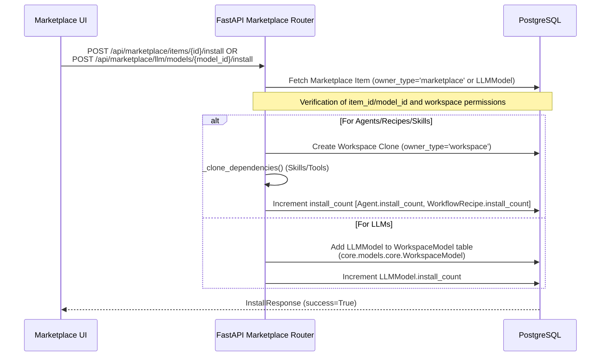

# Community Marketplace

Relevant source files

The following files were used as context for generating this wiki page:

- [frontend/components/marketplace/llm-model-card.tsx](frontend/components/marketplace/llm-model-card.tsx)
- [frontend/components/marketplace/llm-model-detail-modal.tsx](frontend/components/marketplace/llm-model-detail-modal.tsx)
- [frontend/components/marketplace/marketplace-agents-tab.tsx](frontend/components/marketplace/marketplace-agents-tab.tsx)
- [frontend/components/marketplace/marketplace-llms-tab.tsx](frontend/components/marketplace/marketplace-llms-tab.tsx)
- [frontend/components/marketplace/marketplace-plugin-detail-modal.tsx](frontend/components/marketplace/marketplace-plugin-detail-modal.tsx)
- [frontend/components/marketplace/marketplace-plugins-tab.tsx](frontend/components/marketplace/marketplace-plugins-tab.tsx)
- [frontend/components/marketplace/marketplace-skills-tab.tsx](frontend/components/marketplace/marketplace-skills-tab.tsx)
- [frontend/components/marketplace/marketplace-tools-tab.tsx](frontend/components/marketplace/marketplace-tools-tab.tsx)
- [frontend/components/settings/ApiKeysSettingsTab.tsx](frontend/components/settings/ApiKeysSettingsTab.tsx)
- [frontend/hooks/use-openrouter-api.ts](frontend/hooks/use-openrouter-api.ts)
- [orchestrator/api/llm_marketplace.py](orchestrator/api/llm_marketplace.py)
- [orchestrator/api/marketplace.py](orchestrator/api/marketplace.py)
- [orchestrator/api/marketplace_plugins.py](orchestrator/api/marketplace_plugins.py)
- [orchestrator/api/openrouter_marketplace.py](orchestrator/api/openrouter_marketplace.py)
- [orchestrator/api/user_api_keys.py](orchestrator/api/user_api_keys.py)
- [orchestrator/core/database/migrations/042_openrouter_models_cache.sql](orchestrator/core/database/migrations/042_openrouter_models_cache.sql)
- [orchestrator/core/llm/clients/__init__.py](orchestrator/core/llm/clients/__init__.py)
- [orchestrator/core/llm/usage_tracker.py](orchestrator/core/llm/usage_tracker.py)
- [orchestrator/scripts/seed_llm_marketplace.py](orchestrator/scripts/seed_llm_marketplace.py)

The Community Marketplace is a centralized discovery and distribution system for sharing AI agents, recipes (playbooks), tools, LLMs, plugins, skills, and widgets across workspaces. It enables users to browse curated items, install them with a single click, and publish their own creations for community use.

For information about creating agents locally, see [Creating Agents](#5.1). For workflow/recipe creation, see [Creating Recipes](#6.1). For connecting external tools, see [Tools & Integrations](#8).

---

## System Overview

The marketplace operates on an **owner-type isolation pattern** where entities exist in two primary states:

- **Marketplace items**: `owner_type='marketplace'` — Globally visible, curated items available to all workspaces. These typically have `workspace_id` set to `NULL` [orchestrator/api/marketplace.py:158]().
- **Workspace items**: `owner_type='workspace'` — Private items scoped to a single workspace via a `workspace_id` [orchestrator/api/marketplace.py:221-225]().

Installation is a **cloning operation** that copies marketplace items into the user's workspace while preserving metadata and configurations [orchestrator/api/marketplace.py:180-280]().

**Supported Item Types:**
- **Agents**: Pre-configured AI agents with specific personas, model settings, and assigned skills [orchestrator/api/marketplace.py:153-180]().
- **Recipes (Playbooks)**: Multi-agent workflow templates with execution steps and configurations [orchestrator/api/marketplace.py:215-250]().
- **Tools (Applications)**: Composio-integrated external services (Slack, Jira, GitHub, etc.) that provide actions to agents [frontend/components/marketplace/marketplace-tools-tab.tsx:116-128]().
- **LLMs**: Model provider configurations sourced from OpenRouter or custom provider settings [orchestrator/api/llm_marketplace.py:31-56]().
- **Plugins**: Bundles of skills, commands, and agents that extend platform capabilities [orchestrator/api/marketplace_plugins.py:56-76]().
- **Skills**: Reusable code snippets or prompt templates that agents can execute [frontend/components/marketplace/marketplace-skills-tab.tsx:28-38]().

Sources: [orchestrator/api/marketplace.py:1-130](), [frontend/components/marketplace/marketplace-agents-tab.tsx:47-65](), [orchestrator/api/llm_marketplace.py:31-56](), [orchestrator/api/marketplace_plugins.py:56-76](), [frontend/components/marketplace/marketplace-skills-tab.tsx:28-38]()

---

## Architecture & Data Model

### Entity Space Mapping

The following diagram bridges high-level marketplace concepts to specific database models and code identifiers used in the backend.

**Marketplace to Code Entity Map**

```mermaid
graph TD
    subgraph "Natural Language Space"
        UserIntent["'I want to install a<br/>Code Reviewer Agent'"]
        RecipeQuery["'Find a playbook for<br/>market research'"]
        LLMDiscovery["'Browse powerful LLMs'"]
        PluginSearch["'Find a GitHub plugin'"]
        SkillEnable["'Enable a new skill'"]
    end

    subgraph "Code Entity Space (SQLAlchemy Models)"
        AgentModel["Agent Model<br/>(core.models.core.Agent)"]
        RecipeModel["WorkflowRecipe Model<br/>(core.models.core.WorkflowTemplate)"]
        SkillModel["Skill Model<br/>(core.models.core.Skill)"]
        LLMModel["LLMModel Model<br/>(core.models.core.LLMModel)"]
        MarketplacePluginModel["MarketplacePlugin Model<br/>(core.models.marketplace_plugins.MarketplacePlugin)"]
        OpenRouterCacheModel["OpenRouterModelCache Model<br/>(core.models.openrouter_cache.OpenRouterModelCache)"]
        UserModel["User Model<br/>(core.models.core.User)"]
    end

    subgraph "Marketplace Logic (API Endpoints)"
        ListItemsAPI["GET /api/marketplace/items<br/>(marketplace.py::list_items)"]
        ListLLMsAPI["GET /api/marketplace/llm/models<br/>(llm_marketplace.py::list_llm_models)"]
        ListPluginsAPI["GET /api/marketplace/plugins<br/>(marketplace_plugins.py::list_plugins)"]
        InstallItemAPI["POST /api/marketplace/items/{id}/install<br/>(marketplace.py::install_item)"]
        InstallLLMAPI["POST /api/marketplace/llm/models/{id}/install<br/>(llm_marketplace.py::install_llm_model)"]
        NormalizeCat["normalizeCategory()<br/>(marketplace-agents-tab.tsx)"]
    end

    UserIntent --> ListItemsAPI
    RecipeQuery --> ListItemsAPI
    LLMDiscovery --> ListLLMsAPI
    PluginSearch --> ListPluginsAPI
    SkillEnable --> ListPluginsAPI

    ListItemsAPI --> AgentModel
    ListItemsAPI --> RecipeModel
    ListItemsAPI --> SkillModel
    ListLLMsAPI --> LLMModel
    ListLLMsAPI --> OpenRouterCacheModel
    ListPluginsAPI --> MarketplacePluginModel

    AgentModel --> UserModel["original_creator_id"]

    InstallItemAPI --> AgentModel
    InstallItemAPI --> RecipeModel
    InstallLLMAPI --> LLMModel

    ListItemsAPI --> NormalizeCat
```

**Key Data Fields:**
- `owner_type`: Enum determining if the item is in the `marketplace` or a specific `workspace` [orchestrator/api/marketplace.py:158]().
- `is_approved`: Boolean flag requiring admin intervention before an item is public [orchestrator/api/marketplace.py:37-50]().
- `install_count`: Integer tracking popularity, incremented during the install flow [orchestrator/api/marketplace.py:65]().
- `original_creator_id`: Reference to the `UserModel` who first published the item [orchestrator/api/marketplace.py:189-192]().
- `LLMModel.is_installed`: A per-request flag indicating if an LLM is installed in the current workspace [orchestrator/api/llm_marketplace.py:50]().

Sources: [orchestrator/api/marketplace.py:56-82](), [frontend/components/marketplace/marketplace-agents-tab.tsx:39-45](), [orchestrator/api/llm_marketplace.py:31-56](), [orchestrator/api/marketplace_plugins.py:56-76]()

---

### Installation Flow (Clone Pattern)

Installation involves duplicating a marketplace record into the user's workspace context. For complex items like Recipes, this also involves mapping dependencies and tools. For LLMs, it involves adding the model to the workspace's available models.

**Installation Details:**
- **Cloning Logic (Agents/Recipes/Skills)**: The backend performs a deep copy of the marketplace entity, resetting the `id` and assigning the current `workspace_id` from the `RequestContext` [orchestrator/api/marketplace.py:220-230]().
- **LLM Installation**: For LLMs, the `install_llm_model` endpoint creates an entry in the `WorkspaceModel` table, linking the `LLMModel` to the current workspace [orchestrator/api/llm_marketplace.py:300-310]().
- **Dependency Resolution**: When installing an agent, the system identifies `assigned_tools` and `assigned_skills` defined in the marketplace metadata and ensures they are available in the target workspace [orchestrator/api/marketplace.py:85-90]().
- **Admin Overrides**: Admins can override workspace contexts to manage marketplace items across the platform [frontend/components/marketplace/marketplace-agents-tab.tsx:82-83]().

Sources: [orchestrator/api/marketplace.py:92-102](), [orchestrator/api/marketplace.py:180-280](), [orchestrator/api/llm_marketplace.py:290-320](), [frontend/components/marketplace/marketplace-agents-tab.tsx:82-83]()

---

## Marketplace Components

### Browsing & Filtering
The frontend uses a tabbed interface in `MarketplaceHomepage` to separate different item types. For details, see [Marketplace Overview](#14.1).

| Component | Logic / Data Source | Key Features |
|-----------|---------------------|--------------|
| `MarketplaceToolsTab` | `/api/tools/marketplace` (DB cache) | Pagination, category filtering, Composio app integration, connection status [frontend/components/marketplace/marketplace-tools-tab.tsx:77-133](). |
| `MarketplaceAgentsTab` | `useMarketplaceItems({ type: 'agent' })` | Grid/List view, `normalizeCategory` for legacy support, admin approval buttons [frontend/components/marketplace/marketplace-agents-tab.tsx:39-96](). |
| `MarketplaceLlmsTab` | `/api/marketplace/llm/models` | Filters by provider, category, tier, capabilities; sorting; comparison view [frontend/components/marketplace/marketplace-llms-tab.tsx:167-178](). |
| `MarketplacePlaybooksTab` | `apiClient.get('/api/marketplace/items?type=recipe')` | Browse multi-agent workflow templates. |
| `MarketplacePluginsTab` | `/api/marketplace/plugins` | Category and sort filters, admin approval/rejection, GitHub import [frontend/components/marketplace/marketplace-plugins-tab.tsx:160-170](). |
| `MarketplaceSkillsTab` | `/api/workspaces/{ws_id}/skills/available` | Lists skills available for the workspace, enable/disable actions [frontend/components/marketplace/marketplace-skills-tab.tsx:83-95](). |

Sources: [frontend/components/marketplace/marketplace-tools-tab.tsx:1-135](), [frontend/components/marketplace/marketplace-agents-tab.tsx:1-100](), [frontend/components/marketplace/marketplace-llms-tab.tsx:1-204](), [frontend/components/marketplace/marketplace-plugins-tab.tsx:1-201](), [frontend/components/marketplace/marketplace-skills-tab.tsx:1-101]()

### LLM Catalog
The LLM Marketplace (`/api/marketplace/llm`) provides a catalog of LLM models. It leverages `OpenRouterModelCache` for browsing and `LLMModel` for installation and workspace management [orchestrator/api/llm_marketplace.py:102-144](). Users can install models to their workspace, which tracks `install_count` and `is_installed` status [orchestrator/api/llm_marketplace.py:97-98](). The system also checks for available providers based on `UserApiKey` and credential store entries [orchestrator/api/llm_marketplace.py:147-195](). For details, see [Marketplace Backend & LLM Catalog](#14.4).

Sources: [orchestrator/api/llm_marketplace.py:1-197](), [orchestrator/api/user_api_keys.py:1-31]()

---

## Publishing to Marketplace

Users can share their workspace creations with the community, which triggers an approval workflow. For details, see [Publishing to Marketplace](#14.3).

1.  **Submission**: Users trigger a "Share" action which calls `POST /api/marketplace/items` with a `SubmitRequest` [orchestrator/api/marketplace.py:104-110]().
2.  **Approval**: Admins use the `approve_item` endpoint to set `is_approved=True`, making it visible to all users [orchestrator/api/marketplace.py:37-50](). For plugins, admin approval is handled via `POST /api/admin/plugins/{id}/approve` [frontend/components/marketplace/marketplace-plugin-detail-modal.tsx:159-172]().
3.  **Deletion**: Marketplace items can be removed via `DELETE /api/marketplace/items/{id}` [frontend/components/marketplace/marketplace-agents-tab.tsx:124-141]().

Sources: [orchestrator/api/marketplace.py:37-50](), [frontend/components/marketplace/marketplace-agents-tab.tsx:108-141](), [frontend/components/marketplace/marketplace-plugin-detail-modal.tsx:159-172]()

---

## Detailed Documentation
- [Marketplace Overview](#14.1) — MarketplaceHomepage, tabs (Applications, Agents, Playbooks, LLMs, Plugins, Skills, Widgets), search
- [Browsing & Installing Items](#14.2) — Item cards, detail modals, install flow, cascade installer for dependencies, install_count tracking
- [Publishing to Marketplace](#14.3) — Clone-to-workspace pattern, owner_type, dependency cloning, marketplace S3 asset storage, publish/developer pages
- [Marketplace Backend & LLM Catalog](#14.4) — marketplace.py, marketplace_plugins.py, llm_marketplace.py, user_api_keys, usage tracker, workspace isolation and cloning logic

---