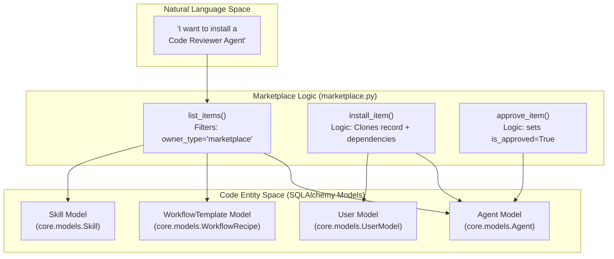
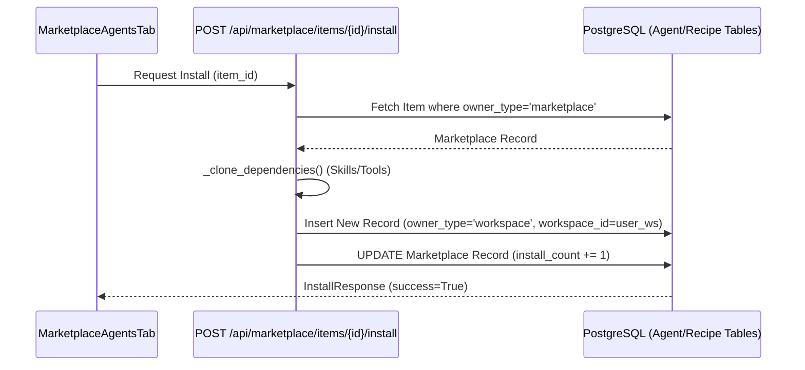

# Community Marketplace

Relevant source files

The following files were used as context for generating this wiki page:

- [frontend/components/marketplace/marketplace-agents-tab.tsx](frontend/components/marketplace/marketplace-agents-tab.tsx)
- [frontend/components/marketplace/marketplace-homepage.tsx](frontend/components/marketplace/marketplace-homepage.tsx)
- [frontend/components/marketplace/marketplace-tools-tab.tsx](frontend/components/marketplace/marketplace-tools-tab.tsx)
- [frontend/components/shared/stats-bar.tsx](frontend/components/shared/stats-bar.tsx)
- [frontend/components/tools/tools-dashboard.tsx](frontend/components/tools/tools-dashboard.tsx)
- [frontend/components/workflows/active-workflows-panel.tsx](frontend/components/workflows/active-workflows-panel.tsx)
- [frontend/components/workflows/execution-kitchen.tsx](frontend/components/workflows/execution-kitchen.tsx)
- [frontend/components/workflows/workflow-management.tsx](frontend/components/workflows/workflow-management.tsx)
- [frontend/hooks/use-marketplace-api.ts](frontend/hooks/use-marketplace-api.ts)
- [frontend/lib/tooltips.json](frontend/lib/tooltips.json)
- [orchestrator/api/marketplace.py](orchestrator/api/marketplace.py)
- [orchestrator/api/recipe_executor.py](orchestrator/api/recipe_executor.py)
- [orchestrator/api/workflow_recipes.py](orchestrator/api/workflow_recipes.py)
- [orchestrator/modules/coordination/__init__.py](orchestrator/modules/coordination/__init__.py)
- [orchestrator/modules/coordination/agent_matcher.py](orchestrator/modules/coordination/agent_matcher.py)
- [orchestrator/modules/coordination/templates.py](orchestrator/modules/coordination/templates.py)
- [orchestrator/modules/learning/tests/conftest.py](orchestrator/modules/learning/tests/conftest.py)
- [orchestrator/modules/learning/tests/test_learning_system.py](orchestrator/modules/learning/tests/test_learning_system.py)

The Community Marketplace is a centralized discovery and distribution system for sharing AI agents, recipes, tools, LLMs, and reusable capabilities across workspaces. It enables users to browse curated items, install them with a single click, and publish their own creations for community use.

For information about creating agents locally, see [Creating Agents](#5.1). For workflow/recipe creation, see [Creating Recipes](#6.1). For connecting external tools, see [Tools & Integrations](#8).

---

## System Overview

The marketplace operates on an **owner-type isolation pattern** where entities exist in two primary states:

- **Marketplace items**: `owner_type='marketplace'` — Globally visible, curated items available to all workspaces. These typically have `workspace_id` set to `NULL` [orchestrator/api/marketplace.py:154-155]().
- **Workspace items**: `owner_type='workspace'` — Private items scoped to a single workspace via a `workspace_id` [orchestrator/api/marketplace.py:221-225]().

Installation is a **cloning operation** that copies marketplace items into the user's workspace while preserving metadata and configurations [orchestrator/api/marketplace.py:180-280]().

**Supported Item Types:**
- **Agents** — Pre-configured AI agents with specific personas and model settings [orchestrator/api/marketplace.py:153-180]().
- **Recipes** — Multi-agent workflow templates with execution steps [orchestrator/api/marketplace.py:215-250]().
- **Applications** — Composio-integrated external services (Slack, Jira, GitHub, etc.) [frontend/components/marketplace/marketplace-tools-tab.tsx:116-128]().
- **LLMs & Capabilities** — Model provider configurations and specialized skills [frontend/components/marketplace/marketplace-homepage.tsx:174-180]().

Sources: [orchestrator/api/marketplace.py:1-130](), [frontend/components/marketplace/marketplace-agents-tab.tsx:47-65](), [frontend/components/marketplace/marketplace-homepage.tsx:58-184]()

---

## Architecture & Data Model

### Entity Space Mapping

The following diagram bridges the high-level marketplace concepts to the specific database models and code identifiers used in the backend.

**Marketplace to Code Entity Map**

**Key Data Fields:**
- `owner_type`: Enum determining if the item is in the `marketplace` or a specific `workspace` [orchestrator/api/marketplace.py:154-155]().
- `is_approved`: Boolean flag requiring admin intervention before an item is public [orchestrator/api/marketplace.py:36-47]().
- `install_count`: Integer tracking popularity, incremented during the install flow [orchestrator/api/marketplace.py:270-275]().
- `original_creator_id`: Reference to the `UserModel` who first published the item [orchestrator/api/marketplace.py:185-188]().

Sources: [orchestrator/api/marketplace.py:53-80](), [orchestrator/api/marketplace.py:154-188]()

---

### Installation Flow (Clone Pattern)

Installation involves duplicating a marketplace record into the user's workspace context. The `marketplace_installs` table tracks these relationships, though recent logic allows flexible cloning to ensure workspace isolation.

**Installation Details:**
- **Dependency Resolution**: For recipes, the system attempts to find and clone dependent agents from the marketplace [orchestrator/api/marketplace.py:83-88]().
- **Warnings**: If a dependency (like a specific agent or tool) is missing from the marketplace, the `InstallResponse` includes a `warnings` array [orchestrator/api/marketplace.py:97-98]().
- **Frontend Hook**: The `useInstallMarketplaceItem` hook manages the mutation and triggers cache invalidation for the local `agents` list [frontend/hooks/use-marketplace-api.ts:138-160]().

Sources: [orchestrator/api/marketplace.py:180-280](), [frontend/hooks/use-marketplace-api.ts:138-160]()

---

## Marketplace Components

### Browsing & Filtering
The frontend uses a tabbed interface in `MarketplaceHomepage` to separate different item types [frontend/components/marketplace/marketplace-homepage.tsx:140-148]().

| Component | Logic / Data Source | Key Features |
|-----------|---------------------|--------------|
| `MarketplaceToolsTab` | `apiClient.getToolCategories()` & `/api/tools/marketplace` | 40 items per page, category filtering, "Add to Workspace" [frontend/components/marketplace/marketplace-tools-tab.tsx:79-112](). |
| `MarketplaceAgentsTab` | `useMarketplaceItems({ type: 'agent' })` | Grid/List view, `normalizeCategory` for legacy support [frontend/components/marketplace/marketplace-agents-tab.tsx:39-94](). |
| `MarketplacePlaybooksTab` | `apiClient.get('/api/marketplace/items?type=recipe')` | Simple/Complex filters, "Cook" preview [frontend/components/marketplace/marketplace-homepage.tsx:170-172](). |
| `CapabilitiesTab` | `MarketplacePluginsTab` & `MarketplaceSkillsTab` | Nested tabs for specialized agent capabilities [frontend/components/marketplace/marketplace-homepage.tsx:35-56](). |

Sources: [frontend/components/marketplace/marketplace-tools-tab.tsx:1-135](), [frontend/components/marketplace/marketplace-agents-tab.tsx:1-100](), [frontend/components/marketplace/marketplace-homepage.tsx:1-184]()

### Item Details & Statistics
- **`StatsBar`**: Displays global marketplace metrics including total items, categories, featured items, and total installs [frontend/components/marketplace/marketplace-homepage.tsx:103-136]().
- **`MarketplaceItemModal`**: Displays extended metadata including `tool_names`, `tool_icons`, and `model_config` [frontend/hooks/use-marketplace-api.ts:21-37]().

---

## Publishing to Marketplace

Users can share their workspace creations with the community via the `useSubmitToMarketplace` hook [frontend/hooks/use-marketplace-api.ts:61-92]().

1. **Submission**: Users trigger a "Share" action which calls `POST /api/marketplace/items` [orchestrator/api/marketplace.py:100-107]().
2. **Cloning**: The backend creates a copy of the workspace item with `owner_type='marketplace'` and `is_approved=False` [orchestrator/api/marketplace.py:64]().
3. **Admin Review**: Admins use the `approve_item` endpoint to set `is_approved=True`, making it visible to all users [frontend/components/marketplace/marketplace-agents-tab.tsx:106-120]().

Sources: [orchestrator/api/marketplace.py:36-47](), [frontend/hooks/use-marketplace-api.ts:39-56](), [frontend/components/marketplace/marketplace-agents-tab.tsx:106-120]()

---

## Detailed Documentation
- [Marketplace Overview](#14.1) — UI Layout and Homepage
- [Browsing & Installing Items](#14.2) — Detailed install flow and dependency cloning
- [Publishing to Marketplace](#14.3) — Submission and Approval workflow
- [Marketplace Backend](#14.4) — `owner_type` logic and cloning implementation
- [Marketplace API Reference](#14.5) — Request/Response schemas for all marketplace endpoints

---