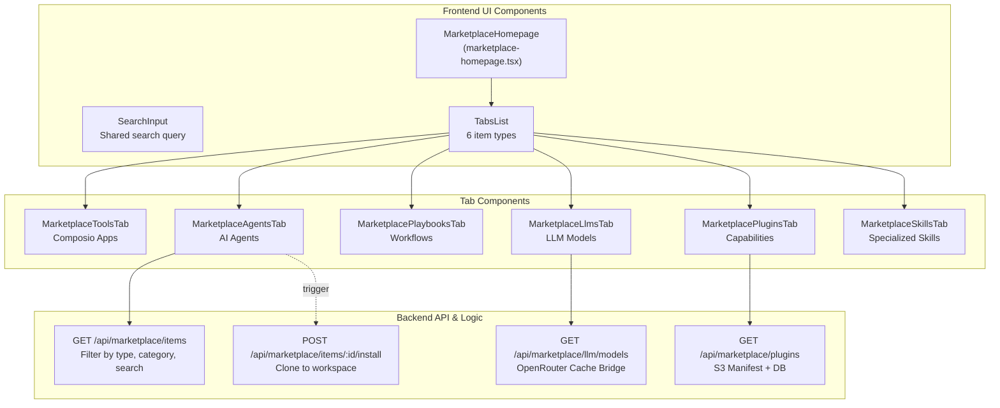
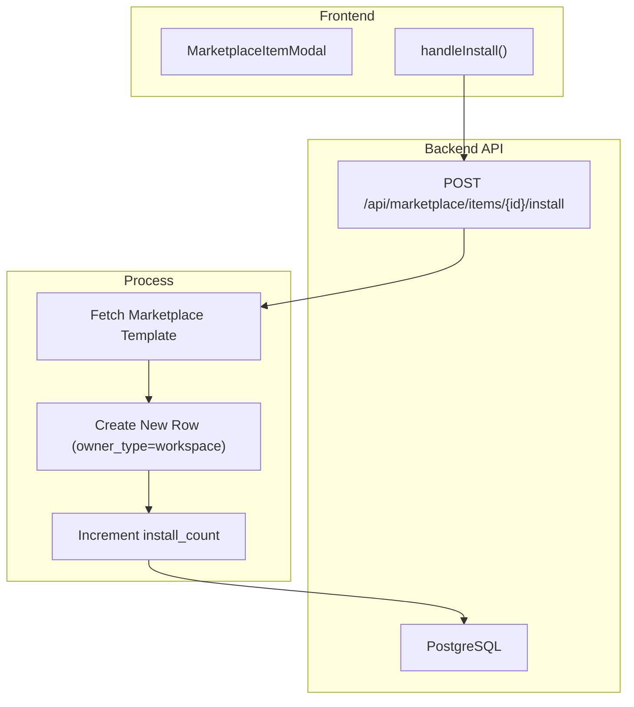

# Browsing & Installing Items

Relevant source files

The following files were used as context for generating this wiki page:

- [frontend/components/marketplace/llm-model-card.tsx](frontend/components/marketplace/llm-model-card.tsx)
- [frontend/components/marketplace/llm-model-detail-modal.tsx](frontend/components/marketplace/llm-model-detail-modal.tsx)
- [frontend/components/marketplace/marketplace-agents-tab.tsx](frontend/components/marketplace/marketplace-agents-tab.tsx)
- [frontend/components/marketplace/marketplace-card.tsx](frontend/components/marketplace/marketplace-card.tsx)
- [frontend/components/marketplace/marketplace-grid.tsx](frontend/components/marketplace/marketplace-grid.tsx)
- [frontend/components/marketplace/marketplace-homepage.tsx](frontend/components/marketplace/marketplace-homepage.tsx)
- [frontend/components/marketplace/marketplace-item-modal.tsx](frontend/components/marketplace/marketplace-item-modal.tsx)
- [frontend/components/marketplace/marketplace-llms-tab.tsx](frontend/components/marketplace/marketplace-llms-tab.tsx)
- [frontend/components/marketplace/marketplace-plugin-detail-modal.tsx](frontend/components/marketplace/marketplace-plugin-detail-modal.tsx)
- [frontend/components/marketplace/marketplace-plugins-tab.tsx](frontend/components/marketplace/marketplace-plugins-tab.tsx)
- [frontend/components/marketplace/marketplace-skills-tab.tsx](frontend/components/marketplace/marketplace-skills-tab.tsx)
- [frontend/components/marketplace/marketplace-tools-tab.tsx](frontend/components/marketplace/marketplace-tools-tab.tsx)
- [frontend/hooks/use-openrouter-api.ts](frontend/hooks/use-openrouter-api.ts)
- [orchestrator/alembic/versions/20260201_add_marketplace_to_recipes.py](orchestrator/alembic/versions/20260201_add_marketplace_to_recipes.py)
- [orchestrator/api/llm_marketplace.py](orchestrator/api/llm_marketplace.py)
- [orchestrator/api/marketplace_plugins.py](orchestrator/api/marketplace_plugins.py)
- [orchestrator/api/openrouter_marketplace.py](orchestrator/api/openrouter_marketplace.py)
- [orchestrator/core/database/migrations/042_openrouter_models_cache.sql](orchestrator/core/database/migrations/042_openrouter_models_cache.sql)
- [orchestrator/scripts/seed_llm_marketplace.py](orchestrator/scripts/seed_llm_marketplace.py)
- [orchestrator/scripts/seed_recipes_marketplace.py](orchestrator/scripts/seed_recipes_marketplace.py)

This document describes the technical implementation of the Community Marketplace UI and API. It covers the multi-tab browsing experience, advanced filtering for different item types (Agents, Recipes, Tools, LLMs, Plugins, and Skills), and the cascading installation flow that clones marketplace items into a user's workspace while tracking installation metrics and dependencies.

---

## Marketplace Interface Overview

The marketplace provides a unified browsing experience for six item types. The interface is organized around a tabbed layout with shared search, category filtering, and view mode controls.

### Component Architecture

The frontend is structured to handle high-volume data (especially for Tools and LLMs) by using a mix of server-side filtering and client-side pagination.

**Marketplace UI & API Interaction**

**Sources:** [frontend/components/marketplace/marketplace-homepage.tsx:53-74](), [orchestrator/api/llm_marketplace.py:25-25](), [orchestrator/api/marketplace_plugins.py:34-34]()

---

## Browsing Items by Type

### Tab Organization

The marketplace uses a six-tab layout. Backend queries distinguish items primarily via the `owner_type` and `type` fields.

| Tab | Label | Type Filter | Backend Source |
|-----|-------|-------------|----------------|
| Tools | Applications | `type=tool` | `/api/tools/marketplace` (DB cache) |
| Agents | Agents | `type=agent` | `/api/marketplace/items` (`owner_type=marketplace`) |
| Recipes | Recipes | `type=recipe` | `/api/marketplace/items` (`type=recipe`) |
| LLMs | LLMs | `type=llm` | `/api/marketplace/llm/models` (OpenRouter Cache) |
| Capabilities | Plugins | `type=plugin` | `/api/marketplace/plugins` |
| Skills | Skills | `type=skill` | `/api/workspaces/:id/skills/available` |

**Sources:** [frontend/components/marketplace/marketplace-agents-tab.tsx:85-89](), [frontend/components/marketplace/marketplace-tools-tab.tsx:112-112](), [frontend/components/marketplace/marketplace-llms-tab.tsx:217-217](), [orchestrator/api/marketplace_plugins.py:170-180]()

### LLM Marketplace (PRD-54)
The LLM tab bridges the `OpenRouterModelCache` (external models) and `LLMModel` (installed models). The `_get_or_create_from_cache` function ensures that if a user installs a model from the OpenRouter cache that doesn't yet exist in the local `llm_models` table, it is auto-created with relevant metadata like `context_window` and `input_cost_per_1k_tokens`.

**Sources:** [orchestrator/api/llm_marketplace.py:101-143](), [frontend/components/marketplace/marketplace-llms-tab.tsx:119-147]()

### Plugins & Skills (PRD-42)
Plugins represent bundled capabilities. The `MarketplacePluginsTab` fetches summaries via `/api/marketplace/plugins` and detailed manifests via `MarketplacePluginDetailModal`.
- **Enriched Content:** The backend `_extract_content_items` function parses the plugin manifest to normalize skills and commands for UI display. [orchestrator/api/marketplace_plugins.py:133-162]()
- **Security Status:** Plugins display a `security_status` (safe, blocked, review_required) based on automated scanner results. [frontend/components/marketplace/marketplace-plugin-detail-modal.tsx:197-228]()

---

## Installation Flow

Installation involves cloning the marketplace template into a workspace-specific instance.

### Item Installation Logic
When `handleInstall` is triggered from `MarketplaceItemModal`, it calls `POST /api/marketplace/items/:id/install`.

**Installation Data Flow**

**Sources:** [frontend/components/marketplace/marketplace-item-modal.tsx:63-81](), [frontend/components/marketplace/llm-model-card.tsx:124-147](), [orchestrator/api/llm_marketplace.py:53-54]()

### Metadata & Dependencies
Marketplace items include metadata that defines their requirements:
- **Agents:** Metadata includes `tool_names`, `tool_icons`, and `model_config`. [frontend/components/marketplace/marketplace-item-modal.tsx:83-101]()
- **Skills:** Skills are enabled for a workspace via `apiClient.post('/api/workspaces/${workspaceId}/skills')`. [frontend/components/marketplace/marketplace-skills-tab.tsx:102-125]()

---

## Search & Filtering Implementation

### Server-Side Filtering
For Tools and LLMs, the system uses high-performance database queries or external API parameters:
- **Tools:** `MarketplaceToolsTab` uses a query string with `category` and `limit=1000` against the DB-cached endpoint. [frontend/components/marketplace/marketplace-tools-tab.tsx:106-112]()
- **LLMs:** `MarketplaceLlmsTab` filters by `selectedProvider`, `selectedTier`, and boolean flags like `filterTools` or `filterVision` via `URLSearchParams`. [frontend/components/marketplace/marketplace-llms-tab.tsx:218-230]()

### Client-Side Search
Tabs like `MarketplaceSkillsTab` and `MarketplaceAgentsTab` (for categories) implement client-side filtering for immediate UI feedback.
- **Skills:** `filteredAvailable` uses a `useMemo` hook to filter by name, description, and tags. [frontend/components/marketplace/marketplace-skills-tab.tsx:147-160]()
- **Agents:** `normalizeCategory` maps legacy categories to unified system IDs for consistent filtering. [frontend/components/marketplace/marketplace-agents-tab.tsx:39-45]()

---

## Item Detail & Comparison

### LLM Comparison & Costs (PRD-54)
The `LLMModelDetailModal` provides a "Cost Calculator" allowing users to estimate monthly expenses.
- **Monthly Cost Calculation:** Multiplies projected input/output tokens by `model.input_cost_per_1k` and `model.output_cost_per_1k`. [frontend/components/marketplace/llm-model-detail-modal.tsx:106-111]()
- **Capability Visualization:** Uses `CAPABILITY_RATING` to map technical benchmarks to human-readable progress bars (Excellent, Good, Moderate). [frontend/components/marketplace/llm-model-card.tsx:76-82]()

### Featured Showcase
The `MarketplaceHomepage` features a `FeaturedBanner` that highlights top-performing items using the `install_count` and `is_featured` flags. Admins can toggle the featured status via `useToggleFeatured`.

**Sources:** [frontend/components/marketplace/marketplace-homepage.tsx:78-151](), [frontend/components/marketplace/llm-model-detail-modal.tsx:138-141]()

---