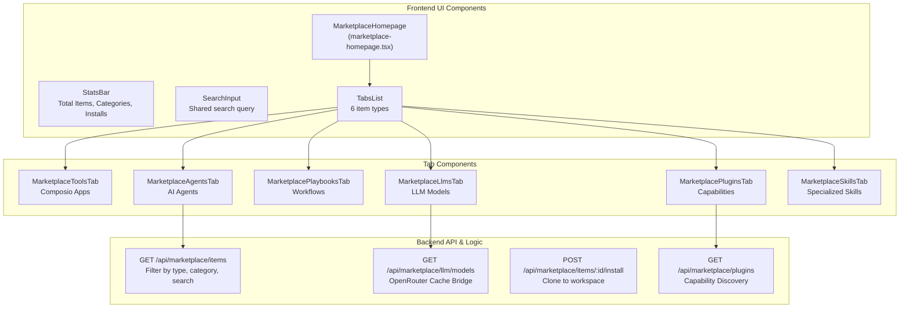
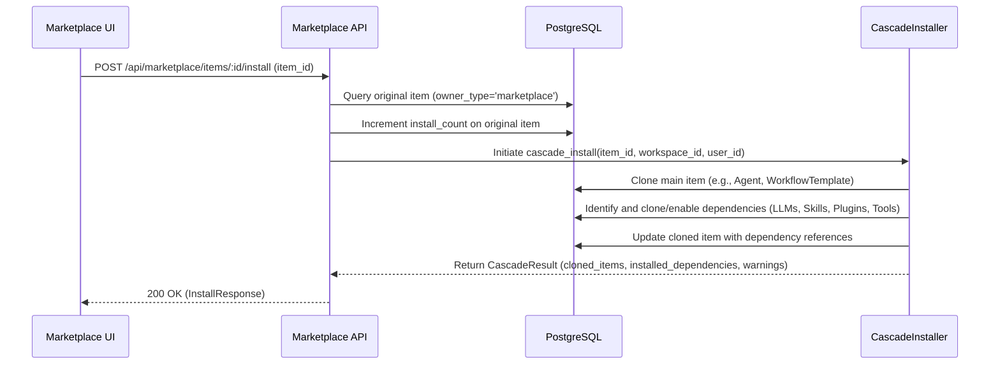

# Browsing & Installing Items

Relevant source files

The following files were used as context for generating this wiki page:

- [frontend/components/marketplace/llm-model-card.tsx](frontend/components/marketplace/llm-model-card.tsx)
- [frontend/components/marketplace/llm-model-detail-modal.tsx](frontend/components/marketplace/llm-model-detail-modal.tsx)
- [frontend/components/marketplace/marketplace-agents-tab.tsx](frontend/components/marketplace/marketplace-agents-tab.tsx)
- [frontend/components/marketplace/marketplace-llms-tab.tsx](frontend/components/marketplace/marketplace-llms-tab.tsx)
- [frontend/components/marketplace/marketplace-plugin-detail-modal.tsx](frontend/components/marketplace/marketplace-plugin-detail-modal.tsx)
- [frontend/components/marketplace/marketplace-plugins-tab.tsx](frontend/components/marketplace/marketplace-plugins-tab.tsx)
- [frontend/components/marketplace/marketplace-skills-tab.tsx](frontend/components/marketplace/marketplace-skills-tab.tsx)
- [frontend/components/marketplace/marketplace-tools-tab.tsx](frontend/components/marketplace/marketplace-tools-tab.tsx)
- [frontend/components/settings/ApiKeysSettingsTab.tsx](frontend/components/settings/ApiKeysSettingsTab.tsx)
- [frontend/hooks/use-marketplace-api.ts](frontend/hooks/use-marketplace-api.ts)
- [frontend/hooks/use-openrouter-api.ts](frontend/hooks/use-openrouter-api.ts)
- [frontend/hooks/use-playbook-api.ts](frontend/hooks/use-playbook-api.ts)
- [frontend/hooks/use-playbook-form.ts](frontend/hooks/use-playbook-form.ts)
- [orchestrator/alembic/versions/agents_public_id_default.py](orchestrator/alembic/versions/agents_public_id_default.py)
- [orchestrator/api/api_playbooks.py](orchestrator/api/api_playbooks.py)
- [orchestrator/api/llm_marketplace.py](orchestrator/api/llm_marketplace.py)
- [orchestrator/api/marketplace.py](orchestrator/api/marketplace.py)
- [orchestrator/api/marketplace_plugins.py](orchestrator/api/marketplace_plugins.py)
- [orchestrator/api/openrouter_marketplace.py](orchestrator/api/openrouter_marketplace.py)
- [orchestrator/api/user_api_keys.py](orchestrator/api/user_api_keys.py)
- [orchestrator/api/workflow_templates.py](orchestrator/api/workflow_templates.py)
- [orchestrator/core/database/migrations/042_openrouter_models_cache.sql](orchestrator/core/database/migrations/042_openrouter_models_cache.sql)
- [orchestrator/core/llm/clients/__init__.py](orchestrator/core/llm/clients/__init__.py)
- [orchestrator/core/llm/usage_tracker.py](orchestrator/core/llm/usage_tracker.py)
- [orchestrator/modules/tools/discovery/cascade_installer.py](orchestrator/modules/tools/discovery/cascade_installer.py)
- [orchestrator/modules/tools/discovery/handlers_marketplace.py](orchestrator/modules/tools/discovery/handlers_marketplace.py)
- [orchestrator/modules/tools/discovery/handlers_packages.py](orchestrator/modules/tools/discovery/handlers_packages.py)
- [orchestrator/modules/tools/discovery/not_found_candidates.py](orchestrator/modules/tools/discovery/not_found_candidates.py)
- [orchestrator/scripts/seed_llm_marketplace.py](orchestrator/scripts/seed_llm_marketplace.py)
- [orchestrator/tests/test_prd222_not_found_names_candidates.py](orchestrator/tests/test_prd222_not_found_names_candidates.py)

This document describes the technical implementation of the Community Marketplace UI and API. It covers the multi-tab browsing experience, advanced filtering for different item types (Agents, Recipes, Tools, LLMs, Plugins, and Skills), and the cascading installation flow that clones marketplace items into a user's workspace while tracking installation metrics and dependencies.

---

## Marketplace Interface Overview

The marketplace provides a unified browsing experience for six item types. The interface is organized around a tabbed layout with shared search, category filtering, and view mode controls.

### Component Architecture

The frontend is structured to handle high-volume data (especially for Tools and LLMs) by using a mix of server-side filtering and client-side pagination.

**Marketplace UI & API Interaction**

**Sources:** `[orchestrator/api/marketplace.py:126-141]()`, `[frontend/components/marketplace/marketplace-plugins-tab.tsx:94-117]()`, `[orchestrator/api/llm_marketplace.py:226-248]()`

---

## Browsing Items by Type

### Tab Organization

The marketplace uses a six-tab layout. Backend queries distinguish items primarily via the `owner_type` and `type` fields.

| Tab | Label | Type Filter | Backend Source |
|-----|-------|-------------|----------------|
| Tools | Applications | `type=tool` | Composio Apps catalog |
| Agents | Agents | `type=agent` | `Agent` table (`owner_type='marketplace'`) |
| Recipes | Recipes | `type=recipe` | `WorkflowTemplate` table (`owner_type='marketplace'`) |
| LLMs | LLMs | `type=llm` | `OpenRouterModelCache` & `LLMModel` |
| Capabilities | Plugins | `type=plugin` | `MarketplacePlugin` table |
| Skills | Skills | `type=skill` | `Skill` table (`workspace_id IS NULL`) |

**Sources:** `[orchestrator/api/marketplace.py:158-158]()`, `[orchestrator/api/llm_marketplace.py:102-144]()`, `[orchestrator/api/marketplace_plugins.py:186-189]()`

### LLM Marketplace (PRD-54)
The LLM tab bridges the `OpenRouterModelCache` (external models) and `LLMModel` (installed models). The `_get_or_create_from_cache` function `[orchestrator/api/llm_marketplace.py:102-144]()` ensures that if a user installs a model from the OpenRouter cache that doesn't yet exist in the local `llm_models` table, it is auto-created with relevant metadata like `context_window` and `input_cost_per_1k_tokens`.

**Sources:** `[orchestrator/api/llm_marketplace.py:102-144]()`, `[frontend/components/marketplace/marketplace-llms-tab.tsx:119-147]()`

---

## Installation & Cascading Dependencies

Installation is a cloning process that transitions an item from `owner_type='marketplace'` to a specific `workspace_id`.

### The Installation Flow
When a marketplace agent or recipe is installed, the system clones the record and increments the `install_count` on the original marketplace record. The `cascade_installer.py` module `[orchestrator/modules/tools/discovery/cascade_installer.py:1-10]()` is responsible for automatically installing all child dependencies such as LLM models, skills, tools, and referenced agents for recipes.

**Marketplace Installation Logic**

**Sources:** `[orchestrator/api/marketplace.py:270-320]()`, `[orchestrator/api/llm_marketplace.py:269-310]()`, `[orchestrator/modules/tools/discovery/cascade_installer.py:1-10]()`

### Implementation Details
- **LLM Installation:** Installing an LLM model links the `LLMModel` to the workspace via the `WorkspaceModel` association table. The `install_model` function `[orchestrator/modules/tools/discovery/cascade_installer.py:149-185]()` handles this, potentially auto-creating the `LLMModel` entry from the `OpenRouterModelCache` if it doesn't exist. `[orchestrator/api/llm_marketplace.py:269-310]()`
- **Plugin Enabling:** Plugins are "enabled" for a workspace rather than cloned. The `MarketplacePluginsTab` tracks this via `setEnabledPluginIds`. `[frontend/components/marketplace/marketplace-plugins-tab.tsx:139-155]()` The `install_plugin` function `[orchestrator/modules/tools/discovery/cascade_installer.py:300-329]()` handles the logic for enabling a plugin for a workspace.
- **Skill Activation:** Skills are enabled for a workspace via `POST /api/workspaces/{workspace_id}/skills`. `[frontend/components/marketplace/marketplace-skills-tab.tsx:102-125]()` The `install_skill` function `[orchestrator/modules/tools/discovery/cascade_installer.py:260-298]()` manages this process.
- **Agent Cloning:** The `clone_agent_to_workspace` function `[orchestrator/modules/tools/discovery/cascade_installer.py:78-128]()` handles the cloning of a marketplace agent into a user's workspace, including copying M2M relationships like skills.
- **Tool Assignment:** For agents, the `cascade_agent_dependencies` function `[orchestrator/modules/tools/discovery/cascade_installer.py:135-140]()` ensures that tools are assigned to the cloned agent. It also checks for OAuth requirements for Composio apps using `check_oauth_requirements` `[orchestrator/modules/tools/discovery/cascade_installer.py:40-71]()` and adds warnings if manual connection is needed.
- **`install_count` Tracking:** The `install_count` field on marketplace items (e.g., `Agent.install_count` `[orchestrator/api/marketplace.py:65]()`, `LLMModel.install_count` `[orchestrator/api/llm_marketplace.py:49]()`) is incremented upon successful installation to track popularity.

**Sources:** `[orchestrator/modules/tools/discovery/cascade_installer.py:1-10]()`, `[orchestrator/modules/tools/discovery/cascade_installer.py:40-71]()`, `[orchestrator/modules/tools/discovery/cascade_installer.py:78-128]()`, `[orchestrator/modules/tools/discovery/cascade_installer.py:135-140]()`, `[orchestrator/modules/tools/discovery/cascade_installer.py:149-185]()`, `[orchestrator/modules/tools/discovery/cascade_installer.py:260-298]()`, `[orchestrator/modules/tools/discovery/cascade_installer.py:300-329]()`, `[orchestrator/api/llm_marketplace.py:269-310]()`, `[frontend/components/marketplace/marketplace-plugins-tab.tsx:139-155]()`, `[frontend/components/marketplace/marketplace-skills-tab.tsx:102-125]()`, `[orchestrator/api/marketplace.py:65]()`, `[orchestrator/api/llm_marketplace.py:49]()`

---

## Search & Filtering Implementation

### Server-Side Filtering
The backend uses SQLAlchemy `ilike` and `or_` filters to perform searches across name and description fields.

- **Agents/Recipes:** `list_items` `[orchestrator/api/marketplace.py:126-141]()` filters by `Agent.name.ilike(f'%{search}%')` and `Agent.description.ilike(f'%{search}%')`. `[orchestrator/api/marketplace.py:167-171]()`
- **Plugins:** `browse_marketplace_plugins` `[orchestrator/modules/tools/discovery/handlers_marketplace.py:12-16]()` applies similar filters to `MarketplacePlugin.name` and `MarketplacePlugin.description`. `[orchestrator/modules/tools/discovery/handlers_marketplace.py:25-29]()`
- **Tools:** The `MarketplaceToolsTab` `[frontend/components/marketplace/marketplace-tools-tab.tsx:66-67]()` fetches tools from `/api/tools/marketplace` `[frontend/components/marketplace/marketplace-tools-tab.tsx:111-111]()` which supports category filtering.

**Sources:** `[orchestrator/api/marketplace.py:126-141]()`, `[orchestrator/api/marketplace.py:167-171]()`, `[orchestrator/modules/tools/discovery/handlers_marketplace.py:12-16]()`, `[orchestrator/modules/tools/discovery/handlers_marketplace.py:25-29]()`, `[frontend/components/marketplace/marketplace-tools-tab.tsx:66-67]()`, `[frontend/components/marketplace/marketplace-tools-tab.tsx:111-111]()`

### Client-Side Search
Tabs like `MarketplaceSkillsTab` `[frontend/components/marketplace/marketplace-skills-tab.tsx:61-61]()` implement client-side filtering on the fetched `available` list for faster UI responsiveness during typing. `[frontend/components/marketplace/marketplace-skills-tab.tsx:147-160]()` Similarly, `MarketplaceAgentsTab` `[frontend/components/marketplace/marketplace-agents-tab.tsx:71-72]()` performs client-side category filtering after fetching all agents. `[frontend/components/marketplace/marketplace-agents-tab.tsx:91-95]()`

**Sources:** `[frontend/components/marketplace/marketplace-skills-tab.tsx:61-61]()`, `[frontend/components/marketplace/marketplace-skills-tab.tsx:147-160]()`, `[frontend/components/marketplace/marketplace-agents-tab.tsx:71-72]()`, `[frontend/components/marketplace/marketplace-agents-tab.tsx:91-95]()`

---

## Item Detail & Comparison

### LLM Comparison (PRD-54)
The `LLMModelCard` `[frontend/components/marketplace/llm-model-card.tsx:113-120]()` and `LLMModelDetailModal` `[frontend/components/marketplace/llm-model-detail-modal.tsx:1-10]()` provide deep technical metadata, including:
- **Cost Calculator:** A frontend utility in `LLMModelDetailModal` to estimate monthly costs based on projected input/output token volume. `[frontend/components/marketplace/llm-model-detail-modal.tsx:102-112]()`
- **Capability Ratings:** Visualization of model strengths (e.g., "Excellent" vs "Moderate" for coding). `[frontend/components/marketplace/llm-model-card.tsx:76-82]()`
- **Comparison State:** The `MarketplaceLlmsTab` `[frontend/components/marketplace/marketplace-llms-tab.tsx:161-162]()` maintains a `comparing` Set of model IDs, allowing users to toggle models into a comparison view. `[frontend/components/marketplace/marketplace-llms-tab.tsx:184-184]()`

**Sources:** `[frontend/components/marketplace/llm-model-card.tsx:113-120]()`, `[frontend/components/marketplace/llm-model-detail-modal.tsx:1-10]()`, `[frontend/components/marketplace/llm-model-detail-modal.tsx:102-112]()`, `[frontend/components/marketplace/llm-model-card.tsx:76-82]()`, `[frontend/components/marketplace/marketplace-llms-tab.tsx:161-162]()`, `[frontend/components/marketplace/marketplace-llms-tab.tsx:184-184]()`

### Plugin Manifests
The `MarketplacePluginDetailModal` `[frontend/components/marketplace/marketplace-plugin-detail-modal.tsx:108-118]()` fetches enriched content from the plugin manifest, including lists of skills, commands, and agents included in the package. `[frontend/components/marketplace/marketplace-plugin-detail-modal.tsx:132-134]()` The backend endpoint `/api/marketplace/plugins/{plugin_id}` `[orchestrator/api/marketplace_plugins.py:135-164]()` provides this detailed information.

**Sources:** `[frontend/components/marketplace/marketplace-plugin-detail-modal.tsx:108-118]()`, `[frontend/components/marketplace/marketplace-plugin-detail-modal.tsx:132-134]()`, `[orchestrator/api/marketplace_plugins.py:135-164]()`

---