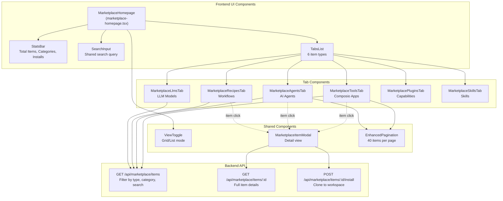
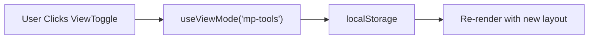
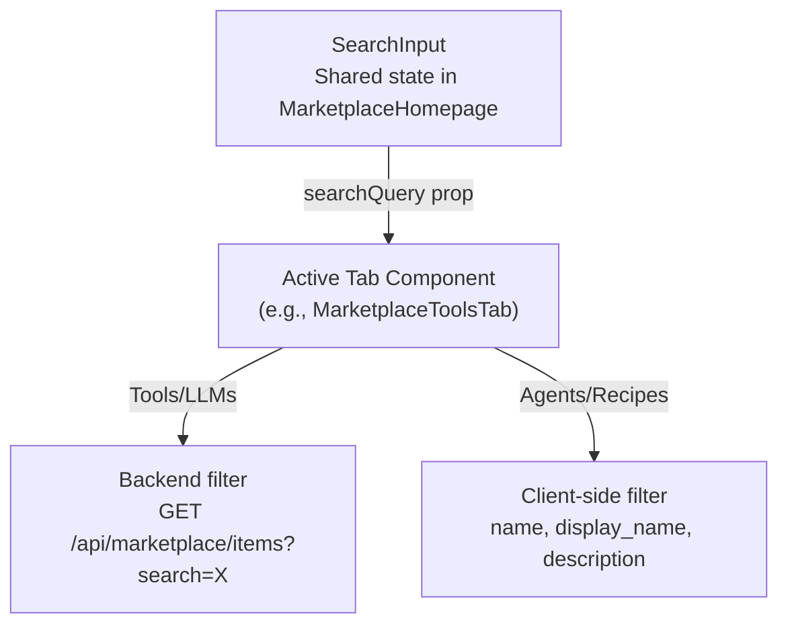
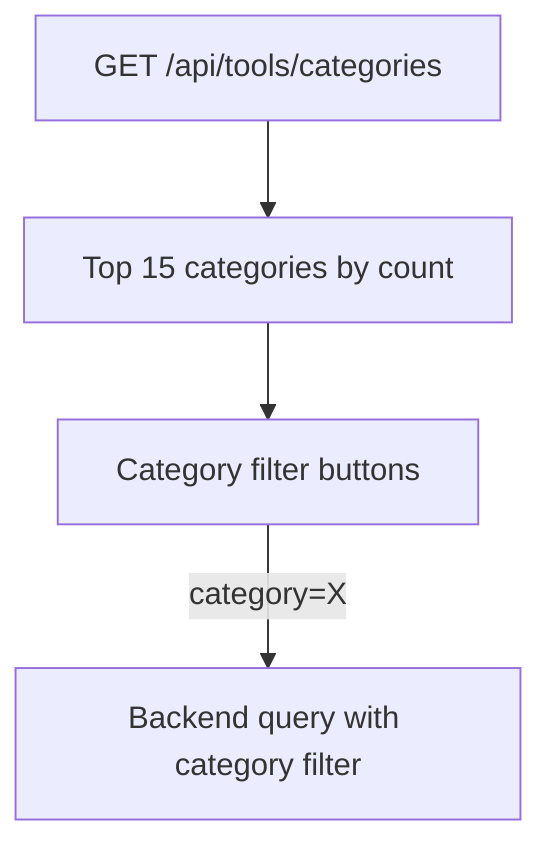
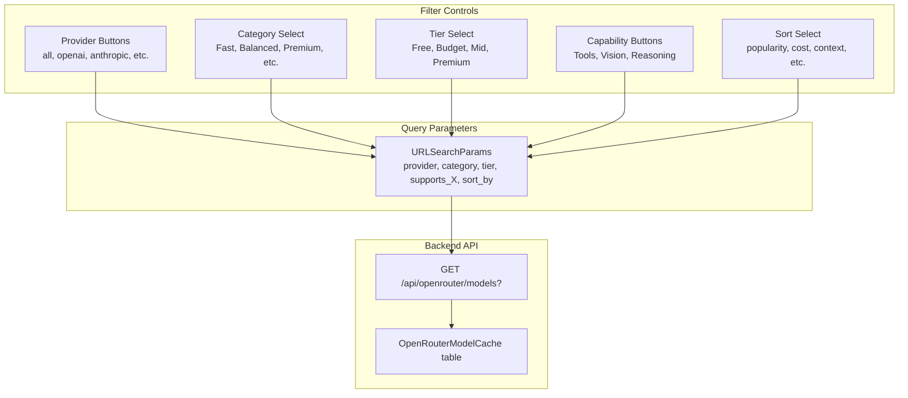
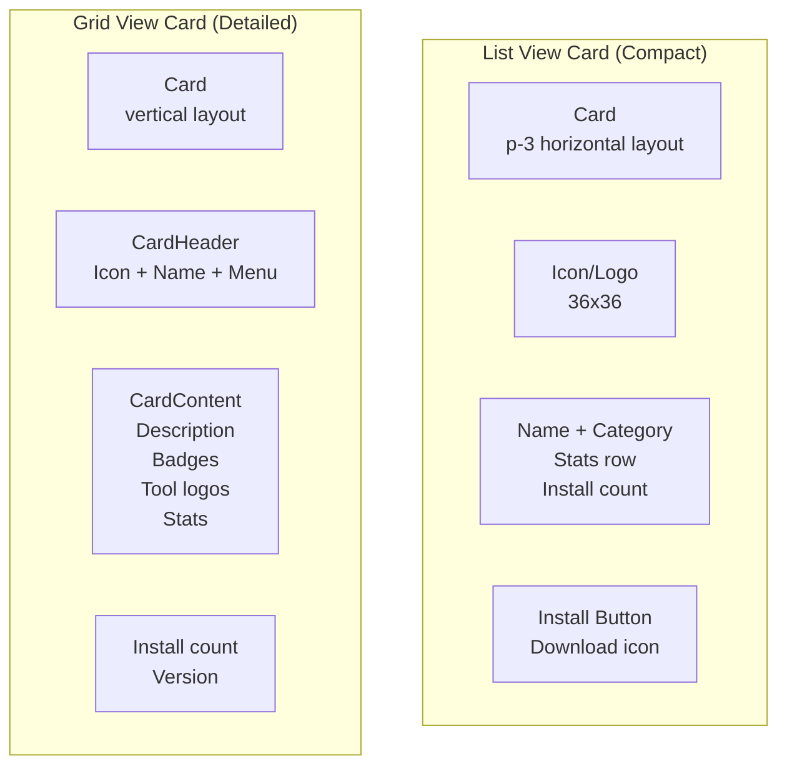
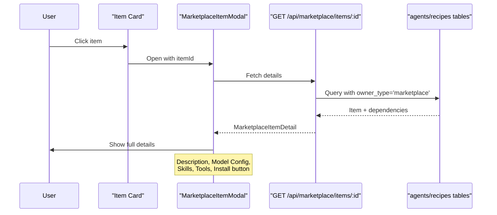
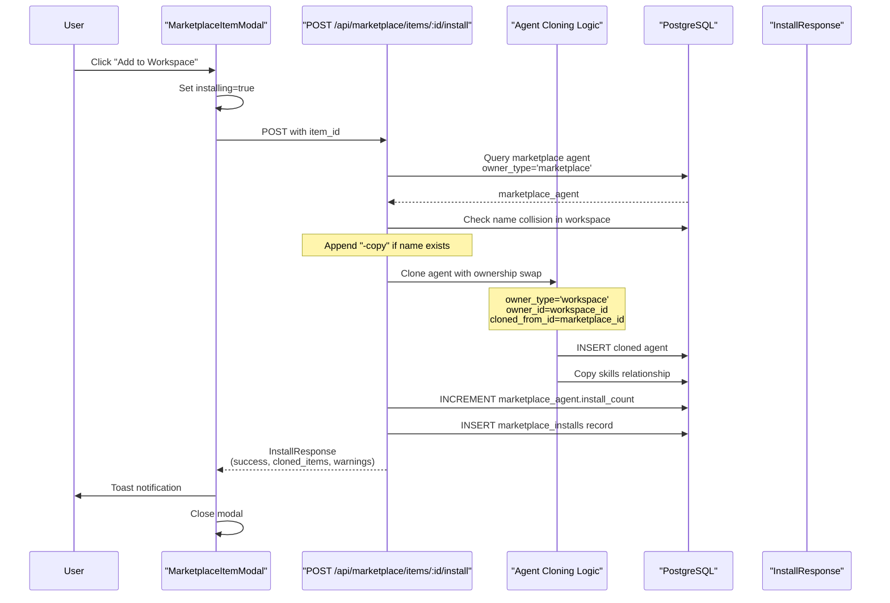

# Browsing & Installing Items

<details>
<summary>Relevant source files</summary>

The following files were used as context for generating this wiki page:

- [frontend/components/marketplace/marketplace-agents-tab.tsx](frontend/components/marketplace/marketplace-agents-tab.tsx)
- [frontend/components/marketplace/marketplace-card.tsx](frontend/components/marketplace/marketplace-card.tsx)
- [frontend/components/marketplace/marketplace-grid.tsx](frontend/components/marketplace/marketplace-grid.tsx)
- [frontend/components/marketplace/marketplace-homepage.tsx](frontend/components/marketplace/marketplace-homepage.tsx)
- [frontend/components/marketplace/marketplace-item-modal.tsx](frontend/components/marketplace/marketplace-item-modal.tsx)
- [frontend/components/marketplace/marketplace-llms-tab.tsx](frontend/components/marketplace/marketplace-llms-tab.tsx)
- [frontend/components/marketplace/marketplace-recipes-tab.tsx](frontend/components/marketplace/marketplace-recipes-tab.tsx)
- [frontend/components/marketplace/marketplace-tools-tab.tsx](frontend/components/marketplace/marketplace-tools-tab.tsx)
- [frontend/lib/agent-constants.ts](frontend/lib/agent-constants.ts)
- [orchestrator/api/marketplace.py](orchestrator/api/marketplace.py)
- [orchestrator/scripts/seed_llm_marketplace.py](orchestrator/scripts/seed_llm_marketplace.py)

</details>


This document describes the user interface and API flow for browsing, searching, filtering, and installing items from the Community Marketplace. It covers the multi-tab browsing experience, item detail views, and the installation process that clones marketplace items into a user's workspace.

For information about publishing items to the marketplace, see [Publishing to Marketplace](#10.3). For the backend database schema and approval workflow, see [Marketplace Backend](#10.4).

---

## Marketplace Interface Overview

The marketplace provides a unified browsing experience for six item types: **Applications** (Composio tools), **Agents**, **Recipes**, **LLMs**, **Capabilities** (plugins), and **Skills**. The interface is organized around a tabbed layout with shared search, category filtering, and view mode controls.



**Sources:** [frontend/components/marketplace/marketplace-homepage.tsx:38-167]()

---

## Browsing Items by Type

### Tab Organization

The marketplace uses a six-tab layout accessible via `TabsList` with the following item types:

| Tab | Label | Type Filter | Description |
|-----|-------|-------------|-------------|
| Tools | Applications | `type=tool` | 880+ Composio app integrations |
| Agents | Agents | `type=agent` | Pre-built AI agents with skills & tools |
| Recipes | Recipes | `type=recipe` | Multi-step workflows |
| LLMs | LLMs | `type=llm` | 400+ LLM models from OpenRouter |
| Plugins | Capabilities | N/A | Plugin content for agents |
| Skills | Skills | N/A | Reusable skill functions |

Each tab component independently fetches and displays items using the shared filtering API pattern.

**Sources:** [frontend/components/marketplace/marketplace-homepage.tsx:118-127]()

### View Modes

All tabs support two view modes controlled by `ViewToggle`:

1. **List View** - Compact horizontal cards (3 columns)
2. **Grid View** - Detailed vertical cards (4 columns)

View mode preference is persisted per tab using the `useViewMode` hook with keys like `'mp-tools'`, `'mp-agents'`, etc.



**Sources:** [frontend/components/marketplace/marketplace-tools-tab.tsx:78](), [frontend/components/marketplace/marketplace-agents-tab.tsx:86]()

---

## Searching and Filtering

### Search Implementation

The `SearchInput` component at the top of the marketplace provides real-time search across all tabs:



**Implementation varies by tab:**
- **Tools Tab:** Search query passed to backend API (`/api/tools/marketplace?search=X`)
- **Agents/Recipes Tabs:** Client-side filtering on fetched items
- **LLMs Tab:** Search query sent to OpenRouter cache API

**Sources:** [frontend/components/marketplace/marketplace-homepage.tsx:40](), [frontend/components/marketplace/marketplace-tools-tab.tsx:216-224]()

### Category Filtering

Each tab implements category-specific filters:

#### Tools Tab - Dynamic Categories
Categories are fetched from the backend API and displayed as horizontal scrolling buttons:



When a category is selected, the backend API is re-queried with `category=X` parameter:

```
GET /api/tools/marketplace?category=Communication&limit=1000
```

**Sources:** [frontend/components/marketplace/marketplace-tools-tab.tsx:92-106](), [frontend/components/marketplace/marketplace-tools-tab.tsx:114-143]()

#### Agents Tab - Fixed Categories
Predefined categories matching persona system:

| Category | Icon | Use Case |
|----------|------|----------|
| Personal Assistant | `UserCircle` | General assistant tasks |
| Customer Support | `Headphones` | Customer service automation |
| DevOps | `Terminal` | Infrastructure management |
| Data Analysis | `BarChart3` | Analytics and reporting |
| E-commerce | `ShoppingBag` | Online store operations |
| ... | ... | 10 total categories |

**Sources:** [frontend/components/marketplace/marketplace-agents-tab.tsx:27-39]()

#### Recipes Tab - Simple Type Filter
Three filter options:
- **All Recipes** - No type filter
- **Simple** - Single-step or basic workflows
- **Complex** - Multi-agent, multi-step workflows

**Sources:** [frontend/components/marketplace/marketplace-recipes-tab.tsx:30](), [frontend/components/marketplace/marketplace-recipes-tab.tsx:138-174]()

#### LLMs Tab - Multi-Dimensional Filtering

The LLM marketplace provides the most sophisticated filtering with:

1. **Provider Filter** - Dynamic chips built from cached model counts
2. **Category Dropdown** - Fast, Balanced, Premium, Coding, etc.
3. **Tier Dropdown** - Free, Budget, Mid-range, Premium
4. **Capability Toggles** - Tools, Vision, Reasoning
5. **Sort Options** - Popularity, Cost, Context, Newest, Name



**Sources:** [frontend/components/marketplace/marketplace-llms-tab.tsx:166-177](), [frontend/components/marketplace/marketplace-llms-tab.tsx:434-519]()

---

## Pagination

### Tools Tab Pagination

The Tools tab implements client-side pagination with 40 items per page using `EnhancedPagination`:

```typescript
// Paginated subset of filtered items
const paginatedApps = useMemo(() => {
    const startIndex = (currentPage - 1) * pageSize
    const endIndex = startIndex + pageSize
    return filteredApps.slice(startIndex, endIndex)
}, [filteredApps, currentPage, pageSize])

// Pagination data structure
const paginationData = useMemo(() => ({
    total: filteredApps.length,
    skip: (currentPage - 1) * pageSize,
    limit: pageSize,
    pages: Math.ceil(filteredApps.length / pageSize),
    current_page: currentPage
}), [filteredApps.length, currentPage, pageSize])
```

The pagination component renders page controls and automatically resets to page 1 when filters change.

**Sources:** [frontend/components/marketplace/marketplace-tools-tab.tsx:85-87](), [frontend/components/marketplace/marketplace-tools-tab.tsx:233-251](), [frontend/components/marketplace/marketplace-tools-tab.tsx:524-530]()

---

## Item Display

### Card Components

Each item type uses a consistent card structure with type-specific metadata:



#### Agent Card Metadata
- Agent name and creator
- Category badge
- Model name (truncated)
- Tool logos (first 5 with +N overflow)
- Install count

**Sources:** [frontend/components/marketplace/marketplace-agents-tab.tsx:196-236](), [frontend/components/marketplace/marketplace-agents-tab.tsx:238-357]()

#### Recipe Card Metadata
- Recipe name and creator
- Steps count
- Unique agents count
- Install count
- Category badge

**Sources:** [frontend/components/marketplace/marketplace-recipes-tab.tsx:198-238](), [frontend/components/marketplace/marketplace-recipes-tab.tsx:240-326]()

#### Tool Card Metadata
- App logo from Composio
- Display name and provider
- Tools count (actions)
- Triggers count
- Categories (first 2)
- Auth schemes (OAuth2, API Key, etc.)
- "Added" badge if in workspace

**Sources:** [frontend/components/marketplace/marketplace-tools-tab.tsx:607-709]()

---

## Item Detail View

### Detail Modal Architecture

Clicking an item opens `MarketplaceItemModal`, which fetches full item details from `/api/marketplace/items/{id}`:



### Detail Response Structure

The backend returns `MarketplaceItemDetail` with extended fields:

```python
class MarketplaceItemDetail(MarketplaceItemOut):
    dependencies: Dict[str, Any]
    # For agents: skills list with full details
    # For recipes: required_tools, recommended_agents
```

**Agent Details Include:**
- Full description
- LLM model configuration (provider, model_id, temperature, max_tokens, context_window)
- Model capabilities badges
- Assigned skills with descriptions
- Assigned tools with Composio logos and descriptions

**Recipe Details Include:**
- Full description
- Steps with agent assignments
- Required tools list
- Recommended agents
- Execution configuration

**Sources:** [orchestrator/api/marketplace.py:82-87](), [orchestrator/api/marketplace.py:355-428](), [orchestrator/api/marketplace.py:430-461]()

### Tool Detail Modal

For Composio apps, a separate `MarketplaceAppDetailsModal` shows:
- App name, description, categories
- Available actions (tools) list
- Trigger events list
- Auth schemes
- Installation instructions

**Sources:** [frontend/components/marketplace/marketplace-tools-tab.tsx:556-563]()

---

## Installing Items

### Installation Flow

The installation process clones marketplace items into the user's workspace with ownership swap:



**Sources:** [orchestrator/api/marketplace.py:468-580]()

### Installation Code Details

The cloning logic in `POST /api/marketplace/items/{item_id}/install`:

```python
# Check name collision
name_exists = db.query(Agent).filter(
    Agent.name == marketplace_agent.name,
    Agent.workspace_id == ctx.workspace_id,
    Agent.owner_type == 'workspace'
).first() is not None

agent_name = f"{marketplace_agent.name}-copy" if name_exists else marketplace_agent.name

# Clone with ownership swap
cloned_agent = Agent(
    name=agent_name,
    description=marketplace_agent.description,
    agent_type=marketplace_agent.agent_type,
    configuration=marketplace_agent.configuration,
    model_config=marketplace_agent.model_config,
    
    # Ownership swap
    owner_type='workspace',
    owner_id=str(ctx.workspace_id),
    workspace_id=ctx.workspace_id,
    created_by_user_id=user_id_int,
    
    # Tracking
    cloned_from_id=marketplace_agent.id,
    original_creator_id=marketplace_agent.original_creator_id,
    
    # Reset marketplace fields
    is_approved=True,
    is_featured=False,
    install_count=0,
    version=marketplace_agent.version
)

# Copy skills relationship
if marketplace_agent.skills:
    cloned_agent.skills = marketplace_agent.skills
```

**Sources:** [orchestrator/api/marketplace.py:502-542]()

### Tool Installation (Composio Apps)

Composio app installation uses a different endpoint:

```
POST /api/tools/add-to-workspace
Body: { "app_name": "slack" }
```

This creates a `WorkspaceTool` record with `status='added'`. The user must then connect OAuth credentials via the Tools dashboard to activate the app.

**Sources:** [frontend/components/marketplace/marketplace-tools-tab.tsx:253-306]()

### Recipe Installation

Recipe installation uses a dedicated hook `useInstallRecipeFromMarketplace` which:
1. Clones the recipe with ownership swap
2. Attempts to resolve agent dependencies from marketplace
3. Returns warnings for missing dependencies

**Sources:** [frontend/components/marketplace/marketplace-recipes-tab.tsx:39](), [frontend/components/marketplace/marketplace-recipes-tab.tsx:98-132]()

---

## Backend API Reference

### List Marketplace Items

```
GET /api/marketplace/items
Query Parameters:
  - type: string (optional) - Filter by 'agent', 'recipe', 'skill', 'llm', 'tool'
  - category: string (optional) - Filter by category
  - search: string (optional) - Search name/description
  - featured: boolean (optional) - Featured items only
  - limit: integer (default: 50, max: 100)
  - offset: integer (default: 0)

Response: List[MarketplaceItemOut]
  - Items ordered by install_count DESC, created_at DESC
  - Only approved items returned (unless admin)
  - Global pagination when type=None, per-type when type specified
```

**Query Logic:**
- When `type` is specified, queries single table with limit/offset
- When `type=None`, fetches from multiple tables, sorts by install count, then applies global pagination

**Sources:** [orchestrator/api/marketplace.py:122-309]()

### Get Item Details

```
GET /api/marketplace/items/{item_id}

Response: MarketplaceItemDetail
  - Full item metadata
  - dependencies object with related items
  - For agents: skills list, tool assignments with Composio metadata
  - For recipes: steps, inputs, outputs, execution_config
```

**Sources:** [orchestrator/api/marketplace.py:315-353]()

### Install Item

```
POST /api/marketplace/items/{item_id}/install

Response: InstallResponse
  - success: boolean
  - message: string
  - cloned_items: List[Dict] - IDs and types of cloned items
  - warnings: List[str] - Missing dependencies or issues
```

**Side Effects:**
1. Creates workspace-owned clone of item
2. Increments `install_count` on marketplace item
3. Records installation in `marketplace_installs` table
4. Copies skill relationships for agents

**Sources:** [orchestrator/api/marketplace.py:468-580]()

---

## Frontend Hooks

### useMarketplaceItems

React Query hook for fetching marketplace items:

```typescript
const { data: items, isLoading } = useMarketplaceItems({
    type: 'agent',
    category: 'DevOps',
    search: 'github',
    limit: 50
})
```

**Sources:** [frontend/components/marketplace/marketplace-agents-tab.tsx:96-101]()

### useInstallMarketplaceItem

Mutation hook for installing items:

```typescript
const installMutation = useInstallMarketplaceItem()

await installMutation.mutateAsync(itemId)
```

**Sources:** [frontend/components/marketplace/marketplace-agents-tab.tsx:104]()

### useAvailableApps (Composio Tools)

Hook for fetching Composio apps from DB cache:

```typescript
const { data: apps, isLoading } = useAvailableApps()
```

This returns apps from `/api/tools/marketplace` which queries the `composio_apps_cache` table for fast response times.

**Sources:** [frontend/components/marketplace/marketplace-tools-tab.tsx:108-148]()

---

## Performance Optimizations

### Tools Tab - DB Cache Strategy

The Tools tab avoids the 48+ API calls per page load by using a cached database table:

```
GET /api/tools/marketplace?category=X&limit=1000
  → Queries composio_apps_cache table
  → Returns apps with is_connected status
  → Sub-200ms response time
```

This eliminates the need to call Composio SDK for every marketplace page load.

**Sources:** [frontend/components/marketplace/marketplace-tools-tab.tsx:110-143]()

### LLMs Tab - OpenRouter Cache

Similar caching strategy for LLM models using `openrouter_model_cache` table:

```
GET /api/openrouter/models?provider=X&sort_by=popularity
  → Queries openrouter_model_cache table
  → Returns 400+ models with filters
  → Includes provider counts for dynamic filter chips
```

**Sources:** [frontend/components/marketplace/marketplace-llms-tab.tsx:203-286]()

### Client-Side Filtering

Agents and Recipes tabs fetch all matching items once, then apply filters client-side for instant feedback:

```typescript
const filteredApps = useMemo(() => {
    let filtered = [...apps]
    
    if (searchQuery.trim()) {
        const query = searchQuery.toLowerCase()
        filtered = filtered.filter(app =>
            app.name.toLowerCase().includes(query) ||
            app.display_name.toLowerCase().includes(query) ||
            app.description?.toLowerCase().includes(query)
        )
    }
    
    return filtered
}, [apps, searchQuery])
```

**Sources:** [frontend/components/marketplace/marketplace-tools-tab.tsx:212-230]()

---

## Admin Features

Admins see additional controls in the marketplace:

1. **Pending Badge** - Unapproved items show yellow "Pending" badge
2. **Approve Button** - In dropdown menu for pending items
3. **Delete Button** - Remove items from marketplace
4. **Sync Cache Button** - For Tools and LLMs tabs to refresh cached data

Admin status is determined by checking if email contains `'automatos.app'`:

```typescript
const isAdmin = user?.emailAddresses?.[0]?.emailAddress?.includes('automatos.app') || false
```

**Sources:** [frontend/components/marketplace/marketplace-agents-tab.tsx:93](), [frontend/components/marketplace/marketplace-tools-tab.tsx:76](), [frontend/components/marketplace/marketplace-tools-tab.tsx:398-409]()

---