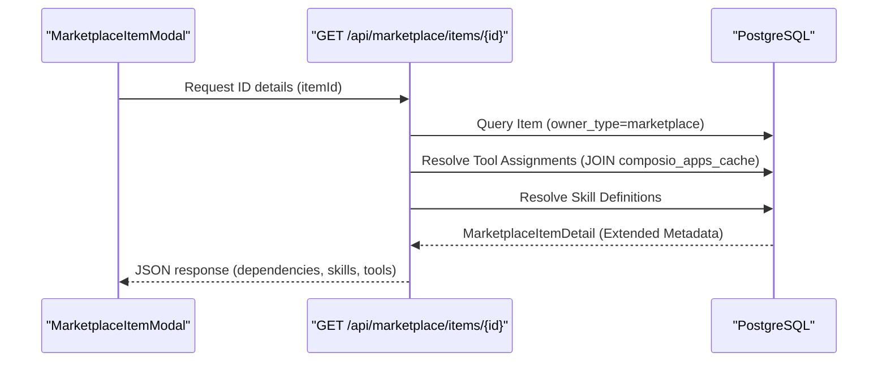

# Browsing & Installing Items

<details>
<summary>Relevant source files</summary>

The following files were used as context for generating this wiki page:

- [frontend/components/marketplace/marketplace-card.tsx](frontend/components/marketplace/marketplace-card.tsx)
- [frontend/components/marketplace/marketplace-grid.tsx](frontend/components/marketplace/marketplace-grid.tsx)
- [frontend/components/marketplace/marketplace-item-modal.tsx](frontend/components/marketplace/marketplace-item-modal.tsx)
- [frontend/hooks/use-marketplace-api.ts](frontend/hooks/use-marketplace-api.ts)
- [orchestrator/api/marketplace.py](orchestrator/api/marketplace.py)
- [orchestrator/modules/coordination/__init__.py](orchestrator/modules/coordination/__init__.py)
- [orchestrator/modules/coordination/agent_matcher.py](orchestrator/modules/coordination/agent_matcher.py)
- [orchestrator/modules/coordination/templates.py](orchestrator/modules/coordination/templates.py)

</details>


This document describes the technical implementation of the Community Marketplace UI and API. It covers the multi-tab browsing experience, advanced filtering for different item types (Agents, Recipes, Tools, LLMs), and the installation flow that clones marketplace items into a user's workspace while tracking installation metrics.

---

## Marketplace Interface Overview

The marketplace provides a unified browsing experience for six item types: **Applications** (Composio tools), **Agents**, **Recipes**, **LLMs**, **Capabilities** (plugins), and **Skills**. The interface is organized around a tabbed layout with shared search, category filtering, and view mode controls.

### Component Architecture

The frontend is structured to handle high-volume data (especially for Tools and LLMs) by using a mix of server-side filtering and client-side pagination.

**Marketplace UI & API Interaction**
```mermaid
graph TB
    subgraph "Frontend UI Components"
        [Homepage] --> [StatsBar]
        [Homepage] --> [SearchInput]
        [Homepage] --> [TabsList]
        [Homepage] --> [ViewToggle]
    end
    
    subgraph "Tab Components"
        [TabsList] --> [ToolsTab]
        [TabsList] --> [AgentsTab]
        [TabsList] --> [RecipesTab]
        [TabsList] --> [LlmsTab]
    end
    
    subgraph "Shared Components"
        [ToolsTab] --> [Pagination]
        [AgentsTab] --> [Pagination]
        [ToolsTab] -. "item click" .-> [ItemModal]
        [AgentsTab] -. "item click" .-> [ItemModal]
    end
    
    subgraph "Backend API"
        [ItemModal] --> [DetailAPI]
        [ItemModal] --> [InstallAPI]
        [AgentsTab] --> [ListAPI]
        [ToolsTab] --> [ToolMarketplaceAPI]
    end

    [Homepage]["MarketplaceHomepage"]
    [StatsBar]["StatsBar"]
    [SearchInput]["SearchInput"]
    [TabsList]["TabsList"]
    [ToolsTab]["MarketplaceToolsTab"]
    [AgentsTab]["MarketplaceAgentsTab"]
    [RecipesTab]["MarketplaceRecipesTab"]
    [LlmsTab]["MarketplaceLlmsTab"]
    [ViewToggle]["ViewToggle"]
    [ItemModal]["MarketplaceItemModal"]
    [Pagination]["EnhancedPagination"]
    [ListAPI]["GET /api/marketplace/items"]
    [DetailAPI]["GET /api/marketplace/items/:id"]
    [InstallAPI]["POST /api/marketplace/items/:id/install"]
    [ToolMarketplaceAPI]["GET /api/tools/marketplace"]
```

**Sources:** `[orchestrator/api/marketplace.py:122-137]()`, `[frontend/components/marketplace/marketplace-item-modal.tsx:62-80]()`, `[frontend/components/marketplace/marketplace-grid.tsx:35-51]()`

---

## Browsing Items by Type

### Tab Organization

The marketplace uses a six-tab layout with the following item types. Backend queries distinguish items primarily via the `owner_type` and `type` fields.

| Tab | Label | Type Filter | Backend Source |
|-----|-------|-------------|----------------|
| Tools | Applications | `type=tool` | `composio_apps_cache` table |
| Agents | Agents | `type=agent` | `agents` table (`owner_type=marketplace`) |
| Recipes | Recipes | `type=recipe` | `workflow_templates` table (`owner_type=marketplace`) |
| LLMs | LLMs | `type=llm` | `openrouter_model_cache` table |

**Sources:** `[orchestrator/api/marketplace.py:53-68]()`, `[orchestrator/api/marketplace.py:154-157]()`, `[frontend/hooks/use-marketplace-api.ts:21-37]()`

### Item Discovery Components

The `MarketplaceGrid` handles the layout of `MarketplaceCard` components. It utilizes the `useMarketplaceItems` hook to fetch data based on current filters.

- **MarketplaceCard:** A visual wrapper that displays `item.icon`, `item.name`, `item.creator_name`, and formatted `install_count`. `[frontend/components/marketplace/marketplace-card.tsx:13-78]()`
- **Install Count Formatting:** Large numbers are abbreviated (e.g., 1000 -> 1.0k) for UI clarity. `[frontend/components/marketplace/marketplace-card.tsx:14-18]()`

---

## Searching and Filtering

### Search Implementation

The `list_items` endpoint in `orchestrator/api/marketplace.py` implements search using SQLAlchemy's `or_` and `ilike` operators across the `name` and `description` columns.

- **Agents:** Filters where `Agent.owner_type == 'marketplace'` and name/description matches. `[orchestrator/api/marketplace.py:163-167]()`
- **Recipes:** Filters where `WorkflowRecipe.owner_type == 'marketplace'` and name/description matches. `[orchestrator/api/marketplace.py:236-240]()`

### Featured and Pagination

Items can be marked as `is_featured` in the database. The API supports a `featured` boolean query parameter to prioritize these items. `[orchestrator/api/marketplace.py:169-170]()`. Pagination is handled via standard `limit` and `offset` parameters. `[orchestrator/api/marketplace.py:128-129]()`

---

## Item Detail Modals

When a user clicks a marketplace card, the `MarketplaceItemModal` is triggered. This component performs a specific fetch for extended metadata.

**Detail Fetching & Dependency Resolution**


The modal displays:
- **Model Config:** Extracted from `item.metadata.model_config` or `item.metadata.configuration.llm_config`. `[frontend/components/marketplace/marketplace-item-modal.tsx:91-101]()`
- **Tools & Skills:** Renders icons and descriptions for dependencies required by the agent or recipe. `[frontend/components/marketplace/marketplace-item-modal.tsx:83-89]()`

**Sources:** `[orchestrator/api/marketplace.py:82-88]()`, `[frontend/components/marketplace/marketplace-item-modal.tsx:43-60]()`

---

## Installation Flow

Installation involves a server-side "clone" operation where a marketplace-owned template is copied into the user's workspace.

### Technical Implementation

The installation is triggered by the `useInstallMarketplaceItem` hook, which calls the `install_item` endpoint.

1. **Cloning:** The backend creates a new instance of the item (Agent or Recipe).
2. **Ownership:** The `owner_type` is changed from `marketplace` to `workspace`, and the `workspace_id` is set to the user's current workspace.
3. **Tracking:** The original item's `install_count` is incremented.
4. **Invalidation:** On success, the frontend invalidates the `['agents']` query key to refresh the local workspace view. `[frontend/hooks/use-marketplace-api.ts:145-147]()`

**Installation Code Entity Mapping**
```mermaid
graph LR
    subgraph "API Layer"
        [Route] --> [Request]
    end
    
    subgraph "Database Models (SQLAlchemy)"
        [M_Item]
        [W_Item]
        [User]
    end
    
    subgraph "Logic (orchestrator/api/marketplace.py)"
        [Route] --> [CloneFunc]
        [CloneFunc] --> [W_Item]
        [CloneFunc] --> [IncrFunc]
    end

    [Route]["POST /api/marketplace/items/{item_id}/install"]
    [Request]["InstallRequest (Pydantic)"]
    [M_Item]["Marketplace Item (owner_type=marketplace)"]
    [W_Item]["Workspace Item (owner_type=workspace)"]
    [User]["UserModel (for original_creator_id)"]
    [CloneFunc]["db.add(cloned_item)"]
    [IncrFunc]["item.install_count += 1"]
```

**Sources:** `[orchestrator/api/marketplace.py:89-98]()`, `[frontend/hooks/use-marketplace-api.ts:138-160]()`, `[frontend/components/marketplace/marketplace-item-modal.tsx:62-80]()`

---

## Admin & Approval Workflow

The marketplace operates on an "Approved" model. Items are not visible to standard users until an admin approves them.

- **Admin Detection:** Determined by `system_role == 'admin'` in the `RequestContext`. `[orchestrator/api/marketplace.py:36-40]()`
- **Visibility:** The `list_items` function applies a filter `Agent.is_approved == True` for non-admin users. `[orchestrator/api/marketplace.py:156-157]()`
- **Approval Check:** Admins can see unapproved items to review them before they are public.

**Sources:** `[orchestrator/api/marketplace.py:43-47]()`, `[orchestrator/api/marketplace.py:139-140]()`

---