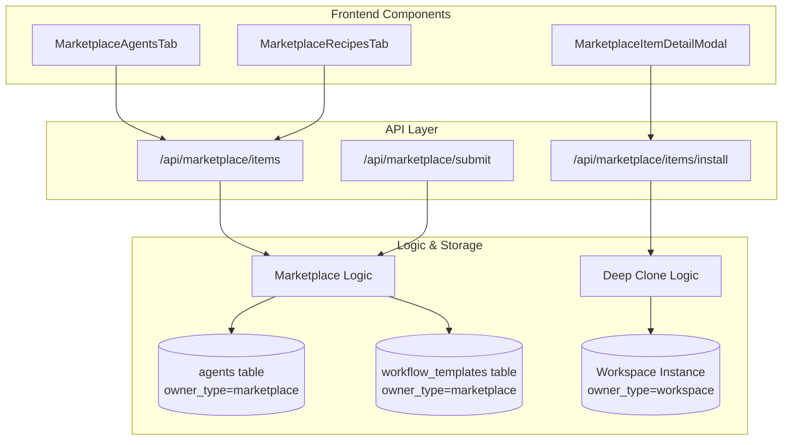

# Marketplace API Reference

Relevant source files

The following files were used as context for generating this wiki page:

- [frontend/hooks/use-marketplace-api.ts](frontend/hooks/use-marketplace-api.ts)
- [orchestrator/api/marketplace.py](orchestrator/api/marketplace.py)
- [orchestrator/modules/coordination/__init__.py](orchestrator/modules/coordination/__init__.py)
- [orchestrator/modules/coordination/agent_matcher.py](orchestrator/modules/coordination/agent_matcher.py)
- [orchestrator/modules/coordination/templates.py](orchestrator/modules/coordination/templates.py)

This document provides a comprehensive reference for the Marketplace API endpoints, which enable browsing, installing, and managing marketplace items including agents, recipes, tools, and LLMs.

---

## Purpose and Scope

The Marketplace API exposes REST endpoints for:
- **Browsing marketplace items** by type, category, and search query. [orchestrator/api/marketplace.py:122-132]()
- **Installing items** to workspaces (agents, recipes, LLMs). [orchestrator/api/marketplace.py:453-460]()
- **Submitting items** for marketplace approval from a private workspace. [orchestrator/api/marketplace.py:688-698]()
- **Managing installation statistics** and popularity metrics. [orchestrator/api/marketplace.py:62-68]()

All endpoints are authenticated via hybrid authentication (Clerk JWT + API keys) and enforce workspace isolation for installed instances. [orchestrator/api/marketplace.py:130]()

---

## Marketplace API Architecture

The marketplace system uses a **single-table architecture** for core entities like agents and recipes, using an `owner_type` discriminator to separate workspace-private items from global marketplace items. [orchestrator/api/marketplace.py:154-157]()

### Code Entity Space Mapping

| System Concept | Code Entity (Backend) | Code Entity (Frontend) |
| :--- | :--- | :--- |
| **Marketplace Router** | `orchestrator/api/marketplace.py` | `useMarketplaceItems` |
| **Item Model (Out)** | `MarketplaceItemOut` | `MarketplaceItem` |
| **Item Detail** | `MarketplaceItemDetail` | `useMarketplaceItem` |
| **Install Logic** | `install_item` | `useInstallMarketplaceItem` |

**Sources:** [orchestrator/api/marketplace.py:29-30](), [orchestrator/api/marketplace.py:53-88](), [frontend/hooks/use-marketplace-api.ts:21-37](), [frontend/hooks/use-marketplace-api.ts:138-144]()

### System Flow Diagram

**Sources:** [orchestrator/api/marketplace.py:29-30](), [orchestrator/api/marketplace.py:122-132](), [orchestrator/api/marketplace.py:453-460](), [orchestrator/api/marketplace.py:688-698]()

---

## Core Marketplace Endpoints

### GET /api/marketplace/items
List and filter marketplace items across all types. [orchestrator/api/marketplace.py:122-132]()

**Query Parameters:**
- `type`: Filter by item type (`agent`, `recipe`, `skill`, `llm`, `tool`). [orchestrator/api/marketplace.py:124]()
- `category`: Filter by functional category (e.g., `Development`, `Marketing`). [orchestrator/api/marketplace.py:125]()
- `search`: Full-text search in name and description. [orchestrator/api/marketplace.py:126]()
- `featured`: Filter for promoted items. [orchestrator/api/marketplace.py:127]()

**Implementation Details:**
The endpoint performs queries on `Agent` and `WorkflowRecipe` tables where `owner_type == 'marketplace'`. [orchestrator/api/marketplace.py:154-157]() It supports global pagination across types when no specific type is requested by fetching all matching rows and applying global offset/limit. [orchestrator/api/marketplace.py:148-150]()

### POST /api/marketplace/items/install
Install a marketplace item to the current workspace. This triggers a **Cloning Operation**. [orchestrator/api/marketplace.py:453-460]()

**Installation Logic:**
1. **Validation**: Checks if the source item exists and has `owner_type == 'marketplace'`. [orchestrator/api/marketplace.py:470-474]()
2. **Deep Copy**: Creates a new instance of the Agent or Recipe. [orchestrator/api/marketplace.py:488-510]()
3. **Isolation**: Changes `owner_type` to `workspace` and assigns the current `workspace_id` to the new instance. [orchestrator/api/marketplace.py:511-512]()
4. **Metrics**: Increments the global `install_count` on the original marketplace record. [orchestrator/api/marketplace.py:534-535]()

---

## Submission and Approval

Users can submit their own workspace items to the community marketplace. [orchestrator/api/marketplace.py:688-698]()

### Submission Flow
1. **Request**: The user provides the `agent_id` or `recipe_id` from their workspace. [orchestrator/api/marketplace.py:100-107]()
2. **Cloning**: The system clones the item but sets `is_approved = False` (unless the user is an admin). [orchestrator/api/marketplace.py:726-731]()
3. **Owner Type**: The new record's `owner_type` is set to `marketplace`. [orchestrator/api/marketplace.py:734]()
4. **Admin Review**: Admin users can view unapproved items via the `list_items` endpoint. [orchestrator/api/marketplace.py:156-157]()

---

## Marketplace Data Models

### MarketplaceItemOut
Standardized response model for marketplace browsing. [orchestrator/api/marketplace.py:53-79]()

| Field | Type | Description |
| :--- | :--- | :--- |
| `id` | `int` | Unique identifier. |
| `type` | `str` | `agent`, `recipe`, `skill`, `llm`, or `tool`. |
| `install_count`| `int` | Total global installations. |
| `is_approved` | `bool` | Approval status for public listing. |
| `metadata` | `dict` | Type-specific configuration (e.g., icons, tags). |

### MarketplaceItemDetail
Extended model providing dependency information for deep inspection. [orchestrator/api/marketplace.py:82-87]()

| Field | Type | Description |
| :--- | :--- | :--- |
| `dependencies` | `dict` | Required tools or skills for the item. |
| `steps` | `list` | (Recipes only) The workflow step definitions. |

---

## Frontend Integration

The frontend utilizes React Query hooks defined in `use-marketplace-api.ts` to interact with these endpoints. [frontend/hooks/use-marketplace-api.ts:8-10]()

- **`useMarketplaceItems`**: Fetches the paginated list of items with automatic caching. [frontend/hooks/use-marketplace-api.ts:97-110]()
- **`useInstallMarketplaceItem`**: Executes the installation mutation and invalidates the `agents` query cache upon success to reflect the new item in the user's workspace. [frontend/hooks/use-marketplace-api.ts:138-160]()
- **`useSubmitToMarketplace`**: Handles the submission of a workspace agent to the marketplace with success/error toast notifications. [frontend/hooks/use-marketplace-api.ts:61-92]()

**Sources:** [orchestrator/api/marketplace.py:53-88](), [orchestrator/api/marketplace.py:122-132](), [orchestrator/api/marketplace.py:453-460](), [frontend/hooks/use-marketplace-api.ts:13-18](), [frontend/hooks/use-marketplace-api.ts:61-92]()

---