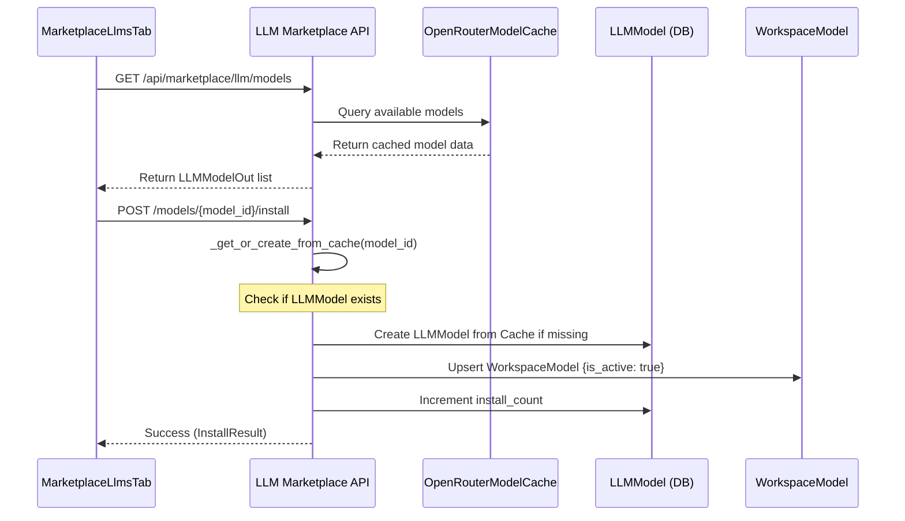
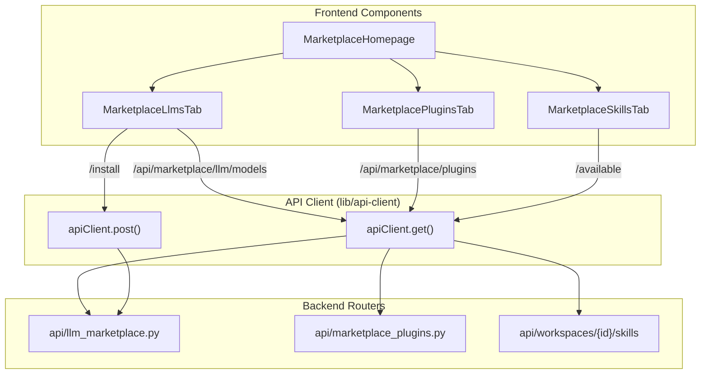

# Marketplace API Reference

Relevant source files

The following files were used as context for generating this wiki page:

- [frontend/components/marketplace/llm-model-card.tsx](frontend/components/marketplace/llm-model-card.tsx)
- [frontend/components/marketplace/llm-model-detail-modal.tsx](frontend/components/marketplace/llm-model-detail-modal.tsx)
- [frontend/components/marketplace/marketplace-agents-tab.tsx](frontend/components/marketplace/marketplace-agents-tab.tsx)
- [frontend/components/marketplace/marketplace-homepage.tsx](frontend/components/marketplace/marketplace-homepage.tsx)
- [frontend/components/marketplace/marketplace-llms-tab.tsx](frontend/components/marketplace/marketplace-llms-tab.tsx)
- [frontend/components/marketplace/marketplace-plugin-detail-modal.tsx](frontend/components/marketplace/marketplace-plugin-detail-modal.tsx)
- [frontend/components/marketplace/marketplace-plugins-tab.tsx](frontend/components/marketplace/marketplace-plugins-tab.tsx)
- [frontend/components/marketplace/marketplace-skills-tab.tsx](frontend/components/marketplace/marketplace-skills-tab.tsx)
- [frontend/components/marketplace/marketplace-tools-tab.tsx](frontend/components/marketplace/marketplace-tools-tab.tsx)
- [frontend/hooks/use-openrouter-api.ts](frontend/hooks/use-openrouter-api.ts)
- [orchestrator/api/llm_marketplace.py](orchestrator/api/llm_marketplace.py)
- [orchestrator/api/marketplace_plugins.py](orchestrator/api/marketplace_plugins.py)
- [orchestrator/api/openrouter_marketplace.py](orchestrator/api/openrouter_marketplace.py)
- [orchestrator/core/database/migrations/042_openrouter_models_cache.sql](orchestrator/core/database/migrations/042_openrouter_models_cache.sql)
- [orchestrator/scripts/seed_llm_marketplace.py](orchestrator/scripts/seed_llm_marketplace.py)

This document provides a technical reference for the Marketplace API endpoints, enabling discovery, installation, and management of community-contributed agents, recipes, tools, plugins, and LLMs.

---

## Purpose and Scope

The Marketplace API serves as the bridge between global community assets and private workspace instances. It handles:
- **Discovery**: Filtering and searching across multiple entity types (Agents, Recipes, LLMs, Plugins, Skills). [orchestrator/api/marketplace_plugins.py:169-180](), [orchestrator/api/llm_marketplace.py:212-225]()
- **Installation (Cloning)**: The process of deep-copying a marketplace template into a workspace-private instance. [orchestrator/api/llm_marketplace.py:265-275]()
- **Plugin Management**: Browsing and enabling specialized agent capabilities via manifest-driven plugins. [orchestrator/api/marketplace_plugins.py:1-10]()
- **LLM Selection**: Browsing and comparing 400+ models from providers like OpenAI, Anthropic, and OpenRouter. [orchestrator/api/llm_marketplace.py:1-7]()

---

## Marketplace Architecture

The system utilizes an `owner_type` discriminator pattern for items. Global templates are marked as `marketplace`, while private instances are tied to a specific `workspace_id`. [frontend/components/marketplace/marketplace-homepage.tsx:36-51]()

### Code Entity Mapping

| System Concept | Backend Entity | Frontend Entity |
| :--- | :--- | :--- |
| **LLM Marketplace** | `orchestrator/api/llm_marketplace.py` | `MarketplaceLlmsTab` |
| **Plugin Registry** | `orchestrator/api/marketplace_plugins.py` | `MarketplacePluginsTab` |
| **Model Model** | `core.models.core.LLMModel` | `LLMModelCard` |
| **Plugin Summary** | `PluginSummaryOut` | `PluginSummary` |
| **Skill Registry** | `core.models.core.Skill` | `MarketplaceSkillsTab` |

**Sources:** [orchestrator/api/llm_marketplace.py:25-30](), [orchestrator/api/marketplace_plugins.py:34-40](), [frontend/components/marketplace/marketplace-llms-tab.tsx:161-170](), [frontend/components/marketplace/marketplace-plugins-tab.tsx:52-73]()

### LLM Installation and Cache Flow

The marketplace bridges the gap between the `OpenRouterModelCache` (for browsing) and the `LLMModel` table (for workspace installation).

**Sources:** [orchestrator/api/llm_marketplace.py:101-143](), [orchestrator/api/llm_marketplace.py:265-285](), [frontend/components/marketplace/llm-model-card.tsx:124-147]()

---

## API Endpoint Reference

### LLM Marketplace
`GET /api/marketplace/llm/models`
Lists available LLMs. It checks for available providers based on the workspace's configured API keys (BYOK or Credential Store). [orchestrator/api/llm_marketplace.py:212-225]()

- **Provider Detection**: Uses `_get_available_providers` to only show models the user can actually run. [orchestrator/api/llm_marketplace.py:146-160]()
- **Installation Status**: Per-request check via `_get_installed_ids` to show "Installed" badges in UI. [orchestrator/api/llm_marketplace.py:199-207]()

### Marketplace Plugins
`GET /api/marketplace/plugins`
Lists approved and active plugins. [orchestrator/api/marketplace_plugins.py:169-180]()

- **Content Extraction**: The backend parses the plugin manifest to extract human-readable lists of skills, commands, and agents using `_extract_content_items`. [orchestrator/api/marketplace_plugins.py:133-162]()
- **Security Status**: Displays `security_status` (safe, review_required, blocked) derived from automated scanners. [frontend/components/marketplace/marketplace-plugin-detail-modal.tsx:197-228]()

### Skills & Capabilities
`GET /api/workspaces/{workspace_id}/skills/available`
Lists skills that can be injected into agents within a specific workspace. [frontend/components/marketplace/marketplace-skills-tab.tsx:82-95]()

---

## Technical Implementation Details

### Multi-Tier Search & Filtering
The Marketplace UI implements complex client-side and server-side filtering:
1. **Category Normalization**: For agents, legacy categories are mapped to a unified system via `normalizeCategory`. [frontend/components/marketplace/marketplace-agents-tab.tsx:39-45]()
2. **LLM Comparison**: Users can select multiple models to compare costs (input/output) and capabilities (vision, tools, streaming). [frontend/components/marketplace/marketplace-llms-tab.tsx:183-184](), [frontend/components/marketplace/llm-model-card.tsx:154-155]()
3. **Tool Pagination**: The tools marketplace handles high-volume data (1000+ apps) with a 40-item pagination strategy. [frontend/components/marketplace/marketplace-tools-tab.tsx:77-79]()

### Marketplace Tool Execution Flow

This diagram shows how the frontend components interact with the `apiClient` to manage marketplace assets.

**Sources:** [frontend/components/marketplace/marketplace-homepage.tsx:53-74](), [frontend/components/marketplace/marketplace-llms-tab.tsx:217-220](), [frontend/components/marketplace/marketplace-plugins-tab.tsx:160-170](), [frontend/components/marketplace/marketplace-skills-tab.tsx:82-90]()

---

## Security and Admin Operations

- **Admin Visibility**: Admins can see pending items. For plugins, the frontend merges results from `/api/marketplace/plugins` and `/api/admin/plugins/pending`. [frontend/components/marketplace/marketplace-plugins-tab.tsx:174-180]()
- **Approval Workflow**: Admins approve items via POST requests (e.g., `/api/admin/plugins/{id}/approve`), which updates the `approval_status` and makes the item public. [frontend/components/marketplace/marketplace-plugin-detail-modal.tsx:160-173]()
- **Data Isolation**: All workspace-specific operations (like enabling a skill) require a `workspace_id` in the URL or payload, ensuring cross-tenant isolation. [frontend/components/marketplace/marketplace-skills-tab.tsx:102-107]()

**Sources:** [orchestrator/api/marketplace_plugins.py:30-32](), [frontend/components/marketplace/marketplace-agents-tab.tsx:108-122]()

---