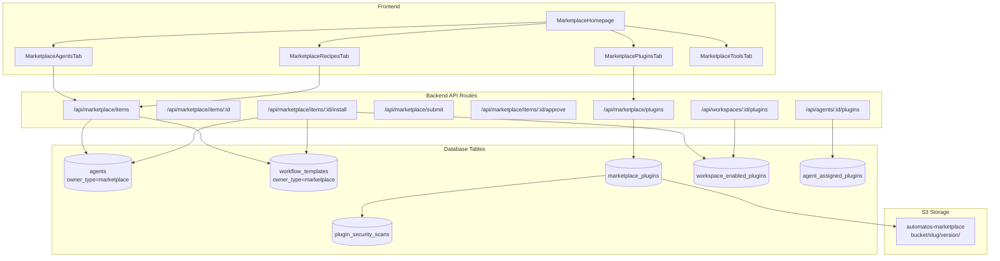
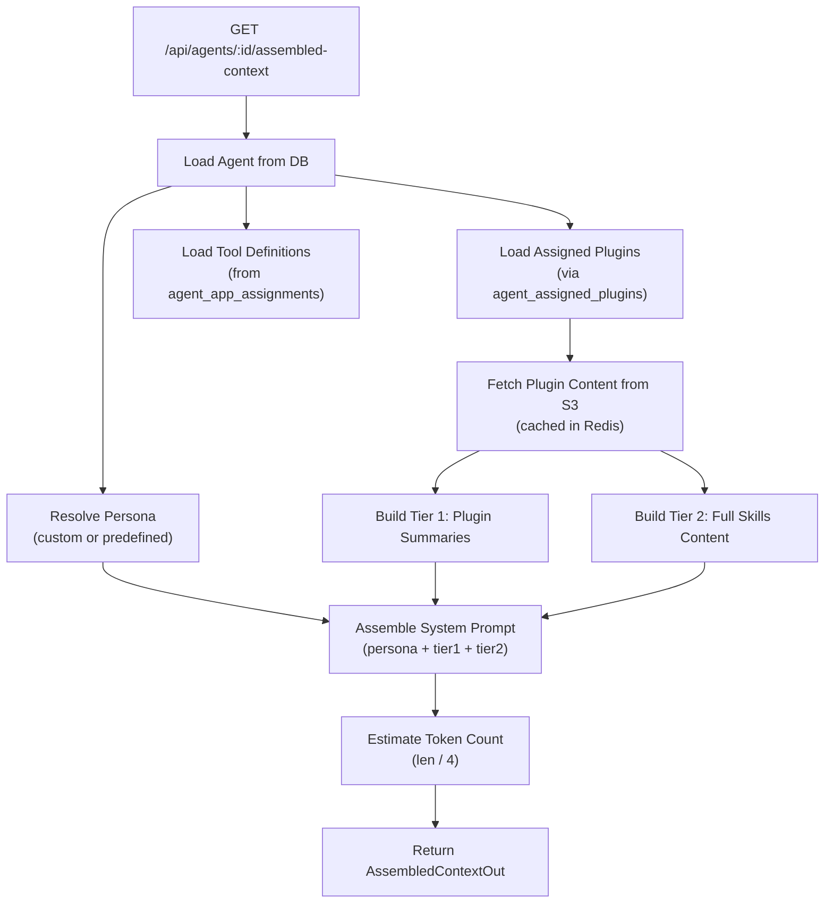
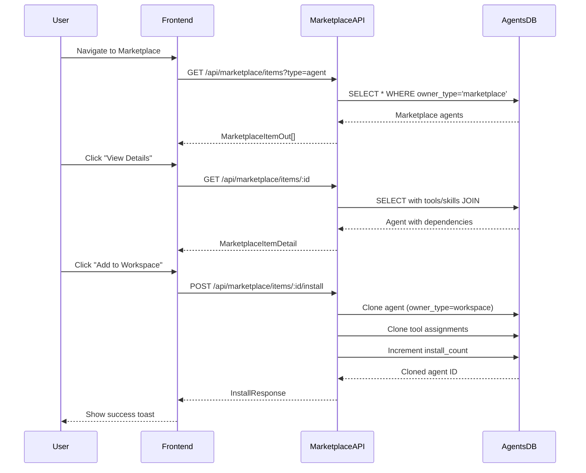
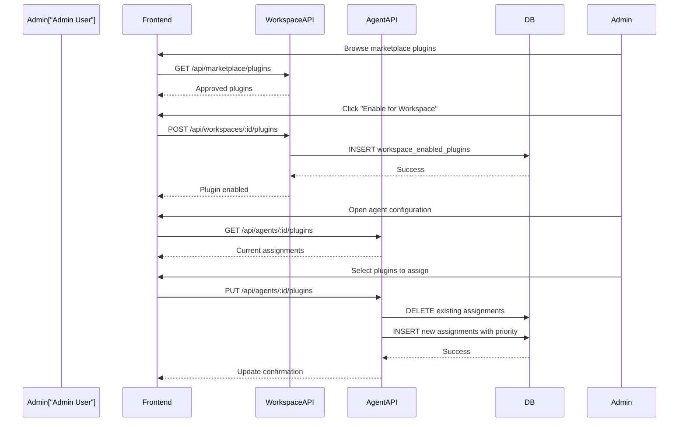

# Marketplace API Reference

<details>
<summary>Relevant source files</summary>

The following files were used as context for generating this wiki page:

- [frontend/app/admin/plugins/page.tsx](frontend/app/admin/plugins/page.tsx)
- [frontend/components/marketplace/marketplace-agents-tab.tsx](frontend/components/marketplace/marketplace-agents-tab.tsx)
- [frontend/components/marketplace/marketplace-card.tsx](frontend/components/marketplace/marketplace-card.tsx)
- [frontend/components/marketplace/marketplace-grid.tsx](frontend/components/marketplace/marketplace-grid.tsx)
- [frontend/components/marketplace/marketplace-homepage.tsx](frontend/components/marketplace/marketplace-homepage.tsx)
- [frontend/components/marketplace/marketplace-item-modal.tsx](frontend/components/marketplace/marketplace-item-modal.tsx)
- [frontend/components/marketplace/marketplace-llms-tab.tsx](frontend/components/marketplace/marketplace-llms-tab.tsx)
- [frontend/components/marketplace/marketplace-recipes-tab.tsx](frontend/components/marketplace/marketplace-recipes-tab.tsx)
- [frontend/components/marketplace/marketplace-tools-tab.tsx](frontend/components/marketplace/marketplace-tools-tab.tsx)
- [frontend/lib/agent-constants.ts](frontend/lib/agent-constants.ts)
- [frontend/lib/api-client.ts](frontend/lib/api-client.ts)
- [orchestrator/.env.example](orchestrator/.env.example)
- [orchestrator/api/agent_plugins.py](orchestrator/api/agent_plugins.py)
- [orchestrator/api/marketplace.py](orchestrator/api/marketplace.py)
- [orchestrator/config.py](orchestrator/config.py)
- [orchestrator/core/database/load_seed_data.py](orchestrator/core/database/load_seed_data.py)
- [orchestrator/core/seeds/seed_personas.py](orchestrator/core/seeds/seed_personas.py)
- [orchestrator/core/seeds/seed_plugin_categories.py](orchestrator/core/seeds/seed_plugin_categories.py)
- [orchestrator/core/services/plugin_cache.py](orchestrator/core/services/plugin_cache.py)
- [orchestrator/main.py](orchestrator/main.py)
- [orchestrator/scripts/seed_llm_marketplace.py](orchestrator/scripts/seed_llm_marketplace.py)
- [scripts/ralph/prd.json](scripts/ralph/prd.json)

</details>


This document provides a comprehensive reference for the Marketplace API endpoints, which enable browsing, installing, and managing marketplace items (agents, recipes, plugins, and tools). For information about plugin architecture and content structure, see [5.1 Plugin Architecture](#5.1). For the upload and security scanning workflow, see [5.2 Plugin Upload & Security](#5.2).

---

## Purpose and Scope

The Marketplace API exposes REST endpoints for:
- **Browsing marketplace items** by type, category, and search query
- **Installing items** to workspaces (agents, recipes, plugins)
- **Submitting items** for marketplace approval
- **Managing approvals** (admin-only)
- **Plugin lifecycle** (workspace enablement, agent assignment)

All endpoints are authenticated via hybrid authentication (Clerk JWT + API keys) and enforce workspace isolation.

**Sources:** [orchestrator/api/marketplace.py:1-30]()

---

## Marketplace API Architecture

The marketplace system uses a **single-table architecture** where agents and recipes are stored in their respective tables with `owner_type` discriminator fields (`'workspace'` vs `'marketplace'`). Plugins use a dedicated `marketplace_plugins` table with S3 storage.



**Sources:** [orchestrator/api/marketplace.py:1-311](), [frontend/components/marketplace/marketplace-homepage.tsx:1-156](), [orchestrator/core/models/core.py:86-185]()

---

## Core Marketplace Endpoints

### GET /api/marketplace/items

List and filter marketplace items across all types.

**Query Parameters:**

| Parameter | Type | Description | Example |
|-----------|------|-------------|---------|
| `type` | string | Filter by item type | `agent`, `recipe`, `skill`, `llm`, `tool` |
| `category` | string | Filter by category | `DevOps`, `Customer Support` |
| `search` | string | Search in name/description | `code review` |
| `featured` | boolean | Show only featured items | `true` |
| `limit` | integer | Max items to return (1-100) | `50` |
| `offset` | integer | Pagination offset | `0` |

**Response Model:**

```typescript
interface MarketplaceItemOut {
  id: number
  type: string  // 'agent', 'recipe', 'skill', 'llm', 'tool'
  name: string
  description: string
  creator_name: string
  icon?: string
  category?: string
  tags: string[]
  install_count: number
  is_featured: boolean
  is_approved: boolean
  version: string
  metadata: Record<string, any>
  created_at: string
  updated_at: string
}
```

**Implementation Details:**

The endpoint queries both `agents` and `workflow_templates` tables with `owner_type = 'marketplace'`, merges results, and applies global pagination when fetching multiple types.

**Sources:** [orchestrator/api/marketplace.py:122-309](), [orchestrator/api/marketplace.py:53-80]()

---

### GET /api/marketplace/items/{id}

Retrieve detailed information about a specific marketplace item, including dependencies.

**Response Model:**

```typescript
interface MarketplaceItemDetail extends MarketplaceItemOut {
  dependencies: {
    skills?: Array<{id: number, name: string, category: string}>
    required_tools?: string[]
    required_agent_id?: number
  }
}
```

**Agent Metadata Enrichment:**

For agents, the backend enriches metadata with:
- **Tool names and icons** from `agent_tool_assignments` joined with `composio_apps_cache`
- **Skill details** from `agent_skills` relationship
- **Model configuration** from `model_config` JSON field

**Sources:** [orchestrator/api/marketplace.py:311-450](), [frontend/components/marketplace/marketplace-item-modal.tsx:39-61]()

---

### POST /api/marketplace/items/{id}/install

Install a marketplace item to the current workspace. Creates a clone with workspace ownership.

**Request Body:** None (uses path parameter)

**Response:**

```typescript
interface InstallResponse {
  success: boolean
  message: string
  cloned_items: Array<{
    type: string
    id: number
    name: string
    cloned_from_id: number
  }>
  warnings: string[]
}
```

**Installation Flow:**

```mermaid
sequenceDiagram
    participant Client
    participant InstallAPI["POST /api/marketplace/items/:id/install"]
    participant AgentsTable[("agents")]
    participant RecipesTable[("workflow_templates")]
    participant ToolsTable[("agent_tool_assignments")]
    
    Client->>InstallAPI: Install item request
    InstallAPI->>AgentsTable: Query original item (owner_type=marketplace)
    AgentsTable-->>InstallAPI: Original agent/recipe data
    
    alt Item is Agent
        InstallAPI->>AgentsTable: Clone agent (owner_type=workspace)
        InstallAPI->>AgentsTable: Set cloned_from_id
        InstallAPI->>ToolsTable: Clone tool assignments
        InstallAPI->>AgentsTable: Increment install_count
    else Item is Recipe
        InstallAPI->>RecipesTable: Clone recipe (owner_type=workspace)
        InstallAPI->>RecipesTable: Set cloned_from_id
        InstallAPI->>RecipesTable: Increment install_count
    end
    
    InstallAPI-->>Client: Return cloned item details + warnings
```

**Sources:** [orchestrator/api/marketplace.py:453-624]()

---

### POST /api/marketplace/submit

Submit an item to the marketplace for approval. Converts workspace-owned items to marketplace items.

**Request Body:**

```typescript
interface SubmitRequest {
  item_type: 'agent' | 'recipe'
  item_id: number
  name?: string          // Optional override
  description?: string   // Optional override
  category?: string
  tags?: string[]
  metadata?: Record<string, any>
}
```

**Submission Workflow:**

1. **Verify workspace ownership** of the original item
2. **Create marketplace clone** with `owner_type = 'marketplace'`
3. **Set approval status** to `pending` (requires admin approval)
4. **Preserve creator info** via `original_creator_id`
5. **Return submission ID** for tracking

**Sources:** [orchestrator/api/marketplace.py:626-768](), [orchestrator/api/marketplace.py:100-117]()

---

### POST /api/marketplace/items/{id}/approve

**Admin-only** endpoint to approve pending marketplace items.

**Request Body:** None

**Response:**

```json
{
  "success": true,
  "message": "Item approved and published to marketplace"
}
```

**Approval Logic:**

```python
# Set approval flags
item.is_approved = True
item.approval_status = 'approved'
item.approved_at = datetime.utcnow()
item.approved_by = ctx.user.email
db.commit()
```

**Sources:** [orchestrator/api/marketplace.py:770-810](), [orchestrator/api/marketplace.py:43-47]()

---

### DELETE /api/marketplace/items/{id}

**Admin-only** endpoint to remove items from marketplace (soft delete by setting `owner_type` back to `workspace`).

**Sources:** [orchestrator/api/marketplace.py:812-855]()

---

## Plugin-Specific Endpoints

### GET /api/marketplace/plugins

List approved marketplace plugins with pagination and filtering.

**Query Parameters:**

| Parameter | Type | Description |
|-----------|------|-------------|
| `category_id` | UUID | Filter by category UUID |
| `search` | string | Search in name/description |
| `approval_status` | string | Filter by approval status (`approved`, `pending`, `rejected`) |
| `limit` | integer | Max plugins to return (1-100) |
| `offset` | integer | Pagination offset |

**Response Model:**

```typescript
interface PluginOut {
  id: string  // UUID
  slug: string
  name: string
  version: string
  description?: string
  long_description?: string
  category_id?: string
  category_name?: string
  tags: string[]
  skills_count: number
  commands_count: number
  agents_count: number
  token_estimate: number
  security_status: string
  approval_status: string
  enable_count: number
  is_featured: boolean
  created_at: string
  updated_at: string
}
```

**Sources:** [orchestrator/api/marketplace_plugins.py:1-150]() (referenced in main.py imports)

---

### POST /api/workspaces/{workspace_id}/plugins

Enable a marketplace plugin for a workspace (adds to `workspace_enabled_plugins` junction table).

**Request Body:**

```typescript
interface EnablePluginRequest {
  plugin_id: string  // UUID
}
```

**Response:**

```json
{
  "success": true,
  "message": "Plugin enabled for workspace",
  "workspace_id": "uuid",
  "plugin_id": "uuid"
}
```

**Sources:** [orchestrator/api/workspace_plugins.py:1-100]() (referenced in main.py imports)

---

### GET /api/agents/{agent_id}/plugins

List plugins assigned to a specific agent.

**Response:**

```typescript
interface AgentPluginsResponse {
  items: Array<{
    plugin_id: string
    slug: string
    name: string
    version: string
    description?: string
    skills_count: number
    commands_count: number
    token_estimate: number
    priority: number
    assigned_at?: string
  }>
}
```

**Sources:** [orchestrator/api/agent_plugins.py:69-125]()

---

### PUT /api/agents/{agent_id}/plugins

Update (replace) plugin assignments for an agent.

**Request Body:**

```typescript
interface UpdateAgentPluginsBody {
  plugin_ids: string[]  // Array of plugin UUIDs
}
```

**Assignment Logic:**

1. **Validate all plugins** are enabled for the agent's workspace
2. **Delete existing assignments** for this agent
3. **Create new assignments** with priority based on array order
4. **Commit transaction** atomically

**Sources:** [orchestrator/api/agent_plugins.py:127-209]()

---

### GET /api/agents/{agent_id}/assembled-context

Retrieve the fully assembled agent context including persona prompt, plugin content, and tool definitions.

**Response Model:**

```typescript
interface AssembledContextOut {
  agent_id: number
  model: string
  temperature: number
  system_prompt: string
  persona: {
    name?: string
    slug?: string
    source?: string
    category?: string
  }
  plugins_loaded: string[]  // Plugin slugs
  tools: Array<{
    id?: number
    name: string
    description: string
    provider?: string
    category?: string
    configuration: Record<string, any>
  }>
  token_estimate: number
}
```

**Context Assembly Process:**



**Sources:** [orchestrator/api/agent_plugins.py:211-338](), [orchestrator/core/services/plugin_context_service.py:1-200]() (referenced)

---

## Database Models Reference

### MarketplacePlugin

```python
class MarketplacePlugin(Base):
    __tablename__ = "marketplace_plugins"
    
    id: UUID              # Primary key
    slug: str             # Unique identifier
    name: str             # Display name
    version: str          # Semantic version
    
    # S3 storage
    s3_bucket: str        # Default: "automatos-marketplace"
    s3_path: str          # bucket/slug/version/
    
    # Content counts
    skills_count: int
    commands_count: int
    agents_count: int
    hooks_count: int
    
    # Security
    security_scan_id: UUID
    security_status: str  # pending, safe, review_required, blocked
    
    # Approval workflow
    approval_status: str  # pending, approved, rejected
    is_active: bool
    is_featured: bool
    
    # Usage tracking
    enable_count: int
```

**Sources:** [orchestrator/core/models/marketplace_plugins.py:50-118]()

---

### WorkspaceEnabledPlugin

Junction table linking workspaces to enabled plugins.

```python
class WorkspaceEnabledPlugin(Base):
    __tablename__ = "workspace_enabled_plugins"
    
    id: UUID
    workspace_id: UUID    # FK to workspaces
    plugin_id: UUID       # FK to marketplace_plugins
    enabled_at: datetime
    enabled_by: str       # User email
```

**Sources:** [orchestrator/core/models/marketplace_plugins.py:183-200]()

---

### AgentAssignedPlugin

Junction table linking agents to assigned plugins with priority ordering.

```python
class AgentAssignedPlugin(Base):
    __tablename__ = "agent_assigned_plugins"
    
    id: UUID
    agent_id: int         # FK to agents
    plugin_id: UUID       # FK to marketplace_plugins
    priority: int         # Display/loading order (0 = highest)
    assigned_at: datetime
```

**Sources:** [orchestrator/core/models/marketplace_plugins.py:203-225]()

---

## Common API Workflows

### Browse and Install an Agent



**Sources:** [frontend/components/marketplace/marketplace-agents-tab.tsx:82-146](), [orchestrator/api/marketplace.py:453-624]()

---

### Enable Plugin for Agent



**Sources:** [orchestrator/api/agent_plugins.py:127-209](), [orchestrator/api/workspace_plugins.py:1-100]() (referenced)

---

## Error Handling

All marketplace endpoints return consistent error responses:

| Status Code | Description | Example |
|-------------|-------------|---------|
| 400 | Bad request (invalid parameters) | `"Plugins not enabled for workspace: uuid1, uuid2"` |
| 403 | Forbidden (admin-only endpoint) | `"Admin access required"` |
| 404 | Item not found | `"Agent not found"` |
| 409 | Conflict (already installed) | `"Item already installed in workspace"` |
| 500 | Internal server error | `"Failed to install marketplace item"` |

**Sources:** [orchestrator/api/marketplace.py:43-47](), [orchestrator/api/agent_plugins.py:85-90]()

---

## Authentication and Authorization

All marketplace endpoints use hybrid authentication via `get_request_context_hybrid`:

```python
async def list_items(
    ctx: RequestContext = Depends(get_request_context_hybrid),
    db: Session = Depends(get_db),
):
    # ctx.workspace_id - Current workspace UUID
    # ctx.user - User info (email, role, system_role)
```

**Admin Check:**

```python
def is_admin(ctx: RequestContext) -> bool:
    if not ctx.user:
        return False
    return getattr(ctx.user, 'system_role', 'user') == 'admin'
```

**Sources:** [orchestrator/api/marketplace.py:36-47](), [orchestrator/core/auth/hybrid.py:1-200]() (referenced)

---

## Frontend Integration Examples

### Using the Marketplace API in React

```typescript
// Fetch marketplace items
const { data: agents } = useQuery({
  queryKey: ['marketplaceItems', 'agent', category],
  queryFn: async () => {
    const params = new URLSearchParams({
      type: 'agent',
      category: category !== 'all' ? category : '',
      limit: '100'
    })
    return apiClient.get(`/api/marketplace/items?${params}`)
  }
})

// Install an item
const installMutation = useInstallMarketplaceItem()
await installMutation.mutateAsync(itemId)
```

**Sources:** [frontend/components/marketplace/marketplace-agents-tab.tsx:93-98](), [frontend/hooks/use-marketplace-api.tsx:1-100]() (referenced)

---

## Rate Limiting and Performance

The marketplace API implements caching strategies:

1. **Plugin content caching** in Redis with 3600s TTL
2. **Database query optimization** via indexes on `owner_type`, `approval_status`
3. **Pagination** to limit response sizes (max 100 items per request)
4. **Lazy loading** of dependencies (only fetched on detail views)

**Sources:** [orchestrator/core/services/plugin_context_service.py:1-200]() (referenced), [orchestrator/api/marketplace.py:122-309]()

---