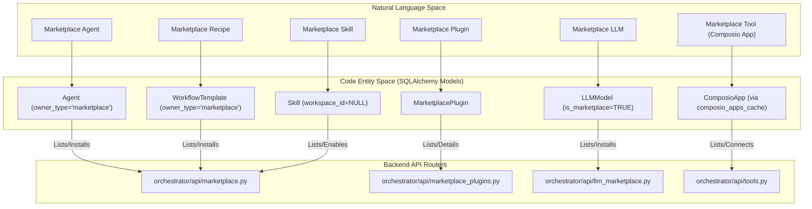
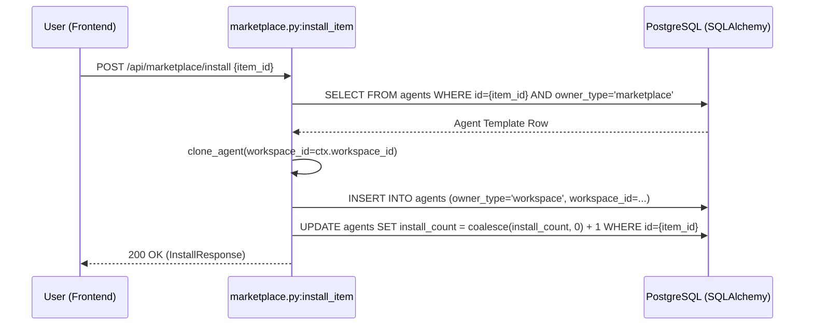
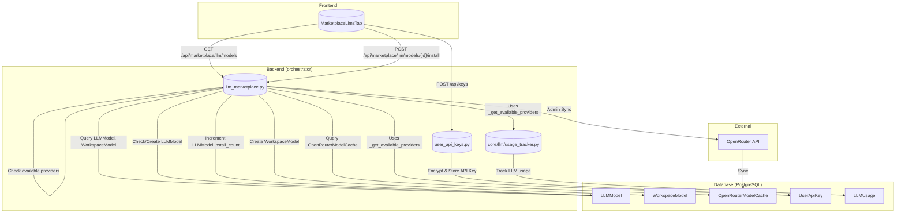

# Marketplace Backend & LLM Catalog

Relevant source files

The following files were used as context for generating this wiki page:

- [frontend/components/marketplace/llm-model-card.tsx](frontend/components/marketplace/llm-model-card.tsx)
- [frontend/components/marketplace/llm-model-detail-modal.tsx](frontend/components/marketplace/llm-model-detail-modal.tsx)
- [frontend/components/marketplace/marketplace-agents-tab.tsx](frontend/components/marketplace/marketplace-agents-tab.tsx)
- [frontend/components/marketplace/marketplace-llms-tab.tsx](frontend/components/marketplace/marketplace-llms-tab.tsx)
- [frontend/components/marketplace/marketplace-plugin-detail-modal.tsx](frontend/components/marketplace/marketplace-plugin-detail-modal.tsx)
- [frontend/components/marketplace/marketplace-plugins-tab.tsx](frontend/components/marketplace/marketplace-plugins-tab.tsx)
- [frontend/components/marketplace/marketplace-skills-tab.tsx](frontend/components/marketplace/marketplace-skills-tab.tsx)
- [frontend/components/marketplace/marketplace-tools-tab.tsx](frontend/components/marketplace/marketplace-tools-tab.tsx)
- [frontend/components/settings/ApiKeysSettingsTab.tsx](frontend/components/settings/ApiKeysSettingsTab.tsx)
- [frontend/hooks/use-openrouter-api.ts](frontend/hooks/use-openrouter-api.ts)
- [orchestrator/api/llm_marketplace.py](orchestrator/api/llm_marketplace.py)
- [orchestrator/api/marketplace.py](orchestrator/api/marketplace.py)
- [orchestrator/api/marketplace_plugins.py](orchestrator/api/marketplace_plugins.py)
- [orchestrator/api/openrouter_marketplace.py](orchestrator/api/openrouter_marketplace.py)
- [orchestrator/api/user_api_keys.py](orchestrator/api/user_api_keys.py)
- [orchestrator/core/database/migrations/042_openrouter_models_cache.sql](orchestrator/core/database/migrations/042_openrouter_models_cache.sql)
- [orchestrator/core/llm/clients/__init__.py](orchestrator/core/llm/clients/__init__.py)
- [orchestrator/core/llm/usage_tracker.py](orchestrator/core/llm/usage_tracker.py)
- [orchestrator/scripts/seed_llm_marketplace.py](orchestrator/scripts/seed_llm_marketplace.py)

This page details the backend implementation of the Automatos AI Marketplace, focusing on the core `marketplace.py` router, the `marketplace_plugins.py` router, and the `llm_marketplace.py` router. It covers the mechanisms for listing, installing, and managing various marketplace items, including Agents, Recipes, Plugins, Skills, and LLMs. Key aspects include data isolation, cloning logic, API key management for LLMs, and usage tracking.

---

## Architecture Overview

The marketplace is implemented across several specialized routers:
- `orchestrator/api/marketplace.py` for core items (Agents/Recipes).
- `orchestrator/api/marketplace_plugins.py` for plugins.
- `orchestrator/api/llm_marketplace.py` for LLM models.

### Data Isolation & Ownership
The system distinguishes between public marketplace assets and private workspace clones using the `owner_type` field for Agents and WorkflowTemplates, and `workspace_id` for LLMModel and Skill.

| Field | Marketplace Value | Workspace Value |
| :--- | :--- | :--- |
| `owner_type` (Agent, WorkflowTemplate) | `"marketplace"` | `"workspace"` |
| `workspace_id` (LLMModel, Skill) | `NULL` | `UUID` of the specific workspace |
| `is_approved` | `BOOLEAN` (Admin gated) | Always `TRUE` |
| `install_count` | `INTEGER` (Global counter) | `NULL` or `0` |

Sources: [orchestrator/api/marketplace.py:158-161](), [orchestrator/api/marketplace.py:255-260](), [orchestrator/api/marketplace.py:485-495]()

### Code Entity Mapping
The following diagram maps high-level marketplace concepts to their specific implementation classes and database models.

**Marketplace Entity Mapping**

Sources: [orchestrator/api/marketplace.py:26-27](), [orchestrator/api/marketplace.py:158-161](), [orchestrator/api/marketplace.py:468-480](), [orchestrator/api/marketplace_plugins.py:36](), [orchestrator/api/llm_marketplace.py:26]()

---

## Installation & Cloning Logic

When an item is "installed," the backend performs a deep clone of the marketplace template into the target workspace.

### The Cloning Sequence
1.  **Validation**: The system verifies the item exists and is approved (for non-admins) via `is_approved` check [orchestrator/api/marketplace.py:160-161]().
2.  **Duplication**: A new record is created in the same table (e.g., `Agent`) but with `owner_type="workspace"` and the current `workspace_id` from `RequestContext` [orchestrator/api/marketplace.py:485-500](). For LLMs, a `WorkspaceModel` entry is created linking the `LLMModel` to the workspace [orchestrator/api/llm_marketplace.py:300-305]().
3.  **Dependency Resolution**:
    -   **Agents**: The system copies tool assignments and skill assignments from the template to the new workspace instance [orchestrator/api/marketplace.py:510-525]().
    -   **Recipes**: The system clones the `WorkflowTemplate`, mapping internal step logic to the user's workspace context and ensuring any required agents are also referenced or cloned [orchestrator/api/marketplace.py:645-660]().
4.  **Telemetry**: The `install_count` on the source marketplace item is incremented atomically using `func.coalesce` to handle nulls [orchestrator/api/marketplace.py:530-534](). For LLMs, `LLMModel.install_count` is incremented [orchestrator/api/llm_marketplace.py:307-308]().

**Agent Installation Data Flow**

Sources: [orchestrator/api/marketplace.py:468-580](), [orchestrator/api/marketplace.py:645-696](), [orchestrator/api/marketplace.py:530-534]()

---

## LLM Catalog (`llm_marketplace.py`)

The LLM Marketplace allows users to browse, compare, and install LLM models to their workspaces. It integrates with the OpenRouter cache for a broad selection of models and manages workspace-specific installations.

### Data Models
-   `LLMModel`: Represents a language model, storing metadata like provider, model ID, costs, capabilities, and marketplace status [orchestrator/api/llm_marketplace.py:31-56]().
-   `OpenRouterModelCache`: A cache of models available via OpenRouter, used to populate the `LLMModel` table dynamically [orchestrator/core/database/migrations/042_openrouter_models_cache.sql]().
-   `WorkspaceModel`: Links an `LLMModel` to a specific `Workspace`, indicating it's installed and available for use within that workspace.

### Key Endpoints
-   `GET /api/marketplace/llm/models`: Lists available LLM models, with filters for provider, category, tier, and capabilities. It also indicates if a model is already installed in the current workspace [orchestrator/api/llm_marketplace.py:200-270]().
-   `POST /api/marketplace/llm/models/{model_id}/install`: Installs an LLM model into the current workspace. If the model doesn't exist in `LLMModel`, it's auto-created from the `OpenRouterModelCache` [orchestrator/api/llm_marketplace.py:273-315]().
-   `POST /api/marketplace/llm/models/{model_id}/uninstall`: Uninstalls an LLM model from the current workspace [orchestrator/api/llm_marketplace.py:318-345]().
-   `GET /api/marketplace/llm/installed-ids`: Returns a list of `model_id`s for models installed in the current workspace, used by the frontend to quickly mark installed models [frontend/components/marketplace/marketplace-llms-tab.tsx:194-204]().
-   `GET /api/marketplace/llm/compare`: Allows comparing multiple LLM models side-by-side [orchestrator/api/llm_marketplace.py:348-370]().
-   `POST /api/marketplace/llm/sync-openrouter-cache`: An admin endpoint to manually trigger a sync of the OpenRouter model catalog [orchestrator/api/llm_marketplace.py:373-400]().

### LLM Model Auto-Creation
The `_get_or_create_from_cache` helper function is crucial for bridging the `OpenRouterModelCache` and `LLMModel` tables. When an LLM is requested for installation and not found in `LLMModel`, it attempts to find it in `OpenRouterModelCache` and creates a new `LLMModel` entry based on the cached data [orchestrator/api/llm_marketplace.py:102-144](). This ensures that the `LLMModel` table primarily contains models that are either explicitly managed or installed by users, while the `OpenRouterModelCache` provides a comprehensive, up-to-date catalog.

**LLM Marketplace Data Flow**

Sources: [orchestrator/api/llm_marketplace.py:200-270](), [orchestrator/api/llm_marketplace.py:273-315](), [orchestrator/api/llm_marketplace.py:318-345](), [orchestrator/api/llm_marketplace.py:348-370](), [orchestrator/api/llm_marketplace.py:373-400](), [orchestrator/api/llm_marketplace.py:102-144](), [orchestrator/api/user_api_keys.py:165-178](), [frontend/components/marketplace/marketplace-llms-tab.tsx:194-204]()

---

## Plugins Marketplace (`marketplace_plugins.py`)

The Plugins Marketplace provides a catalog of reusable code modules that extend the platform's capabilities.

### Data Models
-   `MarketplacePlugin`: Stores metadata about plugins, including name, version, description, category, security status, and approval status.
-   `PluginCategory`: Organizes plugins into categories.

### Key Endpoints
-   `GET /api/marketplace/plugins`: Lists approved and active plugins, with filtering by category, search query, and tags. Supports sorting by popularity, newest, or name [orchestrator/api/marketplace_plugins.py:170-300]().
-   `GET /api/marketplace/plugins/{plugin_id}`: Retrieves detailed information about a specific plugin, including its manifest and enriched lists of contained skills, commands, and agents [orchestrator/api/marketplace_plugins.py:303-360]().
-   `GET /api/marketplace/plugins/categories`: Lists available plugin categories [orchestrator/api/marketplace_plugins.py:363-380]().
-   `GET /api/marketplace/plugins/{plugin_id}/content`: Fetches the raw file content of a plugin, typically used for installation or inspection [orchestrator/api/marketplace_plugins.py:383-438]().

### Plugin Content Extraction
The `_extract_content_items` helper function parses the plugin's manifest to extract and normalize lists of skills, commands, and agents, making them presentable in the UI [orchestrator/api/marketplace_plugins.py:135-165]().

Sources: [orchestrator/api/marketplace_plugins.py:170-300](), [orchestrator/api/marketplace_plugins.py:303-360](), [orchestrator/api/marketplace_plugins.py:363-380](), [orchestrator/api/marketplace_plugins.py:383-438](), [orchestrator/api/marketplace_plugins.py:135-165]()

---

## User API Keys (`user_api_keys.py`)

This module handles the management of "Bring Your Own Key" (BYOK) API keys for LLM providers. These keys are encrypted at rest and validated upon submission.

### Data Model
-   `UserApiKey`: Stores encrypted API keys provided by users for various LLM providers, along with metadata like `provider`, `display_name`, `is_active`, `last_used_at`, and `usage_count` [orchestrator/models/core.py]().

### Key Endpoints
-   `POST /api/keys`: Adds a new BYOK API key for the current workspace. The key is encrypted and validated against the provider before being stored [orchestrator/api/user_api_keys.py:165-200]().
-   `GET /api/keys`: Lists all BYOK API keys for the current workspace, with keys masked for security [orchestrator/api/user_api_keys.py:203-225]().
-   `DELETE /api/keys/{key_id}`: Deletes a specific BYOK API key [orchestrator/api/user_api_keys.py:228-245]().
-   `POST /api/keys/{key_id}/test`: Manually tests the validity of a stored API key [orchestrator/api/user_api_keys.py:248-265]().
-   `PUT /api/keys/{key_id}/toggle-active`: Toggles the `is_active` status of a key [orchestrator/api/user_api_keys.py:268-290]().
-   `GET /api/keys/platform-status`: Provides information about which LLM providers have platform-level keys configured [orchestrator/api/user_api_keys.py:293-315]().
-   `PUT /api/workspaces/current/byok-preferences`: Manages workspace-specific preferences for BYOK overrides, allowing users to choose between platform keys and their own keys for a given provider [frontend/components/settings/ApiKeysSettingsTab.tsx:159-169]().

### Key Validation
The `_validate_provider_key` asynchronous function performs a live, minimal API call to the respective LLM provider to verify the validity of the provided API key. This validation happens both on key creation and when explicitly tested, ensuring that only functional keys are marked as active [orchestrator/api/user_api_keys.py:120-161]().

### Encryption
The `get_encryption_service()` is used to encrypt and decrypt API keys, ensuring they are stored securely at rest [orchestrator/api/user_api_keys.py:180-181]().

Sources: [orchestrator/api/user_api_keys.py:165-200](), [orchestrator/api/user_api_keys.py:203-225](), [orchestrator/api/user_api_keys.py:228-245](), [orchestrator/api/user_api_keys.py:248-265](), [orchestrator/api/user_api_keys.py:268-290](), [orchestrator/api/user_api_keys.py:293-315](), [orchestrator/api/user_api_keys.py:120-161](), [orchestrator/api/user_api_keys.py:180-181](), [frontend/components/settings/ApiKeysSettingsTab.tsx:159-169]()

---

## Tool Integration & Discovery

Tools in the marketplace are primarily managed via the **Composio** ecosystem, supplemented by platform-specific actions.

### Marketplace Tools Sync
The backend leverages the `composio_apps_cache` to resolve metadata like logos and categories. When browsing the marketplace, the `list_items` endpoint can enrich agent cards with tool icons by joining `agent_tool_assignments` with the apps cache [orchestrator/api/marketplace.py:193-198](). The `MarketplaceToolsTab` in the frontend fetches tools from `/api/tools/marketplace` which is a DB-cached endpoint for faster retrieval [frontend/components/marketplace/marketplace-tools-tab.tsx:111-112]().

### Platform Management Skills
A specialized `platform-management` skill provides agents with the ability to browse and install items autonomously. This includes tools like `platform_browse_marketplace_agents` and `platform_install_skill` [orchestrator/core/seeds/platform-management-skill.md:8-17]().

Sources: [orchestrator/api/marketplace.py:193-198](), [orchestrator/core/seeds/platform-management-skill.md:8-17](), [frontend/components/marketplace/marketplace-tools-tab.tsx:111-112]()

---

## Mission Zero & Org Chart Integration

Marketplace items play a critical role in the "Mission Zero" onboarding flow, where a "CTO agent" audits the roster and installs necessary agents from the marketplace to build an organizational structure.

### Organizational Fields
To support hierarchical structures, the `Agent` model includes fields for team alignment and reporting lines:
-   `team`: String (100) identifying the agent's department [orchestrator/alembic/versions/mission_zero_org_fields.py:15]().
-   `job_title`: String (200) for the agent's specific role [orchestrator/alembic/versions/mission_zero_org_fields.py:16]().
-   `reports_to_id`: Foreign key to another `Agent.id` for building the org tree [orchestrator/alembic/versions/mission_zero_org_fields.py:20-25]().

### Org Chart Visualization
The frontend consumes these fields via the `/api/agents/org-chart` endpoint [frontend/components/agents/org-chart-tab.tsx:22](). The `OrgChartCanvas` uses a hierarchical tree layout to position agents based on their `reports_to_id` and `team` assignments [frontend/components/agents/org-chart-canvas.tsx:56-90]().

Sources: [orchestrator/alembic/versions/mission_zero_org_fields.py:14-28](), [frontend/components/agents/org-chart-tab.tsx:19-24](), [frontend/components/agents/org-chart-canvas.tsx:56-90]()

---

## Admin Approval & Moderation

Items submitted to the marketplace are not public by default. They enter a "Pending" state where `is_approved = FALSE`.

### Administrative Actions
-   **Approval**: `POST /api/marketplace/items/{id}/approve` transitions an item to public status [orchestrator/api/marketplace.py:720-740](). For plugins, `POST /api/admin/plugins/{plugin_id}/approve` is used [frontend/components/marketplace/marketplace-plugin-detail-modal.tsx:161-172]().
-   **Featuring**: `POST /api/marketplace/items/{id}/feature` toggles the `is_featured` flag, which is used as a filter in the `list_items` endpoint [orchestrator/api/marketplace.py:173-174]().
-   **Deletion**: Admins can remove items via `DELETE /api/marketplace/items/{id}` [orchestrator/api/marketplace.py:780-790]().

Sources: [orchestrator/api/marketplace.py:173-174](), [orchestrator/api/marketplace.py:720-740](), [orchestrator/api/marketplace.py:780-790](), [frontend/components/marketplace/marketplace-plugin-detail-modal.tsx:161-172]()

---

## Analytics & Tracking

The marketplace tracks global popularity and per-workspace usage to inform the "Featured" algorithm.

### Usage Telemetry
-   **Install Count**: Incremented atomically during the `install_item` flow for Agents/Recipes [orchestrator/api/marketplace.py:530-534]() and for LLMs [orchestrator/api/llm_marketplace.py:307-308]().
-   **Global Pagination**: When listing all item types, the backend applies global pagination across both Agents and Recipes to ensure a unified browsing experience [orchestrator/api/marketplace.py:137-141]().
-   **LLM Usage Tracking**: The `core/llm/usage_tracker.py` module is responsible for tracking LLM usage, including costs, which is then surfaced in analytics dashboards.

Sources: [orchestrator/api/marketplace.py:137-141](), [orchestrator/api/marketplace.py:530-534](), [orchestrator/api/llm_marketplace.py:307-308](), [orchestrator/core/llm/usage_tracker.py]()

---