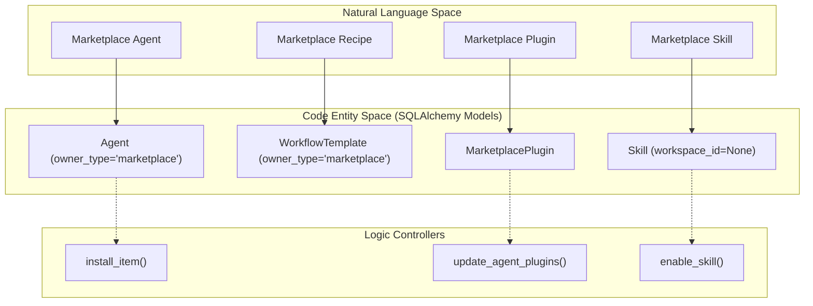
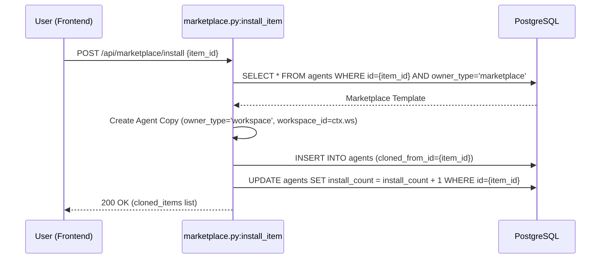
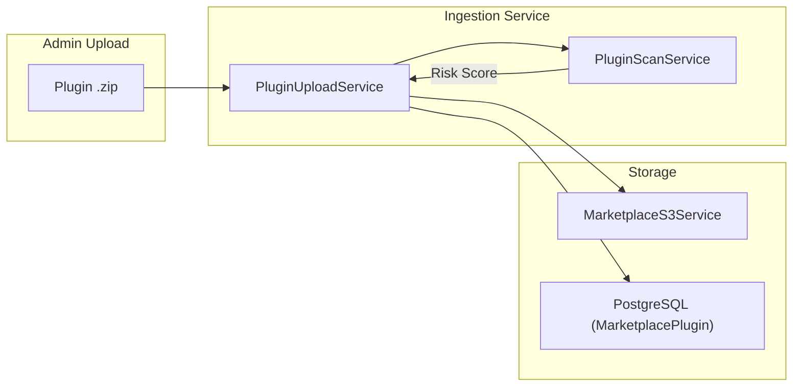

# Marketplace Backend

<details>
<summary>Relevant source files</summary>

The following files were used as context for generating this wiki page:

- [frontend/components/marketplace/marketplace-plugin-detail-modal.tsx](frontend/components/marketplace/marketplace-plugin-detail-modal.tsx)
- [frontend/components/marketplace/marketplace-plugins-tab.tsx](frontend/components/marketplace/marketplace-plugins-tab.tsx)
- [frontend/components/marketplace/marketplace-skills-tab.tsx](frontend/components/marketplace/marketplace-skills-tab.tsx)
- [frontend/hooks/use-marketplace-api.ts](frontend/hooks/use-marketplace-api.ts)
- [orchestrator/api/admin_plugins.py](orchestrator/api/admin_plugins.py)
- [orchestrator/api/agent_plugins.py](orchestrator/api/agent_plugins.py)
- [orchestrator/api/marketplace.py](orchestrator/api/marketplace.py)
- [orchestrator/api/marketplace_plugins.py](orchestrator/api/marketplace_plugins.py)
- [orchestrator/api/workspace_skills.py](orchestrator/api/workspace_skills.py)
- [orchestrator/core/services/marketplace_s3.py](orchestrator/core/services/marketplace_s3.py)
- [orchestrator/core/services/plugin_upload_service.py](orchestrator/core/services/plugin_upload_service.py)
- [orchestrator/modules/coordination/__init__.py](orchestrator/modules/coordination/__init__.py)
- [orchestrator/modules/coordination/agent_matcher.py](orchestrator/modules/coordination/agent_matcher.py)
- [orchestrator/modules/coordination/templates.py](orchestrator/modules/coordination/templates.py)

</details>


The Marketplace Backend provides the infrastructure for discovering, installing, and managing shared assets including Agents, Recipes (Workflows), Plugins, and Skills. It utilizes an **ownership pattern** to multiplex between global marketplace items and private workspace instances within the same database schema.

---

## Architecture Overview

The marketplace is implemented across several specialized routers, primarily `orchestrator/api/marketplace.py` for core items (Agents/Recipes) and `orchestrator/api/marketplace_plugins.py` for the plugin ecosystem.

### Data Isolation & Ownership
The system distinguishes between public marketplace assets and private workspace clones using the `owner_type` field.

| Field | Marketplace Value | Workspace Value |
| :--- | :--- | :--- |
| `owner_type` | `"marketplace"` | `"workspace"` |
| `workspace_id` | `NULL` | `UUID` of the specific workspace |
| `is_approved` | `BOOLEAN` (Admin gated) | Always `TRUE` |
| `install_count` | `INTEGER` (Global counter) | `NULL` or `0` |

**Sources:** [orchestrator/api/marketplace.py:154-158](), [orchestrator/api/marketplace.py:255-260](), [orchestrator/api/agent_plugins.py:148-151]()

### Code Entity Mapping
The following diagram maps high-level marketplace concepts to their specific implementation classes and database models.

**Marketplace Entity Mapping**

**Sources:** [orchestrator/api/marketplace.py:25-26](), [orchestrator/api/marketplace.py:468-480](), [orchestrator/api/agent_plugins.py:130-140](), [orchestrator/api/workspace_skills.py:190-206]()

---

## Installation & Cloning Logic

When an item is "installed," the backend performs a deep clone of the marketplace template into the target workspace.

### The Cloning Sequence
1. **Validation**: The system verifies the item exists and is approved (for non-admins) [orchestrator/api/marketplace.py:482-495]().
2. **Duplication**: A new record is created in the same table (e.g., `Agent`) but with `owner_type="workspace"` and the current `workspace_id` [orchestrator/api/marketplace.py:500-515]().
3. **Dependency Resolution**:
    - For **Agents**: The system copies tool assignments from `agent_tool_assignments` and skill assignments from `agent_skills` [orchestrator/api/marketplace.py:536-570]().
    - For **Recipes**: The system attempts to map marketplace `agent_id` references to existing agents in the user's workspace or warns if dependencies are missing [orchestrator/api/marketplace.py:660-685]().
4. **Telemetry**: The `install_count` on the source marketplace item is incremented atomically [orchestrator/api/marketplace.py:530-534]().

**Agent Installation Data Flow**

**Sources:** [orchestrator/api/marketplace.py:468-580](), [orchestrator/api/marketplace.py:645-696](), [frontend/hooks/use-marketplace-api.ts:138-160]()

---

## Plugin & Skill Marketplace

Plugins represent a higher-order grouping of capabilities (Skills, Commands, Hooks). Unlike simple agents, plugins require a two-stage activation:
1. **Workspace Enablement**: A plugin is enabled for a workspace via `WorkspaceEnabledPlugin` [orchestrator/api/agent_plugins.py:165-178]().
2. **Agent Assignment**: Enabled plugins are assigned to specific agents via `AgentAssignedPlugin` [orchestrator/api/agent_plugins.py:186-193]().

### Skill Materialization
When a plugin is assigned to an agent, the backend automatically "materializes" the associated skills. This involves looking up the `Skill` records linked to that plugin and creating entries in the `agent_skills` join table [orchestrator/api/agent_plugins.py:195-200]().

**Plugin Assignment Implementation**
```python
# From orchestrator/api/agent_plugins.py
# 1. Remove existing assignments
db.query(AgentAssignedPlugin).filter(
    AgentAssignedPlugin.agent_id == agent_id,
).delete(synchronize_session="fetch")

# 2. Create new assignments with priority
for priority, plugin_id in enumerate(unique_plugin_ids):
    assignment = AgentAssignedPlugin(
        agent_id=agent_id,
        plugin_id=plugin_id,
        priority=priority,
    )
    db.add(assignment)
```
**Sources:** [orchestrator/api/agent_plugins.py:181-193](), [orchestrator/api/workspace_skills.py:190-206]()

---

## Plugin Ingestion & Security

Marketplace Plugins follow a strict ingestion pipeline managed by `PluginUploadService`.

### Upload & Scanning Pipeline
1. **Extraction**: Zip files are validated for `manifest.json` and extracted to S3 (or local storage in dev) [orchestrator/core/services/plugin_upload_service.py:134-153]().
2. **Auto-Categorization**: The `_auto_categorise` helper matches keywords in the description/tags against `_CATEGORY_KEYWORDS` [orchestrator/core/services/plugin_upload_service.py:59-78]().
3. **Security Scan**: `PluginScanService` performs static analysis and LLM-based risk assessment [orchestrator/core/services/plugin_upload_service.py:88]().
4. **Approval**: Admins use `approve_plugin` to move items from `pending` to `approved` [orchestrator/api/admin_plugins.py:203-222]().

**Plugin Ingestion Path**

**Sources:** [orchestrator/core/services/plugin_upload_service.py:80-103](), [orchestrator/core/services/plugin_upload_service.py:134-179](), [orchestrator/api/admin_plugins.py:137-180]()

---

## Tool Integration (Composio)

Tools in the marketplace are primarily sourced from the **Composio** integration. The backend maintains a local cache of these tools to allow fast browsing and category filtering.

### Marketplace Tools Sync
The frontend fetches from `/api/marketplace/items?type=tool`, which leverages the `composio_apps_cache` to resolve metadata like logos and categories [orchestrator/api/marketplace.py:193-198]().

**Sources:** [orchestrator/api/marketplace.py:193-198](), [frontend/components/marketplace/marketplace-plugins-tab.tsx:157-170]()

---

## Admin Approval & Moderation

Items submitted to the marketplace are not public by default. They enter a "Pending" state where `is_approved = FALSE` [orchestrator/api/marketplace.py:157]().

### Approval Endpoints
- **Approve Agent/Recipe**: `POST /api/marketplace/items/{id}/approve` sets `is_approved = TRUE` [orchestrator/api/marketplace.py:720-750]().
- **Approve Plugin**: `POST /api/admin/plugins/{plugin_id}/approve` updates the `approval_status` [orchestrator/api/admin_plugins.py:203-222]().
- **Feature**: `POST /api/marketplace/items/{id}/feature` toggles the `is_featured` flag for high-visibility placement [orchestrator/api/marketplace.py:753-780]().

**Sources:** [orchestrator/api/marketplace.py:720-750](), [orchestrator/api/admin_plugins.py:203-222](), [frontend/components/marketplace/marketplace-plugin-detail-modal.tsx:156-169]()

---

## Analytics & Tracking

The marketplace tracks usage via the `install_count` field on primary entities.

### Install Count Increment
The increment happens atomically during the installation transaction to ensure data consistency.
```python
# From orchestrator/api/marketplace.py:530
# Update install count on original item
db.execute(
    text("UPDATE agents SET install_count = install_count + 1 WHERE id = :id"),
    {"id": item_id}
)
```
**Sources:** [orchestrator/api/marketplace.py:530-534](), [orchestrator/api/marketplace.py:645-696]()

---