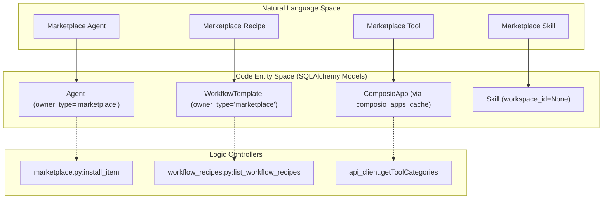
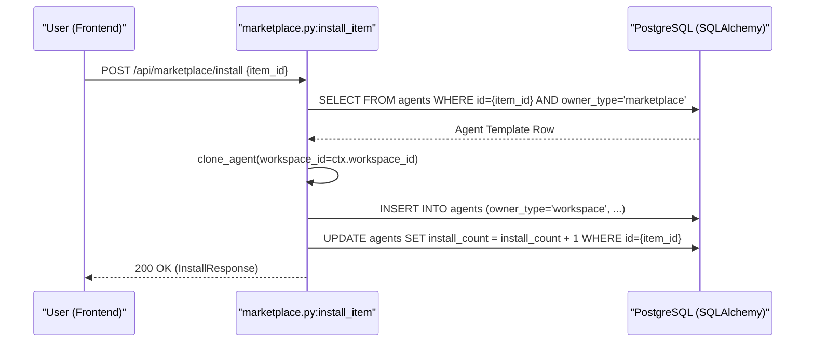
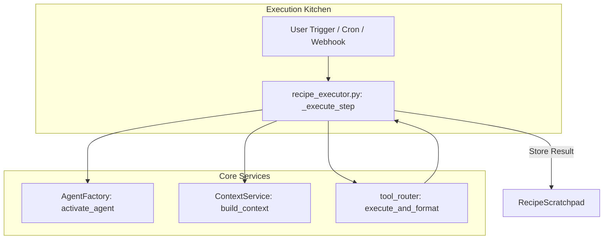

# Marketplace Backend

Relevant source files

The following files were used as context for generating this wiki page:

- [frontend/components/agents/org-chart-tab.tsx](frontend/components/agents/org-chart-tab.tsx)
- [orchestrator/api/composio_analytics.py](orchestrator/api/composio_analytics.py)
- [orchestrator/api/marketplace.py](orchestrator/api/marketplace.py)
- [orchestrator/api/workflow_recipes.py](orchestrator/api/workflow_recipes.py)
- [orchestrator/core/seeds/platform-management-skill.md](orchestrator/core/seeds/platform-management-skill.md)
- [orchestrator/scripts/seed_agent_personas_v2.py](orchestrator/scripts/seed_agent_personas_v2.py)
- [orchestrator/scripts/seed_marketplace_agents_v2.py](orchestrator/scripts/seed_marketplace_agents_v2.py)
- [orchestrator/scripts/seed_recipes_marketplace_v2.py](orchestrator/scripts/seed_recipes_marketplace_v2.py)

The Marketplace Backend provides the infrastructure for discovering, installing, and managing shared assets including Agents, Recipes (Workflows), Plugins, and Skills. It utilizes an **ownership pattern** to multiplex between global marketplace items and private workspace instances within the same database schema.

---

## Architecture Overview

The marketplace is implemented across several specialized routers, primarily `orchestrator/api/marketplace.py` for core items (Agents/Recipes) and `orchestrator/api/workflow_recipes.py` for the workflow ecosystem.

### Data Isolation & Ownership
The system distinguishes between public marketplace assets and private workspace clones using the `owner_type` field.

| Field | Marketplace Value | Workspace Value |
| :--- | :--- | :--- |
| `owner_type` | `"marketplace"` | `"workspace"` |
| `workspace_id` | `NULL` | `UUID` of the specific workspace |
| `is_approved` | `BOOLEAN` (Admin gated) | Always `TRUE` |
| `install_count` | `INTEGER` (Global counter) | `NULL` or `0` |

**Sources:** [orchestrator/api/marketplace.py:154-158](), [orchestrator/api/marketplace.py:255-260](), [orchestrator/api/workflow_recipes.py:181-185]()

### Code Entity Mapping
The following diagram maps high-level marketplace concepts to their specific implementation classes and database models.

**Marketplace Entity Mapping**

**Sources:** [orchestrator/api/marketplace.py:25-28](), [orchestrator/api/marketplace.py:468-480](), [orchestrator/api/workflow_recipes.py:25-28](), [orchestrator/api/marketplace.py:193-198]()

---

## Installation & Cloning Logic

When an item is "installed," the backend performs a deep clone of the marketplace template into the target workspace.

### The Cloning Sequence
1. **Validation**: The system verifies the item exists and is approved (for non-admins) via `is_approved` check [orchestrator/api/marketplace.py:156-158]().
2. **Duplication**: A new record is created in the same table (e.g., `Agent`) but with `owner_type="workspace"` and the current `workspace_id` [orchestrator/api/marketplace.py:485-500]().
3. **Dependency Resolution**:
    - **Agents**: The system copies tool assignments and skill assignments from the template to the new workspace instance [orchestrator/api/marketplace.py:510-525]().
    - **Recipes**: The system clones the `WorkflowTemplate`, mapping internal step logic to the user's workspace context and ensuring any required agents are also referenced or cloned [orchestrator/api/marketplace.py:645-660]().
4. **Telemetry**: The `install_count` on the source marketplace item is incremented atomically [orchestrator/api/marketplace.py:530-534]().

**Agent Installation Data Flow**

**Sources:** [orchestrator/api/marketplace.py:468-580](), [orchestrator/api/marketplace.py:645-696](), [orchestrator/api/marketplace.py:530-534]()

---

## Tool Integration & Discovery

Tools in the marketplace are primarily managed via the **Composio** ecosystem, supplemented by platform-specific actions.

### Marketplace Tools Sync
The backend leverages the `composio_apps_cache` to resolve metadata like logos and categories. When browsing the marketplace, the `list_items` endpoint can enrich agent cards with tool icons by joining `agent_tool_assignments` with the apps cache [orchestrator/api/marketplace.py:193-198]().

### Platform Management Skills
A specialized `platform-management` skill provides agents with the ability to browse and install items autonomously. This includes tools like `platform_browse_marketplace_agents` and `platform_install_skill` [orchestrator/core/seeds/platform-management-skill.md:8-17]().

**Sources:** [orchestrator/api/marketplace.py:193-198](), [orchestrator/core/seeds/platform-management-skill.md:8-17]()

---

## Workflow & Recipe Execution

Recipes (Playbooks) installed from the marketplace are executed using the `RecipeDirectExecutor`. This provides a simplified, sequential execution path that aligns with the chatbot's component stack.

### Execution Components
- **ContextService**: Uses `ContextMode.RECIPE` to build system prompts including step instructions and previous outputs.
- **AgentFactory**: Activates the specific agent assigned to the recipe step.
- **RecipeScratchpad**: Provides inter-step data sharing, allowing subsequent steps to access previous outputs.
- **Trigger Management**: For event-driven recipes, `_auto_register_trigger` handles Composio webhook subscriptions [orchestrator/api/workflow_recipes.py:50-105]().

**Recipe Execution Logic**

**Sources:** [orchestrator/api/workflow_recipes.py:50-105](), [orchestrator/api/workflow_recipes.py:140-174](), [orchestrator/api/marketplace.py:72-76]()

---

## Admin Approval & Moderation

Items submitted to the marketplace are not public by default. They enter a "Pending" state where `is_approved = FALSE`.

### Administrative Actions
- **Approval**: `POST /api/marketplace/items/{id}/approve` transitions an item to public status [orchestrator/api/marketplace.py:720-740]().
- **Featuring**: `POST /api/marketplace/items/{id}/feature` toggles the `is_featured` flag, which is used as a filter in the `list_items` endpoint [orchestrator/api/marketplace.py:170-171]().
- **Deletion**: Admins can remove items via `DELETE /api/marketplace/items/{id}` [orchestrator/api/marketplace.py:780-790]().

**Sources:** [orchestrator/api/marketplace.py:170-171](), [orchestrator/api/marketplace.py:720-740](), [orchestrator/api/marketplace.py:780-790]()

---

## Analytics & Tracking

The marketplace tracks global popularity and per-workspace usage to inform the "Featured" algorithm.

### Usage Telemetry
- **Install Count**: Incremented atomically during the `install_item` flow [orchestrator/api/marketplace.py:530-534]().
- **Composio Analytics**: Aggregated views of tool usage across the workspace, tracking which marketplace-sourced tools are most active [orchestrator/api/composio_analytics.py:132-151]().

**Sources:** [orchestrator/api/marketplace.py:530-534](), [orchestrator/api/composio_analytics.py:132-151]()

---