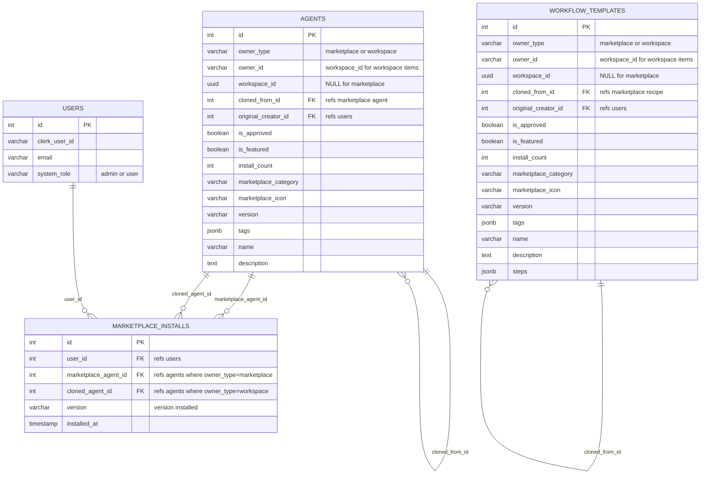
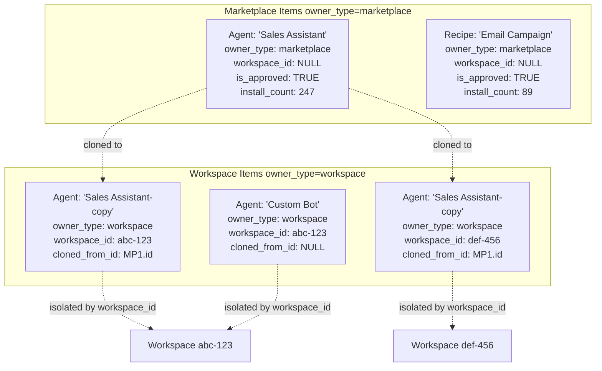
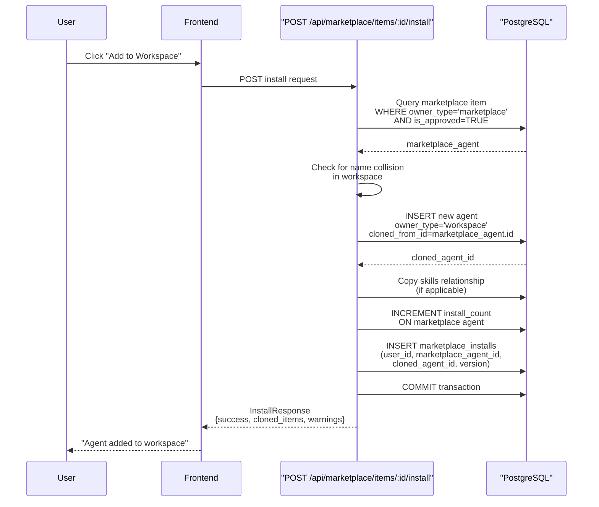
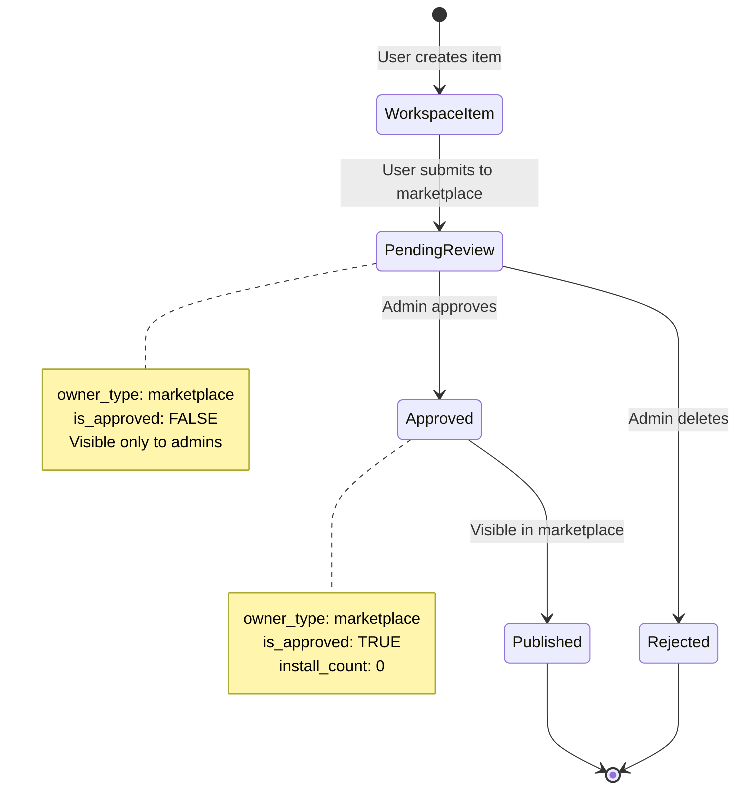
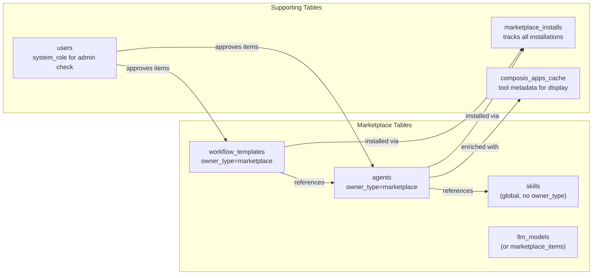

# Marketplace Backend

<details>
<summary>Relevant source files</summary>

The following files were used as context for generating this wiki page:

- [frontend/components/marketplace/marketplace-agents-tab.tsx](frontend/components/marketplace/marketplace-agents-tab.tsx)
- [frontend/components/marketplace/marketplace-card.tsx](frontend/components/marketplace/marketplace-card.tsx)
- [frontend/components/marketplace/marketplace-grid.tsx](frontend/components/marketplace/marketplace-grid.tsx)
- [frontend/components/marketplace/marketplace-homepage.tsx](frontend/components/marketplace/marketplace-homepage.tsx)
- [frontend/components/marketplace/marketplace-item-modal.tsx](frontend/components/marketplace/marketplace-item-modal.tsx)
- [frontend/components/marketplace/marketplace-llms-tab.tsx](frontend/components/marketplace/marketplace-llms-tab.tsx)
- [frontend/components/marketplace/marketplace-recipes-tab.tsx](frontend/components/marketplace/marketplace-recipes-tab.tsx)
- [frontend/components/marketplace/marketplace-tools-tab.tsx](frontend/components/marketplace/marketplace-tools-tab.tsx)
- [frontend/lib/agent-constants.ts](frontend/lib/agent-constants.ts)
- [orchestrator/api/marketplace.py](orchestrator/api/marketplace.py)
- [orchestrator/scripts/seed_llm_marketplace.py](orchestrator/scripts/seed_llm_marketplace.py)

</details>


This document describes the backend implementation of the Community Marketplace, focusing on database schema, ownership patterns, install tracking, and the approval workflow. The marketplace allows users to discover and install pre-built agents, recipes, LLM models, and other components from a central repository.

For information about browsing and installing items from the frontend, see [Browsing & Installing Items](#10.2). For publishing workspace items to the marketplace, see [Publishing to Marketplace](#10.3). For API endpoint specifications, see [Marketplace API Reference](#10.5).

---

## Database Schema

The marketplace uses an **ownership pattern** rather than separate tables. Marketplace items are stored in the same tables as workspace items (`agents`, `workflow_templates`, etc.), differentiated by the `owner_type` column. This design enables code reuse and simplifies the cloning process.

### Core Fields

Every marketplace-enabled table includes these columns:

| Column | Type | Purpose |
|--------|------|---------|
| `owner_type` | `VARCHAR` | Either `'marketplace'` or `'workspace'` |
| `owner_id` | `VARCHAR` | Workspace ID for workspace items, NULL for marketplace |
| `workspace_id` | `UUID` | NULL for marketplace items, workspace UUID for workspace items |
| `is_approved` | `BOOLEAN` | Admin approval status for marketplace items |
| `is_featured` | `BOOLEAN` | Whether item appears in featured section |
| `install_count` | `INTEGER` | Number of times installed (marketplace items only) |
| `cloned_from_id` | `INTEGER` | Reference to marketplace item this was cloned from |
| `original_creator_id` | `INTEGER` | DB user ID of original creator |
| `marketplace_category` | `VARCHAR` | Display category (e.g., "Customer Support", "DevOps") |
| `marketplace_icon` | `VARCHAR` | Icon URL or emoji for marketplace display |
| `version` | `VARCHAR` | Semantic version string (e.g., "1.0.0") |
| `tags` | `JSONB` | Array of tags for filtering |



**Sources:** [orchestrator/api/marketplace.py:35-80](), [orchestrator/api/marketplace.py:469-580]()

---

## Owner Type Pattern

The `owner_type` field enables a single table to store both marketplace and workspace items. This pattern appears throughout the codebase for multi-tenant isolation.

### Marketplace Items

```python
owner_type = 'marketplace'
owner_id = None
workspace_id = None
is_approved = True  # Must be approved to appear in marketplace
is_featured = False  # Admin-curated featured status
install_count = 0  # Incremented on each install
```

When querying marketplace items, the filter is:

```sql
WHERE owner_type = 'marketplace' AND is_approved = TRUE
```

Admin users can see unapproved items (`is_approved = FALSE`) for moderation purposes.

### Workspace Items

```python
owner_type = 'workspace'
owner_id = str(workspace_id)  # Workspace UUID as string
workspace_id = workspace_id  # UUID reference
is_approved = True  # Always true for workspace items
is_featured = False  # Not applicable
install_count = 0  # Not applicable
cloned_from_id = 123  # If cloned from marketplace
```

Workspace items are isolated by `workspace_id` in all queries, ensuring multi-tenant security.



**Sources:** [orchestrator/api/marketplace.py:122-231](), [orchestrator/api/marketplace.py:468-580]()

---

## Install Flow

When a user installs a marketplace item, the backend creates a workspace-owned copy and records the installation in the `marketplace_installs` table.

### Installation Sequence



### Clone Logic

The cloning process copies the item's configuration while swapping ownership fields:

```python
# Source: marketplace agent
marketplace_agent = {
    "owner_type": "marketplace",
    "owner_id": None,
    "workspace_id": None,
    "name": "Sales Assistant",
    "configuration": {...},
    "model_config": {...}
}

# Cloned: workspace agent
cloned_agent = {
    "owner_type": "workspace",
    "owner_id": str(workspace_id),
    "workspace_id": workspace_id,
    "name": "Sales Assistant-copy",  # Renamed if collision
    "configuration": marketplace_agent.configuration,  # Copied
    "model_config": marketplace_agent.model_config,  # Copied
    "cloned_from_id": marketplace_agent.id,  # Tracking
    "original_creator_id": marketplace_agent.original_creator_id,  # Preserved
    "version": marketplace_agent.version  # Snapshot
}
```

**Key behaviors:**

1. **Name collision handling**: If an agent named "Sales Assistant" already exists in the workspace, the clone is named "Sales Assistant-copy"
2. **Skills copying**: For agents, the `skills` many-to-many relationship is copied directly (skills are shared globally, not workspace-isolated)
3. **Tool assignments**: Tool assignments are NOT automatically copied—users must reconnect tools in their workspace
4. **Version snapshot**: The installed version is recorded for update detection

**Sources:** [orchestrator/api/marketplace.py:468-580]()

---

## Install Tracking Table

The `marketplace_installs` table records every installation for analytics and update checking.

### Schema

```sql
CREATE TABLE marketplace_installs (
    id SERIAL PRIMARY KEY,
    user_id INTEGER NOT NULL REFERENCES users(id),
    marketplace_agent_id INTEGER NOT NULL REFERENCES agents(id),
    cloned_agent_id INTEGER NOT NULL REFERENCES agents(id),
    version VARCHAR(20) NOT NULL,
    installed_at TIMESTAMP NOT NULL DEFAULT NOW()
);
```

### Update Detection

The system detects available updates by comparing installed version against current marketplace version:

```sql
SELECT
    marketplace_agent.id,
    marketplace_agent.name,
    mins.version as installed_version,
    marketplace_agent.version as latest_version
FROM marketplace_installs mins
JOIN agents marketplace_agent ON mins.marketplace_agent_id = marketplace_agent.id
WHERE mins.user_id = :user_id
AND mins.version != marketplace_agent.version
AND marketplace_agent.owner_type = 'marketplace'
```

This query powers the **GET /api/marketplace/updates** endpoint, which returns items where `installed_version < latest_version`.

**Sources:** [orchestrator/api/marketplace.py:645-696]()

---

## Querying Marketplace Items

The **GET /api/marketplace/items** endpoint supports filtering and pagination across multiple item types.

### Query Parameters

| Parameter | Type | Description |
|-----------|------|-------------|
| `type` | `str` | Filter by type: `'agent'`, `'recipe'`, `'skill'`, `'llm'`, `'tool'` |
| `category` | `str` | Filter by marketplace category |
| `search` | `str` | Search in name and description (case-insensitive ILIKE) |
| `featured` | `bool` | Show only featured items |
| `limit` | `int` | Max results (1-100, default 50) |
| `offset` | `int` | Pagination offset |

### Cross-Type Queries

When `type` is `None`, the endpoint queries both `agents` and `workflow_templates` tables and combines results:

```python
# Query agents
agent_query = db.query(Agent).filter(Agent.owner_type == 'marketplace')
if not user_is_admin:
    agent_query = agent_query.filter(Agent.is_approved == True)
agents = agent_query.order_by(desc(Agent.install_count)).all()

# Query recipes
recipe_query = db.query(WorkflowRecipe).filter(WorkflowRecipe.owner_type == 'marketplace')
if not user_is_admin:
    recipe_query = recipe_query.filter(WorkflowRecipe.is_approved == True)
recipes = recipe_query.order_by(desc(WorkflowRecipe.install_count)).all()

# Combine and sort by install_count
items = agents + recipes
items.sort(key=lambda x: (x.install_count, x.created_at), reverse=True)

# Apply pagination AFTER combining
items = items[offset:offset + limit]
```

This approach ensures global pagination when browsing "All Items" rather than per-table pagination.

**Sources:** [orchestrator/api/marketplace.py:122-308]()

---

## Response Enrichment

The API enriches marketplace items with additional metadata for frontend display.

### Agent Response

```json
{
  "id": 42,
  "type": "agent",
  "name": "Sales Assistant",
  "description": "AI agent for sales automation",
  "creator_name": "user@automatos.app",
  "icon": "💼",
  "category": "Sales",
  "tags": ["crm", "automation", "sales"],
  "install_count": 247,
  "is_featured": true,
  "version": "1.2.0",
  "metadata": {
    "agent_type": "assistant",
    "model_config": {"provider": "openai", "model_id": "gpt-4o"},
    "tool_names": ["SALESFORCE", "HUBSPOT", "GMAIL"],
    "tool_icons": ["https://...", "https://...", "https://..."]
  }
}
```

Tool names and icons are fetched via a JOIN with `composio_apps_cache`:

```sql
SELECT ata.tool_id, cac.logo_url
FROM agent_tool_assignments ata
LEFT JOIN composio_apps_cache cac
    ON LOWER(cac.app_slug) = LOWER(ata.tool_id)
    OR LOWER(cac.app_name) = LOWER(ata.tool_id)
WHERE ata.agent_id = :agent_id AND ata.enabled = true
LIMIT 3
```

This provides the frontend with visual tool indicators without additional API calls.

### Recipe Response

```json
{
  "id": 15,
  "type": "recipe",
  "name": "Email Campaign Automation",
  "description": "Multi-step workflow for email campaigns",
  "creator_name": "user@automatos.app",
  "category": "Marketing",
  "install_count": 89,
  "steps": [
    {"agent_id": 42, "name": "Draft Email", "order": 1},
    {"agent_id": 43, "name": "Send via MailChimp", "order": 2}
  ],
  "metadata": {
    "required_tools": ["mailchimp", "gmail"],
    "recommended_agents": ["Sales Assistant"]
  }
}
```

**Sources:** [orchestrator/api/marketplace.py:180-231](), [orchestrator/api/marketplace.py:260-296]()

---

## Featured Items

Featured items are admin-curated and displayed prominently in the marketplace homepage. The `is_featured` flag is set manually by admins.

### Featured Query

```python
agents = db.query(Agent).filter(
    Agent.owner_type == 'marketplace',
    Agent.is_approved == True,
    Agent.is_featured == True
).order_by(
    desc(Agent.install_count),
    desc(Agent.created_at)
).limit(8).all()
```

The **GET /api/marketplace/featured** endpoint returns up to 8 (configurable) featured items sorted by popularity.

### Admin Controls

Admins can toggle featured status via the **POST /api/marketplace/items/:id/feature** endpoint (not shown in provided files, but referenced in frontend). The flag is stored directly in the `is_featured` column.

**Sources:** [orchestrator/api/marketplace.py:587-638]()

---

## Approval Workflow

Items submitted to the marketplace start with `is_approved = FALSE` and are invisible to non-admin users until approved.



### Admin Check

The `is_admin()` helper determines if a user has admin privileges:

```python
def is_admin(ctx: RequestContext) -> bool:
    if not ctx.user:
        return False
    return getattr(ctx.user, 'system_role', 'user') == 'admin'
```

Users with `system_role = 'admin'` in the `users` table can:
1. View unapproved items (`is_approved = FALSE`)
2. Approve items via **POST /api/marketplace/items/:id/approve**
3. Delete items via **DELETE /api/marketplace/items/:id**
4. Toggle featured status

**Sources:** [orchestrator/api/marketplace.py:36-47](), [orchestrator/api/marketplace.py:122-158]()

---

## Submission Process

Users submit workspace items to the marketplace via **POST /api/marketplace/items/submit** (endpoint implementation not shown in provided files, referenced in [Publishing to Marketplace](#10.3)).

The submission process:

1. **Duplicate item**: Create a copy with `owner_type = 'marketplace'` and `is_approved = FALSE`
2. **Set creator**: Record `original_creator_id` from current user
3. **Metadata**: Copy category, tags, and configuration from workspace item
4. **Link**: Set `cloned_from_id` on marketplace copy to reference workspace original

After approval, the item appears in marketplace listings with `install_count = 0`.

---

## Item Detail Endpoint

The **GET /api/marketplace/items/:id** endpoint returns enriched details including dependencies.

### Agent Detail

```python
def _build_agent_detail(agent: Agent, db: Session) -> MarketplaceItemDetail:
    # Get creator name from users table
    creator = db.query(UserModel).filter(UserModel.id == agent.original_creator_id).first()
    
    # Get assigned skills
    skills = [{'id': s.id, 'name': s.name, 'description': s.description} 
              for s in agent.skills]
    
    # Get tool assignments with Composio metadata
    tools = db.execute(text('''
        SELECT ata.tool_id, cac.logo_url, cac.description, cac.display_name
        FROM agent_tool_assignments ata
        LEFT JOIN composio_apps_cache cac
            ON LOWER(cac.app_slug) = LOWER(ata.tool_id)
        WHERE ata.agent_id = :agent_id
    '''), {"agent_id": agent.id}).fetchall()
    
    return MarketplaceItemDetail(
        id=agent.id,
        type='agent',
        metadata={'skills': skills, 'tool_names': [...], 'tool_icons': [...]},
        dependencies={'skills': skills}
    )
```

This detailed view is used by `MarketplaceItemModal` on the frontend to show full configuration before installation.

**Sources:** [orchestrator/api/marketplace.py:315-428]()

---

## Statistics and Analytics

The marketplace tracks key metrics for display:

| Metric | Calculation |
|--------|-------------|
| Total Items | `COUNT(*) WHERE owner_type='marketplace' AND is_approved=TRUE` |
| Featured Count | `COUNT(*) WHERE is_featured=TRUE` |
| Total Installs | `SUM(install_count)` across all marketplace items |
| Categories | `COUNT(DISTINCT marketplace_category)` |

These are computed on-demand by the frontend's `fetchStats()` function, which queries **GET /api/marketplace/items?limit=100** and aggregates locally.

For production systems with large catalogs, these metrics should be cached in Redis or precomputed.

**Sources:** [frontend/components/marketplace/marketplace-homepage.tsx:54-70]()

---

## LLM Marketplace

LLM models are seeded into the marketplace via the `seed_llm_marketplace.py` script. These are treated as read-only marketplace items:

```python
LLM_MODELS = [
    {
        "provider": "openai",
        "model_id": "gpt-4o",
        "display_name": "GPT-4o",
        "context_window": 128000,
        "capabilities": ["text", "vision", "code"],
        "is_recommended": True
    },
    # ... 400+ models
]
```

The script inserts models into a `marketplace_items` table (not shown in provided schema—may be an older implementation) or uses a similar pattern with `owner_type = 'marketplace'`.

Note: The provided code shows models being stored in `marketplace_items` table, but the main API endpoints query `agents` and `workflow_templates`. This suggests LLM marketplace may use a separate table or be in transition.

**Sources:** [orchestrator/scripts/seed_llm_marketplace.py:1-101]()

---

## Multi-Table Architecture

The marketplace spans multiple tables with consistent `owner_type` patterns:



Each item type implements:
1. `owner_type` differentiation
2. `cloned_from_id` tracking
3. `install_count` incrementing
4. `is_approved` gating
5. `is_featured` curation

**Sources:** [orchestrator/api/marketplace.py:1-820]()

---