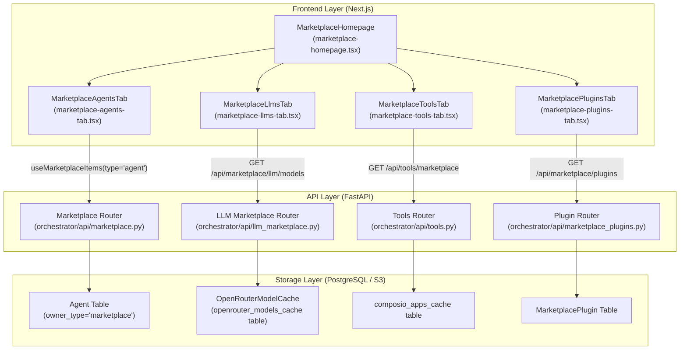
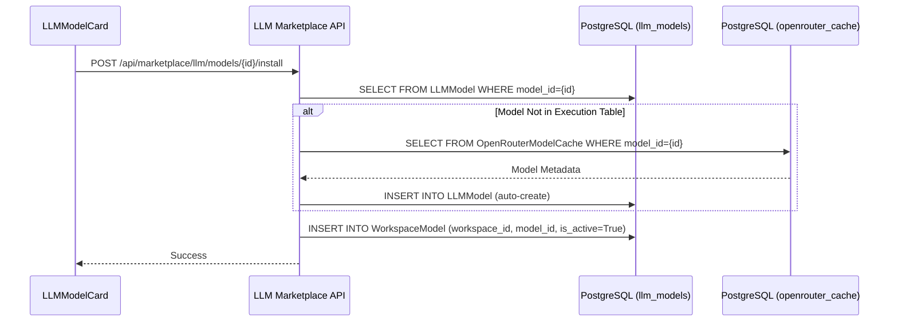

# Marketplace Overview

Relevant source files

The following files were used as context for generating this wiki page:

- [frontend/components/marketplace/llm-model-card.tsx](frontend/components/marketplace/llm-model-card.tsx)
- [frontend/components/marketplace/llm-model-detail-modal.tsx](frontend/components/marketplace/llm-model-detail-modal.tsx)
- [frontend/components/marketplace/marketplace-agents-tab.tsx](frontend/components/marketplace/marketplace-agents-tab.tsx)
- [frontend/components/marketplace/marketplace-homepage.tsx](frontend/components/marketplace/marketplace-homepage.tsx)
- [frontend/components/marketplace/marketplace-llms-tab.tsx](frontend/components/marketplace/marketplace-llms-tab.tsx)
- [frontend/components/marketplace/marketplace-plugin-detail-modal.tsx](frontend/components/marketplace/marketplace-plugin-detail-modal.tsx)
- [frontend/components/marketplace/marketplace-plugins-tab.tsx](frontend/components/marketplace/marketplace-plugins-tab.tsx)
- [frontend/components/marketplace/marketplace-skills-tab.tsx](frontend/components/marketplace/marketplace-skills-tab.tsx)
- [frontend/components/marketplace/marketplace-tools-tab.tsx](frontend/components/marketplace/marketplace-tools-tab.tsx)
- [frontend/hooks/use-openrouter-api.ts](frontend/hooks/use-openrouter-api.ts)
- [orchestrator/api/llm_marketplace.py](orchestrator/api/llm_marketplace.py)
- [orchestrator/api/marketplace_plugins.py](orchestrator/api/marketplace_plugins.py)
- [orchestrator/api/openrouter_marketplace.py](orchestrator/api/openrouter_marketplace.py)
- [orchestrator/core/database/migrations/042_openrouter_models_cache.sql](orchestrator/core/database/migrations/042_openrouter_models_cache.sql)
- [orchestrator/scripts/seed_llm_marketplace.py](orchestrator/scripts/seed_llm_marketplace.py)

## Purpose and Scope

The Community Marketplace is a centralized hub within Automatos AI that allows users to discover, install, and publish reusable AI components. It facilitates the distribution of **Applications (Tools)**, **Agents**, **Workflows (Recipes)**, **LLMs (OpenRouter Models)**, and **Capabilities (Plugins/Skills)**. [frontend/components/marketplace/marketplace-homepage.tsx:10-26]()

The marketplace architecture relies on a unified ownership model where the `owner_type` field distinguishes between `'marketplace'` (publicly shared templates) and `'workspace'` (private/installed instances). This enables a "Clone-to-Workspace" pattern, ensuring that modifications made to an installed agent or recipe do not affect the original marketplace template.

---

## System Architecture

The marketplace integrates frontend discovery interfaces with backend API services that manage database isolation and external provider synchronization.

### Marketplace Discovery Data Flow

**Sources:** [frontend/components/marketplace/marketplace-homepage.tsx:21-31](), [frontend/components/marketplace/marketplace-agents-tab.tsx:85-89](), [frontend/components/marketplace/marketplace-tools-tab.tsx:112-113](), [orchestrator/api/llm_marketplace.py:25-30](), [orchestrator/api/marketplace_plugins.py:34-36]()

---

## Marketplace Item Types

The marketplace categorizes AI components into primary tabs. Each type follows a specific discovery and installation logic:

| Tab | Item Type | Code Entity | Backend Source / Hook |
|:---|:---|:---|:---|
| **Applications** | Tools | `ComposioApp` | `/api/tools/marketplace` via `useAvailableApps` |
| **Agents** | AI Agents | `MarketplaceAgent` | `useMarketplaceItems({type: 'agent'})` |
| **Recipes** | Playbooks | `WorkflowRecipe` | `MarketplacePlaybooksTab` |
| **LLMs** | Models | `LLMModel` | `/api/marketplace/llm/models` |
| **Capabilities** | Skills/Plugins | `Skill` / `PluginSummary` | `MarketplaceSkillsTab` / `MarketplacePluginsTab` |

### Implementation of Item Categories
For Agents, the UI provides category filtering which maps to the `category` field in the database, normalized via `normalizeCategory`. [frontend/components/marketplace/marketplace-agents-tab.tsx:30-45](). LLMs use categories such as "Fast", "Reasoning", and "Vision" to filter the OpenRouter model cache. [frontend/components/marketplace/marketplace-llms-tab.tsx:46-55]()

**Sources:** [frontend/components/marketplace/marketplace-agents-tab.tsx:30-45](), [frontend/components/marketplace/marketplace-llms-tab.tsx:46-55](), [frontend/components/marketplace/marketplace-tools-tab.tsx:112-127]()

---

## LLM Marketplace (PRD-54)

The LLM Marketplace allows users to browse and install models from OpenRouter. It bridges the `OpenRouterModelCache` (the discovery layer) and the `LLMModel` table (the execution layer). [orchestrator/api/llm_marketplace.py:101-106]()

### Model Installation Logic
When a model is selected for installation:
1.  **Cache Resolution**: The system checks if the model exists in the `LLMModel` table. [orchestrator/api/llm_marketplace.py:107-109]()
2.  **Auto-Creation**: If missing, it auto-creates the `LLMModel` record using metadata from the `OpenRouterModelCache` via `_get_or_create_from_cache`. [orchestrator/api/llm_marketplace.py:118-143]()
3.  **Workspace Activation**: The model ID is added to the `WorkspaceModel` table with `is_active=True`. [orchestrator/api/llm_marketplace.py:203-207]()

**Sources:** [orchestrator/api/llm_marketplace.py:118-143](), [orchestrator/api/llm_marketplace.py:199-208](), [frontend/components/marketplace/llm-model-card.tsx:124-147]()

---

## Tool Discovery & Connection

The "Applications" tab provides a searchable interface for integrations. Unlike Agents, Tools are managed through a specialized synchronization service.

1.  **Cache Sync**: The system maintains a local cache of available tools in the `composio_apps_cache` table. Admins can trigger a full sync. [frontend/components/marketplace/marketplace-tools-tab.tsx:69-70]()
2.  **Marketplace View**: `MarketplaceToolsTab` fetches from `/api/tools/marketplace`. This endpoint returns cached metadata (logo, description, action count) to ensure fast browsing. [frontend/components/marketplace/marketplace-tools-tab.tsx:112-127]()
3.  **Connection Flow**:
    *   Clicking "Connect" triggers `useInitiateConnection`. [frontend/components/marketplace/marketplace-tools-tab.tsx:163]()
    *   For OAuth tools, a provider popup is opened via the Composio SDK.
    *   Upon successful auth, the tool status becomes `active` in the user's workspace, allowing it to be assigned to agents. [frontend/components/marketplace/marketplace-tools-tab.tsx:181-188]()

**Sources:** [frontend/components/marketplace/marketplace-tools-tab.tsx:112-127](), [frontend/components/marketplace/marketplace-tools-tab.tsx:163-188]()

---

## Capabilities: Plugins & Skills

The "Capabilities" tab is split into **Plugins** and **Skills**.

### Marketplace Plugins (PRD-42)
Plugins are atomic extensions packaged together. The `MarketplacePluginsTab` lists approved and active plugins. [orchestrator/api/marketplace_plugins.py:180-187]()
*   **Enriched Content**: The backend extracts `skills`, `commands`, and `agents` from the plugin manifest stored in S3/DB. [orchestrator/api/marketplace_plugins.py:133-162]()
*   **Detail View**: `MarketplacePluginDetailModal` shows full information, including security status (Verified Safe, Blocked, Review Required). [frontend/components/marketplace/marketplace-plugin-detail-modal.tsx:197-228]()
*   **Admin Control**: Admins can approve or reject pending plugins directly from the UI. [frontend/components/marketplace/marketplace-plugin-detail-modal.tsx:160-188]()

### Marketplace Skills
Skills are specialised methodologies or prompt-based capabilities. The `MarketplaceSkillsTab` fetches available skills for the workspace via `/api/workspaces/{workspaceId}/skills/available`. [frontend/components/marketplace/marketplace-skills-tab.tsx:86-88]()

Installation involves a `POST` to the workspace skills endpoint, which registers the skill as enabled for that specific workspace. [frontend/components/marketplace/marketplace-skills-tab.tsx:102-112]()

**Sources:** [orchestrator/api/marketplace_plugins.py:133-162](), [frontend/components/marketplace/marketplace-plugin-detail-modal.tsx:197-228](), [frontend/components/marketplace/marketplace-skills-tab.tsx:102-112]()

---

## Search & Filtering Implementation

The marketplace uses a combination of server-side filtering and client-side logic.

*   **SearchInput**: Captures user input in `MarketplaceHomepage` and passes it to child tabs as the `searchQuery` prop. [frontend/components/marketplace/marketplace-homepage.tsx:21-27]()
*   **Category Filtering**: Child tabs like `MarketplaceAgentsTab` and `MarketplaceToolsTab` use local state to filter results by category (e.g., 'all', 'coding', 'reasoning'). [frontend/components/marketplace/marketplace-agents-tab.tsx:74-96](), [frontend/components/marketplace/marketplace-tools-tab.tsx:71-135]()
*   **Pagination**: The `EnhancedPagination` component handles large result sets (e.g., 40 items per page for tools). [frontend/components/marketplace/marketplace-tools-tab.tsx:78-79]()

**Sources:** [frontend/components/marketplace/marketplace-homepage.tsx:21-27](), [frontend/components/marketplace/marketplace-agents-tab.tsx:74-96](), [frontend/components/marketplace/marketplace-tools-tab.tsx:78-79]()

---