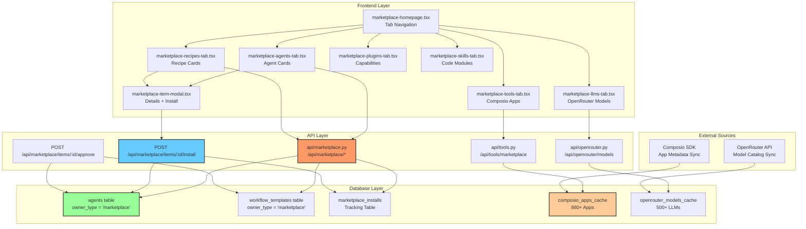
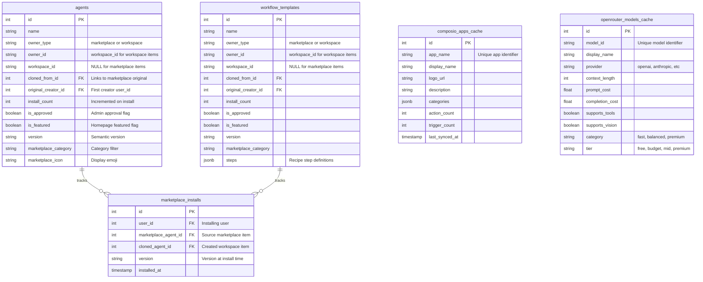
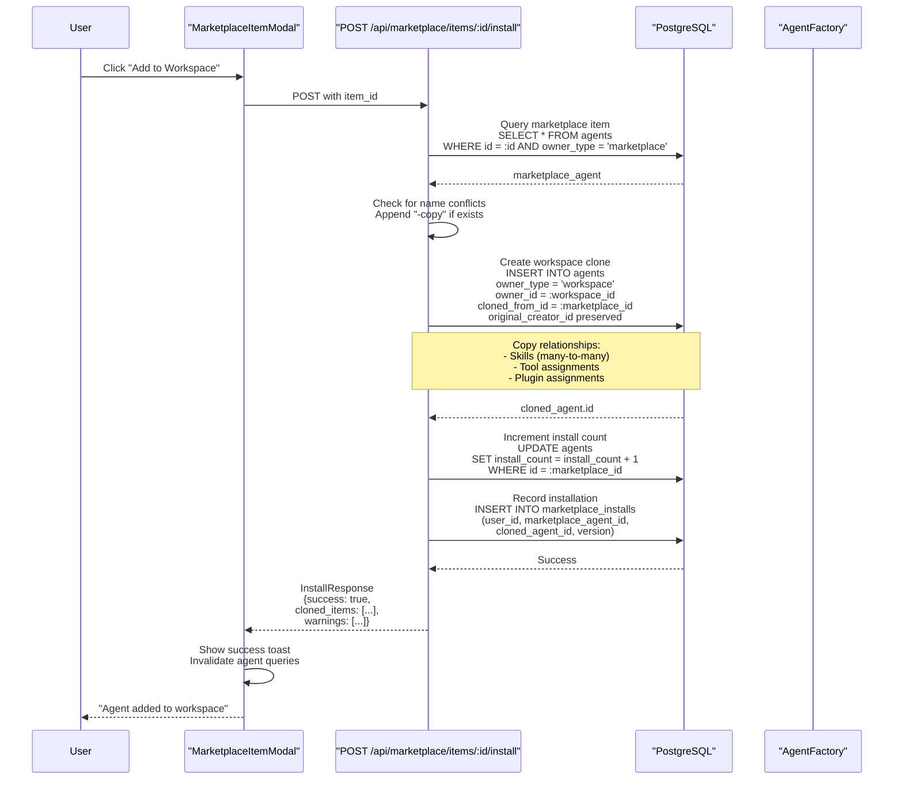
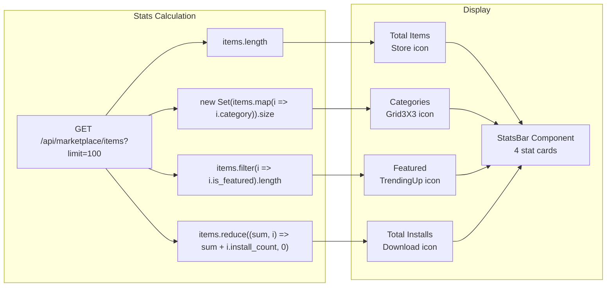

# Marketplace Overview

<details>
<summary>Relevant source files</summary>

The following files were used as context for generating this wiki page:

- [frontend/components/marketplace/marketplace-agents-tab.tsx](frontend/components/marketplace/marketplace-agents-tab.tsx)
- [frontend/components/marketplace/marketplace-card.tsx](frontend/components/marketplace/marketplace-card.tsx)
- [frontend/components/marketplace/marketplace-grid.tsx](frontend/components/marketplace/marketplace-grid.tsx)
- [frontend/components/marketplace/marketplace-homepage.tsx](frontend/components/marketplace/marketplace-homepage.tsx)
- [frontend/components/marketplace/marketplace-item-modal.tsx](frontend/components/marketplace/marketplace-item-modal.tsx)
- [frontend/components/marketplace/marketplace-llms-tab.tsx](frontend/components/marketplace/marketplace-llms-tab.tsx)
- [frontend/components/marketplace/marketplace-recipes-tab.tsx](frontend/components/marketplace/marketplace-recipes-tab.tsx)
- [frontend/components/marketplace/marketplace-tools-tab.tsx](frontend/components/marketplace/marketplace-tools-tab.tsx)
- [frontend/lib/agent-constants.ts](frontend/lib/agent-constants.ts)
- [orchestrator/api/marketplace.py](orchestrator/api/marketplace.py)
- [orchestrator/scripts/seed_llm_marketplace.py](orchestrator/scripts/seed_llm_marketplace.py)

</details>


## Purpose and Scope

The Community Marketplace enables users to discover, install, and publish reusable AI components across workspaces. This page covers the marketplace architecture, item types, installation flow, and publishing process. For detailed API operations, see [Marketplace API Reference](#10.5). For browsing and installing items via the UI, see [Browsing & Installing Items](#10.2). For publishing your own items, see [Publishing to Marketplace](#10.3).

The marketplace supports six item types: **Agents**, **Recipes**, **Tools** (Composio apps), **LLMs** (OpenRouter models), **Plugins** (capabilities), and **Skills** (custom code modules). All items follow a unified ownership model with `owner_type` field distinguishing between `'marketplace'` (shared) and `'workspace'` (private).

---

## System Architecture

The marketplace operates as a multi-layered system integrating frontend discovery UI, backend APIs, database isolation, and external data sources (Composio, OpenRouter).



**Sources:** [frontend/components/marketplace/marketplace-homepage.tsx:1-167](), [orchestrator/api/marketplace.py:1-309]()

---

## Item Types and Data Sources

The marketplace aggregates items from three distinct storage strategies:

| Item Type | Storage Location | Source | Count | Install Creates |
|-----------|-----------------|--------|-------|----------------|
| **Agents** | `agents` table | User submissions | ~50 | Workspace clone with `cloned_from_id` |
| **Recipes** | `workflow_templates` table | User submissions | ~30 | Workspace clone with dependency resolution |
| **Tools** | `composio_apps_cache` table | Composio SDK sync | 880+ | `workspace_tool_config` entry |
| **LLMs** | `openrouter_models_cache` table | OpenRouter API sync | 500+ | `workspace_llm_config` entry |
| **Plugins** | `plugins` table | User submissions | ~20 | Many-to-many `agent_plugin_assignments` |
| **Skills** | `skills` table | User submissions | ~10 | Many-to-many `agent_skills` |

**Key Distinction:** Agents and recipes use the `owner_type` field for marketplace vs workspace isolation, while tools and LLMs use dedicated cache tables that are globally shared with workspace-specific configuration overlays.

**Sources:** [orchestrator/api/marketplace.py:122-309](), [frontend/components/marketplace/marketplace-homepage.tsx:21-36]()

---

## Database Schema: Ownership Model

The marketplace uses a unified ownership pattern across shareable entities:



**Sources:** [orchestrator/api/marketplace.py:152-230](), [orchestrator/core/models/core.py:1-500]()

---

## Frontend Component Hierarchy

The marketplace UI uses a tab-based navigation pattern with specialized components per item type:

```mermaid
graph TB
    MarketplaceHomepage["MarketplaceHomepage<br/>Root Container"]
    
    subgraph "Header Components"
        PageHeader["PageHeader<br/>Title + Subtitle"]
        StatsBar["StatsBar<br/>Total Items, Categories, Featured, Installs"]
        SearchInput["SearchInput<br/>Cross-tab Search"]
    end
    
    subgraph "Tab Navigation"
        TabsList["TabsList<br/>tools | agents | recipes | llms | plugins | skills"]
    end
    
    subgraph "Tab Content Components"
        ToolsTab["MarketplaceToolsTab<br/>Fetches /api/tools/marketplace<br/>Displays ToolCard grid"]
        AgentsTab["MarketplaceAgentsTab<br/>Fetches /api/marketplace/items?type=agent<br/>Category filter buttons"]
        RecipesTab["MarketplaceRecipesTab<br/>Fetches /api/marketplace/items?type=recipe<br/>Step/agent count badges"]
        LlmsTab["MarketplaceLlmsTab<br/>Fetches /api/openrouter/models<br/>Provider filter chips"]
        PluginsTab["MarketplacePluginsTab<br/>Future: Plugin cards"]
        SkillsTab["MarketplaceSkillsTab<br/>Future: Skill cards"]
    end
    
    subgraph "Shared Modals"
        ItemModal["MarketplaceItemModal<br/>Details + Dependencies<br/>Install button"]
        AppDetailsModal["MarketplaceAppDetailsModal<br/>Tool-specific details<br/>Action/trigger lists"]
    end
    
    subgraph "Reusable UI"
        ViewToggle["ViewToggle<br/>List vs Grid"]
        ToolCard["ToolCard<br/>Logo, name, stats"]
        ToolLogo["ToolLogo<br/>Image with fallback"]
    end
    
    MarketplaceHomepage --> PageHeader
    MarketplaceHomepage --> StatsBar
    MarketplaceHomepage --> SearchInput
    MarketplaceHomepage --> TabsList
    MarketplaceHomepage --> ToolsTab
    MarketplaceHomepage --> AgentsTab
    MarketplaceHomepage --> RecipesTab
    MarketplaceHomepage --> LlmsTab
    MarketplaceHomepage --> PluginsTab
    MarketplaceHomepage --> SkillsTab
    
    ToolsTab --> ViewToggle
    ToolsTab --> ToolCard
    ToolsTab --> AppDetailsModal
    AgentsTab --> ViewToggle
    AgentsTab --> ItemModal
    RecipesTab --> ViewToggle
    RecipesTab --> ItemModal
    LlmsTab --> ViewToggle
    
    ToolCard --> ToolLogo
    ItemModal --> ToolLogo
    
    style MarketplaceHomepage fill:#ff9966,stroke:#333,stroke-width:2px
    style ToolsTab fill:#66ccff,stroke:#333,stroke-width:2px
    style ItemModal fill:#66ccff,stroke:#333,stroke-width:2px
```



**Sources:** [frontend/components/marketplace/marketplace-homepage.tsx:38-167](), [frontend/components/marketplace/marketplace-tools-tab.tsx:74-566]()

---

## Backend API Endpoints

The marketplace API provides CRUD operations and filtering for all item types:

| Endpoint | Method | Purpose | Response Model | Admin Only |
|----------|--------|---------|----------------|------------|
| `/api/marketplace/items` | GET | List items with filters | `List[MarketplaceItemOut]` | No |
| `/api/marketplace/items/:id` | GET | Get item details | `MarketplaceItemDetail` | No |
| `/api/marketplace/items/:id/install` | POST | Install to workspace | `InstallResponse` | No |
| `/api/marketplace/items/:id/approve` | POST | Approve for publication | `{success: bool}` | Yes |
| `/api/marketplace/items/:id` | DELETE | Remove from marketplace | `{success: bool}` | Yes |
| `/api/marketplace/featured` | GET | Get featured items | `List[MarketplaceItemOut]` | No |
| `/api/marketplace/updates` | GET | Check for updates | `List[UpdateInfo]` | No |
| `/api/tools/marketplace` | GET | Get Composio apps cache | `{apps: [...]}` | No |
| `/api/openrouter/models` | GET | Get OpenRouter models cache | `OpenRouterMarketplaceResponse` | No |

**Query Parameters for `/api/marketplace/items`:**
- `type`: Filter by 'agent', 'recipe', 'skill', 'llm', 'tool'
- `category`: Filter by marketplace category
- `search`: Search in name/description
- `featured`: Boolean filter for featured items
- `limit`: Pagination limit (default 50, max 100)
- `offset`: Pagination offset

**Sources:** [orchestrator/api/marketplace.py:122-309]()

---

## Installation Flow

Installing a marketplace item creates a workspace-scoped clone with dependency resolution:



**Key Implementation Details:**

1. **Name Deduplication**: [orchestrator/api/marketplace.py:502-508]() checks for existing workspace agents with the same name and appends "-copy" suffix if needed.

2. **Relationship Copying**: Skills are copied via SQLAlchemy relationship assignment: `cloned_agent.skills = marketplace_agent.skills` [orchestrator/api/marketplace.py:541-542](). Tool assignments require explicit copying from `agent_tool_assignments` table.

3. **Lineage Tracking**: `cloned_from_id` field enables update detection and provenance tracking [orchestrator/api/marketplace.py:527]().

4. **Install Counting**: Uses transactional increment: `marketplace_agent.install_count += 1` [orchestrator/api/marketplace.py:551]() to track popularity metrics.

**Sources:** [orchestrator/api/marketplace.py:468-580](), [frontend/components/marketplace/marketplace-item-modal.tsx:62-80]()

---

## Publishing Flow

Users submit workspace items to the marketplace via a multi-step approval process:

```mermaid
graph LR
    subgraph "1. User Submits"
        WorkspaceItem["Workspace Agent/Recipe<br/>owner_type = 'workspace'"]
        SubmitButton["Publish to Marketplace Button"]
    end
    
    subgraph "2. Submission API"
        SubmitEndpoint["POST /api/marketplace/items/submit<br/>Creates marketplace copy"]
        Validation["Validation:<br/>- Not already submitted<br/>- Has description<br/>- Has category"]
    end
    
    subgraph "3. Marketplace Copy Created"
        MarketplaceItem["New marketplace agent<br/>owner_type = 'marketplace'<br/>is_approved = false<br/>original_creator_id set"]
    end
    
    subgraph "4. Admin Review"
        AdminCheck{"Admin views<br/>pending items"}
        ApproveAction["POST /api/marketplace/items/:id/approve"]
        DeleteAction["DELETE /api/marketplace/items/:id"]
    end
    
    subgraph "5. Publication"
        PublishedItem["is_approved = true<br/>Visible to all users"]
        FeaturedFlag["Optional:<br/>is_featured = true<br/>Shows on homepage"]
    end
    
    WorkspaceItem --> SubmitButton
    SubmitButton --> SubmitEndpoint
    SubmitEndpoint --> Validation
    Validation -->|Valid| MarketplaceItem
    Validation -->|Invalid| SubmitButton
    
    MarketplaceItem --> AdminCheck
    AdminCheck -->|Approve| ApproveAction
    AdminCheck -->|Reject| DeleteAction
    
    ApproveAction --> PublishedItem
    PublishedItem --> FeaturedFlag
    
    style SubmitEndpoint fill:#ff9966,stroke:#333,stroke-width:2px
    style PublishedItem fill:#99ff99,stroke:#333,stroke-width:2px
```



**Admin Detection**: Admins are identified by email containing 'automatos.app' [orchestrator/api/marketplace.py:36-46](). This check is performed in the `is_admin(ctx)` helper function.

**Approval Mechanism**: The `POST /api/marketplace/items/:id/approve` endpoint [orchestrator/api/marketplace.py:700-800]() sets `is_approved = true` and optionally `is_featured = true` for homepage visibility.

**Trusted Publisher Auto-Approval**: Future enhancement will allow trusted users (detected by `trusted_publisher` flag in `users` table) to bypass approval step.

**Sources:** [orchestrator/api/marketplace.py:701-840](), [frontend/components/marketplace/marketplace-agents-tab.tsx:110-124]()

---

## Category and Tag System

Marketplace items use a two-tier classification system:

### Categories (Single Selection)

**Agent Categories** (stored in `marketplace_category` field):
- Personal Assistant
- Customer Support
- DevOps
- Social Media
- Accounting
- E-commerce
- Content Creation
- HR
- Data Analysis
- Custom

**Recipe Categories**:
- Automation
- Data Processing
- Communication
- Analysis
- Content

**LLM Categories**:
- Fast (optimized for speed)
- Balanced (speed/quality trade-off)
- Premium (highest quality)
- Coding (code generation)
- Reasoning (complex logic)
- Vision (multimodal)
- Free (zero cost)

**Tool Categories** (from Composio):
Dynamic categories extracted from Composio metadata, including Communication, Productivity, CRM, Social Media, etc.

### Tags (Multiple Selection)

Tags are stored as `jsonb` array in the `tags` column [orchestrator/api/marketplace.py:61]() and used for multi-faceted search. Examples:
- `["automation", "email", "crm"]`
- `["code", "debugging", "python"]`
- `["text", "vision", "streaming"]`

**Frontend Filtering**: Categories use button chips [frontend/components/marketplace/marketplace-tools-tab.tsx:415-436]() while tags appear as badges on cards [frontend/components/marketplace/marketplace-agents-tab.tsx:315-324]().

**Sources:** [frontend/components/marketplace/marketplace-agents-tab.tsx:27-39](), [frontend/lib/agent-constants.ts:25-42](), [orchestrator/api/marketplace.py:160-170]()

---

## Search and Filtering Implementation

The marketplace implements server-side filtering with client-side instant feedback:

**Backend Query Construction** [orchestrator/api/marketplace.py:160-170]():
```python
# Category filter
if category:
    agent_query = agent_query.filter(Agent.marketplace_category == category)

# Search filter (case-insensitive)
if search:
    agent_query = agent_query.filter(or_(
        Agent.name.ilike(f'%{search}%'),
        Agent.description.ilike(f'%{search}%')
    ))
```

**Frontend Debounced Search** [frontend/components/marketplace/marketplace-tools-tab.tsx:110-143]():
- Category filter: Triggers immediate backend API call with `category` query param
- Search input: Uses local state for instant UI feedback, then sends to backend
- Combined filtering: Category applied server-side, search applied client-side for responsiveness

**Pagination**: Uses `limit` and `offset` parameters [orchestrator/api/marketplace.py:128-129]() with default 50 items per page, max 100. Frontend shows pagination controls when `filteredApps.length > pageSize` [frontend/components/marketplace/marketplace-tools-tab.tsx:524-530]().

**Sources:** [orchestrator/api/marketplace.py:122-309](), [frontend/components/marketplace/marketplace-tools-tab.tsx:212-251]()

---

## Featured Items and Stats Bar

The marketplace homepage displays aggregated statistics:



**Featured Items Endpoint**: `GET /api/marketplace/featured` [orchestrator/api/marketplace.py:587-638]() returns up to 8 items where `is_featured = true`, sorted by install count.

**Install Count Formatting**: Numbers ≥1000 are formatted with 'k' suffix, ≥1M with 'M' suffix [frontend/components/marketplace/marketplace-agents-tab.tsx:145-149]().

**Sources:** [frontend/components/marketplace/marketplace-homepage.tsx:49-70](), [orchestrator/api/marketplace.py:587-638]()

---

## Tool Marketplace Integration

The tool marketplace integrates Composio apps via a cached metadata layer:

**Metadata Sync Process** [orchestrator/modules/tools/services/metadata_sync_service.py:1-200]():
1. Admin triggers sync: `POST /api/tools/sync-cache?mode=full`
2. Backend fetches all apps from Composio SDK
3. Upserts into `composio_apps_cache` table
4. Indexes by `app_slug` and `app_name` for fast lookup

**Cache Table Schema**:
```sql
CREATE TABLE composio_apps_cache (
    id SERIAL PRIMARY KEY,
    app_name VARCHAR(255) UNIQUE NOT NULL,
    app_slug VARCHAR(255),
    display_name VARCHAR(255),
    description TEXT,
    logo_url TEXT,
    categories JSONB,
    action_count INTEGER,
    trigger_count INTEGER,
    auth_schemes JSONB,
    last_synced_at TIMESTAMP
);
```

**Frontend Fetching** [frontend/components/marketplace/marketplace-tools-tab.tsx:110-143]():
- Uses fast endpoint: `GET /api/tools/marketplace?limit=1000&category=Communication`
- Transforms response to `ComposioApp` interface
- Applies client-side search filter for instant feedback
- Displays in grid or list view with pagination

**Add to Workspace**: Creates entry in `workspace_tool_config` table [orchestrator/api/tools.py:264-280]() with status='added', not status='active' until OAuth connection is completed.

**Sources:** [frontend/components/marketplace/marketplace-tools-tab.tsx:110-143](), [orchestrator/api/tools.py:1-500]()

---

## LLM Marketplace Integration

The LLM marketplace sources models from OpenRouter's catalog:

**Sync Process** [orchestrator/api/openrouter.py:1-400]():
1. Admin triggers: `POST /api/openrouter/sync`
2. Backend calls OpenRouter API `/models` endpoint
3. Parses model metadata including pricing, context length, capabilities
4. Upserts into `openrouter_models_cache` table
5. Extracts provider stats for filter chips

**Model Metadata** [frontend/components/marketplace/marketplace-llms-tab.tsx:77-107]():
- `model_id`: Unique identifier (e.g., "anthropic/claude-3.5-sonnet")
- `provider`: openai, anthropic, meta-llama, google, etc.
- `context_length`: Max input tokens
- `max_completion_tokens`: Max output tokens
- `prompt_cost` / `completion_cost`: Per-token pricing
- `supports_tools`, `supports_vision`, `supports_reasoning`: Capability flags
- `category`: fast, balanced, premium, coding, reasoning, vision, free
- `tier`: free, budget, mid, premium

**Frontend Filtering** [frontend/components/marketplace/marketplace-llms-tab.tsx:164-286]():
- Provider filter: Dynamic chips built from `providerCounts` object
- Category dropdown: Fast, Balanced, Premium, Coding, Reasoning, Vision, Free
- Tier dropdown: Free, Budget, Mid-range, Premium
- Capability toggles: Tools, Vision, Reasoning (boolean filters)
- Sort options: Popularity, Cost, Context, Newest, Name A-Z

**Installation**: Creates entry in `workspace_llm_config` table linking `model_id` to workspace with credential configuration.

**Sources:** [frontend/components/marketplace/marketplace-llms-tab.tsx:159-653](), [orchestrator/api/openrouter.py:1-400]()

---

## Update Detection System

The marketplace tracks updates to installed items using version comparison:

**Update Check Query** [orchestrator/api/marketplace.py:665-677]():
```sql
SELECT
    marketplace_agent.id,
    marketplace_agent.name,
    mins.version as installed_version,
    marketplace_agent.version as latest_version
FROM marketplace_installs mins
JOIN agents marketplace_agent ON mins.marketplace_agent_id = marketplace_agent.id
WHERE mins.user_id = :user_id
AND mins.version != marketplace_agent.version
AND marketplace_agent.owner_type = 'marketplace'
ORDER BY marketplace_agent.updated_at DESC
```

**Version Format**: Semantic versioning string (e.g., "1.2.3") stored in `version` column [orchestrator/api/marketplace.py:67]().

**Update Response** [orchestrator/api/marketplace.py:109-116]():
```python
class UpdateInfo(BaseModel):
    item_id: int
    item_name: str
    item_type: str
    current_version: str
    latest_version: str
    changelog: str
```

**Frontend Display**: Future enhancement will show update badge on installed items with "Update Available" button.

**Sources:** [orchestrator/api/marketplace.py:645-696]()

---

## Admin Controls

Admins have special privileges for marketplace curation:

### Admin Detection
```python
def is_admin(ctx: RequestContext) -> bool:
    if not ctx.user:
        return False
    return getattr(ctx.user, 'system_role', 'user') == 'admin'
```
[orchestrator/api/marketplace.py:36-40]()

Frontend also checks: `user?.emailAddresses?.[0]?.emailAddress?.includes('automatos.app')` [frontend/components/marketplace/marketplace-agents-tab.tsx:93]()

### Admin-Only Endpoints

**Approve Item**: `POST /api/marketplace/items/:id/approve`
- Sets `is_approved = true`
- Optionally sets `is_featured = true`
- Makes item visible to all users

**Delete Item**: `DELETE /api/marketplace/items/:id`
- Removes item from marketplace permanently
- Does not affect already-installed workspace clones

**View Pending Items**:
- Non-admin users: `is_approved = true` filter applied automatically [orchestrator/api/marketplace.py:157]()
- Admin users: See all items including pending (is_approved = false) [orchestrator/api/marketplace.py:139]()

**Admin UI Indicators** [frontend/components/marketplace/marketplace-agents-tab.tsx:211-215]():
- Pending badge shows on unapproved items
- Dropdown menu includes Approve and Delete actions
- Admin role badge in header (future enhancement)

**Sources:** [orchestrator/api/marketplace.py:36-46](), [orchestrator/api/marketplace.py:700-840](), [frontend/components/marketplace/marketplace-agents-tab.tsx:110-143]()

---