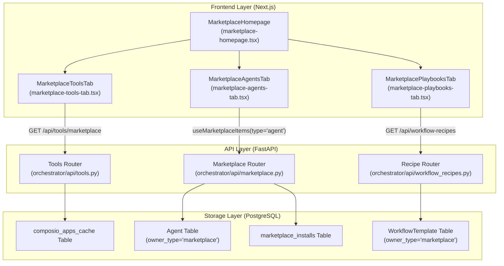
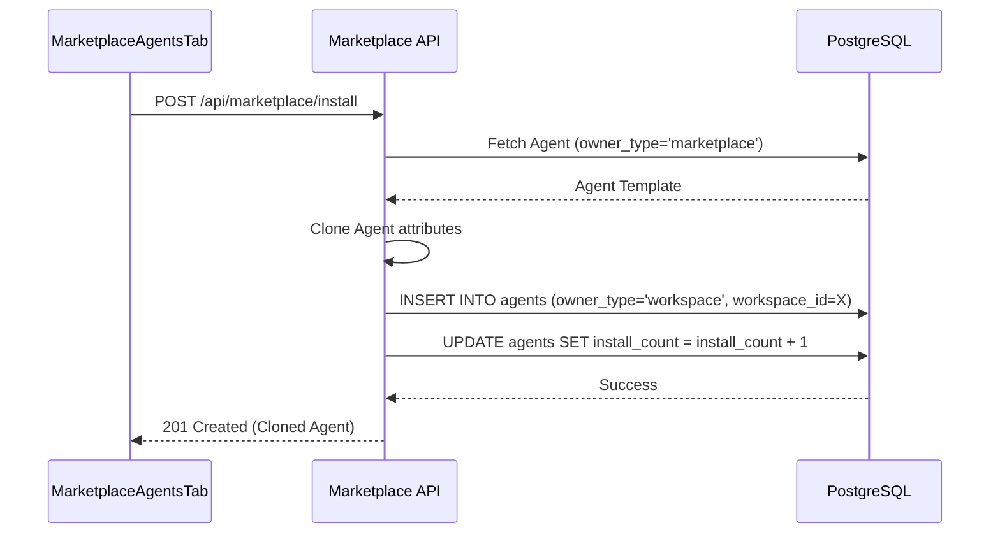

# Marketplace Overview

Relevant source files

The following files were used as context for generating this wiki page:

- [frontend/components/marketplace/marketplace-agents-tab.tsx](frontend/components/marketplace/marketplace-agents-tab.tsx)
- [frontend/components/marketplace/marketplace-homepage.tsx](frontend/components/marketplace/marketplace-homepage.tsx)
- [frontend/components/marketplace/marketplace-tools-tab.tsx](frontend/components/marketplace/marketplace-tools-tab.tsx)
- [frontend/components/shared/stats-bar.tsx](frontend/components/shared/stats-bar.tsx)
- [frontend/components/tools/tools-dashboard.tsx](frontend/components/tools/tools-dashboard.tsx)
- [frontend/components/workflows/active-workflows-panel.tsx](frontend/components/workflows/active-workflows-panel.tsx)
- [frontend/components/workflows/execution-kitchen.tsx](frontend/components/workflows/execution-kitchen.tsx)
- [frontend/components/workflows/workflow-management.tsx](frontend/components/workflows/workflow-management.tsx)
- [frontend/hooks/use-marketplace-api.ts](frontend/hooks/use-marketplace-api.ts)
- [frontend/lib/tooltips.json](frontend/lib/tooltips.json)
- [orchestrator/api/marketplace.py](orchestrator/api/marketplace.py)
- [orchestrator/api/recipe_executor.py](orchestrator/api/recipe_executor.py)
- [orchestrator/api/workflow_recipes.py](orchestrator/api/workflow_recipes.py)
- [orchestrator/modules/coordination/__init__.py](orchestrator/modules/coordination/__init__.py)
- [orchestrator/modules/coordination/agent_matcher.py](orchestrator/modules/coordination/agent_matcher.py)
- [orchestrator/modules/coordination/templates.py](orchestrator/modules/coordination/templates.py)
- [orchestrator/modules/learning/tests/conftest.py](orchestrator/modules/learning/tests/conftest.py)
- [orchestrator/modules/learning/tests/test_learning_system.py](orchestrator/modules/learning/tests/test_learning_system.py)

## Purpose and Scope

The Community Marketplace is a centralized hub within Automatos AI that allows users to discover, install, and publish reusable AI components. It facilitates the distribution of **Applications (Tools)**, **Agents**, **Workflows (Recipes)**, **LLMs (OpenRouter Models)**, and **Capabilities (Plugins/Skills)**. [frontend/components/marketplace/marketplace-homepage.tsx:142-146]()

The marketplace architecture relies on a unified ownership model where the `owner_type` field distinguishes between `'marketplace'` (publicly shared templates) and `'workspace'` (private/installed instances). This enables a "Clone-to-Workspace" pattern, ensuring that modifications made to an installed agent or recipe do not affect the original marketplace template. [orchestrator/api/marketplace.py:154-157]()

---

## System Architecture

The marketplace integrates frontend discovery interfaces with backend API services that manage database isolation and external provider synchronization.

### Marketplace Data Flow

**Sources:** [frontend/components/marketplace/marketplace-homepage.tsx:58-184](), [frontend/components/marketplace/marketplace-agents-tab.tsx:83-87](), [frontend/components/marketplace/marketplace-tools-tab.tsx:112-113](), [orchestrator/api/marketplace.py:122-132]()

---

## Marketplace Item Types

The marketplace categorizes AI components into five primary tabs. Each type follows a specific discovery and installation logic:

| Tab | Item Type | Code Entity | Backend Source / Hook |
|:---|:---|:---|:---|
| **Applications** | Tools | `ComposioApp` | `/api/tools/marketplace` via `useAvailableApps` |
| **Agents** | AI Agents | `Agent` | `useMarketplaceItems({type: 'agent'})` |
| **Recipes** | Workflows | `WorkflowTemplate` | `/api/workflow-recipes` |
| **LLMs** | Models | `LLMModel` | `/api/openrouter/models` |
| **Capabilities** | Skills/Plugins | `Skill` / `Plugin` | `MarketplacePluginsTab` / `MarketplaceSkillsTab` |

### Implementation of Item Categories
For Agents, the UI provides category filtering (e.g., "Customer Support", "DevOps") which maps to the `marketplace_category` field in the `Agent` model. [orchestrator/api/marketplace.py:160-161](). Tools use categories synchronized from the Composio SDK, retrieved via `apiClient.getToolCategories()`. [frontend/components/marketplace/marketplace-tools-tab.tsx:84-93]()

**Sources:** [frontend/components/marketplace/marketplace-homepage.tsx:142-146](), [frontend/components/marketplace/marketplace-tools-tab.tsx:112-127](), [frontend/components/marketplace/marketplace-agents-tab.tsx:30-45](), [orchestrator/api/marketplace.py:53-80]()

---

## Installation Logic: Clone-to-Workspace

When a user installs an item, the system performs a "deep clone" operation. This creates a workspace-scoped copy while maintaining a link to the original for tracking.

### Sequence: Installing a Marketplace Agent

**Sources:** [frontend/components/marketplace/marketplace-agents-tab.tsx:99-100](), [orchestrator/api/marketplace.py:172-173](), [orchestrator/api/marketplace.py:154-157]()

---

## Tool Discovery & Connection

The "Applications" tab provides a searchable interface for 800+ integrations. Unlike Agents, Tools are managed through a specialized synchronization service that interfaces with Composio. [frontend/components/marketplace/marketplace-tools-tab.tsx:1-6]()

1.  **Cache Sync**: The system maintains a local cache of available tools in the `composio_apps_cache` table. Admins can trigger a full sync via `apiClient.syncToolsCache('full')`. [frontend/components/tools/tools-dashboard.tsx:174-184]()
2.  **Marketplace View**: `MarketplaceToolsTab` fetches from `/api/tools/marketplace`. This endpoint returns cached metadata (logo, description, action count) to ensure fast browsing without hitting external APIs on every load. [frontend/components/marketplace/marketplace-tools-tab.tsx:112-127]()
3.  **Connection Flow**:
    *   Clicking "Connect" triggers `useInitiateConnection`. [frontend/components/marketplace/marketplace-tools-tab.tsx:163]()
    *   For OAuth tools, a provider popup is opened via the Composio SDK.
    *   Upon successful auth, the tool status becomes `active` in the user's workspace, enabling it for agent selection. [frontend/components/marketplace/marketplace-tools-tab.tsx:181-188]()

**Sources:** [frontend/components/marketplace/marketplace-tools-tab.tsx:112-127](), [frontend/components/tools/tools-dashboard.tsx:174-184](), [frontend/components/marketplace/marketplace-tools-tab.tsx:163-188]()

---

## Publishing & Admin Review

Users contribute to the community by publishing workspace items, which enter a review queue.

1.  **Submission**: A workspace item is submitted via `POST /api/marketplace/submit`. The item is cloned with `owner_type='marketplace'` and `is_approved=false`. [orchestrator/api/marketplace.py:100-106]()
2.  **Admin Review**: System administrators (detected via `system_role == 'admin'`) see pending items. [orchestrator/api/marketplace.py:36-40]()
3.  **Approval**: Admins approve items via `POST /api/marketplace/items/{id}/approve`, setting `is_approved=true`. [frontend/components/marketplace/marketplace-agents-tab.tsx:110](), [orchestrator/api/marketplace.py:64]()
4.  **Featuring**: Admins can set `is_featured = true`, causing items to appear in the `StatsBar` highlights and featured lists. [frontend/components/marketplace/marketplace-homepage.tsx:79-85](), [orchestrator/api/marketplace.py:169-170]()

**Sources:** [frontend/components/marketplace/marketplace-agents-tab.tsx:106-120](), [frontend/components/marketplace/marketplace-homepage.tsx:74-90](), [orchestrator/api/marketplace.py:36-47]()

---

## Search & Filtering Implementation

The marketplace uses a combination of server-side filtering and client-side debouncing to handle large catalogs.

*   **SearchInput**: Captures user input in `MarketplaceHomepage` and passes it to child tabs as a prop. [frontend/components/marketplace/marketplace-homepage.tsx:151-157]()
*   **Debouncing**: `ToolsDashboard` implements a 500ms timeout before updating the `debouncedSearch` string used in API calls to prevent excessive network requests. [frontend/components/tools/tools-dashboard.tsx:131-137]()
*   **Pagination**: The `EnhancedPagination` component handles result sets, using `skip` and `limit` parameters passed to the backend `list_items` function. [frontend/components/tools/tools-dashboard.tsx:158-163](), [orchestrator/api/marketplace.py:128-129]()

**Sources:** [frontend/components/marketplace/marketplace-homepage.tsx:151-157](), [frontend/components/tools/tools-dashboard.tsx:131-137](), [frontend/components/tools/tools-dashboard.tsx:158-163](), [orchestrator/api/marketplace.py:122-132]()

---