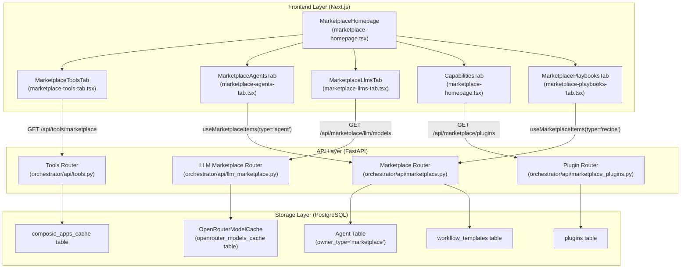
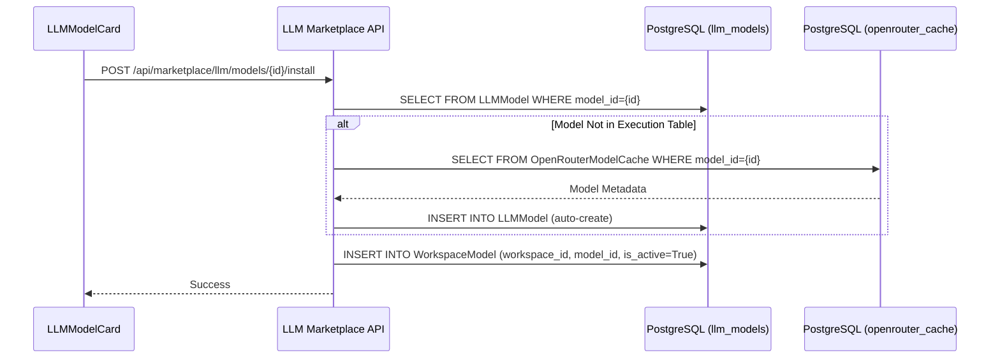

# Marketplace Overview

Relevant source files

The following files were used as context for generating this wiki page:

- [frontend/components/activity/activity-page.tsx](frontend/components/activity/activity-page.tsx)
- [frontend/components/agents/agent-management.tsx](frontend/components/agents/agent-management.tsx)
- [frontend/components/documents/document-management.tsx](frontend/components/documents/document-management.tsx)
- [frontend/components/marketplace/llm-model-card.tsx](frontend/components/marketplace/llm-model-card.tsx)
- [frontend/components/marketplace/llm-model-detail-modal.tsx](frontend/components/marketplace/llm-model-detail-modal.tsx)
- [frontend/components/marketplace/marketplace-agents-tab.tsx](frontend/components/marketplace/marketplace-agents-tab.tsx)
- [frontend/components/marketplace/marketplace-homepage.tsx](frontend/components/marketplace/marketplace-homepage.tsx)
- [frontend/components/marketplace/marketplace-llms-tab.tsx](frontend/components/marketplace/marketplace-llms-tab.tsx)
- [frontend/components/marketplace/marketplace-plugin-detail-modal.tsx](frontend/components/marketplace/marketplace-plugin-detail-modal.tsx)
- [frontend/components/marketplace/marketplace-plugins-tab.tsx](frontend/components/marketplace/marketplace-plugins-tab.tsx)
- [frontend/components/marketplace/marketplace-skills-tab.tsx](frontend/components/marketplace/marketplace-skills-tab.tsx)
- [frontend/components/marketplace/marketplace-tools-tab.tsx](frontend/components/marketplace/marketplace-tools-tab.tsx)
- [frontend/components/settings/ApiKeysSettingsTab.tsx](frontend/components/settings/ApiKeysSettingsTab.tsx)
- [frontend/components/tools/tools-dashboard.tsx](frontend/components/tools/tools-dashboard.tsx)
- [frontend/components/workflows/active-workflows-panel.tsx](frontend/components/workflows/active-workflows-panel.tsx)
- [frontend/components/workflows/workflow-management.tsx](frontend/components/workflows/workflow-management.tsx)
- [frontend/hooks/use-openrouter-api.ts](frontend/hooks/use-openrouter-api.ts)
- [orchestrator/api/llm_marketplace.py](orchestrator/api/llm_marketplace.py)
- [orchestrator/api/marketplace.py](orchestrator/api/marketplace.py)
- [orchestrator/api/marketplace_plugins.py](orchestrator/api/marketplace_plugins.py)
- [orchestrator/api/openrouter_marketplace.py](orchestrator/api/openrouter_marketplace.py)
- [orchestrator/api/user_api_keys.py](orchestrator/api/user_api_keys.py)
- [orchestrator/core/database/migrations/042_openrouter_models_cache.sql](orchestrator/core/database/migrations/042_openrouter_models_cache.sql)
- [orchestrator/core/llm/clients/__init__.py](orchestrator/core/llm/clients/__init__.py)
- [orchestrator/core/llm/usage_tracker.py](orchestrator/core/llm/usage_tracker.py)
- [orchestrator/scripts/seed_llm_marketplace.py](orchestrator/scripts/seed_llm_marketplace.py)

## Purpose and Scope

The Community Marketplace is a centralized hub within Automatos AI that allows users to discover, install, and publish reusable AI components. It facilitates the distribution of **Applications (Tools)**, **Agents**, **Workflows (Recipes)**, **LLMs (OpenRouter Models)**, and **Capabilities (Plugins/Skills)**. [frontend/components/marketplace/marketplace-homepage.tsx:10-26]()

The marketplace architecture relies on a unified ownership model where the `owner_type` field distinguishes between `'marketplace'` (publicly shared templates) and `'workspace'` (private/installed instances). This enables a "Clone-to-Workspace" pattern, ensuring that modifications made to an installed agent or recipe do not affect the original marketplace template.

---

## System Architecture

The marketplace integrates frontend discovery interfaces with backend API services that manage database isolation and external provider synchronization.

### Marketplace Discovery Data Flow

**Sources:** [frontend/components/marketplace/marketplace-homepage.tsx:21-31](), [frontend/components/marketplace/marketplace-agents-tab.tsx:85-89](), [frontend/components/marketplace/marketplace-tools-tab.tsx:112-113](), [orchestrator/api/llm_marketplace.py:25-30](), [frontend/components/marketplace/marketplace-plugins-tab.tsx:169-170](), [orchestrator/api/marketplace.py:148-149]()

---

## Marketplace Item Types

The marketplace categorizes AI components into primary tabs. Each type follows a specific discovery and installation logic:

| Tab | Item Type | Code Entity | Backend Source / Hook |
|:---|:---|:---|:---|
| **Applications** | Tools | `ComposioApp` | `/api/tools/marketplace` via `useAvailableApps` |
| **Agents** | AI Agents | `MarketplaceAgent` | `useMarketplaceItems({type: 'agent'})` |
| **Playbooks** | Workflows/Recipes | `WorkflowTemplate` | `useMarketplaceItems({type: 'recipe'})` |
| **LLMs** | Models | `LLMModel` | `/api/marketplace/llm/models` |
| **Plugins** | Plugins | `PluginSummary` | `/api/marketplace/plugins` |
| **Skills** | Skills | `Skill` | `/api/workspaces/{workspaceId}/skills/available` |

### Implementation of Item Categories
For Agents, the UI provides category filtering which maps to the `category` field in the database. [frontend/components/marketplace/marketplace-agents-tab.tsx:30-45](). LLMs use categories such as "Fast", "Reasoning", and "Vision" to filter the OpenRouter model cache. [frontend/components/marketplace/marketplace-llms-tab.tsx:46-55]()

**Sources:** [frontend/components/marketplace/marketplace-agents-tab.tsx:30-45](), [frontend/components/marketplace/marketplace-llms-tab.tsx:46-55](), [frontend/components/marketplace/marketplace-tools-tab.tsx:112-127](), [frontend/components/marketplace/marketplace-homepage.tsx:10-16]()

---

## LLM Marketplace (PRD-54)

The LLM Marketplace allows users to browse and install models from OpenRouter. It bridges the `OpenRouterModelCache` (the discovery layer) and the `LLMModel` table (the execution layer). [orchestrator/api/llm_marketplace.py:101-106]()

### Model Installation Logic
When a model is selected for installation:
1.  **Cache Resolution**: The system checks if the model exists in the `LLMModel` table. [orchestrator/api/llm_marketplace.py:108-110]()
2.  **Auto-Creation**: If missing, it auto-creates the `LLMModel` record using metadata from the `OpenRouterModelCache`. [orchestrator/api/llm_marketplace.py:118-143]()
3.  **Workspace Activation**: The model ID is added to the `WorkspaceModel` table with `is_active=True`. [orchestrator/api/llm_marketplace.py:203-207]()

**Sources:** [orchestrator/api/llm_marketplace.py:118-143](), [orchestrator/api/llm_marketplace.py:199-208](), [frontend/components/marketplace/llm-model-card.tsx:124-147]()

---

## Tool Discovery & Connection

The "Applications" tab provides a searchable interface for integrations. Unlike Agents, Tools are managed through a specialized synchronization service.

1.  **Cache Sync**: The system maintains a local cache of available tools in the `composio_apps_cache` table. Admins can trigger a full sync via `apiClient.syncToolsCache('full')`. [frontend/components/tools/tools-dashboard.tsx:174-184]()
2.  **Marketplace View**: `MarketplaceToolsTab` fetches from `/api/tools/marketplace`. This endpoint returns cached metadata (logo, description, action count) to ensure fast browsing. [frontend/components/marketplace/marketplace-tools-tab.tsx:112-127]()
3.  **Connection Flow**:
    *   Clicking "Connect" triggers `useInitiateConnection`. [frontend/components/marketplace/marketplace-tools-tab.tsx:163]()
    *   For OAuth tools, a provider popup is opened via the Composio SDK.
    *   Upon successful auth, the tool status becomes `active` in the user's workspace, allowing it to be assigned to agents. [frontend/components/marketplace/marketplace-tools-tab.tsx:181-188]()

**Sources:** [frontend/components/marketplace/marketplace-tools-tab.tsx:112-127](), [frontend/components/tools/tools-dashboard.tsx:174-184](), [frontend/components/marketplace/marketplace-tools-tab.tsx:163-188]()

---

## Capabilities: Plugins & Skills

The "Capabilities" tab is split into **Plugins** and **Skills**. [frontend/components/marketplace/marketplace-homepage.tsx:53-74]()

*   **Plugins**: Atomic extensions (commands, hooks, skills) packaged together. Admins can import plugins directly from GitHub via the `GitHubImportModal`. [frontend/components/marketplace/marketplace-plugins-tab.tsx:116](), [frontend/components/marketplace/marketplace-plugins-tab.tsx:157-172]()
*   **Skills**: Specialised methodologies or prompt-based capabilities. The `MarketplaceSkillsTab` fetches available skills for the workspace via `/api/workspaces/{workspaceId}/skills/available`. [frontend/components/marketplace/marketplace-skills-tab.tsx:86-88]()

Installation of a skill involves a `POST` to the workspace skills endpoint, which registers the skill as enabled for that specific workspace. [frontend/components/marketplace/marketplace-skills-tab.tsx:102-112]()

**Sources:** [frontend/components/marketplace/marketplace-homepage.tsx:53-74](), [frontend/components/marketplace/marketplace-plugins-tab.tsx:52-73](), [frontend/components/marketplace/marketplace-skills-tab.tsx:28-38](), [frontend/components/marketplace/marketplace-skills-tab.tsx:102-112]()

---

## Search & Filtering Implementation

The marketplace uses a combination of server-side filtering and client-side debouncing.

*   **SearchInput**: Captures user input in `MarketplaceHomepage` and passes it to child tabs as the `searchQuery` prop. [frontend/components/marketplace/marketplace-homepage.tsx:20-26]()
*   **Debouncing**: `ToolsDashboard` implements a 500ms timeout before updating the `debouncedSearch` string used in API calls. [frontend/components/tools/tools-dashboard.tsx:131-137]()
*   **Pagination**: Large result sets use `EnhancedPagination`. Tools use a 20/60 split for grid/list views, while the Marketplace Tools tab uses 40 items per page. [frontend/components/marketplace/marketplace-tools-tab.tsx:78-79](), [frontend/components/tools/tools-dashboard.tsx:127-128]()

**Sources:** [frontend/components/marketplace/marketplace-homepage.tsx:20-26](), [frontend/components/tools/tools-dashboard.tsx:131-137](), [frontend/components/marketplace/marketplace-tools-tab.tsx:78-79]()

---