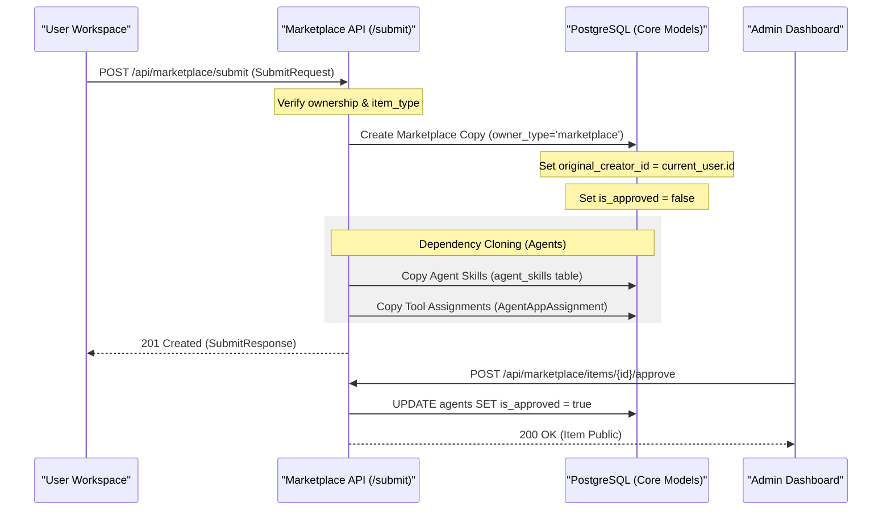
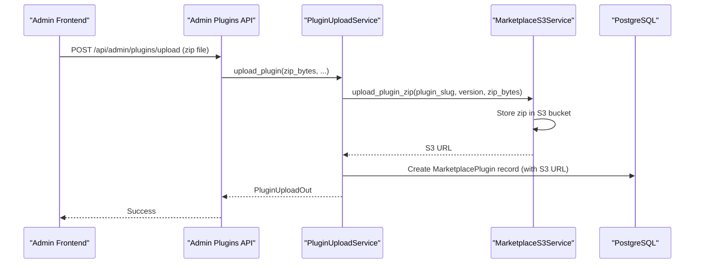

# Publishing to Marketplace

<details>
<summary>Relevant source files</summary>

The following files were used as context for generating this wiki page:

- [SPRINT0_OVERNIGHT_REPORT.md](SPRINT0_OVERNIGHT_REPORT.md)
- [frontend/app/deliverables/explorer/page.tsx](frontend/app/deliverables/explorer/page.tsx)
- [frontend/app/deliverables/page.tsx](frontend/app/deliverables/page.tsx)
- [frontend/app/marketplace/developer/page.tsx](frontend/app/marketplace/developer/page.tsx)
- [frontend/app/marketplace/publish/page.tsx](frontend/app/marketplace/publish/page.tsx)
- [frontend/app/settings/notifications/page.tsx](frontend/app/settings/notifications/page.tsx)
- [frontend/app/settings/profile/page.tsx](frontend/app/settings/profile/page.tsx)
- [frontend/components/agents/skills/skill-editor-modal.tsx](frontend/components/agents/skills/skill-editor-modal.tsx)
- [frontend/components/agents/skills/workspace-skills-tab.tsx](frontend/components/agents/skills/workspace-skills-tab.tsx)
- [frontend/components/auth/require-role.tsx](frontend/components/auth/require-role.tsx)
- [frontend/components/knowledge/memory-tab.tsx](frontend/components/knowledge/memory-tab.tsx)
- [frontend/components/settings/ApiKeyManager.tsx](frontend/components/settings/ApiKeyManager.tsx)
- [frontend/components/settings/NotificationsSettingsTab.tsx](frontend/components/settings/NotificationsSettingsTab.tsx)
- [frontend/hooks/use-skills-api.ts](frontend/hooks/use-skills-api.ts)
- [frontend/stores/index.ts](frontend/stores/index.ts)
- [orchestrator/alembic/versions/prd195_drop_authz_fossil_tables.py](orchestrator/alembic/versions/prd195_drop_authz_fossil_tables.py)
- [orchestrator/api/admin_plugins.py](orchestrator/api/admin_plugins.py)
- [orchestrator/api/agent_plugins.py](orchestrator/api/agent_plugins.py)
- [orchestrator/api/personas.py](orchestrator/api/personas.py)
- [orchestrator/api/rag_feedback.py](orchestrator/api/rag_feedback.py)
- [orchestrator/api/workspace_plugins.py](orchestrator/api/workspace_plugins.py)
- [orchestrator/api/workspace_skills.py](orchestrator/api/workspace_skills.py)
- [orchestrator/core/services/marketplace_s3.py](orchestrator/core/services/marketplace_s3.py)
- [orchestrator/core/services/plugin_upload_service.py](orchestrator/core/services/plugin_upload_service.py)

</details>


**Purpose and Scope**: This document covers the technical implementation of publishing workspace items (agents, recipes/playbooks, skills, plugins) to the Community Marketplace. It details the "Clone to Marketplace" pattern, the `owner_type` state machine, dependency management during publishing, and the administrative approval workflow. It also covers the storage of marketplace assets in S3 and the frontend pages for publishing and developer views.

---

## Publishing Architecture

The marketplace publishing system allows users to share their workspace configurations while maintaining strict isolation between user environments. The system implements a **Clone-on-Publish** pattern where a workspace entity is decoupled from its original environment and replicated as a template in the marketplace.

### Entity State Transitions

| Field | Workspace State | Marketplace (Pending) | Marketplace (Approved) |
| :--- | :--- | :--- | :--- |
| `owner_type` | `workspace` | `marketplace` | `marketplace` |
| `workspace_id` | User's UUID | `NULL` | `NULL` |
| `is_approved` | `N/A` | `false` | `true` |
| `is_featured` | `false` | `false` | Admin-set |
| `install_count` | `0` | `0` | Incremental |

Sources: [orchestrator/api/marketplace.py:56-80](), [orchestrator/api/marketplace.py:158-162]()

---

## The Submission Workflow

When a user submits an agent or recipe, the backend performs a deep clone of the entity and its relational dependencies. This process is initiated via the frontend components which interface with the Marketplace API.

### Submission Data Flow

The following diagram illustrates the transition from a private workspace entity to a public marketplace item, involving the `Agent` and `WorkflowTemplate` (aliased as `WorkflowRecipe`) models.



Sources: [orchestrator/api/marketplace.py:104-111](), [orchestrator/api/marketplace.py:158-162](), [orchestrator/api/marketplace.py:26-26](), [orchestrator/modules/tools/discovery/handlers_agents.py:14-15]()

### Dependency Resolution Logic
For **Agents**, the publishing process ensures that all associated metadata and capabilities are preserved in the marketplace version:
1. **Model Config**: Provider, model ID, and temperature settings are stored in the `model_config` field [orchestrator/api/marketplace.py:56-80]().
2. **Tools**: External app assignments are captured via `AgentAppAssignment`. The system retrieves app metadata for the marketplace card [orchestrator/modules/tools/discovery/handlers_agents.py:15-16]().
3. **Skills**: Custom code-based capabilities associated with the agent are linked via the `Skill` model and the `agent_skills` association table [orchestrator/api/marketplace.py:26-26](), [orchestrator/modules/tools/discovery/handlers_agents.py:14-14]().

Sources: [orchestrator/api/marketplace.py:186-200](), [orchestrator/api/marketplace.py:56-80](), [orchestrator/modules/tools/discovery/handlers_agents.py:14-16]()

---

## Admin Approval & Moderation

Approval is restricted to administrative users. The system identifies admins via the `caller_is_admin` check.

### Implementation of assert_admin

The `assert_admin` helper ensures that only authorized personnel can transition items from `pending` to `public`.

```python
# orchestrator/api/marketplace.py:46-50
def assert_admin(ctx: RequestContext) -> None:
    """Raise 403 if the current user is not an admin."""
    if not is_admin(ctx):
        raise HTTPException(status_code=403, detail="Admin access required")
```

### Marketplace Management Logic

| Code Entity | File Path | Role |
| :--- | :--- | :--- |
| `is_admin` | `orchestrator/api/marketplace.py` | Validates admin privileges via `caller_is_admin` [orchestrator/api/marketplace.py:37-43]() |
| `MarketplaceItemOut` | `orchestrator/api/marketplace.py` | Pydantic model for public item data [orchestrator/api/marketplace.py:56-83]() |
| `list_items` | `orchestrator/api/marketplace.py` | Backend logic for browsing and filtering [orchestrator/api/marketplace.py:126-141]() |
| `useSubmitToMarketplace` | `frontend/hooks/use-marketplace-api.ts` | React hook for frontend submission [frontend/hooks/use-marketplace-api.ts:61-92]() |

Sources: [orchestrator/api/marketplace.py:37-50](), [frontend/hooks/use-marketplace-api.ts:61-92]()

---

## Popularity Tracking & Updates

The marketplace tracks usage and versioning to provide a dynamic ecosystem for users.

### Install Count
The `install_count` field is incremented every time a user successfully clones a marketplace item to their workspace. This serves as the primary sorting metric for the marketplace browsing view.

```python
# orchestrator/api/marketplace.py:176-177
# Order by install count
agent_query = agent_query.order_by(desc(Agent.install_count), desc(Agent.created_at))
```

### Versioning and Updates
Marketplace items include a `version` string (defaulting to "1.0.0"). The `UpdateInfo` model allows the system to notify users when a newer version of an installed agent or recipe is available.

```python
# orchestrator/api/marketplace.py:113-120
class UpdateInfo(BaseModel):
    item_id: int
    item_name: str
    item_type: str
    current_version: str
    latest_version: str
    changelog: str
```

Sources: [orchestrator/api/marketplace.py:65-65](), [orchestrator/api/marketplace.py:113-120](), [orchestrator/api/marketplace.py:176-177]()

---

## Platform Management Skills
Agents can be equipped with the `platform-management` skill to programmatically interact with the marketplace. This allows for autonomous workspace setup and plugin installation.

### Marketplace Platform Actions
The `platform-management` skill includes several tools for marketplace interaction:
- `platform_browse_marketplace_agents`: Search for pre-built agent templates [orchestrator/core/seeds/platform-management-skill.md:10-11]().
- `platform_install_skill`: Enable a marketplace skill for the workspace [orchestrator/core/seeds/platform-management-skill.md:16-17]().
- `platform_browse_marketplace_plugins`: Browse the marketplace plugin catalog [orchestrator/core/seeds/platform-management-skill.md:8-9]().

Sources: [orchestrator/core/seeds/platform-management-skill.md:8-17]()

---

## Marketplace S3 Asset Storage

Marketplace plugins and skills, particularly those with code or static assets, are stored in an S3-compatible object storage service. This ensures scalability, durability, and efficient delivery of these assets.

### Plugin Upload and Storage

When an admin uploads a plugin via the `/api/admin/plugins/upload` endpoint, the `PluginUploadService` handles the storage of the plugin's zip file.



The `MarketplaceS3Service` [orchestrator/core/services/marketplace_s3.py]() is responsible for interacting with the S3 bucket. It provides methods for uploading and retrieving plugin zip files. The `PluginUploadService` [orchestrator/core/services/plugin_upload_service.py]() orchestrates the upload process, including security scanning and database record creation.

Sources: [orchestrator/api/admin_plugins.py:140-203](), [orchestrator/core/services/plugin_upload_service.py](), [orchestrator/core/services/marketplace_s3.py]()

---

## Publish and Developer Pages

The frontend provides dedicated pages for users to publish their items and for developers to manage their marketplace submissions.

### Publish Page

The `/marketplace/publish` page [frontend/app/marketplace/publish/page.tsx]() allows users to submit their agents, playbooks, or other items to the marketplace. This page typically presents a form where users can select the item to publish, provide metadata, and initiate the submission process.

### Developer Page

The `/marketplace/developer` page [frontend/app/marketplace/developer/page.tsx]() serves as a dashboard for users who have submitted items to the marketplace. It allows them to:
- View the status of their submitted items (pending, approved, rejected).
- Track installation counts and other metrics for their published items.
- Manage versions or update details for their items.

These pages interact with the backend Marketplace API endpoints to fetch and submit data.

Sources: [frontend/app/marketplace/publish/page.tsx](), [frontend/app/marketplace/developer/page.tsx]()

---

## API Reference: Publishing Endpoints

| Method | Endpoint | Description | Auth |
| :--- | :--- | :--- | :--- |
| `POST` | `/api/marketplace/submit` | Submits a workspace item to marketplace [orchestrator/api/marketplace.py:104-111]() | User |
| `GET` | `/api/marketplace/items` | Lists approved marketplace items with filters [orchestrator/api/marketplace.py:126-136]() | Public/User |
| `POST` | `/api/marketplace/install` | Clones a marketplace item into a workspace [orchestrator/api/marketplace.py:92-94]() | User |
| `POST` | `/api/admin/plugins/upload` | Uploads a plugin zip file to S3 and creates a pending marketplace record [orchestrator/api/admin_plugins.py:140-203]() | Admin |
| `POST` | `/api/admin/plugins/{plugin_id}/approve` | Approves a pending marketplace plugin [orchestrator/api/admin_plugins.py:205-208]() | Admin |

Sources: [orchestrator/api/marketplace.py:126-136](), [orchestrator/api/marketplace.py:104-111](), [frontend/hooks/use-marketplace-api.ts:138-163](), [orchestrator/api/admin_plugins.py:140-203](), [orchestrator/api/admin_plugins.py:205-208]()

---