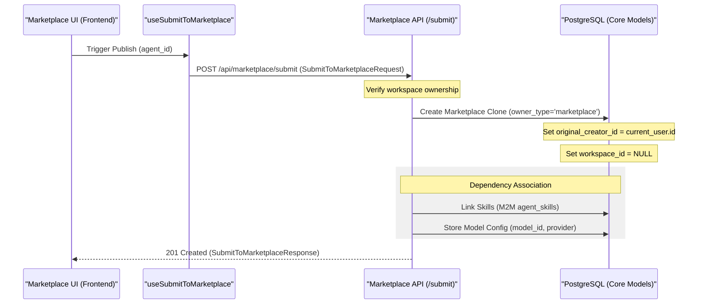
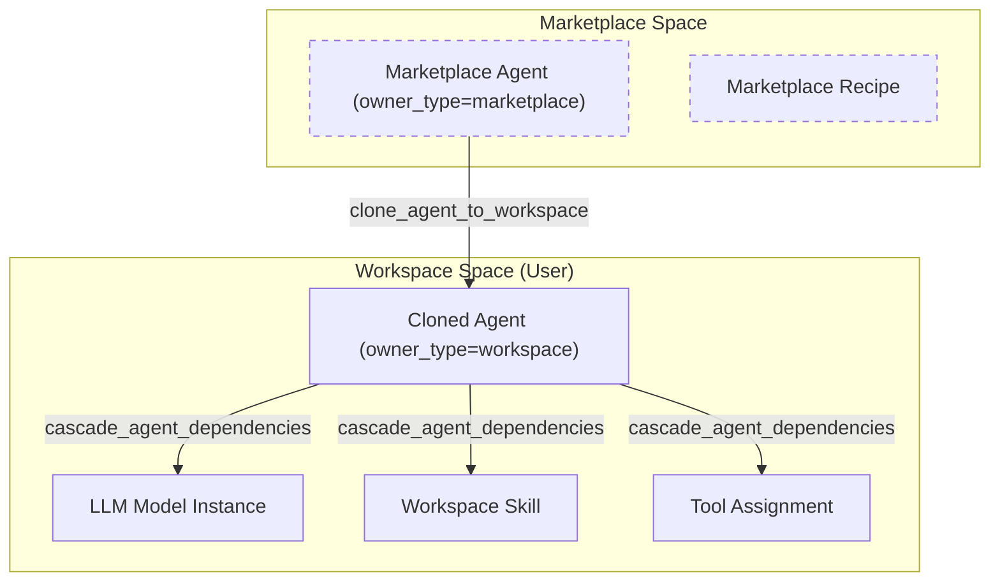

# Publishing to Marketplace

Relevant source files

The following files were used as context for generating this wiki page:

- [frontend/components/auth/profile-menu.tsx](frontend/components/auth/profile-menu.tsx)
- [frontend/hooks/use-marketplace-api.ts](frontend/hooks/use-marketplace-api.ts)
- [frontend/hooks/use-playbook-api.ts](frontend/hooks/use-playbook-api.ts)
- [frontend/lib/shepherd/tour-registry.ts](frontend/lib/shepherd/tour-registry.ts)
- [orchestrator/alembic/versions/agents_public_id_default.py](orchestrator/alembic/versions/agents_public_id_default.py)
- [orchestrator/modules/tools/discovery/cascade_installer.py](orchestrator/modules/tools/discovery/cascade_installer.py)
- [orchestrator/modules/tools/discovery/handlers_marketplace.py](orchestrator/modules/tools/discovery/handlers_marketplace.py)

**Purpose and Scope**: This document covers the technical implementation of publishing workspace items (agents, recipes) to the Community Marketplace. It details the "Clone to Marketplace" pattern, the `owner_type` state machine, dependency management during publishing, and the cascading installation logic that ensures agents and workflows remain functional across different user environments.

---

## Publishing Architecture

The marketplace publishing system allows users to share their workspace configurations while maintaining strict isolation between user environments. The system implements a **Clone-on-Publish** pattern where a workspace entity is decoupled from its original environment and replicated as a template in the marketplace.

### Entity State Transitions

| Field | Workspace State | Marketplace (Pending) | Marketplace (Approved) |
| :--- | :--- | :--- | :--- |
| `owner_type` | `workspace` | `marketplace` | `marketplace` |
| `workspace_id` | User's UUID | `NULL` | `NULL` |
| `is_approved` | `N/A` | `false` | `true` |
| `is_featured` | `false` | `false` | Admin-set |
| `install_count` | `0` | `0` | Incremental |

Sources: [orchestrator/modules/tools/discovery/handlers_marketplace.py:86-89](), [orchestrator/modules/tools/discovery/cascade_installer.py:110-119]()

---

## The Submission Workflow

When a user submits an agent or recipe, the backend performs a deep clone of the entity and its relational dependencies. This process is initiated via the frontend components which interface with the Marketplace API.

### Submission Data Flow

The following diagram illustrates the transition from a private workspace entity to a public marketplace item, involving the `Agent` and `WorkflowRecipe` models.

Sources: [frontend/hooks/use-marketplace-api.ts:39-56](), [frontend/hooks/use-marketplace-api.ts:61-92](), [orchestrator/modules/tools/discovery/cascade_installer.py:101-122]()

### Dependency Resolution Logic
For **Agents**, the publishing process ensures that all associated metadata and capabilities are preserved in the marketplace version:
1. **Model Config**: Provider, model ID, and temperature settings are stored in the `model_config` field [orchestrator/modules/tools/discovery/cascade_installer.py:107-107]().
2. **Tools**: External app requirements (Composio slugs) are analyzed. The system checks `ComposioAppCache` to determine if OAuth is required for the tool to function after installation [orchestrator/modules/tools/discovery/cascade_installer.py:40-71]().
3. **Skills**: Custom code-based capabilities associated with the agent are linked via the `skills` relationship [orchestrator/modules/tools/discovery/cascade_installer.py:125-127]().

Sources: [orchestrator/modules/tools/discovery/cascade_installer.py:40-71](), [orchestrator/modules/tools/discovery/cascade_installer.py:101-128]()

---

## Cascading Installation Pattern

When a user installs an item from the marketplace, the `cascade_installer` module ensures that all dependencies are provisioned into the user's workspace automatically.

### Installation Data Flow

### Key Installation Functions
- `clone_agent_to_workspace`: Handles the physical duplication of the agent record, ensuring no name collisions occur within the target workspace [orchestrator/modules/tools/discovery/cascade_installer.py:78-128]().
- `cascade_agent_dependencies`: Orchestrates the installation of LLM models, plugins, skills, and tools required by the agent [orchestrator/modules/tools/discovery/cascade_installer.py:135-148]().
- `check_oauth_requirements`: Scans the `ComposioAppCache` to warn users if the installed tools require manual OAuth connection (e.g., Gmail, Slack) [orchestrator/modules/tools/discovery/cascade_installer.py:40-71]().

Sources: [orchestrator/modules/tools/discovery/cascade_installer.py:40-148]()

---

## Admin Approval & Moderation

Approval is restricted to administrative users. The system uses a toggle mechanism to transition items to a featured state or approve them for public listing.

### Marketplace Management Logic

| Code Entity | File Path | Role |
| :--- | :--- | :--- |
| `useToggleFeatured` | `frontend/hooks/use-marketplace-api.ts` | Admin hook to feature/unfeature items [frontend/hooks/use-marketplace-api.ts:168-186]() |
| `useSubmitToMarketplace` | `frontend/hooks/use-marketplace-api.ts` | Handles the `auto_approved` flag logic [frontend/hooks/use-marketplace-api.ts:61-92]() |
| `browse_marketplace_agents` | `orchestrator/modules/tools/discovery/handlers_marketplace.py` | Filters for `owner_type='marketplace'` and `status='active'` [orchestrator/modules/tools/discovery/handlers_marketplace.py:82-89]() |

Sources: [frontend/hooks/use-marketplace-api.ts:168-186](), [orchestrator/modules/tools/discovery/handlers_marketplace.py:82-89]()

---

## Popularity Tracking & Updates

The marketplace tracks usage and versioning to provide a dynamic ecosystem for users.

### Install Count
The `install_count` field is incremented every time a user successfully clones a marketplace item to their workspace. This serves as the primary sorting metric for the marketplace browsing view [orchestrator/modules/tools/discovery/handlers_marketplace.py:105-105]().

### Versioning and Updates
Marketplace items include a `version` string. The `useMarketplaceUpdates` hook allows the system to notify users when a newer version of an installed agent or recipe is available in the marketplace [frontend/hooks/use-marketplace-api.ts:191-198]().

Sources: [orchestrator/modules/tools/discovery/handlers_marketplace.py:105-105](), [frontend/hooks/use-marketplace-api.ts:191-198]()

---

## API Reference: Publishing Endpoints

| Method | Hook / Endpoint | Description | Auth |
| :--- | :--- | :--- | :--- |
| `POST` | `useSubmitToMarketplace` | Submits a workspace item to marketplace [frontend/hooks/use-marketplace-api.ts:61-92]() | User |
| `POST` | `useSubmitPlaybookToMarketplace` | Submits a workflow recipe to marketplace [frontend/hooks/use-playbook-api.ts:135-146]() | User |
| `POST` | `useInstallMarketplaceItem` | Clones a marketplace item and triggers cascade [frontend/hooks/use-marketplace-api.ts:138-163]() | User |
| `GET` | `useMarketplaceItems` | Lists approved marketplace items with filters [frontend/hooks/use-marketplace-api.ts:97-110]() | Public/User |

Sources: [frontend/hooks/use-marketplace-api.ts:61-163](), [frontend/hooks/use-playbook-api.ts:135-146]()

---