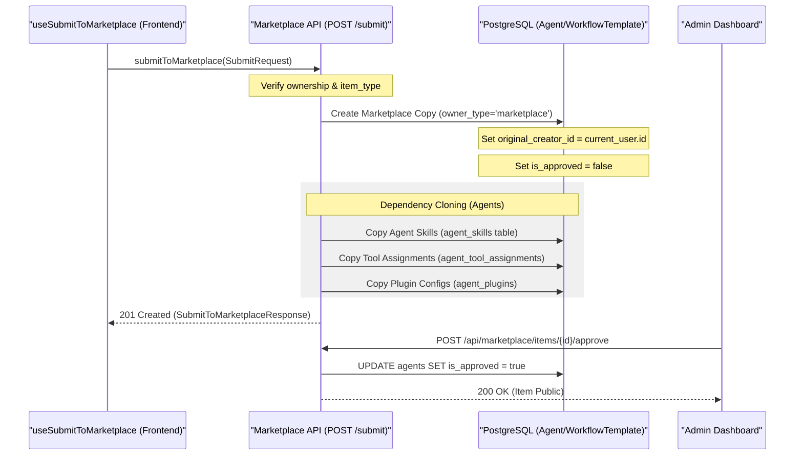
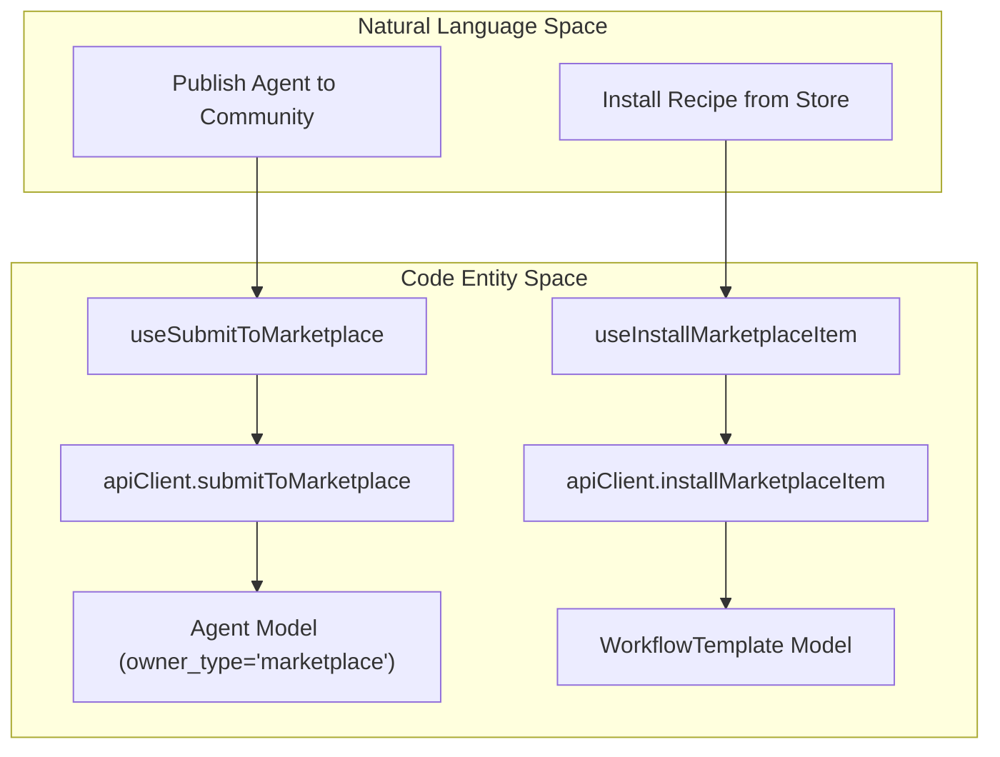

# Publishing to Marketplace

<details>
<summary>Relevant source files</summary>

The following files were used as context for generating this wiki page:

- [frontend/hooks/use-marketplace-api.ts](frontend/hooks/use-marketplace-api.ts)
- [orchestrator/api/marketplace.py](orchestrator/api/marketplace.py)
- [orchestrator/modules/coordination/__init__.py](orchestrator/modules/coordination/__init__.py)
- [orchestrator/modules/coordination/agent_matcher.py](orchestrator/modules/coordination/agent_matcher.py)
- [orchestrator/modules/coordination/templates.py](orchestrator/modules/coordination/templates.py)

</details>


**Purpose and Scope**: This document covers the technical implementation of publishing workspace items (agents, recipes) to the Community Marketplace. It details the "Clone to Marketplace" pattern, the `owner_type` state machine, dependency management during publishing, and the administrative approval workflow.

---

## Publishing Architecture

The marketplace publishing system allows users to share their workspace configurations while maintaining strict isolation between user environments. The system implements a **Clone-on-Publish** pattern where a workspace entity is decoupled from its original environment and replicated as a template in the marketplace.

### Entity State Transitions

| Field | Workspace State | Marketplace (Pending) | Marketplace (Approved) |
| :--- | :--- | :--- | :--- |
| `owner_type` | `workspace` | `marketplace` | `marketplace` |
| `workspace_id` | User's UUID | `NULL` | `NULL` |
| `is_approved` | `N/A` | `false` | `true` |
| `is_featured` | `false` | `false` | Admin-set |
| `install_count` | `0` | `0` | Incremental |

**Sources**: [orchestrator/api/marketplace.py:53-77](), [orchestrator/api/marketplace.py:154-157]()

---

## The Submission Workflow

When a user submits an agent or recipe, the backend performs a deep clone of the entity and its relational dependencies. This process is initiated via the `useSubmitToMarketplace` hook in the frontend.

### Submission Data Flow

The following diagram illustrates the transition from a private workspace entity to a public marketplace item, mapping frontend hooks to backend API logic.



**Sources**: [orchestrator/api/marketplace.py:100-107](), [frontend/hooks/use-marketplace-api.ts:39-56](), [frontend/hooks/use-marketplace-api.ts:61-92]()

### Dependency Resolution Logic
For **Agents**, the publishing process ensures that all associated metadata and capabilities are preserved in the marketplace version:
1. **Model Config**: Provider, model ID, and temperature settings are stored in the `metadata` or `configuration` fields.
2. **Tools**: External app IDs (Composio slugs) and specific action filters are captured. The system queries the `composio_apps_cache` to retrieve logos and metadata for the marketplace card.
3. **Skills**: Custom code-based capabilities associated with the agent are linked via the `agent_skills` relationship.

**Sources**: [orchestrator/api/marketplace.py:53-68](), [orchestrator/api/marketplace.py:190-205]()

---

## Admin Approval & Moderation

Approval is restricted to administrative users. The system identifies admins via the `system_role` field in the `UserModel`.

### Implementation of assert_admin

The `assert_admin` helper ensures that only authorized personnel can transition items from `pending` to `public`.

```python
# orchestrator/api/marketplace.py:43-47
def assert_admin(ctx: RequestContext) -> None:
    """Raise 403 if the current user is not an admin."""
    if not is_admin(ctx):
        raise HTTPException(status_code=403, detail="Admin access required")
```

### Marketplace Management Logic

The marketplace logic bridges high-level user actions with specific database entities.



**Sources**: [orchestrator/api/marketplace.py:36-40](), [orchestrator/api/marketplace.py:53-80](), [frontend/hooks/use-marketplace-api.ts:61-68](), [frontend/hooks/use-marketplace-api.ts:138-144]()

---

## Popularity Tracking & Updates

The marketplace tracks usage and versioning to provide a dynamic ecosystem for users.

### Install Count
The `install_count` field is incremented every time a user successfully clones a marketplace item to their workspace. This serves as the primary sorting metric for the marketplace browsing view.

```python
# orchestrator/api/marketplace.py:172-173
# Order by install count
agent_query = agent_query.order_by(desc(Agent.install_count), desc(Agent.created_at))
```

### Versioning and Updates
Marketplace items include a `version` string (defaulting to "1.0.0"). The `UpdateInfo` model and `checkMarketplaceUpdates` hook allow the system to notify users when a newer version of an installed agent or recipe is available.

```typescript
// frontend/hooks/use-marketplace-api.ts:165-172
export function useMarketplaceUpdates() {
  return useQuery({
    queryKey: marketplaceQueryKeys.updates,
    queryFn: () => apiClient.checkMarketplaceUpdates(),
    staleTime: 1000 * 60 * 15, // 15 minutes
    refetchOnWindowFocus: false,
  })
}
```

**Sources**: [orchestrator/api/marketplace.py:65](), [orchestrator/api/marketplace.py:109-116](), [frontend/hooks/use-marketplace-api.ts:165-172]()

---

## API Reference: Publishing Endpoints

| Method | Endpoint | Description | Auth |
| :--- | :--- | :--- | :--- |
| `POST` | `/api/marketplace/submit` | Submits a workspace item to marketplace | User |
| `GET` | `/api/marketplace/items` | Lists approved marketplace items with filters | Public/User |
| `GET` | `/api/marketplace/items/{id}` | Retrieves detailed item info including dependencies | User |
| `POST` | `/api/marketplace/install` | Clones a marketplace item into the current workspace | User |
| `GET` | `/api/marketplace/updates` | Checks for updates to installed marketplace items | User |

**Sources**: [orchestrator/api/marketplace.py:122-132](), [frontend/hooks/use-marketplace-api.ts:10-173]()

---