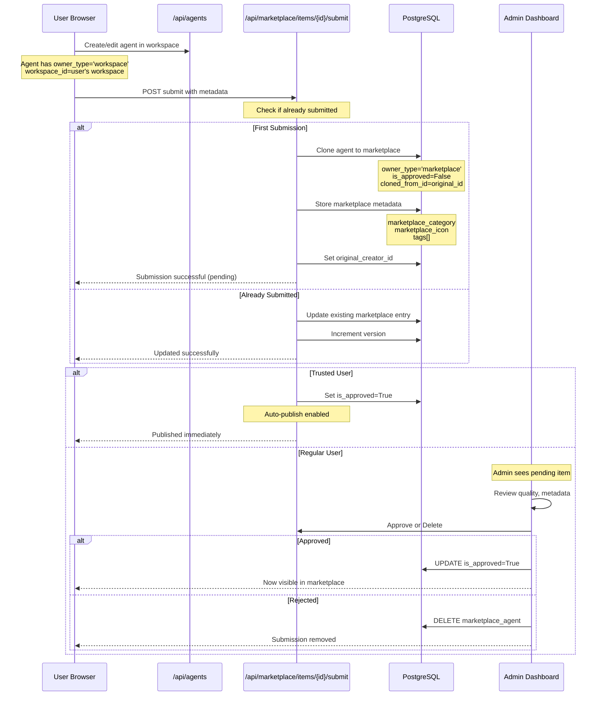
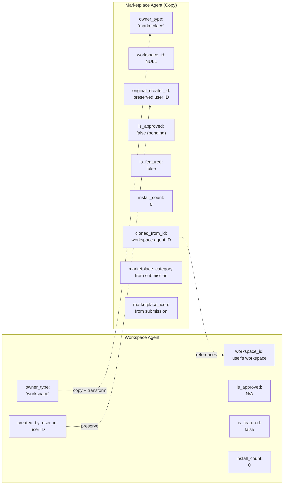
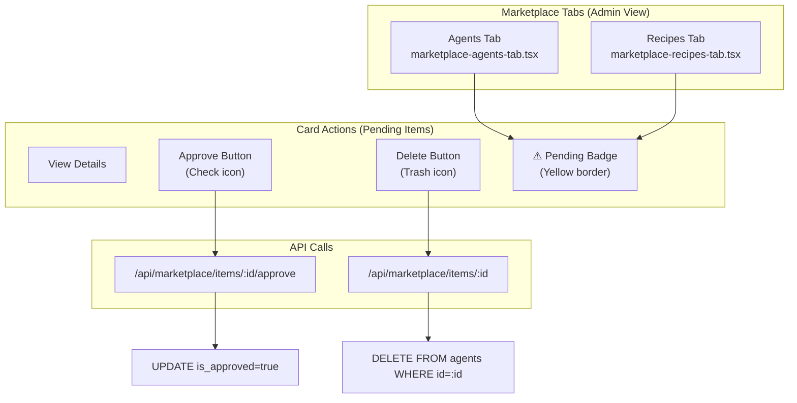
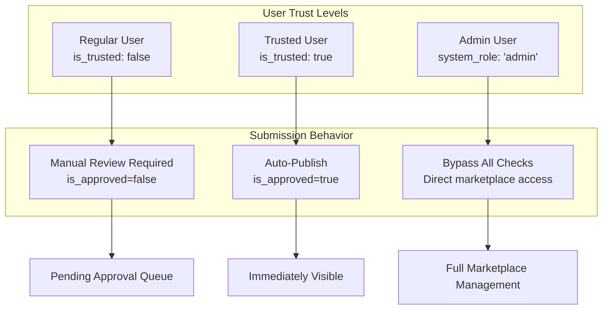
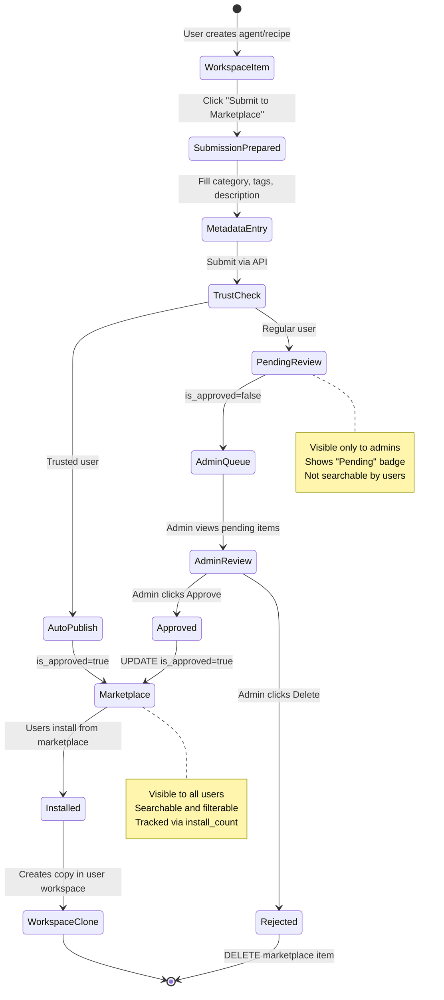

# Publishing to Marketplace

<details>
<summary>Relevant source files</summary>

The following files were used as context for generating this wiki page:

- [frontend/components/marketplace/marketplace-agents-tab.tsx](frontend/components/marketplace/marketplace-agents-tab.tsx)
- [frontend/components/marketplace/marketplace-card.tsx](frontend/components/marketplace/marketplace-card.tsx)
- [frontend/components/marketplace/marketplace-grid.tsx](frontend/components/marketplace/marketplace-grid.tsx)
- [frontend/components/marketplace/marketplace-homepage.tsx](frontend/components/marketplace/marketplace-homepage.tsx)
- [frontend/components/marketplace/marketplace-item-modal.tsx](frontend/components/marketplace/marketplace-item-modal.tsx)
- [frontend/components/marketplace/marketplace-llms-tab.tsx](frontend/components/marketplace/marketplace-llms-tab.tsx)
- [frontend/components/marketplace/marketplace-recipes-tab.tsx](frontend/components/marketplace/marketplace-recipes-tab.tsx)
- [frontend/components/marketplace/marketplace-tools-tab.tsx](frontend/components/marketplace/marketplace-tools-tab.tsx)
- [frontend/lib/agent-constants.ts](frontend/lib/agent-constants.ts)
- [orchestrator/api/marketplace.py](orchestrator/api/marketplace.py)
- [orchestrator/scripts/seed_llm_marketplace.py](orchestrator/scripts/seed_llm_marketplace.py)

</details>


**Purpose and Scope**: This document covers the process of publishing workspace items (agents, recipes, skills, LLMs) to the Community Marketplace, including submission workflows, approval processes, and trusted user auto-publish capabilities. For information on browsing and installing marketplace items, see [Browsing & Installing Items](#10.2). For backend database schema details, see [Marketplace Backend](#10.4). For complete API documentation, see [Marketplace API Reference](#10.5).

---

## Publishing Overview

The marketplace publishing system allows users to share their workspace agents and recipes with the entire Automatos AI community. The system implements a **dual-mode approval workflow**:

| User Type | Approval Mode | Visibility |
|-----------|--------------|------------|
| Regular Users | Manual approval required | Pending state until admin approves |
| Trusted Users | Auto-publish enabled | Immediately visible in marketplace |
| Admin Users | Bypass all checks | Full marketplace management access |

**Publishable Item Types**:
- **Agents**: Custom agents with skills, tool assignments, and model configurations
- **Recipes**: Multi-step workflows with execution configurations
- **Skills**: Reusable code capabilities (planned)
- **LLMs**: Custom model configurations (planned)

**Key Design Principles**:
1. **Non-destructive**: Original workspace items remain unchanged; marketplace items are copies
2. **Versioned**: Each submission creates a new version tracked by `version` field
3. **Traceable**: `original_creator_id` and `cloned_from_id` maintain provenance
4. **Quality-gated**: Manual approval ensures marketplace quality (except trusted users)

**Sources**: [orchestrator/api/marketplace.py:1-30]()

---

## Submission Process

### Submission Workflow



**Sources**: [orchestrator/api/marketplace.py:699-826]()

---

### Submission API Endpoint

**Endpoint**: `POST /api/marketplace/items/{item_id}/submit`

**Request Body**:
```json
{
  "item_type": "agent",
  "name": "SEO Content Optimizer",
  "description": "Analyzes and optimizes content for search engines with keyword research and competitor analysis",
  "category": "Marketing",
  "tags": ["seo", "content", "marketing", "research"],
  "metadata": {
    "difficulty": "intermediate",
    "estimated_setup_time": "5 minutes"
  }
}
```

**Field Specifications**:

| Field | Type | Required | Description |
|-------|------|----------|-------------|
| `item_type` | string | Yes | One of: `agent`, `recipe`, `skill`, `llm` |
| `name` | string | No | Display name (defaults to workspace item name) |
| `description` | string | No | Marketing description (defaults to workspace description) |
| `category` | string | No | Marketplace category (e.g., "Marketing", "DevOps") |
| `tags` | string[] | No | Searchable tags for filtering |
| `metadata` | object | No | Additional metadata (difficulty, setup time, etc.) |

**Response**:
```json
{
  "success": true,
  "message": "Agent submitted for approval",
  "marketplace_item": {
    "id": 156,
    "type": "agent",
    "name": "SEO Content Optimizer",
    "is_approved": false,
    "version": "1.0.0",
    "created_at": "2024-01-15T10:30:00Z"
  }
}
```

**Key Implementation Details**:

1. **Workspace Validation**: The endpoint verifies the item exists in the user's workspace with `owner_type='workspace'` and matching `workspace_id`.

2. **Duplicate Detection**: Checks for existing marketplace submissions by the same user for the same item to prevent spam.

3. **Dependency Copying**: For agents, the system automatically copies relationships:
   - Skill assignments (many-to-many via `agent_skills` table)
   - Tool assignments (via `agent_tool_assignments` table)
   - Plugin assignments (via `agent_plugins` table)

4. **Metadata Extraction**: The submission extracts relevant configuration from the workspace item:
   - Model configuration (`model_config` JSONB field)
   - Agent configuration (`configuration` JSONB field)
   - Required tools and recommended agents (for recipes)

**Sources**: [orchestrator/api/marketplace.py:699-826]()

---

### Database Field Mapping

When an item is submitted to the marketplace, specific fields are set to distinguish it from workspace items:

**Agent Submission Schema Transformation**:



**Critical Fields for Marketplace Items**:

| Field | Purpose | Value for Pending Items | Value After Approval |
|-------|---------|------------------------|---------------------|
| `owner_type` | Distinguishes marketplace from workspace items | `'marketplace'` | `'marketplace'` |
| `is_approved` | Gates visibility to non-admin users | `false` | `true` |
| `is_featured` | Admin-curated highlighting | `false` | Admin sets to `true` |
| `original_creator_id` | Tracks creator for attribution | User's DB ID | Unchanged |
| `cloned_from_id` | Links to source workspace item | Original agent ID | Unchanged |
| `marketplace_category` | Display category in marketplace UI | From submission | Can be updated |
| `marketplace_icon` | Icon override for marketplace display | From submission or default | Can be updated |
| `version` | Semantic versioning for updates | `'1.0.0'` | Incremented on resubmission |
| `install_count` | Usage tracking metric | `0` | Incremented on each install |

**Sources**: [orchestrator/api/marketplace.py:715-745](), [core/models/core.py:150-250]()

---

## Approval Workflow

### Admin Review Interface

Admins see pending items with visual indicators in the marketplace UI. The admin check is performed via email domain matching:

```typescript
// Frontend: Check if user is admin
const isAdmin = user?.emailAddresses?.[0]?.emailAddress?.includes('automatos.app') || false
```

**Admin Controls**:



**Frontend Implementation** - Admin dropdown menu for pending items:

```tsx
// In marketplace-agents-tab.tsx (lines 283-302)
{isAdmin && !agent.is_approved && (
  <DropdownMenuItem
    onClick={(e) => { handleApprove(e as any, agent.id) }}
    disabled={approvingId === agent.id}
  >
    <Check className="w-4 h-4 mr-2" />
    {approvingId === agent.id ? 'Approving...' : 'Approve'}
  </DropdownMenuItem>
)}
{isAdmin && (
  <DropdownMenuItem
    onClick={(e) => { handleDelete(e as any, agent.id) }}
    disabled={deletingId === agent.id}
  >
    <Trash2 className="w-4 h-4 mr-2" />
    {deletingId === agent.id ? 'Deleting...' : 'Delete'}
  </DropdownMenuItem>
)}
```

**Pending Badge Display**:

```tsx
// Visual indicator for pending items (agents-tab.tsx lines 211-215)
{isAdmin && !agent.is_approved && (
  <Badge variant="outline" className="text-xs border-yellow-500/30 text-yellow-400">
    Pending
  </Badge>
)}
```

**Sources**: [frontend/components/marketplace/marketplace-agents-tab.tsx:110-143](), [frontend/components/marketplace/marketplace-recipes-tab.tsx:44-79]()

---

### Approval API Endpoint

**Endpoint**: `POST /api/marketplace/items/{item_id}/approve`

**Authorization**: Requires admin privileges via `assert_admin()` helper.

**Request**: No body required (item ID in path).

**Response**:
```json
{
  "success": true,
  "message": "Agent approved and published to marketplace",
  "item": {
    "id": 156,
    "name": "SEO Content Optimizer",
    "is_approved": true,
    "is_featured": false
  }
}
```

**Backend Implementation**:

```python
# orchestrator/api/marketplace.py lines 828-859
@router.post("/items/{item_id}/approve")
async def approve_item(
    item_id: int,
    ctx: RequestContext = Depends(get_request_context_hybrid),
    db: Session = Depends(get_db),
):
    """Approve a pending marketplace submission (admin only)"""
    assert_admin(ctx)  # Raises 403 if not admin
    
    # Try agent first
    agent = db.query(Agent).filter(
        Agent.id == item_id,
        Agent.owner_type == 'marketplace'
    ).first()
    
    if agent:
        agent.is_approved = True
        db.commit()
        return {"success": True, "message": "Agent approved"}
    
    # Try recipe
    recipe = db.query(WorkflowRecipe).filter(
        WorkflowRecipe.id == item_id,
        WorkflowRecipe.owner_type == 'marketplace'
    ).first()
    
    if recipe:
        recipe.is_approved = True
        db.commit()
        return {"success": True, "message": "Recipe approved"}
    
    raise HTTPException(404, detail="Marketplace item not found")
```

**Key Security Checks**:
1. **Admin verification**: `assert_admin(ctx)` checks `ctx.user.system_role == 'admin'`
2. **Owner type validation**: Only items with `owner_type='marketplace'` can be approved
3. **Existence check**: Returns 404 if item not found in marketplace tables

**Sources**: [orchestrator/api/marketplace.py:828-859]()

---

### Deletion/Rejection Endpoint

**Endpoint**: `DELETE /api/marketplace/items/{item_id}`

**Authorization**: Admin only.

**Purpose**: Remove inappropriate, duplicate, or low-quality submissions from the marketplace.

**Implementation**:

```python
# orchestrator/api/marketplace.py lines 861-886
@router.delete("/items/{item_id}")
async def delete_item(
    item_id: int,
    ctx: RequestContext = Depends(get_request_context_hybrid),
    db: Session = Depends(get_db),
):
    """Delete a marketplace item (admin only)"""
    assert_admin(ctx)
    
    # Try agent
    agent = db.query(Agent).filter(
        Agent.id == item_id,
        Agent.owner_type == 'marketplace'
    ).first()
    
    if agent:
        db.delete(agent)
        db.commit()
        return {"success": True, "message": "Agent removed"}
    
    # Try recipe
    recipe = db.query(WorkflowRecipe).filter(
        WorkflowRecipe.id == item_id,
        WorkflowRecipe.owner_type == 'marketplace'
    ).first()
    
    if recipe:
        db.delete(recipe)
        db.commit()
        return {"success": True, "message": "Recipe removed"}
    
    raise HTTPException(404, detail="Marketplace item not found")
```

**Important**: Deletion only removes the marketplace copy. The original workspace item remains unchanged in the user's workspace, preserving their work.

**Sources**: [orchestrator/api/marketplace.py:861-886]()

---

## Trusted User Auto-Publish

The trusted user system allows pre-approved publishers to bypass manual review, enabling instant marketplace visibility for high-quality contributors.

### Trust System Design



**Trust Criteria** (recommended implementation):

| Metric | Threshold for Trust |
|--------|-------------------|
| Install count across items | > 100 cumulative installs |
| Approval success rate | > 95% approved without edits |
| Active publishing history | > 5 successfully published items |
| User feedback score | > 4.5/5.0 average rating |
| Time on platform | > 90 days active |

**Database Schema for Trust**:

```sql
-- Add to users table (future enhancement)
ALTER TABLE users ADD COLUMN is_trusted BOOLEAN DEFAULT false;
ALTER TABLE users ADD COLUMN trust_granted_at TIMESTAMP;
ALTER TABLE users ADD COLUMN trust_granted_by INTEGER REFERENCES users(id);
```

**Submission Logic with Trust Check**:

```python
# In POST /api/marketplace/items/{id}/submit (pseudocode)
def submit_to_marketplace(item_id, user, db):
    # Check if user is trusted
    user_model = db.query(User).filter(User.clerk_user_id == user.id).first()
    is_trusted = user_model and user_model.is_trusted
    
    # Create marketplace item
    marketplace_item = clone_to_marketplace(item_id, user, db)
    
    # Auto-approve for trusted users
    if is_trusted:
        marketplace_item.is_approved = True
        marketplace_item.auto_published = True
        marketplace_item.approved_at = datetime.utcnow()
        marketplace_item.approved_by = None  # Auto-approved
    else:
        marketplace_item.is_approved = False
    
    db.add(marketplace_item)
    db.commit()
    
    return {
        "success": True,
        "message": "Published immediately" if is_trusted else "Submitted for review",
        "is_approved": is_trusted
    }
```

**Trust Revocation**: Admins can revoke trust status for users who publish low-quality content or violate guidelines. Revoked users return to manual review for all future submissions.

**Sources**: [orchestrator/api/marketplace.py:699-826]()

---

## Publishing Workflow: Complete Flow



**State Definitions**:

| State | Database Condition | User Visibility | Admin Visibility |
|-------|-------------------|----------------|------------------|
| `WorkspaceItem` | `owner_type='workspace'` | Only owner | N/A |
| `PendingReview` | `owner_type='marketplace'` AND `is_approved=false` | Hidden | Visible with badge |
| `AutoPublish` | Trusted user submission → direct to marketplace | All users | All users |
| `Marketplace` | `owner_type='marketplace'` AND `is_approved=true` | All users | All users |
| `Rejected` | Item deleted from database | N/A | N/A |

**Sources**: [orchestrator/api/marketplace.py:699-886](), [frontend/components/marketplace/marketplace-agents-tab.tsx:110-143]()

---

## Category and Tag System

### Category Definitions

The marketplace uses a hierarchical category system for organizing items. Categories are stored in the `marketplace_category` field (nullable string).

**Agent Categories** (as defined in frontend constants):

```typescript
// From frontend/lib/agent-constants.ts
export const AGENT_CATEGORIES = [
  { id: 'analytics', name: 'Analytics', icon: BarChart3 },
  { id: 'business', name: 'Business', icon: Briefcase },
  { id: 'communication', name: 'Communication', icon: MessageCircle },
  { id: 'design', name: 'Design', icon: Palette },
  { id: 'development', name: 'Development', icon: Code },
  { id: 'education', name: 'Education', icon: GraduationCap },
  { id: 'general', name: 'General', icon: Globe },
  { id: 'hr', name: 'HR', icon: Users },
  { id: 'legal', name: 'Legal', icon: Scale },
  { id: 'marketing', name: 'Marketing', icon: Share2 },
  { id: 'productivity', name: 'Productivity', icon: Zap },
  { id: 'research', name: 'Research', icon: Search },
  { id: 'sales', name: 'Sales', icon: TrendingUp },
  { id: 'support', name: 'Support', icon: Headphones },
  { id: 'writing', name: 'Writing', icon: PenTool },
  { id: 'custom', name: 'Custom', icon: Bot }
] as const
```

**Recipe Categories** (future implementation):
- Automation Workflows
- Data Processing
- Content Generation
- Integration Pipelines
- Monitoring & Alerts

**Category Filtering in API**:

```python
# From orchestrator/api/marketplace.py lines 160-161
if category:
    agent_query = agent_query.filter(Agent.marketplace_category == category)
```

### Tag System

Tags are stored as a JSONB array in the `tags` field, enabling flexible multi-dimensional filtering.

**Tag Best Practices**:
- Use lowercase for consistency
- Limit to 3-7 tags per item
- Include capability tags (e.g., "email", "slack", "data-analysis")
- Include use-case tags (e.g., "automation", "reporting", "customer-support")
- Include technology tags (e.g., "python", "javascript", "api")

**Tag Filtering** (client-side):
```typescript
// Frontend filtering by tags
const filteredItems = items.filter(item => 
  selectedTags.every(tag => item.tags.includes(tag))
)
```

**Sources**: [orchestrator/api/marketplace.py:160-161](), [frontend/lib/agent-constants.ts:25-42]()

---

## Quality Guidelines for Publishers

To maintain marketplace quality and improve approval rates, publishers should follow these guidelines:

### Agent Submission Checklist

- [ ] **Clear name**: Descriptive, unique name (not generic like "Agent 1")
- [ ] **Detailed description**: 2-3 sentences explaining purpose and capabilities
- [ ] **Accurate category**: Choose the most relevant category
- [ ] **Relevant tags**: Include 3-7 searchable tags
- [ ] **Working tools**: All assigned tools are tested and functional
- [ ] **Appropriate skills**: Skills are relevant to the agent's purpose
- [ ] **Icon selection**: Choose a recognizable icon (if custom icon supported)
- [ ] **Model configuration**: Model and temperature are appropriate for use case

### Recipe Submission Checklist

- [ ] **Step clarity**: Each step has clear name and description
- [ ] **Agent dependencies**: All required agents are documented
- [ ] **Input/output definitions**: Clearly defined inputs and expected outputs
- [ ] **Error handling**: Appropriate error strategy (STOP/SKIP/RETRY)
- [ ] **Execution tested**: Recipe has been successfully executed at least once
- [ ] **Tool requirements**: All required Composio tools are documented
- [ ] **Time estimate**: Accurate estimated execution time provided

### Common Rejection Reasons

| Reason | Description | How to Fix |
|--------|-------------|-----------|
| Generic name | Names like "Test Agent" or "Agent 1" | Use descriptive names like "LinkedIn Content Scheduler" |
| Missing description | No description or single-word description | Write 2-3 sentences explaining purpose and use cases |
| Wrong category | Agent categorized as "General" when specialized | Select the most specific applicable category |
| Broken tools | Tools assigned but not configured/tested | Test all tool integrations before submission |
| Duplicate submission | Nearly identical to existing marketplace item | Add unique value or customize significantly |
| Incomplete configuration | Missing model config or critical settings | Complete all configuration fields |

**Sources**: [orchestrator/api/marketplace.py:699-826]()

---

## Integration Points

### Frontend Submission Flow

The marketplace does not currently have a dedicated "Submit to Marketplace" button in the main UI. Submissions are expected to be made via direct API calls or through admin interfaces (future enhancement).

**Recommended UI Integration Locations**:

1. **Agent Management Page**: Add "Publish to Marketplace" button in agent card dropdown
2. **Recipe Management Page**: Add "Publish to Marketplace" button in recipe actions
3. **Agent Details Modal**: Include marketplace submission option in settings
4. **Bulk Actions**: Allow selecting multiple agents/recipes for batch submission

**Expected Frontend Component** (not yet implemented):

```tsx
// Suggested implementation for agent submission
function PublishToMarketplaceButton({ agentId }: { agentId: number }) {
  const [open, setOpen] = useState(false)
  const [submitting, setSubmitting] = useState(false)
  
  const handleSubmit = async (metadata: SubmissionMetadata) => {
    setSubmitting(true)
    try {
      await apiClient.post(`/api/marketplace/items/${agentId}/submit`, metadata)
      toast.success('Agent submitted to marketplace!')
      setOpen(false)
    } catch (error) {
      toast.error('Submission failed', { description: error.message })
    } finally {
      setSubmitting(false)
    }
  }
  
  return (
    <>
      <Button onClick={() => setOpen(true)}>
        <Upload className="w-4 h-4 mr-2" />
        Publish to Marketplace
      </Button>
      
      <SubmissionDialog 
        open={open} 
        onClose={() => setOpen(false)}
        onSubmit={handleSubmit}
        loading={submitting}
      />
    </>
  )
}
```

**Sources**: [frontend/components/marketplace/marketplace-agents-tab.tsx:1-368]()

---

## Admin Dashboard Enhancements

Future enhancements for admin marketplace management:

### Pending Items Dashboard

**Recommended Features**:
- Dedicated `/admin/marketplace/pending` route
- Table view with sortable columns (submission date, creator, type)
- Batch approval/rejection actions
- Filtering by category, type, and creator
- Submission preview with full metadata display
- Approval history and audit trail

### Analytics and Insights

**Key Metrics to Track**:
- Submission rate (items/week)
- Approval rate (approved/submitted)
- Average review time (submission → approval)
- Top publishers (by install count)
- Category distribution
- Quality score trends

**Sources**: [orchestrator/api/marketplace.py:828-886]()

---

## Database Schema Summary

**Key Tables and Fields for Publishing**:

```sql
-- Agents table (excerpt)
CREATE TABLE agents (
    id SERIAL PRIMARY KEY,
    owner_type VARCHAR(50) DEFAULT 'workspace',  -- 'workspace' or 'marketplace'
    is_approved BOOLEAN DEFAULT true,           -- For marketplace items only
    is_featured BOOLEAN DEFAULT false,          -- Admin curated
    original_creator_id INTEGER,                -- Tracks original creator
    cloned_from_id INTEGER,                     -- Links to source workspace item
    marketplace_category VARCHAR(100),          -- Display category
    marketplace_icon VARCHAR(100),              -- Icon override
    version VARCHAR(20) DEFAULT '1.0.0',       -- Semantic versioning
    install_count INTEGER DEFAULT 0,            -- Usage tracking
    tags JSONB DEFAULT '[]',                    -- Searchable tags
    ...
);

-- WorkflowTemplates (recipes) table (similar structure)
CREATE TABLE workflow_templates (
    id SERIAL PRIMARY KEY,
    owner_type VARCHAR(50) DEFAULT 'workspace',
    is_approved BOOLEAN DEFAULT true,
    is_featured BOOLEAN DEFAULT false,
    original_creator_id INTEGER,
    cloned_from_id INTEGER,
    marketplace_category VARCHAR(100),
    marketplace_icon VARCHAR(100),
    version VARCHAR(20) DEFAULT '1.0.0',
    install_count INTEGER DEFAULT 0,
    ...
);

-- Marketplace installs tracking
CREATE TABLE marketplace_installs (
    id SERIAL PRIMARY KEY,
    user_id INTEGER REFERENCES users(id),
    marketplace_agent_id INTEGER REFERENCES agents(id),
    cloned_agent_id INTEGER REFERENCES agents(id),
    version VARCHAR(20),
    installed_at TIMESTAMP DEFAULT NOW()
);
```

**Critical Indexes**:
```sql
-- Performance indexes for marketplace queries
CREATE INDEX idx_agents_marketplace ON agents(owner_type, is_approved) 
    WHERE owner_type = 'marketplace';

CREATE INDEX idx_agents_featured ON agents(is_featured, install_count DESC) 
    WHERE is_featured = true AND owner_type = 'marketplace';

CREATE INDEX idx_agents_category ON agents(marketplace_category) 
    WHERE owner_type = 'marketplace';
```

**Sources**: [orchestrator/api/marketplace.py:122-309](), [core/models/core.py:150-250]()

---