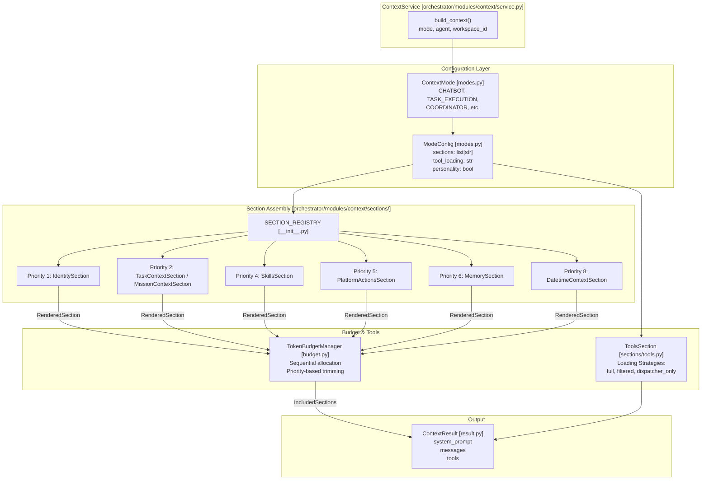
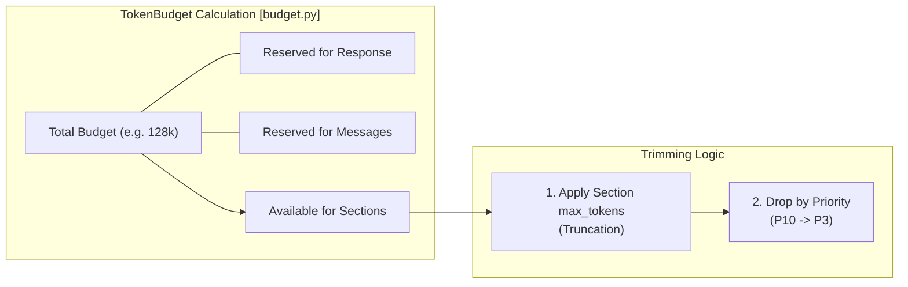

# Context Service

<details>
<summary>Relevant source files</summary>

The following files were used as context for generating this wiki page:

- [docs/PRDS/123-HARNESS-PATTERN-ADOPTION.md](docs/PRDS/123-HARNESS-PATTERN-ADOPTION.md)
- [orchestrator/modules/context/budget.py](orchestrator/modules/context/budget.py)
- [orchestrator/modules/context/modes.py](orchestrator/modules/context/modes.py)
- [orchestrator/modules/context/sections/__init__.py](orchestrator/modules/context/sections/__init__.py)
- [orchestrator/modules/context/sections/agent_roster.py](orchestrator/modules/context/sections/agent_roster.py)
- [orchestrator/modules/context/sections/composio.py](orchestrator/modules/context/sections/composio.py)
- [orchestrator/modules/context/sections/memory.py](orchestrator/modules/context/sections/memory.py)
- [orchestrator/modules/context/sections/mission_context.py](orchestrator/modules/context/sections/mission_context.py)
- [orchestrator/modules/context/sections/onboarding.py](orchestrator/modules/context/sections/onboarding.py)
- [orchestrator/modules/context/sections/platform_actions.py](orchestrator/modules/context/sections/platform_actions.py)
- [orchestrator/modules/context/sections/playbook_context.py](orchestrator/modules/context/sections/playbook_context.py)
- [orchestrator/modules/context/sections/plugins.py](orchestrator/modules/context/sections/plugins.py)
- [orchestrator/scripts/eval/tool_routing/seed_telemetry.py](orchestrator/scripts/eval/tool_routing/seed_telemetry.py)
- [orchestrator/tests/test_context/__init__.py](orchestrator/tests/test_context/__init__.py)
- [orchestrator/tests/test_context/conftest.py](orchestrator/tests/test_context/conftest.py)
- [orchestrator/tests/test_context/test_budget_manager.py](orchestrator/tests/test_context/test_budget_manager.py)
- [orchestrator/tests/test_context/test_estimator.py](orchestrator/tests/test_context/test_estimator.py)
- [orchestrator/tests/test_context/test_identity_section.py](orchestrator/tests/test_context/test_identity_section.py)
- [orchestrator/tests/test_context/test_memory_section.py](orchestrator/tests/test_context/test_memory_section.py)
- [orchestrator/tests/test_context/test_modes.py](orchestrator/tests/test_context/test_modes.py)
- [orchestrator/tests/test_context/test_service.py](orchestrator/tests/test_context/test_service.py)
- [orchestrator/tests/test_platform_actions_section.py](orchestrator/tests/test_platform_actions_section.py)
- [orchestrator/tests/test_platform_actions_section_graph.py](orchestrator/tests/test_platform_actions_section_graph.py)

</details>


## Purpose and Scope

`ContextService` is the unified prompt-building layer for the Automatos AI platform. It provides a single entry point for assembling LLM contexts, consolidating fragmented code paths into a modular system. It manages the assembly of system prompts, message history formatting, tool schema loading, and ephemeral attachment injection based on specific execution **modes** (e.g., chatbot, task execution, heartbeat, coordinator). [orchestrator/modules/context/service.py:1-19]()

This service ensures that every LLM call across the platform benefits from consistent identity injection, skill awareness, platform action discovery, and memory retrieval while strictly adhering to token budgets through a priority-based trimming system. [orchestrator/modules/context/budget.py:1-9]()

**Sources:** [orchestrator/modules/context/service.py:1-19](), [orchestrator/modules/context/budget.py:1-9]()

---

## Architecture Overview

The Context Service operates by orchestrating several specialized components to produce a `ContextResult`.



**Diagram 1: Context Service Internal Flow**

### Core Components
1.  **ContextMode**: An enum defining the high-level intent of the LLM call, such as `CHATBOT`, `TASK_EXECUTION`, or `COORDINATOR`. [orchestrator/modules/context/modes.py:13-22]()
2.  **ModeConfig**: A declarative configuration for each mode, specifying which sections to include and how tools should be loaded. [orchestrator/modules/context/modes.py:26-33]()
3.  **Section Registry**: A mapping of string identifiers to `BaseSection` subclasses like `IdentitySection` or `SkillsSection`. [orchestrator/modules/context/sections/__init__.py:27-43]()
4.  **TokenBudgetManager**: Logic for trimming or dropping sections based on priority when context exceeds model limits. [orchestrator/modules/context/budget.py:53-64]()

**Sources:** [orchestrator/modules/context/modes.py:13-33](), [orchestrator/modules/context/sections/__init__.py:27-43](), [orchestrator/modules/context/budget.py:53-64]()

---

## Context Modes

Modes define the "flavor" of the prompt. For example, `CHATBOT` mode enables personality and conversation history, while `COORDINATOR` mode focuses on mission goals and agent rosters. [orchestrator/modules/context/modes.py:35-49]()

| Mode | Personality | Tool Loading | Key Sections |
| :--- | :--- | :--- | :--- |
| `CHATBOT` | `True` | `filtered` | identity, skills, memory, platform_actions, conversation |
| `TASK_EXECUTION` | `False` | `full` | identity, skills, task_context, platform_actions, conversation |
| `COORDINATOR` | `False` | `full` | identity, mission_context, agent_roster, platform_actions |
| `HEARTBEAT_ORCHESTRATOR`| `False` | `dispatcher_only` | identity, skills, platform_actions, task_context |
| `RECIPE` | `False` | `full` | identity, skills, memory, playbook_context |

For a full list of modes and their specific configurations, see [Context Modes](#4.1).

**Sources:** [orchestrator/modules/context/modes.py:35-134]()

---

## Section Priority System

The service uses a 10-tier priority system (1 = highest importance). When the `TokenBudgetManager` encounters a context that is too large, it drops sections starting from the highest priority number (lowest importance). [orchestrator/modules/context/budget.py:110-115]()

### Priority Guarantees
*   **Priority 1-2**: Critical sections (e.g., `IdentitySection` at P1, `TaskContextSection` or `MissionContextSection` at P2) are **NEVER** dropped, even if the budget is exceeded. [orchestrator/modules/context/budget.py:121-123]()
*   **Priority 3-10**: Sections like `SkillsSection` (P4), `PlatformActionsSection` (P5), or `MemorySection` (P6) may be dropped to save space. [orchestrator/modules/context/budget.py:118-132]()

For details on how each section is rendered, see [Section Priority System](#4.2) and [Section Types](#4.4).

**Sources:** [orchestrator/modules/context/budget.py:110-132](), [orchestrator/modules/context/sections/identity.py:6-9](), [orchestrator/modules/context/sections/platform_actions.py:39-40](), [orchestrator/modules/context/sections/memory.py:48-49]()

---

## Token Budget Management

Each mode has a `TokenBudget` defining the total allowed tokens and reservations for messages and responses. [orchestrator/modules/context/budget.py:152-157]()



**Diagram 2: Token Budget Allocation**

The `TokenBudgetManager` first applies local `max_tokens` caps defined on individual sections (e.g., `PlatformActionsSection` uses `PLATFORM_ACTIONS_MAX_TOKENS`) via truncation. [orchestrator/modules/context/sections/platform_actions.py:43-46]() If the total is still over budget, it begins dropping entire sections based on the priority system. [orchestrator/modules/context/budget.py:80-132]()

For more on allocation strategies, see [Token Budget Management](#4.3).

**Sources:** [orchestrator/modules/context/budget.py:26-40](), [orchestrator/modules/context/budget.py:80-132](), [orchestrator/modules/context/sections/platform_actions.py:43-46]()

---

## Personality and Identity

The `IdentitySection` manages how an agent perceives itself. In `CHATBOT` mode, it uses workspace personality settings to generate time-aware greetings and response rules. [orchestrator/modules/context/modes.py:36-40]() For non-chatbot modes, it provides a professional, role-based identity including the agent's name, type, and description. [orchestrator/tests/test_context/test_identity_section.py:41-47]()

The identity system supports:
*   **Custom Personas**: Agents can use a `custom_persona_prompt` if enabled. [orchestrator/tests/test_context/test_identity_section.py:81-94]()
*   **Database Personas**: Fallback to predefined persona objects stored in the database. [orchestrator/tests/test_context/test_identity_section.py:97-112]()

**Sources:** [orchestrator/modules/context/modes.py:36-40](), [orchestrator/tests/test_context/test_identity_section.py:41-112]()

---

## Tool Loading and Platform Actions

The service handles tool schema preparation through the `ToolsSection` and `PlatformActionsSection`.
*   **PlatformActionsSection**: Injects a markdown catalog of available `platform_execute` actions. It supports **Semantic Tool Routing** (PRD-138) to rank and filter actions by query similarity. [orchestrator/modules/context/sections/platform_actions.py:7-12]() It also supports **Graph Routing** (PRD-139) to suggest multi-action sequences (chains). [orchestrator/modules/context/sections/platform_actions.py:68-72]()
*   **SkillsSection**: Loads the specific instructions associated with an agent's assigned skills. [orchestrator/modules/context/sections/__init__.py:23]()
*   **ComposioSection**: Lists connected external applications (e.g., GitHub, Slack) available via `composio_execute`. [orchestrator/modules/context/sections/composio.py:19-28]()

This allows agents to have access to complex integrations and self-management capabilities while keeping the prompt size manageable through filtering.

**Sources:** [orchestrator/modules/context/sections/platform_actions.py:7-72](), [orchestrator/modules/context/sections/composio.py:19-28](), [orchestrator/modules/context/sections/__init__.py:23-25]()

---

## Memory Tier Integration

The `MemorySection` (Priority 6) integrates the multi-tier memory system into the prompt. [orchestrator/modules/context/sections/memory.py:49]()
*   **Context Router (PRD-79)**: For `CHATBOT` mode, it attempts to use the `UnifiedMemoryService` to retrieve a rich context bundle including long-term memories, session summaries, and temporal logs. [orchestrator/modules/context/sections/memory.py:103-132]()
*   **SmartMemoryManager**: Acts as a fallback, providing two-tier (global + agent-specific) memory retrieval. [orchestrator/modules/context/sections/memory.py:83-84]()
*   **Daily Logs**: Injects recent platform activity to give the agent temporal awareness. [orchestrator/modules/context/sections/memory.py:172-178]()

**Sources:** [orchestrator/modules/context/sections/memory.py:7-9](), [orchestrator/modules/context/sections/memory.py:103-178]()

---

## Integration and Usage

The `ContextService` is the standard way to prepare prompts for any consumer in the system, replacing fragmented logic in chat, recipes, and heartbeats. [orchestrator/modules/context/service.py:1-19]()

```python
# Standard Usage Pattern
service = ContextService(db_session)
result = await service.build_context(
    mode=ContextMode.TASK_EXECUTION,
    agent=agent_record,
    workspace_id="ws_123",
    kwargs={"query": "How many agents are active?"}
)

# result.system_prompt contains the assembled sections (Identity, Skills, Platform Actions, etc.)
# result.tools contains the loaded schemas based on the 'full' tool_loading strategy
```

For details on the migration from legacy prompt builders, see [Migration & Integration](#4.5).

**Sources:** [orchestrator/modules/context/service.py:1-19](), [orchestrator/modules/context/modes.py:53-62]()

---