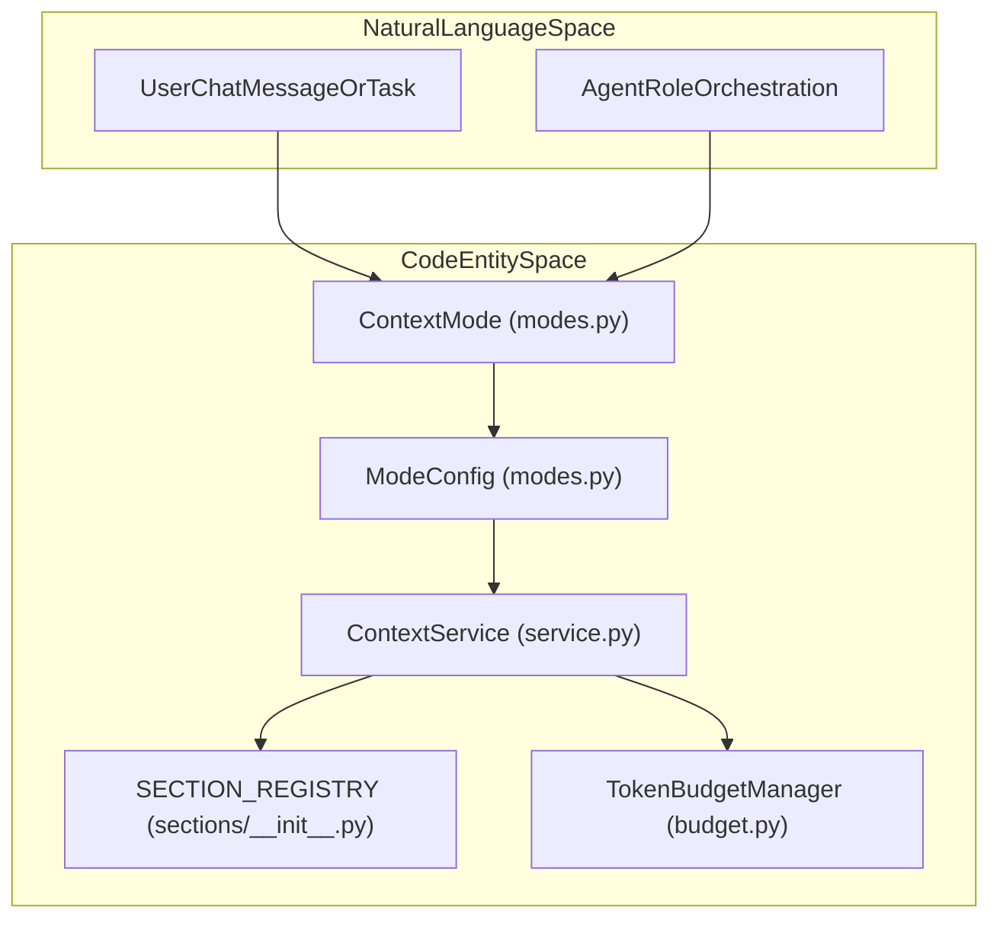
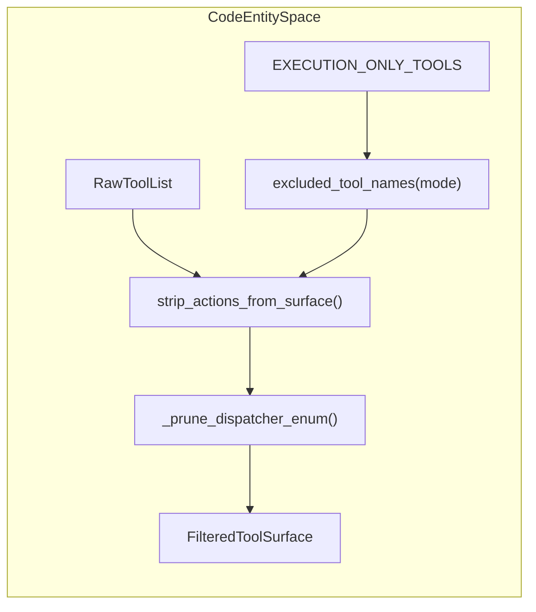

# Context Modes

Relevant source files

The following files were used as context for generating this wiki page:

- [orchestrator/modules/context/__init__.py](orchestrator/modules/context/__init__.py)
- [orchestrator/modules/context/budget.py](orchestrator/modules/context/budget.py)
- [orchestrator/modules/context/modes.py](orchestrator/modules/context/modes.py)
- [orchestrator/modules/context/planning.py](orchestrator/modules/context/planning.py)
- [orchestrator/modules/context/sections/__init__.py](orchestrator/modules/context/sections/__init__.py)
- [orchestrator/modules/context/sections/agent_roster.py](orchestrator/modules/context/sections/agent_roster.py)
- [orchestrator/modules/context/sections/composio.py](orchestrator/modules/context/sections/composio.py)
- [orchestrator/modules/context/sections/field_memory.py](orchestrator/modules/context/sections/field_memory.py)
- [orchestrator/modules/context/sections/planning_history.py](orchestrator/modules/context/sections/planning_history.py)
- [orchestrator/modules/context/sections/planning_knowledge.py](orchestrator/modules/context/sections/planning_knowledge.py)
- [orchestrator/modules/context/sections/playbook_context.py](orchestrator/modules/context/sections/playbook_context.py)
- [orchestrator/modules/context/sections/plugins.py](orchestrator/modules/context/sections/plugins.py)
- [orchestrator/tests/test_context/test_modes.py](orchestrator/tests/test_context/test_modes.py)
- [orchestrator/tests/test_context/test_service.py](orchestrator/tests/test_context/test_service.py)
- [orchestrator/tests/test_prd164_planning_pack.py](orchestrator/tests/test_prd164_planning_pack.py)
- [orchestrator/tests/test_prd179_field_read.py](orchestrator/tests/test_prd179_field_read.py)

Context modes define how `ContextService` assembles system prompts, tools, and messages for different execution scenarios. Each mode declares which sections it needs, how tools are loaded, and optional constraints like maximum token budgets. This unified system replaces fragmented prompt-building paths with a single declarative interface [orchestrator/modules/context/modes.py:1-6]().

---

## Purpose and Scope

Context modes are declarative configurations defined in `orchestrator/modules/context/modes.py` that control:

1.  **Section Composition**: Which concrete section classes from `SECTION_REGISTRY` are instantiated and rendered into the final system prompt [orchestrator/modules/context/modes.py:116-116](), [orchestrator/modules/context/sections/__init__.py:31-51]().
2.  **Tool Loading Strategy**: Whether to load all tools (`full`), filter them by intent (`filtered`), use the platform dispatcher only (`dispatcher_only`), or load no tools (`none`) [orchestrator/modules/context/modes.py:117-117]().
3.  **Personality Injection**: Whether to include conversational "chatbot" personality traits via `AutomatosPersonality` or remain professional and neutral [orchestrator/modules/context/modes.py:118-118]().
4.  **Token Budgeting & Execution Constraints**: Maximum token caps per mode and tool visibility rules such as PRD-229 execution-only tool stripping [orchestrator/modules/context/modes.py:26-34]().

Sources: [orchestrator/modules/context/modes.py:1-121](), [orchestrator/modules/context/sections/__init__.py:31-51]()

---

## Architecture & Data Flow

The following diagram bridges the natural language space (user requests, agent roles) to the code entity space (`ContextMode`, `ModeConfig`, and `ContextService`), illustrating how runtime parameters resolve into concrete prompt sections and tool loading strategies.

Title: "ContextModeResolutionAndAssembly"

Sources: [orchestrator/modules/context/modes.py:13-24](), [orchestrator/modules/context/modes.py:112-121](), [orchestrator/modules/context/sections/__init__.py:31-51](), [orchestrator/modules/context/budget.py:51-68]()

---

## Tool Filtering & PRD-229 Enforcement

Certain platform tools—specifically `platform_ask_orchestrator`—are restricted to worker execution lanes. The codebase implements strict checks via `EXECUTION_ONLY_TOOLS`, `EXECUTION_TOOL_MODES`, and `excluded_tool_names()` to strip these tools from non-execution surfaces (such as `CHATBOT`) [orchestrator/modules/context/modes.py:26-53]().

Title: "ToolFilteringFlowPRD229"

Functions and constants involved in tool enforcement:
- `EXECUTION_ONLY_TOOLS`: A `frozenset` containing restricted actions like `platform_ask_orchestrator` [orchestrator/modules/context/modes.py:34-34]().
- `EXECUTION_TOOL_MODES`: A `frozenset` containing modes permitted to run execution tools (e.g., `ContextMode.TASK_EXECUTION`) [orchestrator/modules/context/modes.py:38-38]().
- `excluded_tool_names(mode)`: Determines whether tool exclusions apply based on the active mode [orchestrator/modules/context/modes.py:41-53]().
- `strip_actions_from_surface(tools, excluded)`: Pure function that rebuilds tool definitions or prunes dispatch enums without mutating input objects [orchestrator/modules/context/modes.py:56-81]().

Sources: [orchestrator/modules/context/modes.py:26-110]()

---

## Mode Configurations Catalog

The `MODE_CONFIGS` dictionary maps each `ContextMode` enum value to a frozen `ModeConfig` dataclass instance [orchestrator/modules/context/modes.py:112-122]().

### CHATBOT
*   **Purpose**: User-facing conversational interactions with conversational tone and greetings [orchestrator/modules/context/modes.py:122-136]().
*   **Sections**: `identity`, `onboarding`, `skills`, `composio`, `plugins`, `platform_actions`, `memory`, `business_graph`, `datetime_context`, `conversation` [orchestrator/modules/context/modes.py:127-132]().
*   **Tool Loading**: `filtered` [orchestrator/modules/context/modes.py:133-133]().
*   **Personality**: `True` [orchestrator/modules/context/modes.py:134-134]().

### TASK_EXECUTION
*   **Purpose**: Professional, neutral agent execution for specific tasks [orchestrator/modules/context/modes.py:137-149]().
*   **Sections**: `identity`, `skills`, `composio`, `plugins`, `platform_actions`, `memory`, `business_graph`, `task_context`, `datetime_context`, `conversation` [orchestrator/modules/context/modes.py:141-145]().
*   **Tool Loading**: `full` [orchestrator/modules/context/modes.py:146-146]().
*   **Personality**: `False` [orchestrator/modules/context/modes.py:147-147]().

### HEARTBEAT_ORCHESTRATOR & HEARTBEAT_AGENT
*   **Purpose**: Autonomous scheduled checks and background task management [orchestrator/modules/context/modes.py:150-174]().
*   **Heartbeat Orchestrator**: Uses `dispatcher_only` tool loading, lean 8,000 token budget, and neutral tone [orchestrator/modules/context/modes.py:150-160]().
*   **Heartbeat Agent**: Includes `field_memory` for cross-run learning (PRD-179) with `full` tool loading and 128k budget [orchestrator/modules/context/modes.py:161-174]().

### RECIPE
*   **Purpose**: Multi-step playbook and workflow execution [orchestrator/modules/context/modes.py:175-185]().
*   **Sections**: `identity`, `skills`, `composio`, `plugins`, `platform_actions`, `playbook_context`, `task_context`, `datetime_context`, `conversation` [orchestrator/modules/context/modes.py:175-185]().
*   **Tool Loading**: `full` [orchestrator/modules/context/modes.py:175-185]().

### ROUTER
*   **Purpose**: Fast intent classification and message routing without executing heavy tool sets [orchestrator/modules/context/modes.py:186-196]().
*   **Tool Loading**: `none` [orchestrator/modules/context/modes.py:186-196]().

### ORCHESTRATOR_STAGE
*   **Purpose**: Execution of intermediate high-level orchestrator lifecycle stages [orchestrator/modules/context/modes.py:197-207]().
*   **Tool Loading**: `dispatcher_only` [orchestrator/modules/context/modes.py:197-207]().

### NL2SQL
*   **Purpose**: Natural language to SQL query generation and database reasoning [orchestrator/modules/context/modes.py:208-218]().
*   **Tool Loading**: `filtered` [orchestrator/modules/context/modes.py:208-218]().

Sources: [orchestrator/modules/context/modes.py:122-246]()

---