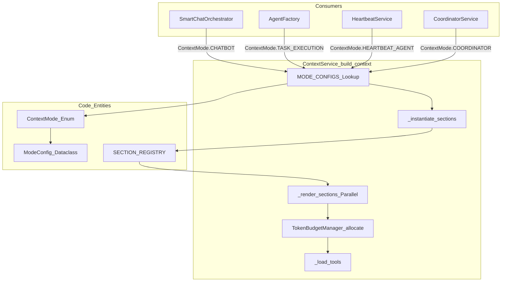
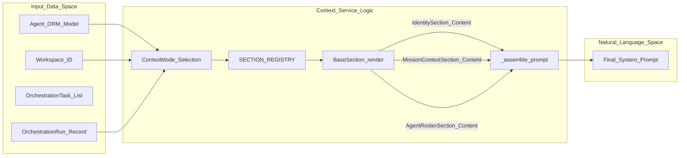

# Context Modes

Relevant source files

The following files were used as context for generating this wiki page:

- [orchestrator/modules/context/budget.py](orchestrator/modules/context/budget.py)
- [orchestrator/modules/context/modes.py](orchestrator/modules/context/modes.py)
- [orchestrator/modules/context/sections/__init__.py](orchestrator/modules/context/sections/__init__.py)
- [orchestrator/modules/context/sections/agent_roster.py](orchestrator/modules/context/sections/agent_roster.py)
- [orchestrator/modules/context/sections/mission_context.py](orchestrator/modules/context/sections/mission_context.py)
- [orchestrator/modules/context/sections/onboarding.py](orchestrator/modules/context/sections/onboarding.py)
- [orchestrator/tests/test_context/__init__.py](orchestrator/tests/test_context/__init__.py)
- [orchestrator/tests/test_context/conftest.py](orchestrator/tests/test_context/conftest.py)
- [orchestrator/tests/test_context/test_budget_manager.py](orchestrator/tests/test_context/test_budget_manager.py)
- [orchestrator/tests/test_context/test_estimator.py](orchestrator/tests/test_context/test_estimator.py)
- [orchestrator/tests/test_context/test_identity_section.py](orchestrator/tests/test_context/test_identity_section.py)
- [orchestrator/tests/test_context/test_memory_section.py](orchestrator/tests/test_context/test_memory_section.py)
- [orchestrator/tests/test_context/test_modes.py](orchestrator/tests/test_context/test_modes.py)
- [orchestrator/tests/test_context/test_service.py](orchestrator/tests/test_context/test_service.py)

Context modes define how the `ContextService` assembles system prompts, tools, and messages for different execution scenarios. Each mode declares which sections it needs, how tools are loaded, and optional constraints like maximum token budgets. This unified system replaces fragmented prompt-building paths with a single declarative interface [orchestrator/modules/context/modes.py:1-6]().

---

## Purpose and Scope

Context modes are declarative configurations that control:

1.  **Section Composition**: Which of the available sections (Identity, Skills, Memory, Task, etc.) are included in the final system prompt [orchestrator/modules/context/modes.py:29-29]().
2.  **Tool Loading Strategy**: Whether to load all tools (`full`), filter them by intent (`filtered`), use the platform dispatcher only (`dispatcher_only`), or load no tools (`none`) [orchestrator/modules/context/modes.py:30-30]().
3.  **Personality Injection**: Whether to include conversational "chatbot" personality traits or remain professional/neutral [orchestrator/modules/context/modes.py:31-31]().
4.  **Token Budgeting**: The maximum number of tokens allocated to the system prompt and message history [orchestrator/modules/context/modes.py:32-32]().

**Sources:** [orchestrator/modules/context/modes.py:1-32]()

---

## Architecture Overview

### Context Mode Lifecycle

The following diagram illustrates how a consumer request (like a Chat or a Task) flows through the `ContextService` to produce a final `ContextResult`.

Title: Context Assembly Data Flow

**Sources:** [orchestrator/modules/context/modes.py:13-21](), [orchestrator/modules/context/modes.py:35-134](), [orchestrator/modules/context/sections/__init__.py:27-43](), [orchestrator/modules/context/budget.py:66-75]()

---

## Available Context Modes

The system defines specialized modes via the `ContextMode` enum. Each mode is mapped to a `ModeConfig` which dictates its behavior [orchestrator/modules/context/modes.py:13-22]().

### CHATBOT
*   **Purpose**: User-facing conversational interaction [orchestrator/modules/context/modes.py:36-39]().
*   **Sections**: `identity`, `onboarding`, `skills`, `composio`, `plugins`, `platform_actions`, `memory`, `business_graph`, `datetime_context`, `conversation` [orchestrator/modules/context/modes.py:40-45]().
*   **Personality**: `True` (uses conversational tone and greetings) [orchestrator/modules/context/modes.py:47-47]().
*   **Tool Strategy**: `filtered` (uses intent classification to select tools) [orchestrator/modules/context/modes.py:46-46]().
*   **Budget**: 128,000 total tokens (60,000 reserved for messages) [orchestrator/modules/context/budget.py:153-157]().

### TASK_EXECUTION
*   **Purpose**: Professional, neutral agent execution for specific tasks [orchestrator/modules/context/modes.py:50-52]().
*   **Sections**: `identity`, `skills`, `composio`, `plugins`, `platform_actions`, `memory`, `business_graph`, `task_context`, `datetime_context`, `conversation` [orchestrator/modules/context/modes.py:53-58]().
*   **Personality**: `False` (neutral tone) [orchestrator/modules/context/modes.py:60-60]().
*   **Tool Strategy**: `full` (all assigned tools available) [orchestrator/modules/context/modes.py:59-59]().

### HEARTBEAT (ORCHESTRATOR & AGENT)
*   **Purpose**: Autonomous scheduled checks and background task execution [orchestrator/modules/context/modes.py:63-64]().
*   **Orchestrator Mode**: Uses `dispatcher_only` tool loading and a lean 8,000 token system budget [orchestrator/modules/context/modes.py:70-72]().
*   **Agent Mode**: Stateless by design (memory excluded by default), but allows `full` tool access for task completion. 128k token budget [orchestrator/modules/context/modes.py:74-86]().

### COORDINATOR
*   **Purpose**: Internal orchestration for decomposing goals, dispatching tasks, and reconciling state [orchestrator/modules/context/modes.py:121-124]().
*   **Sections**: `identity`, `mission_context`, `agent_roster`, `platform_actions`, `task_context`, `datetime_context` [orchestrator/modules/context/modes.py:125-129]().
*   **Budget**: 131,072 tokens (to accommodate full mission context and agent rosters) [orchestrator/modules/context/budget.py:197-201]().
*   **Tool Strategy**: `full` [orchestrator/modules/context/modes.py:130-130]().

### Specialized Modes
*   **RECIPE**: For multi-step automation pipelines; includes `playbook_context` [orchestrator/modules/context/modes.py:90-99]().
*   **ROUTER**: Internal routing classification; includes only `identity` and `datetime_context` [orchestrator/modules/context/modes.py:101-106]().
*   **NL2SQL**: High-precision SQL generation; no tools or personality [orchestrator/modules/context/modes.py:115-120]().
*   **ORCHESTRATOR_STAGE**: Internal coordination stage; minimal context [orchestrator/modules/context/modes.py:108-113]().

**Sources:** [orchestrator/modules/context/modes.py:40-134](), [orchestrator/modules/context/budget.py:152-202]()

---

## Token Budget Management

The `TokenBudgetManager` ensures that the assembled context does not exceed LLM limits using a priority-based trimming algorithm [orchestrator/modules/context/budget.py:53-64]().

### Trimming Logic
1.  **Capping**: Individual sections are first truncated to their `max_tokens` (e.g., `IdentitySection` capped at model default or specific integer) [orchestrator/modules/context/budget.py:79-103](), [orchestrator/modules/context/sections/identity.py:163-165]().
2.  **Dropping**: If the total still exceeds the budget, sections are dropped starting from the highest priority number (lowest importance) [orchestrator/modules/context/budget.py:113-132]().
3.  **Protected Sections**: Priority 1 and 2 sections (e.g., `identity`, `task_context`, `mission_context`, `onboarding`) are **never dropped** [orchestrator/modules/context/budget.py:122-123]().

### Section Priority Reference

| Priority | Section Name | Description |
| :--- | :--- | :--- |
| 1 | `identity` | Agent name, role, and core persona [orchestrator/modules/context/sections/identity.py:158-161](). |
| 2 | `task_context` | Current task description and board context [orchestrator/modules/context/sections/__init__.py:39-39](). |
| 2 | `mission_context` | Goal, plan, and task statuses for missions [orchestrator/modules/context/sections/mission_context.py:30-32](). |
| 2 | `onboarding` | Mission Zero onboarding prompt injection [orchestrator/modules/context/sections/onboarding.py:42-44](). |
| 2 | `playbook_context` | Context for multi-step recipes [orchestrator/modules/context/sections/__init__.py:40-40](). |
| 3 | `agent_roster` | List of available agents and capabilities [orchestrator/modules/context/sections/agent_roster.py:27-29](). |
| 4 | `skills` | Assigned skill prompt templates [orchestrator/modules/context/sections/__init__.py:30-30](). |
| 5 | `platform_actions` | Markdown catalog of available platform tools [orchestrator/modules/context/sections/__init__.py:33-33](). |

**Sources:** [orchestrator/modules/context/budget.py:53-145](), [orchestrator/modules/context/sections/identity.py:158-165](), [orchestrator/modules/context/sections/onboarding.py:42-44](), [orchestrator/modules/context/sections/mission_context.py:30-32](), [orchestrator/modules/context/sections/agent_roster.py:27-29]()

---

## Data Flow: Mode to System Prompt

The `ContextService` orchestrates the transformation from raw data to a final system prompt.

Title: From Code Entities to System Prompt

**Sources:** [orchestrator/modules/context/sections/__init__.py:28-45](), [orchestrator/modules/context/modes.py:35-134](), [orchestrator/modules/context/sections/mission_context.py:46-51]()

---

## Section Implementation Details

### Mission and Coordinator Context
*   **MissionContextSection**: Provides the `CoordinatorService` with the full mission state, including goal, current state, planned task count, and budget tracking (tokens used vs estimate) [orchestrator/modules/context/sections/mission_context.py:47-77](). It lists statuses for all tasks in the mission, including sequence numbers, assigned agents, and attempt counts [orchestrator/modules/context/sections/mission_context.py:79-100]().
*   **AgentRosterSection**: Renders a list of available agents in the workspace for the coordinator. Includes `agent_id`, `name`, `agent_type`, `model_id` (extracted from `model_config` JSON), `skills`, and truncated descriptions [orchestrator/modules/context/sections/agent_roster.py:53-97]().

**Sources:** [orchestrator/modules/context/sections/mission_context.py:20-32](), [orchestrator/modules/context/sections/agent_roster.py:20-29]()

### Onboarding and Tasks
*   **OnboardingSection**: Implements the "Mission Zero" pattern (PRD-123). It injects a discovery and research prompt if the workspace has zero active agents or if a user triggers it via phrases like "set up my workspace" [orchestrator/modules/context/sections/onboarding.py:53-67](). It uses `_check_empty_workspace` to query the `Agent` model for active records [orchestrator/modules/context/sections/onboarding.py:69-86]().
*   **IdentitySection**: Renders the core agent identity. It includes the agent name, role, and workspace context [orchestrator/modules/context/sections/identity.py:41-48](). It also supports custom personas and database-driven persona objects [orchestrator/modules/context/sections/identity.py:81-112]().

**Sources:** [orchestrator/modules/context/sections/onboarding.py:34-44](), [orchestrator/modules/context/sections/identity.py:29-35]()

---