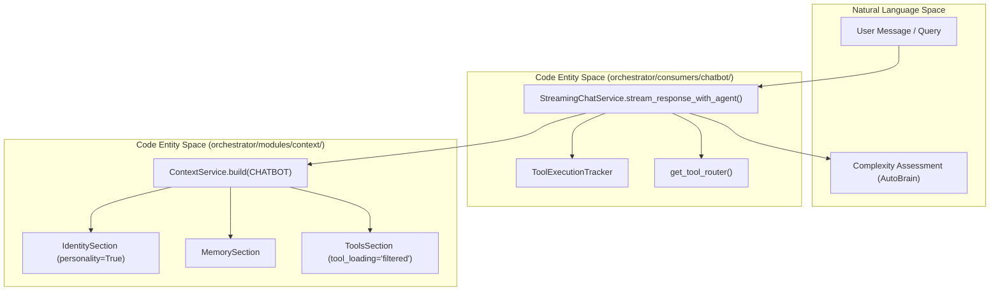
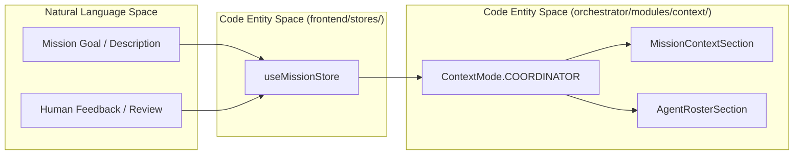

# Migration & Integration

Relevant source files

The following files were used as context for generating this wiki page:

- [frontend/app/api/chat/route.ts](frontend/app/api/chat/route.ts)
- [frontend/components/chatbot/chat.tsx](frontend/components/chatbot/chat.tsx)
- [frontend/components/chatbot/mission-suggestion-card.tsx](frontend/components/chatbot/mission-suggestion-card.tsx)
- [frontend/lib/chat/hooks.ts](frontend/lib/chat/hooks.ts)
- [frontend/stores/mission-store.ts](frontend/stores/mission-store.ts)
- [orchestrator/api/chat.py](orchestrator/api/chat.py)
- [orchestrator/api/recipe_executor.py](orchestrator/api/recipe_executor.py)
- [orchestrator/consumers/chatbot/service.py](orchestrator/consumers/chatbot/service.py)
- [orchestrator/modules/agents/factory/agent_factory.py](orchestrator/modules/agents/factory/agent_factory.py)
- [orchestrator/modules/context/budget.py](orchestrator/modules/context/budget.py)
- [orchestrator/modules/context/modes.py](orchestrator/modules/context/modes.py)
- [orchestrator/modules/context/sections/__init__.py](orchestrator/modules/context/sections/__init__.py)
- [orchestrator/modules/context/sections/agent_roster.py](orchestrator/modules/context/sections/agent_roster.py)
- [orchestrator/modules/context/sections/mission_context.py](orchestrator/modules/context/sections/mission_context.py)
- [orchestrator/modules/context/sections/onboarding.py](orchestrator/modules/context/sections/onboarding.py)
- [orchestrator/tests/test_context/__init__.py](orchestrator/tests/test_context/__init__.py)
- [orchestrator/tests/test_context/conftest.py](orchestrator/tests/test_context/conftest.py)
- [orchestrator/tests/test_context/test_budget_manager.py](orchestrator/tests/test_context/test_budget_manager.py)
- [orchestrator/tests/test_context/test_estimator.py](orchestrator/tests/test_context/test_estimator.py)
- [orchestrator/tests/test_context/test_identity_section.py](orchestrator/tests/test_context/test_identity_section.py)
- [orchestrator/tests/test_context/test_memory_section.py](orchestrator/tests/test_context/test_memory_section.py)
- [orchestrator/tests/test_context/test_modes.py](orchestrator/tests/test_context/test_modes.py)
- [orchestrator/tests/test_context/test_service.py](orchestrator/tests/test_context/test_service.py)

This document describes how **ContextService** (PRD-80) replaced 9 fragmented prompt-building code paths across the Automatos AI codebase. It covers the pre-migration state, the phased migration strategy, integration patterns for each consumer, and the unified section assembly system.

---

## Purpose and Scope

Prior to the implementation of the centralized context system, prompt construction logic was duplicated across multiple modules with inconsistent formatting, missing memory injection, and no unified token budget management. The `ContextService` migration unified all prompt building through a single, testable service with declarative mode-based section assembly via `ContextMode` [orchestrator/modules/context/modes.py:13-22]().

This page documents:
- The 9 pre-migration prompt-building paths that were replaced.
- The phased migration strategy that prevented breaking changes.
- Integration patterns for each consumer (heartbeat, agent factory, recipe executor, chatbot, router, coordinator, etc.).
- The unified `TokenBudgetManager` integration across consumers [orchestrator/modules/context/budget.py:53-64]().

**Sources:** [orchestrator/modules/context/modes.py:1-22](), [orchestrator/modules/context/budget.py:1-9]()

---

## Pre-Migration State: 9 Fragmented Paths

Before `ContextService`, prompt building was scattered across the codebase, each with its own logic for assembling identity, skills, memory, tools, and datetime context. This led to inconsistent formatting and a lack of token budgeting.

### Fragmented Prompt-Building Locations

| Location | Old Method / Logic | Issue Addressed |
|:---|:---|:---|
| `personality.py` | `AutomatosPersonality.get_base_system_prompt()` | Replaced by `IdentitySection` with `personality=True` in `CHATBOT` mode [orchestrator/modules/context/modes.py:40-49]() |
| `agent_factory.py` | `AgentFactory.execute_with_prompt()` | Now delegates to `ContextService` for runtime assembly using `BaseSection` subclasses [orchestrator/modules/agents/factory/agent_factory.py:5-11]() |
| `chatbot/service.py` | Manual tool loop + prompt assembly | Unified via `StreamingChatService` and `ContextService(CHATBOT)` [orchestrator/consumers/chatbot/service.py:12-13](), [orchestrator/modules/context/modes.py:40-49]() |
| `heartbeat_service.py` | Inline orchestrator/agent prompts | Replaced by `HEARTBEAT_ORCHESTRATOR` and `HEARTBEAT_AGENT` modes [orchestrator/modules/context/modes.py:65-87]() |
| `recipe_executor.py` | Manual step-loop assembly | Replaced by `RECIPE` mode context (PRD-80) [orchestrator/api/recipe_executor.py:9-12]() |
| `engine.py` | `UniversalRouter` LLM classification | Replaced by `ROUTER` mode using lean context assembly [orchestrator/modules/context/modes.py:101-106]() |
| `task_context.py` | String concatenation in factory | Unified via `TaskContextSection` with Priority 2 protection [orchestrator/modules/context/sections/__init__.py:24-39]() |
| `platform_actions.py`| Manual catalog building | Unified via `PlatformActionsSection` wrapping `ActionRegistry` [orchestrator/modules/context/sections/__init__.py:20-33]() |
| `memory.py` | Scattered `retrieve_memories` calls | Unified via `MemorySection` and `ContextRouter` (PRD-79) [orchestrator/modules/context/sections/__init__.py:17-34]() |

**Sources:** [orchestrator/modules/context/modes.py:35-134](), [orchestrator/api/recipe_executor.py:1-19](), [orchestrator/modules/agents/factory/agent_factory.py:1-11]()

---

## Phased Migration: Consumer-by-Consumer

### Smart Orchestrator (Chatbot) Migration

The `CHATBOT` mode is the primary user-facing conversational path. It integrates the `StreamingChatService` to handle complex multi-agent routing and streaming responses [orchestrator/consumers/chatbot/service.py:12-13]().

#### Chatbot Integration Flow
The following diagram illustrates how the chatbot bridges Natural Language space to the Code Entity space via the `StreamingChatService` layer.

**Key Integration Points:**
*   **Identity:** Injects chatbot-specific personality using `IdentitySection` with `personality=True` [orchestrator/modules/context/modes.py:47]().
*   **Tool Loop Prevention:** `ToolExecutionTracker` implements exact and semantic deduplication to prevent infinite tool loops [orchestrator/consumers/chatbot/service.py:83-90]().
*   **Token Budgeting:** `CHATBOT` mode uses a 128k budget with 60k reserved for conversation history [orchestrator/modules/context/budget.py:153-157]().

**Sources:** [orchestrator/consumers/chatbot/service.py:83-176](), [orchestrator/modules/context/modes.py:40-49](), [orchestrator/modules/context/budget.py:152-157]()

---

### Mission and Coordination Integration

The migration introduced the `COORDINATOR` mode to support PRD-82A multi-agent missions. This mode provides the `CoordinatorService` with a high-capacity context for goal decomposition and task dispatching [orchestrator/modules/context/modes.py:125-133]().

#### Mission Coordination Flow
This diagram shows how mission data and agent rosters are transformed into code entities for coordination.

**Key Integration Points:**
*   **Large Context Window:** `COORDINATOR` mode uses a 131,072 token budget to accommodate full mission context and agent rosters [orchestrator/modules/context/budget.py:197-201]().
*   **Step Execution:** `recipe_executor.py` was migrated to use `ContextService(RECIPE)` for sequential step execution, replacing fragmented prompt logic [orchestrator/api/recipe_executor.py:6-12]().
*   **Human-in-the-Loop:** The `useMissionStore` manages UI states for plan review and feedback which are then injected into the coordination context [frontend/stores/mission-store.ts:10-31]().

**Sources:** [orchestrator/modules/context/modes.py:125-133](), [orchestrator/modules/context/budget.py:194-202](), [frontend/stores/mission-store.ts:45-104]()

---

## Integration Patterns

### Pattern 1: Declarative Mode Configuration
The `MODE_CONFIGS` dictionary provides a central registry for all consumer types, defining required sections and tool loading strategies (e.g., `full`, `filtered`, `dispatcher_only`) [orchestrator/modules/context/modes.py:35-134]().

### Pattern 2: Priority-Based Trimming
The `TokenBudgetManager` uses a priority system (P1-P10) to protect critical context. Identity (P1) and Task Context (P2) are never dropped, while lower priority sections are truncated or removed if the total exceeds the `available_for_sections` budget [orchestrator/modules/context/budget.py:53-64, 118-132]().

### Pattern 3: Centralized Section Registry
All context components are registered in the `SECTION_REGISTRY`, allowing `ContextService` to instantiate them dynamically based on the requested `ContextMode` [orchestrator/modules/context/sections/__init__.py:28-45]().

### Pattern 4: Unified Tool Schemas
The `AgentFactory` and `recipe_executor` now utilize a single path for tool discovery: `get_tools_for_agent()` from `tool_router.py`, eliminating hardcoded schemas and legacy JSON formats [orchestrator/modules/agents/factory/agent_factory.py:9-11](), [orchestrator/api/recipe_executor.py:12]().

**Sources:** [orchestrator/modules/context/modes.py:25-33](), [orchestrator/modules/context/budget.py:37-40](), [orchestrator/modules/context/sections/__init__.py:1-45](), [orchestrator/modules/agents/factory/agent_factory.py:1-11]()

---