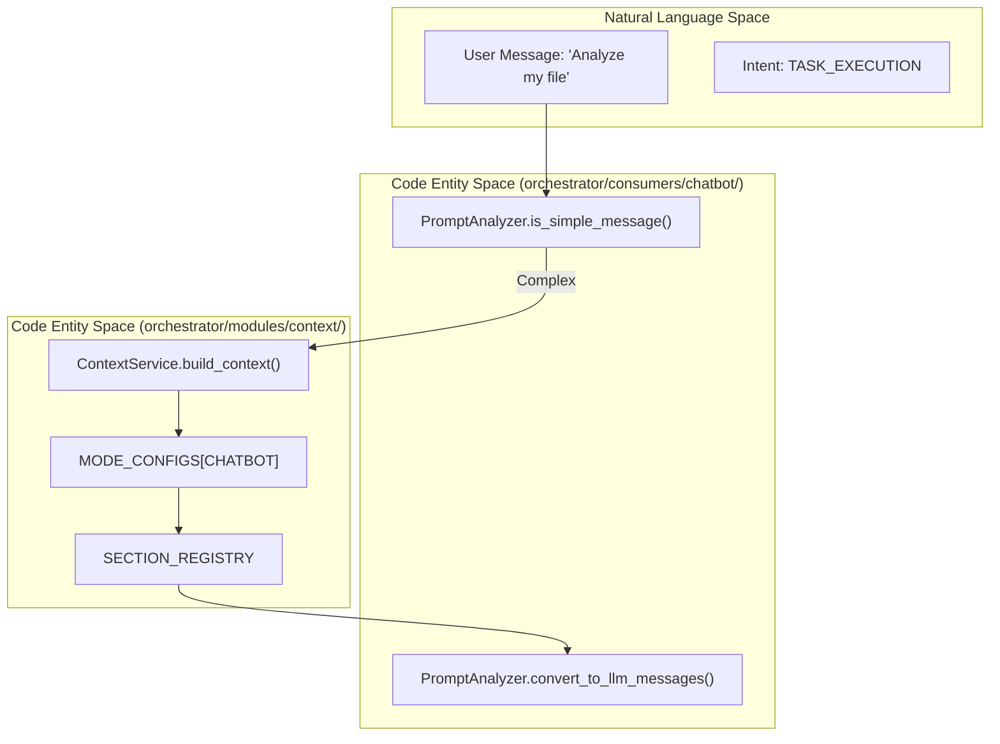
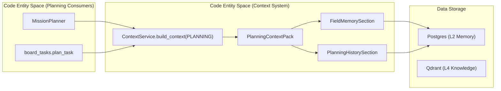

# Migration & Integration

Relevant source files

The following files were used as context for generating this wiki page:

- [orchestrator/api/chat.py](orchestrator/api/chat.py)
- [orchestrator/api/routing.py](orchestrator/api/routing.py)
- [orchestrator/consumers/chatbot/auto.py](orchestrator/consumers/chatbot/auto.py)
- [orchestrator/consumers/chatbot/prompt_analyzer.py](orchestrator/consumers/chatbot/prompt_analyzer.py)
- [orchestrator/consumers/chatbot/service.py](orchestrator/consumers/chatbot/service.py)
- [orchestrator/core/attachment_refs.py](orchestrator/core/attachment_refs.py)
- [orchestrator/core/llm/manager.py](orchestrator/core/llm/manager.py)
- [orchestrator/core/routing/engine.py](orchestrator/core/routing/engine.py)
- [orchestrator/modules/agents/factory/agent_factory.py](orchestrator/modules/agents/factory/agent_factory.py)
- [orchestrator/modules/attachments/extract.py](orchestrator/modules/attachments/extract.py)
- [orchestrator/modules/attachments/resolver.py](orchestrator/modules/attachments/resolver.py)
- [orchestrator/modules/context/sections/conversation.py](orchestrator/modules/context/sections/conversation.py)
- [orchestrator/modules/context/service.py](orchestrator/modules/context/service.py)
- [orchestrator/modules/tools/discovery/platform_actions.py](orchestrator/modules/tools/discovery/platform_actions.py)
- [orchestrator/modules/tools/discovery/platform_executor.py](orchestrator/modules/tools/discovery/platform_executor.py)
- [orchestrator/scripts/setup_jira_trigger.py](orchestrator/scripts/setup_jira_trigger.py)
- [orchestrator/services/heartbeat_service.py](orchestrator/services/heartbeat_service.py)
- [orchestrator/services/page_context.py](orchestrator/services/page_context.py)
- [orchestrator/tests/test_prd221_page_context.py](orchestrator/tests/test_prd221_page_context.py)
- [orchestrator/tests/test_prd221_page_prior_tools.py](orchestrator/tests/test_prd221_page_prior_tools.py)
- [orchestrator/tests/test_prd223_attachment_refs.py](orchestrator/tests/test_prd223_attachment_refs.py)

This page describes how `ContextService` (PRD-80) replaced fragmented prompt-building paths, attachment resolution, page context injection, and integration across various consumers in the Automatos AI codebase [orchestrator/modules/context/service.py:1-19]().

---

## Purpose and Scope

Prior to the implementation of the centralized context system, prompt construction logic was duplicated across multiple modules with inconsistent formatting, missing memory injection, and no unified token budget management. The `ContextService` migration unified all prompt building through a single, testable service with declarative mode-based section assembly [orchestrator/modules/context/service.py:86-92]().

This migration achieved:
- **Centralized Assembly**: A single entry point for all LLM calls across all subsystems [orchestrator/modules/context/service.py:86-92]().
- **Token Budgeting**: Model-aware trimming that protects critical context [orchestrator/modules/context/service.py:173-176]().
- **Cache Stability**: Sequential section ordering to maximize LLM prompt caching [orchestrator/modules/context/service.py:177-178]().

**Sources:** [orchestrator/modules/context/service.py:1-19]()

---

## Pre-Migration State: Fragmented Paths

Before `ContextService`, prompt building was scattered across the codebase, each with its own logic for assembling identity, skills, memory, tools, and datetime context.

### Fragmented Prompt-Building Locations

| Location | Old Method / Logic | Issue Addressed |
|:---|:---|:---|
| `personality.py` | `AutomatosPersonality` base prompt | Replaced by `IdentitySection` with `personality=True` in `CHATBOT` mode [orchestrator/modules/context/service.py:138-139]() |
| `agent_factory.py` | `execute_with_prompt()` manual strings | Now delegates to `ContextService.build_context()` [orchestrator/modules/agents/factory/agent_factory.py:1-12]() |
| `chatbot/` | Inline memory + tool injection | Unified via `ContextMode.CHATBOT` section list [orchestrator/consumers/chatbot/service.py:5-13]() |
| `heartbeat_service.py` | `_orchestrator_tick` / `_agent_tick` | Replaced by `HEARTBEAT_ORCHESTRATOR` and `HEARTBEAT_AGENT` modes [orchestrator/services/heartbeat_service.py:135-142]() |
| `recipe_executor.py` | Step-loop prompt assembly | Replaced by `RECIPE` mode context [orchestrator/modules/context/service.py:96-116]() |
| `engine.py` | `UniversalRouter` classification | Replaced by `ROUTER` mode lean context [orchestrator/core/routing/engine.py:45-46]() |
| `platform_actions.py`| Manual catalog building | Unified via `PlatformActionsSection` [orchestrator/modules/tools/discovery/platform_actions.py:1-10]() |

**Sources:** [orchestrator/modules/context/service.py:86-116](), [orchestrator/core/routing/engine.py:45-46]()

---

## Integration Patterns

### Chatbot & Prompt Analysis Integration
The `CHATBOT` mode is the primary user-facing path. It integrates with `PromptAnalyzer` to detect simple messages (greetings) and fresh start requests before invoking the heavy context build [orchestrator/consumers/chatbot/prompt_analyzer.py:34-70]().

Title: Chatbot Context Assembly Flow

Sources: [orchestrator/consumers/chatbot/prompt_analyzer.py:34-70](), [orchestrator/modules/context/service.py:86-116]()

---

### Planning Pack Integration (PRD-164)
The `PLANNING` mode introduced a specialized context bundle consumed by execution components [orchestrator/modules/context/service.py:96-116](). This pack includes planning RAG knowledge, planning history, and field memory [orchestrator/modules/context/service.py:68-80]().

Title: Planning Context Assembly Flow

Sources: [orchestrator/modules/context/service.py:68-80](), [orchestrator/modules/context/service.py:96-116]()

---

### Attachment Resolution (PRD-127)
The migration centralized attachment handling via `AttachmentResolver`. All consumers pass `attachment_ids` to `ContextService`, which delegates to the resolver to produce image URL parts or extract text from documents [orchestrator/modules/context/service.py:54-60]().

**Key Resolution Logic:**
- **Vision Check**: Ensures the target model supports vision before sending images [orchestrator/modules/context/service.py:127-135]().
- **Text Extraction**: Uses document processing libraries for ephemeral document parsing [orchestrator/modules/context/service.py:54-60]().
- **Safety**: Injects fallback markers if files are missing, preventing model hallucination [orchestrator/modules/context/service.py:176-183]().

**Sources:** [orchestrator/modules/context/service.py:54-60](), [orchestrator/modules/context/service.py:127-135]()

---

## Migration Validation
The migration was validated via extensive integration tests ensuring that:
1.  **Immutability**: `ContextResult` is a frozen dataclass containing assembled prompts and tool schemas [orchestrator/modules/context/service.py:113-116]().
2.  **Budget Compliance**: Low-priority sections are dropped while critical identity and task contexts remain [orchestrator/modules/context/service.py:173-176]().
3.  **Section Parallelism**: Sections are rendered concurrently using asynchronous execution to minimize latency [orchestrator/modules/context/service.py:170-171]().

**Sources:** [orchestrator/modules/context/service.py:113-176]()

---