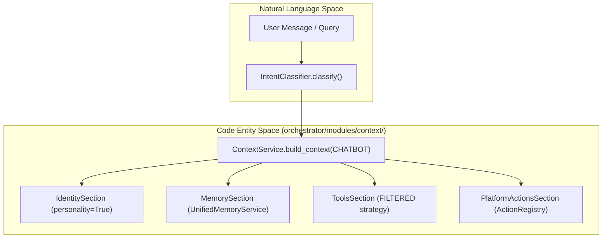
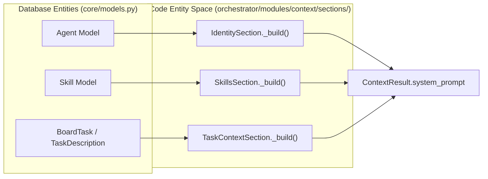

# Migration & Integration

Relevant source files

The following files were used as context for generating this wiki page:

- [docs/PRDS/123-HARNESS-PATTERN-ADOPTION.md](docs/PRDS/123-HARNESS-PATTERN-ADOPTION.md)
- [frontend/components/workflows/execution-theater/orchestrator-control.tsx](frontend/components/workflows/execution-theater/orchestrator-control.tsx)
- [frontend/hooks/use-workflow-websocket.ts](frontend/hooks/use-workflow-websocket.ts)
- [orchestrator/api/agent_endpoints.py](orchestrator/api/agent_endpoints.py)
- [orchestrator/consumers/chatbot/integration.py](orchestrator/consumers/chatbot/integration.py)
- [orchestrator/consumers/chatbot/prompt_analyzer.py](orchestrator/consumers/chatbot/prompt_analyzer.py)
- [orchestrator/consumers/chatbot/smart_orchestrator.py](orchestrator/consumers/chatbot/smart_orchestrator.py)
- [orchestrator/modules/agents/queries.py](orchestrator/modules/agents/queries.py)
- [orchestrator/modules/context/sections/identity.py](orchestrator/modules/context/sections/identity.py)
- [orchestrator/modules/context/sections/memory.py](orchestrator/modules/context/sections/memory.py)
- [orchestrator/modules/context/sections/platform_actions.py](orchestrator/modules/context/sections/platform_actions.py)
- [orchestrator/modules/context/sections/skills.py](orchestrator/modules/context/sections/skills.py)
- [orchestrator/modules/context/sections/task_context.py](orchestrator/modules/context/sections/task_context.py)
- [orchestrator/modules/context/sections/tools.py](orchestrator/modules/context/sections/tools.py)

This document describes how **ContextService** (PRD-80) replaced 9 fragmented prompt-building code paths across the Automatos AI codebase. It covers the pre-migration state, the integration patterns for core consumers like `SmartChatOrchestrator` and `AgentFactory`, and the unified section assembly system.

---

## Purpose and Scope

Prior to the implementation of the centralized context system, prompt construction logic was duplicated across multiple modules with inconsistent formatting, missing memory injection, and no unified token budget management. The `ContextService` migration unified all prompt building through a single, testable service with declarative mode-based section assembly.

This page documents:
- The 9 pre-migration prompt-building paths that were replaced.
- Integration patterns for the primary consumers: `SmartChatOrchestrator` (Chatbot) and `AgentFactory` (Task Execution).
- The transition from legacy `SmartMemory` to the `UnifiedMemoryService` via `MemorySection`.
- How the system bridges Natural Language requirements to Code Entities.

**Sources:** [orchestrator/modules/context/modes.py:1-6](), [orchestrator/modules/context/sections/base.py:1-15]()

---

## Pre-Migration State: 9 Fragmented Paths

Before `ContextService`, prompt building was scattered across the codebase, each with its own logic for assembling identity, skills, memory, tools, and datetime context.

### Fragmented Prompt-Building Locations

| Location | File Path | Legacy Logic Replaced |
|:---|:---|:---|
| **Chatbot** | `smart_orchestrator.py` | Inline memory retrieval and tool filtering [orchestrator/consumers/chatbot/smart_orchestrator.py:187-195]() |
| **Agent Factory** | `agent_factory.py` | `_build_agent_system_prompt()` string concatenation |
| **Heartbeat** | `heartbeat_service.py` | Inline `to_dispatcher_schema()` and f-string prompts [orchestrator/modules/context/sections/platform_actions.py:7-11]() |
| **Recipes** | `recipe_executor.py` | Manual step and scratchpad injection |
| **Router** | `engine.py` | Classification-specific f-strings |
| **Orchestrator** | `stages/*.py` | Per-stage static prompts |
| **NL2SQL** | `nl2sql/service.py` | Manual schema/DDL injection |
| **Personality** | `personality.py` | `get_happy_system_prompt()` calls [orchestrator/modules/context/sections/identity.py:125-133]() |
| **Skills** | `skill_loader.py` | Manual `SKILL.md` loading [orchestrator/modules/context/sections/skills.py:106-111]() |

**Sources:** [orchestrator/consumers/chatbot/smart_orchestrator.py:187-200](), [orchestrator/modules/context/sections/platform_actions.py:1-11](), [orchestrator/modules/context/sections/identity.py:122-133](), [orchestrator/modules/context/sections/skills.py:106-128]()

---

## Integration Patterns

### 1. Smart Orchestrator (Chatbot) Integration
The `SmartChatOrchestrator` is the primary consumer of `ContextMode.CHATBOT`. It uses `SmartChatIntegration` as a wrapper to replace scattered logic [orchestrator/consumers/chatbot/integration.py:33-38]().

#### Chatbot Context Flow
The following diagram illustrates how the chatbot bridges Natural Language space to the Code Entity space via `ContextService`.

**Key Implementation Details:**
*   **Intent Awareness:** `SmartChatOrchestrator.prepare_request` first classifies the intent to decide if memory or tools are even needed [orchestrator/consumers/chatbot/smart_orchestrator.py:157-164]().
*   **Personality Injection:** `IdentitySection` detects `CHATBOT` mode and calls `AutomatosPersonality.get_base_system_prompt()` [orchestrator/modules/context/sections/identity.py:150-156]().
*   **Tool Filtering:** `ToolsSection` uses `SmartToolRouter` to select only relevant tools for the current query [orchestrator/modules/context/sections/tools.py:160-170]().

**Sources:** [orchestrator/consumers/chatbot/smart_orchestrator.py:150-200](), [orchestrator/consumers/chatbot/integration.py:33-75](), [orchestrator/modules/context/sections/identity.py:122-165](), [orchestrator/modules/context/sections/tools.py:160-185]()

---

### 2. Agent Factory (Task Execution) Integration
The `AgentFactory` utilizes `ContextMode.TASK_EXECUTION` for autonomous agent runs. This mode prioritizes task clarity and skill-specific instructions over personality.

#### Task Execution Entity Mapping
This diagram shows how database entities are transformed into the system prompt for the `AgentLifecycle.ACTIVE` state.

**Key Integration Points:**
*   **Eager Loading:** To prevent N+1 query issues, `get_agent_with_context` pre-loads `skills` and `persona` relationships before calling `build_context` [orchestrator/modules/agents/queries.py:26-44]().
*   **Task Specifics:** `TaskContextSection` injects the `task_description`, `status`, and `priority` [orchestrator/modules/context/sections/task_context.py:42-65]().
*   **Skill Tools:** `SkillsSection` extracts tool names from the `tools_schema` field of active skills to provide explicit usage instructions [orchestrator/modules/context/sections/skills.py:68-78]().

**Sources:** [orchestrator/modules/agents/queries.py:26-44](), [orchestrator/modules/context/sections/task_context.py:18-65](), [orchestrator/modules/context/sections/skills.py:18-82]()

---

## Memory Transition

The migration replaced the legacy `SmartMemoryManager` with the `UnifiedMemoryService` (PRD-79) within the `MemorySection` [orchestrator/modules/context/sections/memory.py:7-12]().

### Context Router Integration
For `CHATBOT` mode, the `MemorySection` attempts to use the `Context Router` first. This provides:
1.  **Long-term memories** from Mem0 [orchestrator/modules/context/sections/memory.py:133-146]().
2.  **Session summaries** for conversation continuity [orchestrator/modules/context/sections/memory.py:151-157]().
3.  **Temporal results** for time-based queries [orchestrator/modules/context/sections/memory.py:168-184]().

If the `Context Router` fails, it gracefully falls back to the legacy `SmartMemoryManager` [orchestrator/modules/context/sections/memory.py:78-79]().

**Sources:** [orchestrator/modules/context/sections/memory.py:71-126](), [orchestrator/modules/context/sections/memory.py:130-190]()

---

## Priority and Trimming Rules

The migration introduced a strict priority system to ensure that critical context is never lost during token budget management.

| Priority | Section | Mode Usage | Trimming Behavior |
|:---|:---|:---|:---|
| **1** | `IdentitySection` | All Modes | **Never dropped** [orchestrator/modules/context/sections/identity.py:68-71]() |
| **2** | `TaskContextSection` | TASK_EXECUTION | **Never dropped** [orchestrator/modules/context/sections/task_context.py:26-28]() |
| **3** | `ToolsSection` | All (Internal) | N/A (Does not contribute text) [orchestrator/modules/context/sections/tools.py:49-55]() |
| **4** | `SkillsSection` | All Modes | Dropped if budget exceeded |
| **5** | `PlatformActionsSection` | CHATBOT, HEARTBEAT | Dropped if budget exceeded [orchestrator/modules/context/sections/platform_actions.py:32-34]() |
| **6** | `MemorySection` | CHATBOT, TASK | Dropped if budget exceeded [orchestrator/modules/context/sections/memory.py:48-50]() |

**Sources:** [orchestrator/modules/context/sections/identity.py:68-71](), [orchestrator/modules/context/sections/task_context.py:26-28](), [orchestrator/modules/context/sections/skills.py:25-27](), [orchestrator/modules/context/sections/platform_actions.py:32-34](), [orchestrator/modules/context/sections/memory.py:48-50]()

---