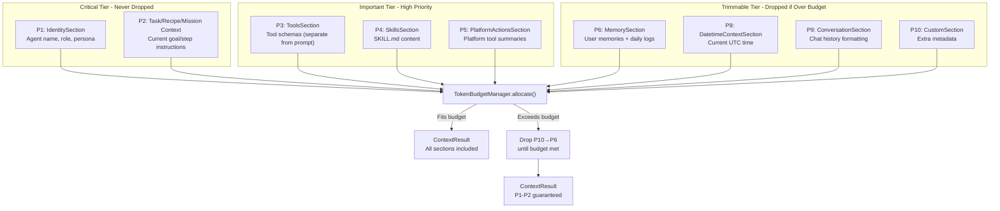
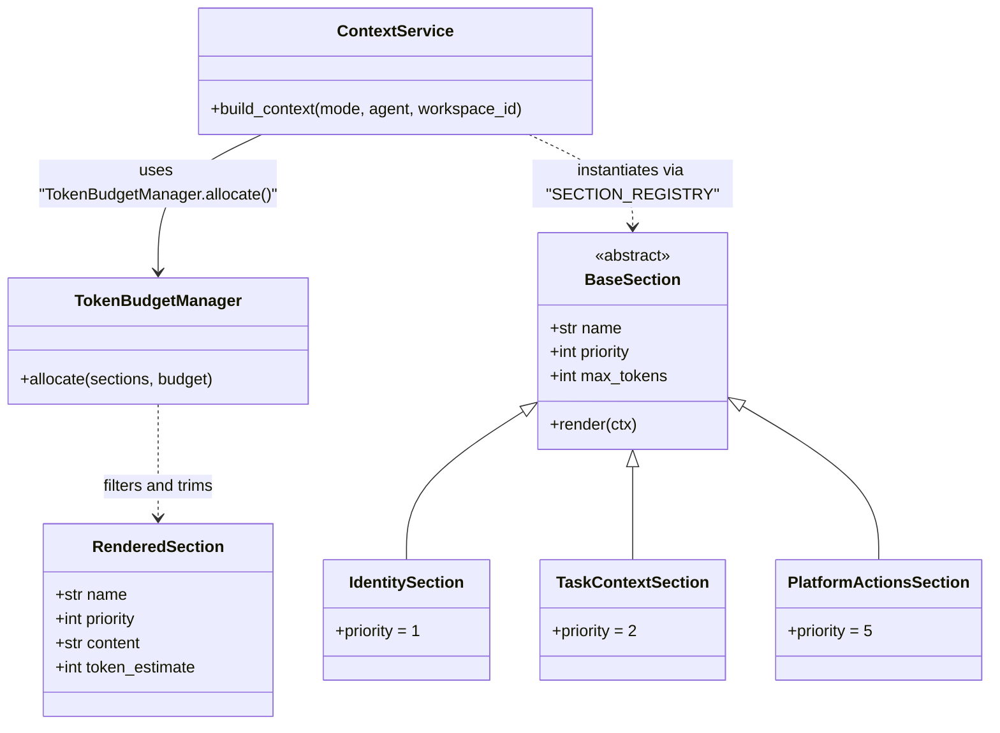

# Section Priority System

Relevant source files

The following files were used as context for generating this wiki page:

- [docs/PRDS/123-HARNESS-PATTERN-ADOPTION.md](docs/PRDS/123-HARNESS-PATTERN-ADOPTION.md)
- [orchestrator/consumers/chatbot/integration.py](orchestrator/consumers/chatbot/integration.py)
- [orchestrator/consumers/chatbot/prompt_analyzer.py](orchestrator/consumers/chatbot/prompt_analyzer.py)
- [orchestrator/consumers/chatbot/smart_orchestrator.py](orchestrator/consumers/chatbot/smart_orchestrator.py)
- [orchestrator/modules/agents/queries.py](orchestrator/modules/agents/queries.py)
- [orchestrator/modules/context/budget.py](orchestrator/modules/context/budget.py)
- [orchestrator/modules/context/modes.py](orchestrator/modules/context/modes.py)
- [orchestrator/modules/context/sections/__init__.py](orchestrator/modules/context/sections/__init__.py)
- [orchestrator/modules/context/sections/agent_roster.py](orchestrator/modules/context/sections/agent_roster.py)
- [orchestrator/modules/context/sections/composio.py](orchestrator/modules/context/sections/composio.py)
- [orchestrator/modules/context/sections/identity.py](orchestrator/modules/context/sections/identity.py)
- [orchestrator/modules/context/sections/memory.py](orchestrator/modules/context/sections/memory.py)
- [orchestrator/modules/context/sections/mission_context.py](orchestrator/modules/context/sections/mission_context.py)
- [orchestrator/modules/context/sections/onboarding.py](orchestrator/modules/context/sections/onboarding.py)
- [orchestrator/modules/context/sections/platform_actions.py](orchestrator/modules/context/sections/platform_actions.py)
- [orchestrator/modules/context/sections/plugins.py](orchestrator/modules/context/sections/plugins.py)
- [orchestrator/modules/context/sections/skills.py](orchestrator/modules/context/sections/skills.py)
- [orchestrator/modules/context/sections/task_context.py](orchestrator/modules/context/sections/task_context.py)
- [orchestrator/modules/context/sections/tools.py](orchestrator/modules/context/sections/tools.py)
- [orchestrator/tests/test_context/__init__.py](orchestrator/tests/test_context/__init__.py)
- [orchestrator/tests/test_context/conftest.py](orchestrator/tests/test_context/conftest.py)
- [orchestrator/tests/test_context/test_budget_manager.py](orchestrator/tests/test_context/test_budget_manager.py)
- [orchestrator/tests/test_context/test_estimator.py](orchestrator/tests/test_context/test_estimator.py)
- [orchestrator/tests/test_context/test_identity_section.py](orchestrator/tests/test_context/test_identity_section.py)
- [orchestrator/tests/test_context/test_memory_section.py](orchestrator/tests/test_context/test_memory_section.py)
- [orchestrator/tests/test_context/test_modes.py](orchestrator/tests/test_context/test_modes.py)
- [orchestrator/tests/test_context/test_service.py](orchestrator/tests/test_context/test_service.py)

The **Section Priority System** is the `ContextService`'s mechanism for ensuring critical agent identity, capabilities, and tools are never omitted from the system prompt — even when token budgets are tight. It assigns a **priority (1-10)** to each context section and uses a `TokenBudgetManager` to selectively trim lower-priority sections (P6-10) while guaranteeing high-priority sections (P1-5) always render in full.

This system replaces fragmented prompt-building paths with unified, predictable context assembly. For details on the overall ContextService architecture, see [Context Service]().

---

## Overview

Every context section inherits from `BaseSection` [orchestrator/modules/context/sections/base.py:10-10]() and declares a **priority** integer. When the assembled prompt exceeds the mode's token budget, the `TokenBudgetManager` [orchestrator/modules/context/budget.py:53-53]() trims sections in **reverse priority order** (highest priority number = lowest importance) until the prompt fits.

**Key guarantee:** Priorities 1-2 are **never dropped**, even if the total remains over budget [orchestrator/modules/context/budget.py:121-123]().

**Sources:** [orchestrator/modules/context/budget.py:1-64](), [orchestrator/modules/context/sections/base.py:10-30]()

---

## Priority Tier Breakdown

The following diagram illustrates how the `TokenBudgetManager` processes different sections based on their assigned priority levels.

**Sources:** [orchestrator/modules/context/budget.py:53-145](), [orchestrator/modules/context/sections/identity.py:69-69](), [orchestrator/modules/context/sections/task_context.py:27-27](), [orchestrator/modules/context/sections/skills.py:26-26](), [orchestrator/modules/context/sections/platform_actions.py:33-33]()

---

## Section Priority Registry

The `SECTION_REGISTRY` [orchestrator/modules/context/sections/__init__.py:28-45]() maps logical names used in `ModeConfig` [orchestrator/modules/context/modes.py:35-134]() to concrete implementation classes.

| Priority | Section Name | Class | Max Tokens (Default) | Purpose |
| :--- | :--- | :--- | :--- | :--- |
| **1** | `identity` | `IdentitySection` | 600 | Agent name, role, persona, and response formatting [orchestrator/modules/context/sections/identity.py:68-71]() |
| **2** | `task_context` | `TaskContextSection` | 1500 | Current task description and board metadata [orchestrator/modules/context/sections/task_context.py:26-28]() |
| **2** | `playbook_context` | `PlaybookContextSection` | - | Current recipe step and execution context [orchestrator/modules/context/sections/__init__.py:40-40]() |
| **2** | `mission_context` | `MissionContextSection` | - | Goal decomposition and DAG task graph context [orchestrator/modules/context/sections/__init__.py:35-35]() |
| **3** | `tools` | `ToolsSection` | None | Manages tool loading (not rendered in prompt text) [orchestrator/modules/context/sections/tools.py:49-55]() |
| **4** | `skills` | `SkillsSection` | 3000 | SKILL.md content assigned to the agent [orchestrator/modules/context/sections/skills.py:25-27]() |
| **5** | `platform_actions` | `PlatformActionsSection` | 2000 | Descriptions of internal platform capabilities [orchestrator/modules/context/sections/platform_actions.py:32-34]() |
| **6** | `memory` | `MemorySection` | 1500 | User memories, session context, and daily logs [orchestrator/modules/context/sections/__init__.py:34-34]() |
| **8** | `datetime_context`| `DatetimeContextSection` | - | Current system date and time [orchestrator/modules/context/sections/__init__.py:41-41]() |
| **9** | `conversation` | `ConversationSection` | - | Formatting hints for message history [orchestrator/modules/context/sections/__init__.py:43-43]() |
| **10** | `custom` | `CustomSection` | - | Arbitrary key-value metadata [orchestrator/modules/context/sections/__init__.py:44-44]() |

**Sources:** [orchestrator/modules/context/sections/__init__.py:27-45](), [orchestrator/modules/context/budget.py:121-123](), [orchestrator/modules/context/sections/platform_actions.py:32-34]()

---

## Token Budget Allocation Algorithm

The `TokenBudgetManager.allocate()` method implements a three-step trimming algorithm to fit sections into the `available_for_sections` budget [orchestrator/modules/context/budget.py:37-40]().

### 1. Per-Section Capping
Every `RenderedSection` is first truncated to its own `max_tokens` limit [orchestrator/modules/context/budget.py:81-83](). This ensures no single section (like a massive task description) consumes the entire budget before the priority-based dropping begins. The `TokenEstimator` [orchestrator/modules/context/budget.py:22-22]() provides approximate counts for this calculation.

### 2. Priority-Based Dropping
If the total token estimate still exceeds the budget, the manager sorts sections by priority in descending order (highest number = lowest importance) [orchestrator/modules/context/budget.py:113-115](). It iterates through this list and drops sections until the budget is met, with the strict exception that **Priority 1 and 2 sections are never dropped** [orchestrator/modules/context/budget.py:121-123]().

### 3. Order Preservation
After trimming, the manager rebuilds the section list to preserve the original relative order of the remaining sections, ensuring logical flow in the final system prompt [orchestrator/modules/context/budget.py:135-135]().

**Sources:** [orchestrator/modules/context/budget.py:66-145](), [orchestrator/modules/context/estimator.py:1-20]()

---

## Code Entity Mapping

The following diagram maps the logical priority system to the specific code classes and their interactions within the `ContextService`.

**Sources:** [orchestrator/modules/context/budget.py:43-51](), [orchestrator/modules/context/sections/base.py:18-25](), [orchestrator/modules/context/sections/__init__.py:27-45]()

---

## Mode-Specific Budget Configurations

Budgets are defined per `ContextMode` in `DEFAULT_BUDGETS` [orchestrator/modules/context/budget.py:152-152](). Each mode calculates its available space by subtracting reserved tokens for the response and message history from the total context window.

| Mode | Total Budget | Reserved (Response) | Reserved (Messages) |
| :--- | :--- | :--- | :--- |
| `CHATBOT` | 128,000 | 4,096 | 60,000 |
| `TASK_EXECUTION` | 128,000 | 4,096 | 20,000 |
| `HEARTBEAT_AGENT`| 128,000 | 4,096 | 0 |
| `COORDINATOR` | 131,072 | 4,096 | 0 |

**Sources:** [orchestrator/modules/context/budget.py:152-202](), [orchestrator/modules/context/modes.py:35-134]()

---

## Implementation Details

### Identity Protection
The `IdentitySection` [orchestrator/modules/context/sections/identity.py:55-55]() handles both standard task identity and complex `CHATBOT` personalities. When `personality=True` (active in `CHATBOT` mode [orchestrator/modules/context/modes.py:47-47]()), it calls `AutomatosPersonality.get_base_system_prompt()` to include platform skills, tool guidance, and self-learning instructions [orchestrator/modules/context/sections/identity.py:150-161](). Because it is Priority 1, these core identity traits are never sacrificed.

### Platform Action Cataloging
`PlatformActionsSection` [orchestrator/modules/context/sections/platform_actions.py:23-23]() (Priority 5) wraps `ActionRegistry.build_prompt_summary()` [orchestrator/modules/context/sections/platform_actions.py:62-62](). It injects the markdown catalog of available `platform_execute` actions. This ensures agents across all modes understand the platform's self-management capabilities.

### Skill Content Injection
`SkillsSection` [orchestrator/modules/context/sections/skills.py:18-18]() (Priority 4) loads `SKILL.md` content from the agent's active skills via the `agent_skills` association [orchestrator/modules/context/sections/skills.py:46-52](). It combines multiple skills with separators and appends tool usage instructions if the skill defines specific tool schemas [orchestrator/modules/context/sections/skills.py:65-78]().

### Tool Strategy Integration
The `ToolsSection` [orchestrator/modules/context/sections/tools.py:41-41]() (Priority 3) does not render text but manages tool schemas. It supports four strategies: `FULL`, `FILTERED`, `DISPATCHER_ONLY`, and `NONE` [orchestrator/modules/context/sections/tools.py:32-38](). The `FILTERED` strategy uses the `SmartToolRouter` to select tools based on intent classification [orchestrator/modules/context/sections/tools.py:162-170]().

**Sources:** [orchestrator/modules/context/sections/identity.py:55-165](), [orchestrator/modules/context/sections/platform_actions.py:23-75](), [orchestrator/modules/context/sections/skills.py:18-82](), [orchestrator/modules/context/sections/tools.py:32-194]()

---