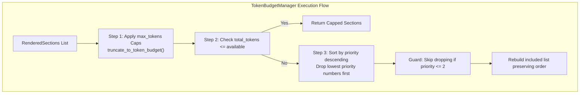
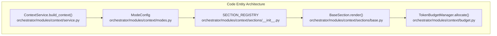

# Section Priority System

Relevant source files

The following files were used as context for generating this wiki page:

- [orchestrator/core/services/skill_l3_execution.py](orchestrator/core/services/skill_l3_execution.py)
- [orchestrator/modules/agents/services/skill_portability.py](orchestrator/modules/agents/services/skill_portability.py)
- [orchestrator/modules/context/__init__.py](orchestrator/modules/context/__init__.py)
- [orchestrator/modules/context/budget.py](orchestrator/modules/context/budget.py)
- [orchestrator/modules/context/modes.py](orchestrator/modules/context/modes.py)
- [orchestrator/modules/context/planning.py](orchestrator/modules/context/planning.py)
- [orchestrator/modules/context/sections/__init__.py](orchestrator/modules/context/sections/__init__.py)
- [orchestrator/modules/context/sections/agent_roster.py](orchestrator/modules/context/sections/agent_roster.py)
- [orchestrator/modules/context/sections/composio.py](orchestrator/modules/context/sections/composio.py)
- [orchestrator/modules/context/sections/field_memory.py](orchestrator/modules/context/sections/field_memory.py)
- [orchestrator/modules/context/sections/identity.py](orchestrator/modules/context/sections/identity.py)
- [orchestrator/modules/context/sections/planning_history.py](orchestrator/modules/context/sections/planning_history.py)
- [orchestrator/modules/context/sections/planning_knowledge.py](orchestrator/modules/context/sections/planning_knowledge.py)
- [orchestrator/modules/context/sections/playbook_context.py](orchestrator/modules/context/sections/playbook_context.py)
- [orchestrator/modules/context/sections/plugins.py](orchestrator/modules/context/sections/plugins.py)
- [orchestrator/modules/context/sections/skills.py](orchestrator/modules/context/sections/skills.py)
- [orchestrator/modules/context/sections/task_context.py](orchestrator/modules/context/sections/task_context.py)
- [orchestrator/modules/tools/discovery/actions_skills.py](orchestrator/modules/tools/discovery/actions_skills.py)
- [orchestrator/modules/tools/discovery/handlers_skill_runtime.py](orchestrator/modules/tools/discovery/handlers_skill_runtime.py)
- [orchestrator/tests/test_context/test_modes.py](orchestrator/tests/test_context/test_modes.py)
- [orchestrator/tests/test_context/test_service.py](orchestrator/tests/test_context/test_service.py)
- [orchestrator/tests/test_identity_section.py](orchestrator/tests/test_identity_section.py)
- [orchestrator/tests/test_p2w1_agent_skills_repair.py](orchestrator/tests/test_p2w1_agent_skills_repair.py)
- [orchestrator/tests/test_prd164_planning_pack.py](orchestrator/tests/test_prd164_planning_pack.py)
- [orchestrator/tests/test_prd179_field_read.py](orchestrator/tests/test_prd179_field_read.py)
- [orchestrator/tests/test_prd202_s2_trigger_activation.py](orchestrator/tests/test_prd202_s2_trigger_activation.py)
- [orchestrator/tests/test_skills_section.py](orchestrator/tests/test_skills_section.py)

## Purpose and Scope

The Section Priority System governs how the unified context assembly pipeline (`ContextService`) prioritizes, allocates token budgets for, and trims prompt sections. By assigning a discrete priority integer (1 to 10) to each concrete section class inheriting from `BaseSection` [orchestrator/modules/context/sections/base.py:10-25](), the system ensures that critical context—such as agent identity and active task instructions—is never omitted or degraded under strict prompt length constraints, while trimmable background memory or chat history is safely pruned first.

Sources: `[orchestrator/modules/context/budget.py:1-20]()`, `[orchestrator/modules/context/sections/base.py:1-25]()`

---

## Priority Tier Structure

The priority system organizes sections into distinct importance tiers. Lower numeric values represent higher priority (Priority 1 being the most critical).

```mermaid
graph TB
    subgraph "Natural Language: Critical Tier (P1-P2)"
        Identity["IdentitySection<br/>priority=1"]
        Task["TaskContextSection<br/>priority=2"]
    end

    subgraph "Natural Language: Important Tier (P3-P5)"
        Tools["ToolsSection<br/>priority=3"]
        Skills["SkillsSection<br/>priority=4"]
        Actions["PlatformActionsSection<br/>priority=5"]
    end

    subgraph "Natural Language: Trimmable Tier (P6-P10)"
        Memory["MemorySection<br/>priority=6"]
        Datetime["DatetimeContextSection<br/>priority=8"]
        Conv["ConversationSection<br/>priority=9"]
        Custom["CustomSection<br/>priority=10"]
    end

    subgraph "Code Entity Space"
        Registry["SECTION_REGISTRY<br/>orchestrator/modules/context/sections/__init__.py"]
        Manager["TokenBudgetManager.allocate()<br/>orchestrator/modules/context/budget.py"]
    end

    Identity --> Manager
    Task --> Manager
    Tools --> Manager
    Skills --> Manager
    Actions --> Manager
    Memory --> Manager
    Datetime --> Manager
    Conv --> Manager
    Custom --> Manager
    Registry --> Manager
```

Sources: `[orchestrator/modules/context/sections/__init__.py:31-51]`, `[orchestrator/modules/context/budget.py:51-147]()`

---

## Section Priority Registry

The `SECTION_REGISTRY` maps section name strings (declared in `ModeConfig.sections`) to their concrete implementation classes [orchestrator/modules/context/sections/__init__.py:31-51]().

| Priority | Section Name | Class Name | Default Max Tokens | Role & Description |
| :--- | :--- | :--- | :--- | :--- |
| **1** | `identity` | `IdentitySection` | `None` | Agent name, role, persona, and response formatting [orchestrator/modules/context/sections/identity.py:68-71]() |
| **2** | `task_context` | `TaskContextSection` | `1500` | Current task description and board metadata [orchestrator/modules/context/sections/task_context.py:26-28]() |
| **2** | `playbook_context` | `PlaybookContextSection` | `None` | Current recipe step and execution context [orchestrator/modules/context/sections/__init__.py:45-45]() |
| **2** | `mission_context` | `MissionContextSection` | `None` | Goal decomposition and DAG task graph context [orchestrator/modules/context/sections/__init__.py:38-38]() |
| **2** | `onboarding` | `OnboardingSection` | `None` | Mission Zero onboarding flow for new workspaces [orchestrator/modules/context/sections/__init__.py:39-39]() |
| **2** | `planning_history` | `PlanningHistorySection` | `None` | Seeded failures for compounding learning [orchestrator/modules/context/modes.py:23-24]() |
| **3** | `tools` | `ToolsSection` | `None` | Manages tool loading declarations [orchestrator/modules/context/sections/__init__.py:43-43]() |
| **4** | `skills` | `SkillsSection` | `None` | Trigger-based skill activation: L1 metadata always, L2 on demand [orchestrator/modules/context/sections/skills.py:44-48]() |
| **5** | `platform_actions` | `PlatformActionsSection` | `None` | Descriptions of internal platform capabilities [orchestrator/modules/context/sections/__init__.py:36-36]() |
| **6** | `memory` | `MemorySection` | `None` | User memories, session context, and daily logs [orchestrator/modules/context/sections/__init__.py:37-37]() |
| **8** | `datetime_context` | `DatetimeContextSection` | `None` | Current system date and time [orchestrator/modules/context/sections/__init__.py:46-46]() |
| **9** | `conversation` | `ConversationSection` | `None` | Formatting hints for message history [orchestrator/modules/context/sections/__init__.py:49-49]() |
| **10** | `custom` | `CustomSection` | `None` | Arbitrary key-value metadata [orchestrator/modules/context/sections/__init__.py:50-50]() |

Sources: `[orchestrator/modules/context/sections/__init__.py:31-51]`, `[orchestrator/modules/context/sections/identity.py:68-71]`, `[orchestrator/modules/context/sections/task_context.py:26-28]`, `[orchestrator/modules/context/sections/skills.py:44-48]()`

---

## Token Budget Allocation Algorithm

When context sections are rendered, `TokenBudgetManager.allocate()` processes them against the available token budget via a deterministic 3-step algorithm [orchestrator/modules/context/budget.py:64-147]().

### 1. Per-Section Capping
Each `RenderedSection` is checked against its defined `max_tokens` limit. If exceeded, `truncate_to_token_budget()` truncates content on clean token boundaries without appending truncation artifacts [orchestrator/modules/context/budget.py:77-105]().

### 2. Priority-Based Dropping
If the cumulative token count exceeds `budget.available_for_sections`, sections are sorted by priority in descending order (highest numeric value = lowest priority) [orchestrator/modules/context/budget.py:112-117](). Sections are dropped one by one until the budget is satisfied. However, **Priority 1 and 2 sections are permanently exempt** and will never be dropped [orchestrator/modules/context/budget.py:121-125]().

### 3. Order Preservation
Once trimmable sections are filtered out, the remaining sections are reconstructed into their original relative order to preserve logical narrative flow for the LLM [orchestrator/modules/context/budget.py:136-137]().

Sources: `[orchestrator/modules/context/budget.py:51-147]()`

---

## Mode-Specific Budget Configurations

Token budgets and constraints vary by `ContextMode` as defined in `DEFAULT_BUDGETS` [orchestrator/modules/context/budget.py:154-195](). Total context size is typically 128,000 tokens, with dynamic reservations for response generation and message history.

| ContextMode | Total Budget | Reserved (Response) | Reserved (Messages) | Tool Loading Strategy |
| :--- | :--- | :--- | :--- | :--- |
| `CHATBOT` | 128,000 | 4,096 | 60,000 | `filtered` [orchestrator/modules/context/modes.py:133-133]() |
| `TASK_EXECUTION` | 128,000 | 4,096 | 20,000 | `full` [orchestrator/modules/context/modes.py:146-146]() |
| `HEARTBEAT_ORCHESTRATOR`| 128,000 | 2,048 | 0 | `dispatcher_only` [orchestrator/modules/context/modes.py:157-157]() |
| `HEARTBEAT_AGENT` | 128,000 | 4,096 | 0 | `full` [orchestrator/modules/context/modes.py:170-170]() |
| `RECIPE` | 128,000 | 4,096 | 10,000 | `full` |
| `NL2SQL` | 128,000 | 2,048 | 2,000 | `none` |

Sources: `[orchestrator/modules/context/budget.py:154-195]`, `[orchestrator/modules/context/modes.py:122-171]()`

---

## Critical Section Implementation Details

### Identity Protection
`IdentitySection` operates at Priority 1 (`priority = 1`) [orchestrator/modules/context/sections/identity.py:69-69](). In `CHATBOT` mode (`personality=True`), it invokes `AutomatosPersonality.get_base_system_prompt()` to inject conversational profiles, platform skills, and action response styles [orchestrator/modules/context/sections/identity.py:136-165](). In other modes, it renders concise agent metadata and formatting rules [orchestrator/modules/context/sections/identity.py:87-120]().

### Task and Mission Context
`TaskContextSection` runs at Priority 2 (`priority = 2`) [orchestrator/modules/context/sections/task_context.py:27-28]() to supply task execution instructions, status data, board names, and dependency context handling protocols [orchestrator/modules/context/sections/task_context.py:42-88]().

### Trigger-Based Skill Activation
`SkillsSection` operates at Priority 4 (`priority = 4`) [orchestrator/modules/context/sections/skills.py:45-45](). It splits attached skills into core always-on definitions (such as `platform-management`) and optional L1 metadata entries [orchestrator/modules/context/sections/skills.py:76-95](). Non-core skills require the agent to explicitly call `platform_load_skill` to pull full bodies into context [orchestrator/modules/tools/discovery/actions_skills.py:29-56]().

Sources: `[orchestrator/modules/context/sections/identity.py:55-165]`, `[orchestrator/modules/context/sections/task_context.py:18-88]`, `[orchestrator/modules/context/sections/skills.py:36-124]`, `[orchestrator/modules/tools/discovery/actions_skills.py:29-56]`, `[orchestrator/modules/context/budget.py:51-147]()`

---